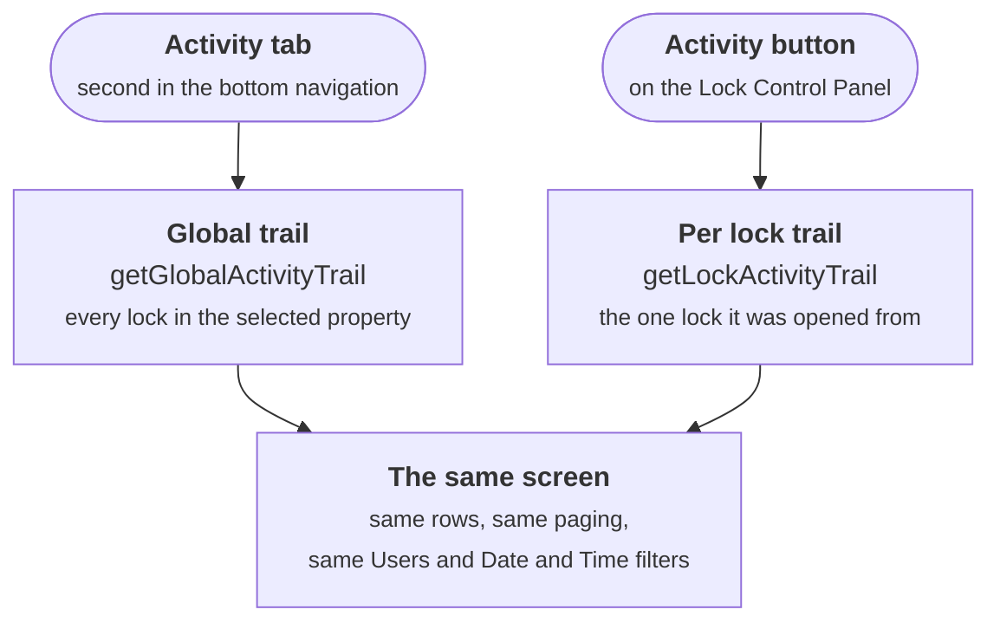
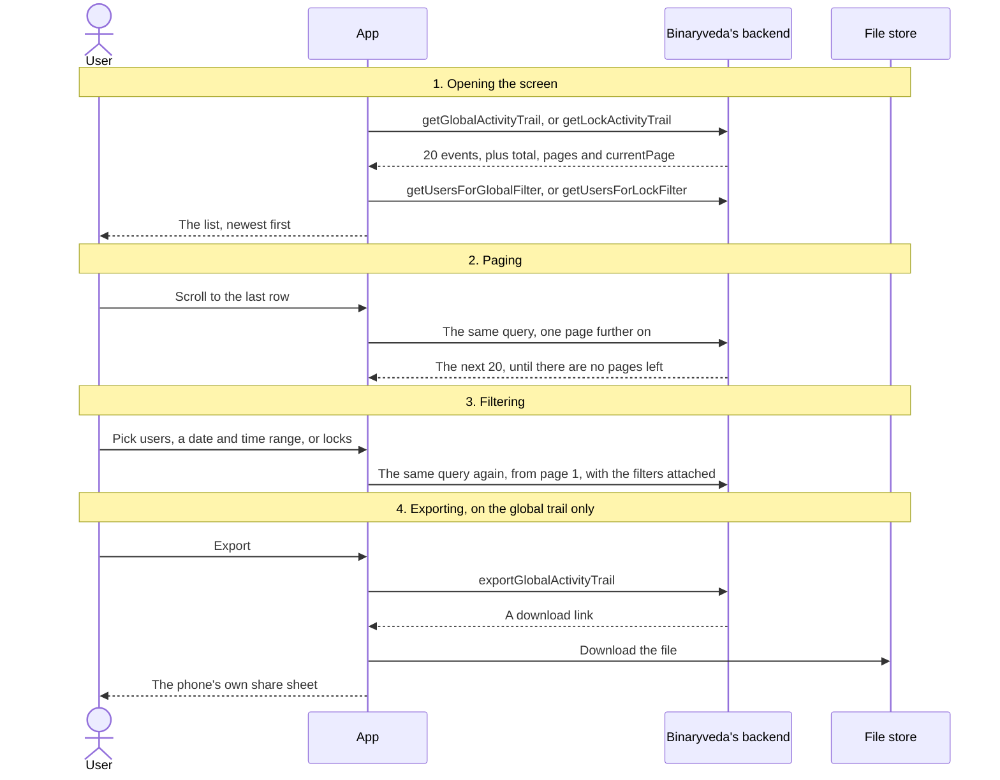
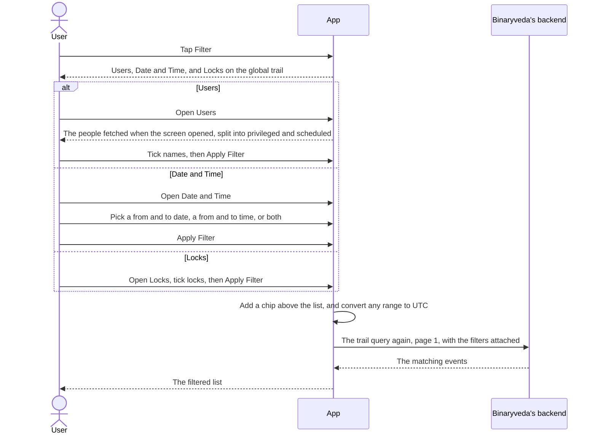
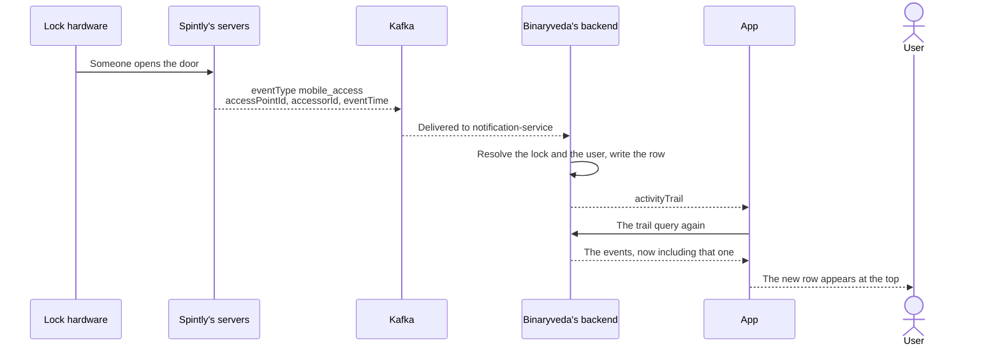
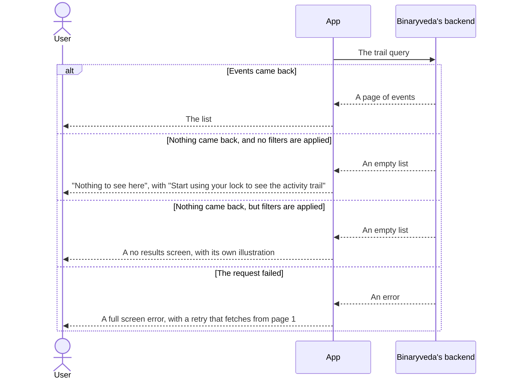

# 6. Activity Trail

**What it is.** The log of every lock and unlock. It comes in two variants:
the **global trail**, which covers every lock in the selected property, and the
**per lock trail**, which covers one lock.

!!! warning "Key point"

    Nothing on this page touches a Spintly SDK and nothing reaches the lock
    hardware. Every call is a **read** against Binaryveda's backend, so nothing
    here can change a lock, a user, or the record of an event. The only thing
    that arrives on its own is the `activityTrail` socket event, which tells the
    screen to fetch again.

## Participants

This page uses User, App, Binaryveda's backend, and the File store an export
link points at.

Each one is defined, with the colour it keeps across the site, in
[Reading these pages](conventions.md).

## The two ways in



Once open, the two behave the same way. They draw the same rows, page the same
way, and offer the same Users and Date and Time filters.

**Four things belong to the global trail alone**, because each of them only
means something when more than one lock is in view:

- the **property dropdown** in the title bar, which decides what the trail covers
- the **Locks filter**, for narrowing the trail to some of those locks
- the **lock name** on the right of each row, saying which lock the event came from
- the **Export** button

The notification bell also sits in the title bar of the global trail, but it
belongs to the tab bar rather than to this screen, and is covered in
[Notifications](notifications.md#3-the-notification-centre).

## The whole flow

Four steps. Each one has its own section below. Only the first runs on the way
in. The rest happen while the screen is open.



## 1. Opening the screen

Opening either trail costs two calls: one for the first page of events, and one
for the people who can be filtered on. iOS makes a third call on the global
trail, for the locks that can be filtered on.

=== "iOS"

    ```mermaid
    sequenceDiagram
        actor U as User
        participant A as App
        participant B as Binaryveda's backend

        U->>A: Open the Activity tab, or tap Activity on the Lock Control Panel
        alt Global trail
            A->>B: getGlobalActivityTrail(getGlobalActivityTrailInput:)<br/>One page of events across the property, scoped by siteId
            B-->>A: 20 events, plus total, pages and currentPage
            A->>B: getUsersForGlobalFilter(propertyId:)<br/>The privileged and scheduled users to offer in the Users filter
            A->>B: listLocksAndGateways(propertyId:)<br/>The locks to offer in the Locks filter
        else Per lock trail
            A->>B: getLockActivityTrail(getLockActivityTrailInput:)<br/>One page of events for that lock, scoped by lockId
            B-->>A: 20 events, plus total, pages and currentPage
            A->>B: getUsersForLockFilter(lockId:)<br/>The privileged and scheduled users to offer in the Users filter
        end
        A-->>U: The list
    ```

    **The global trail is loaded ahead of the tap.** It is fetched when the app
    starts and again whenever the selected property changes, so opening the tab
    usually shows a list that is already there. Opening it fetches again only
    when the last attempt did not leave a loaded list, such as after an error.

    **The per lock trail always fetches when it opens**, since it starts empty
    each time.

=== "Android"

    ```mermaid
    sequenceDiagram
        actor U as User
        participant A as App
        participant B as Binaryveda's backend

        U->>A: Open the Activity tab, or tap Activity on the Lock Control Panel
        alt Global trail
            A->>B: getGlobalActivityTrail(getGlobalActivityTrailInput:)<br/>One page of events across the property, scoped by siteId
            B-->>A: 20 events, plus total, pages and currentPage
            A->>B: getUsersForGlobalFilter(propertyId:)<br/>The privileged and scheduled users to offer in the Users filter
        else Per lock trail
            A->>B: getLockActivityTrail(getLockActivityTrailInput:)<br/>One page of events for that lock, scoped by lockId
            B-->>A: 20 events, plus total, pages and currentPage
            A->>B: getUsersForLockFilter(lockId:)<br/>The privileged and scheduled users to offer in the Users filter
        end
        A-->>U: The list
    ```

    **Both trails fetch when the screen opens**, and again whenever the property
    changes or a filter is applied.

    **No lock list is fetched.** The Locks filter is filled from the lock list
    Home already holds, so the global trail costs one call fewer than it does on
    iOS.

### What the two queries take

Both take a single input object, and most of it is shared. The global query is
scoped by `siteId` and can also carry a **list** of lock ids from the Locks
filter. The per lock query is scoped by one `lockId`, and requires `page` and
`limit`, which are optional on the global one.

Everything else is common and optional: `userId` as a list, `fromDate` and
`toDate` for the date range, and `fromTime` and `toTime` for the daily time
range. Both answer the same way, with an `items` array and a `pagination` block
holding `total`, `pages` and `currentPage`.

## 2. The list

Rows come newest first, grouped under a heading reading **TODAY**, **YESTERDAY**
or the date. Each one reads "Locked or Unlocked by {name} using {method}", with
the time beside it and, on the global trail, the lock name.

Five fields build it: `eventSource`, `userName`, `userId`, `eventTimestamp` and
`lockName`. Only an autolock reads **Locked**. The name shows as **You** when
`userId` is the signed in user's, and is dropped when there is nobody to name.

**Eight fields go unused.** `eventType`, `accessPointDirection`,
`accessPointId`, `siteId`, `siteName`, `userType`, `firstAccessType` and
`secondAccessType` are in both platforms' queries and reach nothing on this
screen.

### What each event source shows as

| `eventSource` | Shown as |
|---|---|
| `Passcode` | Passcode |
| `OTP` | One-Time Passcode |
| `Fingerprint` | Fingerprint |
| `Card` | RFID Card |
| `Mobile_NFC` | NFC |
| `Mobile_Bluetooth`, `Mobile` | Bluetooth |
| `Remote` | Internet |
| `Web Remote` | Web Remote |
| `autolock` | Autolock |
| `2FA` | Dual Authentication, written from `firstAccessSource` and `secondAccessSource` |

## 3. Filtering

The **Filter** button floats over the bottom right of the list and opens a
**Filter by** sheet. Each entry in that sheet opens a sheet of its own, and
applying one closes them and refetches from page 1.



Nothing is fetched when a filter sheet opens. The people and the locks were
already fetched with the screen, and the dates and times are picked in the app,
then converted to UTC before they go out.

**One time users cannot be filtered on.** Both user queries return only
`privilegedUsers` and `scheduledUsers`.

Applied filters sit above the list as chips with a **Clear All** link. Removing
a chip or clearing them all refetches straight away.

## 4. Live updates

Binaryveda's backend pushes an `activityTrail` event over the same socket
[Home](home.md) and the [Lock Control Panel](lock-control-panel.md) read. The
trail does not draw the event. It treats it as a signal to fetch again.



**The row and the signal are written by the same handler**, off one Kafka
message. The row goes into the time-series store, and the socket event is the
app's cue to go and read it. There is no separate write path for the two, which
is why a row can exist without the screen having been told: the event is only
sent when it is newer than the newest row already stored for that lock. The
message shapes, and the rest of what an unlock message sets off, are in
Binaryveda's Kafka events document.

Because iOS refetches the page it is on rather than starting over, an event
arriving while the user has scrolled past page 1 adds that page a second time.

The `ACTIVITY_TRAIL` push topic, covered in
[Notifications](notifications.md#2-a-push-arrives), opens the global trail. On
iOS arriving that way clears the filters first and fetches everything again.

## 5. Exporting

Export is on the global trail only, and it exports whatever the current filters
are showing. `exportGlobalActivityTrail` takes the same input object as the
trail query and answers with a single `link`. The app downloads from that link
itself, so the file never passes back through the backend.

=== "iOS"

    ```mermaid
    sequenceDiagram
        actor U as User
        participant A as App
        participant B as Binaryveda's backend
        participant F as File store

        U->>A: Tap Export
        A-->>U: The button reads "Exporting"
        A->>B: exportGlobalActivityTrail(getGlobalActivityTrailInput:)<br/>The current filters, plus the current page and a limit of 20
        B-->>A: A link
        A->>F: Download it
        A-->>U: The system share sheet
    ```

    **The current page and a limit of 20 go out with the export**, on the same
    input object the trail query uses, so what the file holds depends on how far
    the user has scrolled.

    The file is kept in the app's own storage, so it reaches the user only
    through the share sheet.

=== "Android"

    ```mermaid
    sequenceDiagram
        actor U as User
        participant A as App
        participant B as Binaryveda's backend
        participant F as File store

        U->>A: Tap Export
        A-->>U: A loader on the button
        A->>B: exportGlobalActivityTrail(getGlobalActivityTrailInput:)<br/>The current filters, with no page or limit
        B-->>A: A link
        A->>F: Download it through the system download manager
        F-->>A: A notice once the file is in Downloads
        A-->>U: A success message, then the share chooser
    ```

    **No page or limit is sent**, so the export covers the whole filtered set
    rather than one page of it.

    The file lands in the phone's **Downloads** folder before the share chooser
    opens, and stays there afterwards.

**Export is unreachable from the per lock trail on both platforms.** The button
is drawn only on the global trail, and on Android the per lock screen's export
handler does nothing even if it is reached.

## When there is nothing to show

The same query answers four different ways, and the screen has a state for each.



The global trail also falls back to the first empty state when **no property is
selected**, since there is no `siteId` to query with.

## Differences between the two

| | iOS | Android |
|---|---|---|
| When the global trail first fetches | On app start, and on every property change | When the screen opens |
| Filling the Locks filter | `listLocksAndGateways(propertyId:)`, a call of its own | Reuses the lock list Home already holds |
| Day headings | Never drawn | Drawn above each new day |
| Refetching after a socket event | The current page, added again | A full refresh from page 1 |
| What the export request carries | The current filters, plus the current page and a limit of 20 | The current filters only |
| Where the exported file goes | The app's own storage, then the share sheet | The Downloads folder, then the share chooser |
| Mechanical key | Matched on `key` | Matched on `MechanicalKey` |
| An `eventSource` neither platform expects | No method line at all | Read as Bluetooth |
| A failed request | A different screen for a lost connection and for a server error | The server error screen either way, even when the connection is the problem |

## Every SDK member this flow uses

**None.** The activity trail is the one flow on this site that reaches no
Spintly SDK. The events it lists were recorded when they happened, by whichever
flow performed the unlock, and this screen only reads them back.

Where those events come from is covered elsewhere: an unlock from the app in
[Unlocking a lock, on Home](home.md#3-unlocking-a-lock), and a passcode,
fingerprint or card at the lock itself in
[User Management](user-management.md).
