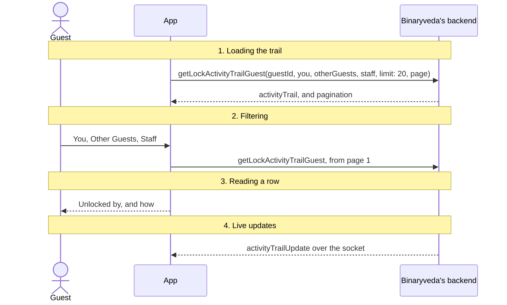
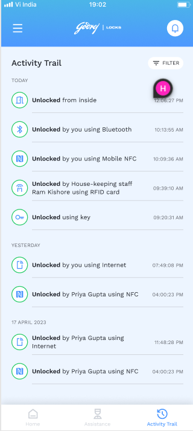
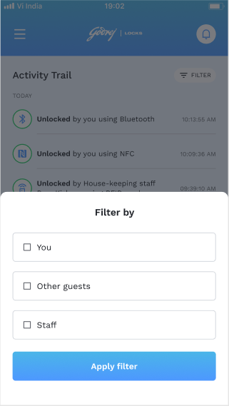
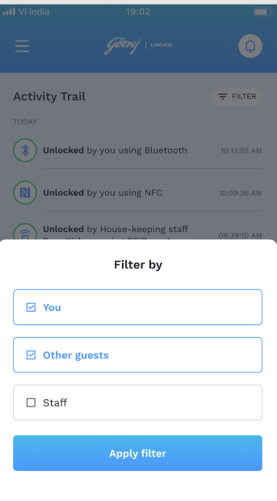
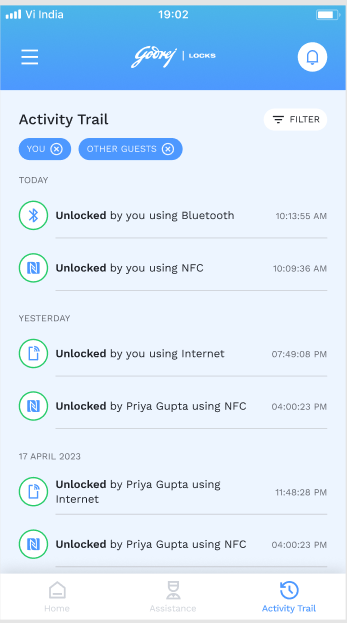

# 5. Activity Trail

**What it is.** The third tab. A log of who opened the guest's room and how,
newest first and grouped by day, with filters for the guest, other guests and
staff.

**How to get there.** Tap Activity Trail in the tab bar. Tapping a Room Unlocked
push opens it too.

## Participants

This page uses Guest, App and Binaryveda's backend.

Each one is defined, with the colour it keeps across the site, in
[Reading these pages](conventions.md).

## The whole flow

Four steps. Each one has its own section below.



## 1. Loading the trail

Twenty rows a page, with the next page fetched as the guest scrolls and a pull
to refresh at the top.

<div class="screens">
<figure>
<a href="images/activity-trail/01-trail.png"></a>
<figcaption><strong>A loaded trail</strong>One page of <code>activityTrail</code>, newest first and grouped by day. Every <code>eventSource</code> in the table in <a href="#3-reading-a-row">step 3</a> appears here: Bluetooth, NFC, RFID card, key and Internet.</figcaption>
</figure>
</div>

=== "iOS"

    ```mermaid
    sequenceDiagram
        actor G as Guest
        participant A as App
        participant B as Binaryveda's backend

        Note over G,B: ActivityTrailView.onAppear
        loop On open, and again on scroll
            A->>B: getLockActivityTrailGuest(guestId, you, otherGuests, staff, limit: 20, page)<br/>One page of the trail
            B-->>A: activityTrail, and pagination
        end
        A-->>G: The rows, grouped by day
        A->>B: Open the socket, if it is not already connected
    ```

    The `guestId` is the one saved from `getGuestDetails` at sign in.

=== "Android"

    ```mermaid
    sequenceDiagram
        actor G as Guest
        participant A as App
        participant B as Binaryveda's backend

        A->>B: getGuestDetails(cognitoId)<br/>For the guestId
        B-->>A: The stay
        loop Paged, as the list scrolls
            A->>B: getLockActivityTrailGuest(guestId, you, otherGuests, staff, limit: 20, page)<br/>One page of the trail
            B-->>A: activityTrail, and pagination
        end
        A-->>G: The rows, grouped by day
        Note over A,B: ActivityTrailScreen ON_RESUME
        A->>B: Open the socket
    ```

Each row in `activityTrail` carries `eventName`, `eventSource`, `eventTimestamp`,
`userId` and `userType`, with `guestDetails` for a guest and `staffDetails`,
including the role name, for a staff member.

## 2. Filtering

Three filters: **You**, **Other Guests** and **Staff**. They are sent as the
booleans `you`, `otherGuests` and `staff`, and the app sends all three as false
when none is chosen. Applying or removing a filter reloads from page 1.

Chosen filters appear as chips above the list, and each chip can be removed on
its own. On iOS the filter sheet belongs to the tab. On Android it is the
Dashboard's bottom sheet, with an **Apply Filter** button.

<div class="screens">
<figure class="crop">
<a href="images/activity-trail/02-filter-sheet.png"></a>
<figcaption><strong>The filter sheet</strong>Nothing chosen yet. This is the state the app sends as all three booleans false.</figcaption>
</figure>
<figure class="crop">
<a href="images/activity-trail/03-filter-chosen.png"></a>
<figcaption><strong>Two of the three</strong>Apply filter sends <code>you</code> and <code>otherGuests</code> as true and <code>staff</code> as false, and reloads from page 1.</figcaption>
</figure>
<figure>
<a href="images/activity-trail/04-filter-chips.png"></a>
<figcaption><strong>The chips</strong>One chip per chosen filter, each removable on its own. The staff row visible in the unfiltered list above is gone.</figcaption>
</figure>
</div>

## 3. Reading a row

A row says who opened the room and with what.

| `eventSource` | Shown as |
|---|---|
| `Mobile_Bluetooth` | Bluetooth |
| `Remote` | Internet |
| `Card` | RFID Card |
| `Mobile_NFC` | NFC on iOS, Mobile NFC on Android |
| `Key` | Key |

| `userType` | Shown as |
|---|---|
| `GUEST`, and it is this guest | by you |
| `GUEST`, another guest | by their first and last name |
| `STAFF` | by the role, then "staff", then the name |

A key unlock names nobody. iOS only writes the sentence for rows whose
`eventName` is `entry`.

## 4. Live updates

When a door on the booking opens, `notification-service` sends
`activityTrailUpdate` to every guest on it. The event is described on
[Home and Unlock](home.md#2-live-updates).

=== "iOS"

    The row is inserted at the top of the list, stamped with the phone's current
    time.

=== "Android"

    The list reloads from the backend.

## Differences between the two

| | iOS | Android |
|---|---|---|
| Where `guestId` comes from | Saved at sign in | A fresh `getGuestDetails` |
| Filter sheet | In the tab | The Dashboard's bottom sheet |
| A live update | Inserted at the top | The list reloads |

## Every SDK member this flow uses

None. The trail comes from Binaryveda's backend, which builds it from the unlock
events Spintly publishes to Kafka.
