# 4. Assistance

**What it is.** The second tab. Four kinds of request the guest can send to hotel
staff: **Housekeeping**, **Reception**, **Room Service** and **Checkout**. Every
one ends in `createServiceRequest`, and the staff app picks it up from there.

**How to get there.** Tap Assistance in the tab bar. The Checkout screen also
opens from the checkout reminder in the
[notification centre](notifications.md#5-the-notification-centre).

!!! warning "Key point"

    **Checkout here only asks staff for help.** It does not end the stay. The
    stay ends when the front desk checks the guest out, which signs the app out.
    See the [Overview](index.md#a-stay-from-check-in-to-check-out).

## Participants

This page uses Guest, App, Binaryveda's backend and Staff member.

Each one is defined, with the colour it keeps across the site, in
[Reading these pages](conventions.md).

## The whole flow

Five steps. Each one has its own section below.

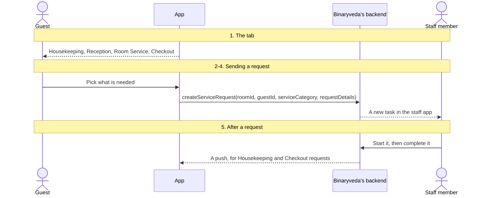

## 1. The tab

The four tiles are fixed in the app, not fetched. **Room Service** is hidden when
`getGuestDetails` returned `isRoomServiceAvailable` as false.

<figure>
<a href="images/assistance/01-quick-services.png">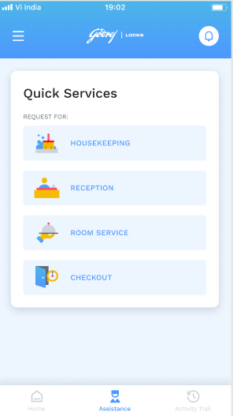</a>
<figcaption><strong>The tab</strong>All four tiles, so this is a stay where <code>isRoomServiceAvailable</code> came back true. Nothing here is fetched.</figcaption>
</figure>

Every request carries the guest's `roomId` and `guestId`, both saved from
`getGuestDetails`, and has `priority: true`.

When the tab opens, Android also calls `getServiceRequestsCountByGuest(guestId)`,
which returns a count per category.

## 2. Housekeeping and Reception

Each tile opens a list. The guest selects any number of items, can type
instructions under each one, and taps **Request for assistance**.

| Category | Item | Sent as `task` |
|---|---|---|
| Housekeeping | Laundry | `LAUNDRY` |
| Housekeeping | Toiletries | `TOILETRIES` |
| Housekeeping | Mini Bar | `MINI_BAR` |
| Housekeeping | Electrical | `ELECTRICAL_ISSUE` |
| Housekeeping | Others | `OTHERS` |
| Reception | Extend Stay | `EXTEND_STAY` |
| Reception | Room Change | `ROOM_CHANGE` |
| Reception | Book Taxi | `BOOK_TAXI` |
| Reception | Travel Desk Number | `TRAVEL_DESK_NUMBER` |
| Reception | Enquiry | `ENQUIRY` |
| Reception | Wake Up Call | `WAKE_UP_CALL` |
| Reception | Emergency | `EMERGENCY` |
| Reception | Newspaper | `NEWSPAPER` |

The two platforms group the items into requests differently:

| | iOS | Android |
|---|---|---|
| Housekeeping | One `HOUSEKEEPING` request with every item | The same |
| Reception, apart from Emergency | One `RECEPTION` request per item | One `RECEPTION` request with every item |
| Emergency | A request of its own, with category `EMERGENCY` | The same |

<figure>
<a href="images/assistance/02-housekeeping-items.png">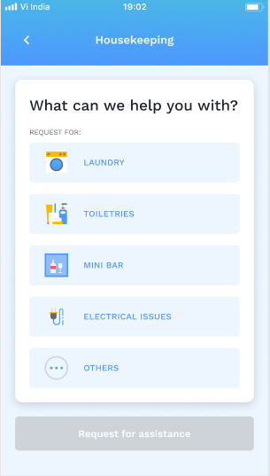</a>
<figcaption><strong>The Housekeeping items</strong>The five <code>task</code> values from the table above. Request for assistance stays disabled until something is picked.</figcaption>
</figure>
<figure>
<a href="images/assistance/03-housekeeping-selected.png">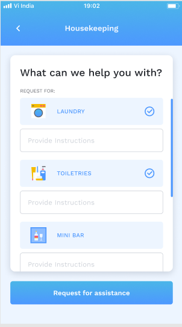</a>
<figcaption><strong>Two picked</strong>Selecting an item opens an instructions field under it. Instructions are optional, and both items go in one <code>HOUSEKEEPING</code> request.</figcaption>
</figure>
<figure>
<a href="images/assistance/04-housekeeping-instructions.png">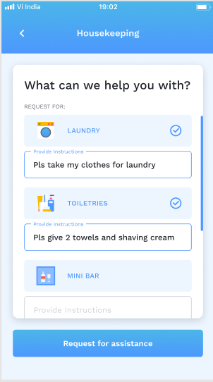</a>
<figcaption><strong>With instructions</strong>Each line becomes the <code>instructions</code> on its own entry in <code>requestDetails</code>.</figcaption>
</figure>
<figure>
<a href="images/assistance/05-reception-items.png">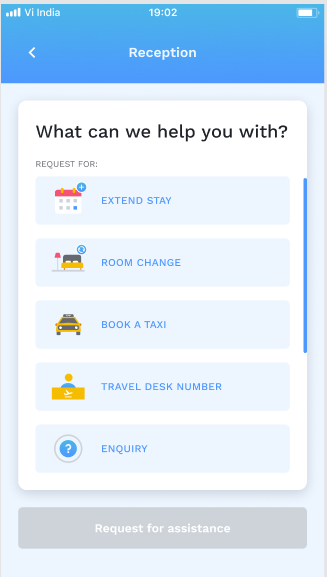</a>
<figcaption><strong>The Reception items</strong>The first five of the eight. The same screen, with a longer list.</figcaption>
</figure>
<figure>
<a href="images/assistance/06-reception-items-scrolled.png">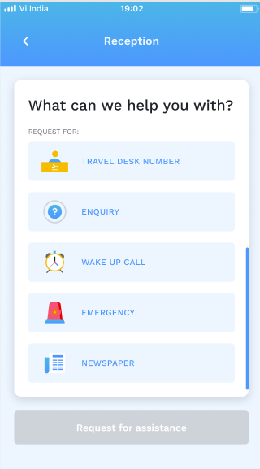</a>
<figcaption><strong>The rest of them</strong>Scrolled to the end. Emergency is the one item that always goes on its own, as an <code>EMERGENCY</code> request.</figcaption>
</figure>
<figure>
<a href="images/assistance/07-reception-instructions.png">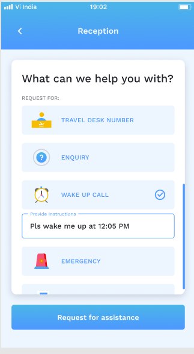</a>
<figcaption><strong>One Reception item</strong>A single <code>WAKE_UP_CALL</code>. Where two or more are picked, iOS sends one request each and Android sends one for all of them.</figcaption>
</figure>
<figure class="crop">
<a href="images/assistance/08-request-sent.png">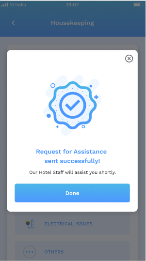</a>
<figcaption><strong>Sent</strong>Shown once the calls come back. The same dialog closes every category, Room Service and Checkout included.</figcaption>
</figure>

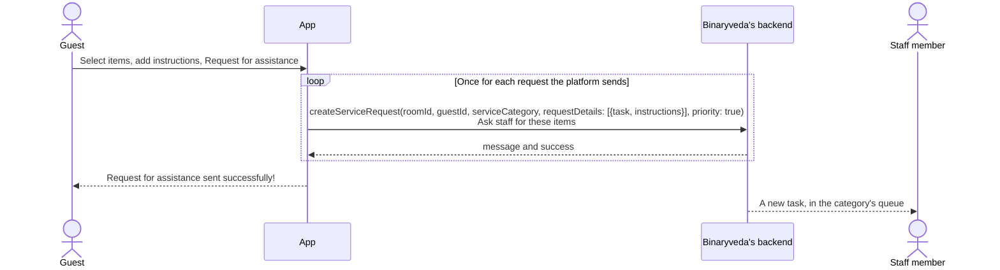

## 3. Checkout

Two items, and each selected one is sent as a request of its own on both
platforms.

| Item | Sent as `task` | Category |
|---|---|---|
| Checkout assistance | `INITIATE_CHECKOUT` | `CHECK_OUT` |
| Airport drop | `AIRPORT_DROP` | `RECEPTION` |

<figure>
<a href="images/assistance/09-checkout-items.png">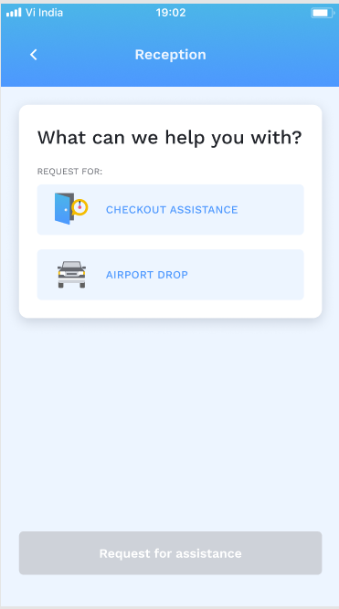</a>
<figcaption><strong>The two items</strong>The screen is titled Reception, which is the category Airport drop is sent under.</figcaption>
</figure>
<figure>
<a href="images/assistance/10-checkout-instructions.png">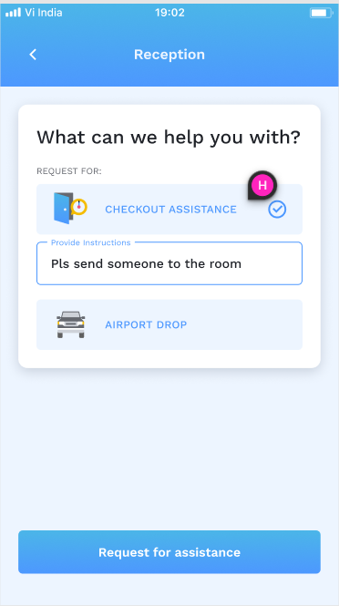</a>
<figcaption><strong>Checkout assistance on its own</strong>One <code>INITIATE_CHECKOUT</code> request. Picking Airport drop as well sends a second request, not a second item.</figcaption>
</figure>

## 4. Room Service

Room Service shows the restaurant's menus and sends a single request asking for
someone to take an order. It does not take the order itself.

<figure>
<a href="images/assistance/11-room-service-menus.png">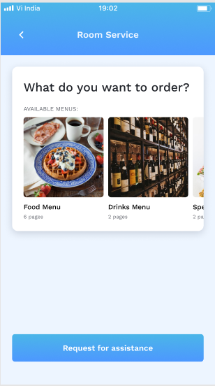</a>
<figcaption><strong>The menus</strong>One card per menu from <code>listRoomServiceAssistance</code>: the <code>previewLink</code> as the cover, the <code>menuName</code> under it, and the <code>pageCount</code> below that. Request for assistance is enabled, so this is inside the restaurant's hours.</figcaption>
</figure>

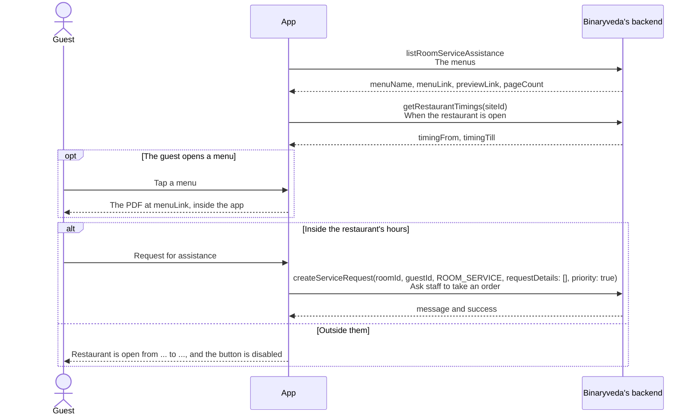

The hours are checked on the phone, against its own clock. The request carries
no items. It tells staff the guest wants room service, and nothing more.

## 5. After a request

The request reaches the staff app as a task. When staff start or complete a
**Housekeeping** or **Checkout** request, the backend tells the guest. Reception,
Emergency and Room Service requests send nothing back.

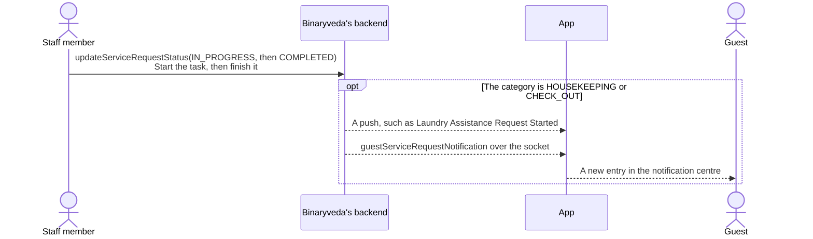

A request with several items produces one notification per item. The `OTHERS`
item never produces one. What the guest sees is on
[Notifications](notifications.md#2-what-the-backend-sends).

## Differences between the two

| | iOS | Android |
|---|---|---|
| Reception items | One request per item | One request for all items, apart from Emergency |
| Menu viewer | A PDF view inside a popup | A PDF reader inside the app |

## Every SDK member this flow uses

None. Every request goes to Binaryveda's backend through GraphQL, and neither
Spintly SDK is involved.
