# 3. Control Panel

**What it is.** The screen for one door. It shows whether the door is locked,
whether privacy or passage mode is on, and opens the door. For the guest's own
room it also has **Clean Room**, which asks housekeeping to clean it.

**How to get there.** Tap a card on [Home](home.md). The screen also opens when
the guest taps **Later** on a room cleaning reminder, from the push or from the
[notification centre](notifications.md#4-the-room-cleaning-reminder).

!!! warning "Key point"

    Privacy mode and passage mode are **read only** here. The guest cannot turn
    on Do Not Disturb from the app. Privacy mode is set by turning the deadbolt
    inside the room, and passage mode from the admin console. See
    [step 2](#2-what-is-on-the-screen).

## Participants

This page uses Guest, App, Binaryveda's backend, Access SDK and Staff member.

Each one is defined, with the colour it keeps across the site, in
[Reading these pages](conventions.md).

## The whole flow

Five steps. Each one has its own section below.

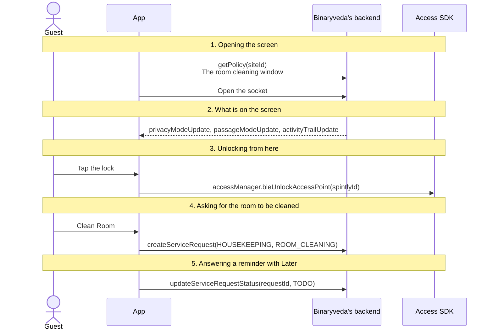

## 1. Opening the screen

`getPolicy` returns the site's policy as a JSON string. The screen reads
`roomCleaningStartTime` and `roomCleaningEndTime` from it, and falls back to 8:00
AM and 6:00 PM when they are missing.

=== "iOS"

    ```mermaid
    sequenceDiagram
        participant A as App
        participant B as Binaryveda's backend

        Note over A,B: ControlPanelView.onAppear
        A->>B: Open the socket, if it is not already connected
        opt Opened by Later on a reminder
            A->>A: Open the Clean Room sheet
        end
        A->>B: getPolicy(siteId)<br/>The room cleaning window
        B-->>A: checkIn, roomCleaningStartTime, roomCleaningEndTime
    ```

=== "Android"

    ```mermaid
    sequenceDiagram
        participant A as App
        participant B as Binaryveda's backend

        Note over A,B: ControlPanelViewModel init
        opt The stay is not loaded yet
            A->>B: getGuestDetails(cognitoId)<br/>The room and the doors
        end
        A->>B: getPolicy(siteId)<br/>The room cleaning window
        opt The door's last unlock time is not known
            A->>B: getUnlockTimePrivacyMode(cognitoId)<br/>A smaller getGuestDetails: privacy mode and the last activity
        end
        Note over A,B: ControlPanelScreen ON_RESUME
        A->>B: Open the socket
        opt Opened by Later on a reminder
            A->>A: Open the Clean Room sheet
        end
    ```

    When the phone has NFC turned off, Android shows a banner about it at the
    foot of the screen. Dismissing it is remembered.

## 2. What is on the screen

| | Where it comes from |
|---|---|
| The room number, or the shared door's name, with the room type or floor | The card that opened the screen |
| The mode badge | `privacyMode` and `passageModeStatus` from `getGuestDetails`, then kept current over the socket |
| The lock, with Tap to unlock | Locked or Unlocked, from the last unlock the app saw. Greyed out, with PRIVACY MODE ON or PASSAGE MODE ON, when a mode is set |
| A status line, and when the door last changed | The time is shown for the room only, from `lastActivity.updatedAt` and the app's own unlocks |
| **Clean Room** and **Invite Guest** | The room only. Both are shown on both platforms |

<div class="screens">
<figure>
<a href="images/control-panel/01-locked.png">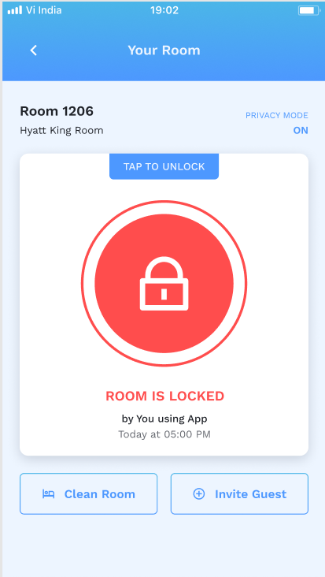</a>
<figcaption><strong>Locked</strong>The status line under the lock names who opened it last and when. Clean Room and Invite Guest sit at the foot, so this is the guest's own room.</figcaption>
</figure>
<figure>
<a href="images/control-panel/02-unlocked.png">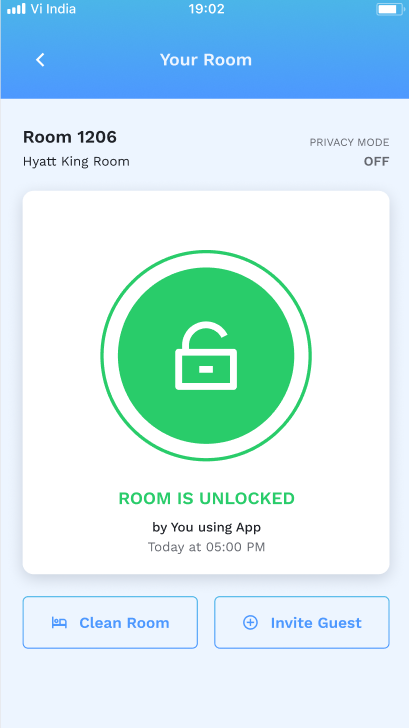</a>
<figcaption><strong>Unlocked</strong>The same screen after an unlock, with the mode flag in the header reading OFF.</figcaption>
</figure>
<figure>
<a href="images/control-panel/03-passage-mode.png">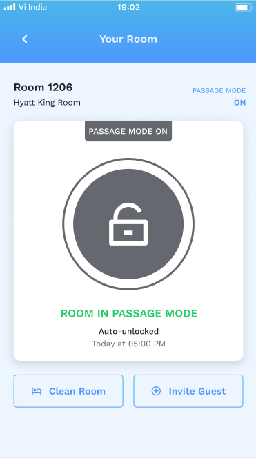</a>
<figcaption><strong>Passage mode</strong>The lock is greyed out and badged, and the status reads Auto-unlocked rather than naming a person. This is the greyed out state the row above describes.</figcaption>
</figure>
</div>

Both modes come from the lock, not from the guest.

| Mode | What it means | What an unlock does |
|---|---|---|
| **Privacy mode** | The deadbolt has been turned from inside the room | The Home button refuses with "The lock is in privacy mode", and tapping the lock here does nothing |
| **Passage mode** | The door is held open, set from the admin console | The Home button says "The room is in Passage mode". Tapping the lock here does nothing on Android, and on iOS it still tries to unlock |

Three socket events keep the screen current while it is open:
`privacyModeUpdate`, `passageModeUpdate`, and `activityTrailUpdate`, which marks
the door Unlocked for six seconds when someone else opens it. They are the same
events Home uses, filtered to this door's `spintlyId`. See
[Home and Unlock](home.md#2-live-updates).

## 3. Unlocking from here

Tapping the lock runs the same unlock as the Home button, with the same remote
fallback. The whole path is on
[Home and Unlock](home.md#3-unlocking).

The tap only does anything while the door shows Locked. iOS also requires
privacy mode to be off, and Android requires both modes to be off. On Android
this screen goes straight to the permission check and the Bluetooth unlock,
without first checking that the Spintly login and poll have finished.

## 4. Asking for the room to be cleaned

**Clean Room** opens a sheet with two choices. Both send a `HOUSEKEEPING` request
with the single item `ROOM_CLEANING`, which lands in the housekeeping queue of
the staff app.

<div class="screens">
<figure class="crop">
<a href="images/control-panel/04-clean-room-sheet.png">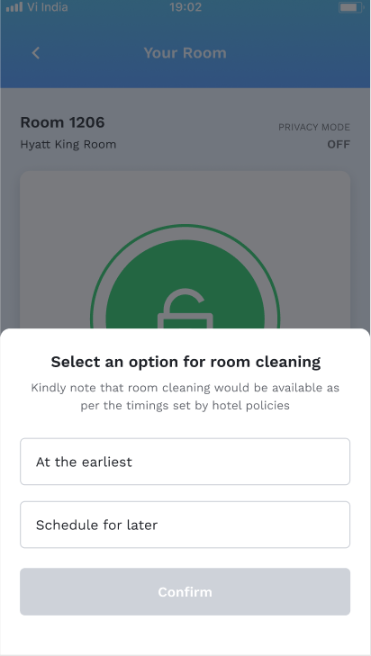</a>
<figcaption><strong>The two choices</strong>Confirm stays disabled until one is picked. The line at the top is the reminder that the site's policy sets the hours.</figcaption>
</figure>
<figure class="crop">
<a href="images/control-panel/05-at-the-earliest.png">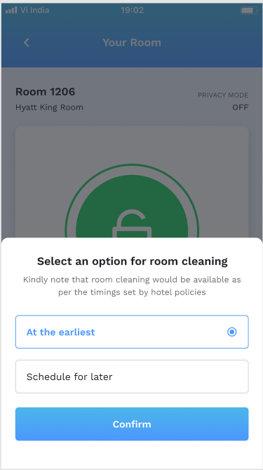</a>
<figcaption><strong>At the earliest</strong>Confirm sends <code>createServiceRequest</code> with <code>priority: true</code> and no slot.</figcaption>
</figure>
<figure class="crop">
<a href="images/control-panel/06-requested.png">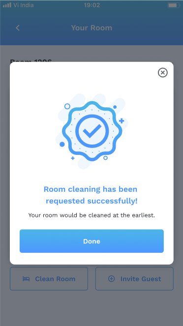</a>
<figcaption><strong>Sent</strong>The request is now a task in the staff app's housekeeping queue.</figcaption>
</figure>
<figure class="crop">
<a href="images/control-panel/07-schedule-for-later.png">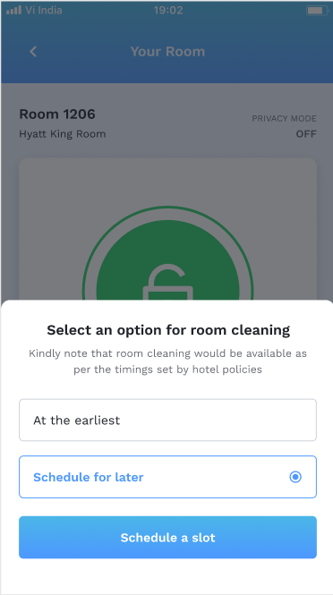</a>
<figcaption><strong>Schedule for later</strong>The button changes to Schedule a slot, which opens the time pickers rather than sending anything.</figcaption>
</figure>
<figure class="crop">
<a href="images/control-panel/08-schedule-slot.png">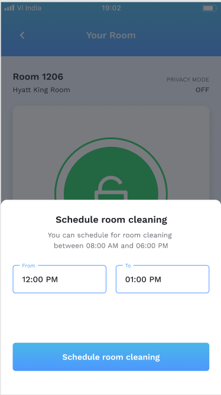</a>
<figcaption><strong>Picking the slot</strong>The 08:00 AM to 06:00 PM here is the policy's <code>roomCleaningStartTime</code> and <code>roomCleaningEndTime</code>, which the pickers are held inside by the table below.</figcaption>
</figure>
<figure class="crop">
<a href="images/control-panel/09-scheduled.png">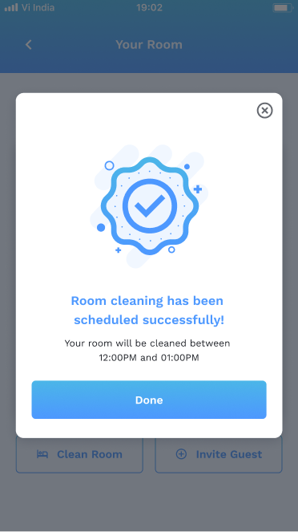</a>
<figcaption><strong>Scheduled</strong>The slot is echoed back. This request carries <code>priority: false</code> with <code>scheduledFrom</code> and <code>scheduledTo</code>.</figcaption>
</figure>
</div>

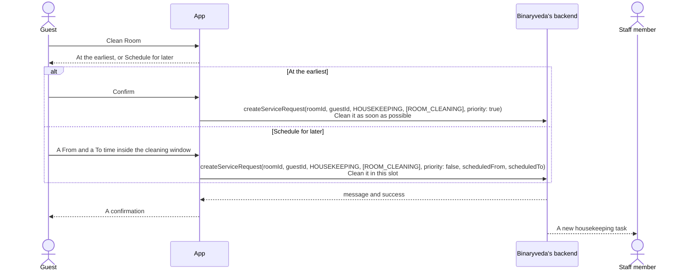

The time pickers keep the slot inside the policy's window:

| | Earliest | Latest |
|---|---|---|
| **From** | The window's start, or now if that is later | 30 minutes before the window ends |
| **To** | 30 minutes after From | The window's end |

Once it is later than 30 minutes before the window ends, Android marks Schedule
for later as unavailable, and iOS shows the window in the sheet's text instead.

What happens to the request afterwards is on
[Assistance](assistance.md#5-after-a-request).

## 5. Answering a reminder with Later

The daily room cleaning reminder asks whether the guest wants the room cleaned
today. It already carries a request, created by the backend and waiting for an
answer. **Later** opens this screen with that request's ID, so the answer
updates it rather than creating a new one.

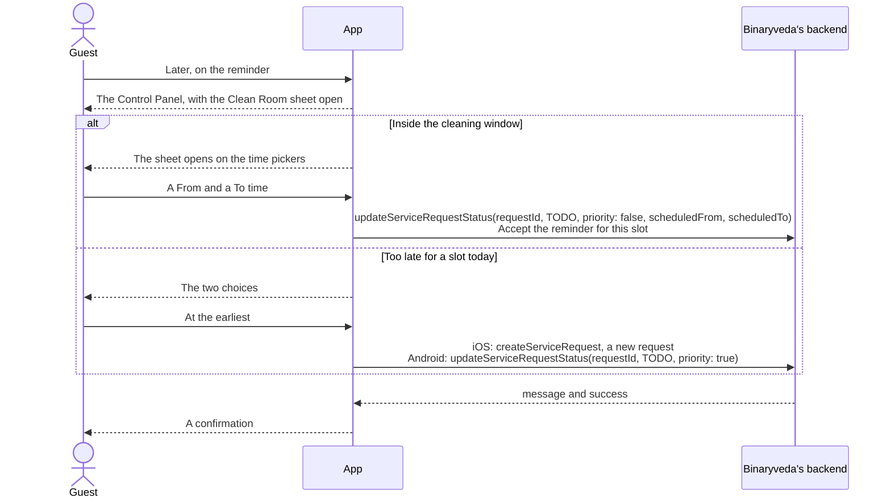

On Android the confirmation returns the guest to the notification centre with
the reminder removed from the list. The reminder itself is on
[Notifications](notifications.md#4-the-room-cleaning-reminder).

## Differences between the two

| | iOS | Android |
|---|---|---|
| Loading on open | `getPolicy` only | `getGuestDetails` if needed, `getPolicy`, and `getUnlockTimePrivacyMode` when the last unlock is unknown |
| The mode badge | PRIVACY MODE or PASSAGE MODE, with ON or OFF | PRIVACY MODE or PASSAGE MODE, with an on or off status |
| Tapping the lock | Allowed unless privacy mode is on, then the same path as Home | Allowed unless either mode is on, then straight to the permission check and Bluetooth |
| Schedule for later, late in the day | The sheet's text shows the window | The choice is marked unavailable |
| At the earliest, after Later on a reminder | Creates a new request | Updates the reminder's request to `TODO` with priority |
| After the confirmation, when opened from a reminder | Stays on the screen | Returns to the notification centre with the reminder removed |

## Every SDK member this flow uses

The unlock members are the ones listed on
[Home and Unlock](home.md#every-sdk-member-this-flow-uses). This screen adds
none of its own.
