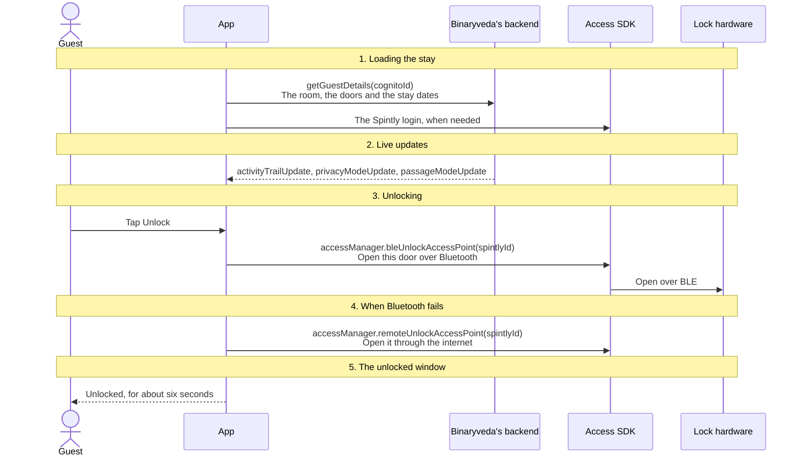
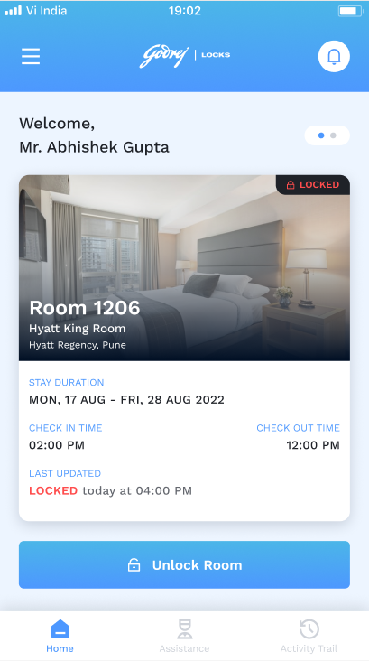
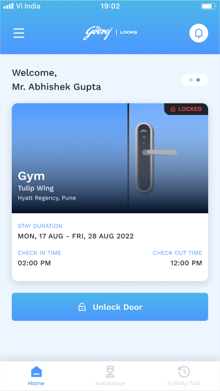
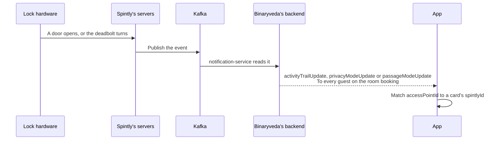
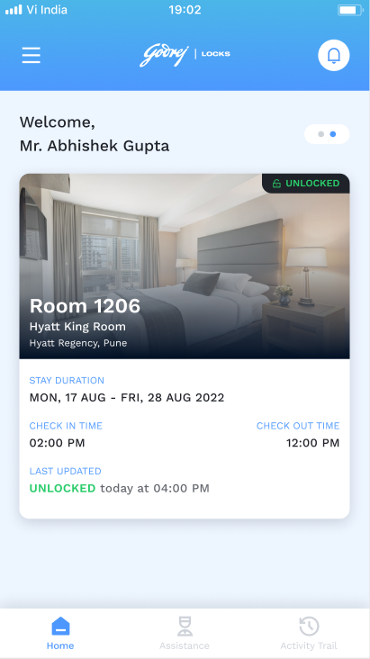

# 2. Home and Unlock

**What it is.** The first tab. One card for the guest's room and one for each
shared door, each with an **Unlock** button. This is where the app loads the
stay, keeps it current over the socket, and opens doors.

**How to get there.** The Dashboard opens on it. Tapping a card opens the
[Control Panel](control-panel.md) for that door.

!!! warning "Key point"

    A failed Bluetooth unlock falls back to a **remote unlock** through the
    internet. When the site has geofencing turned on, the fallback only runs
    while the phone is inside the site's geofence. See
    [step 4](#4-when-bluetooth-fails).

## Participants

This page uses Guest, App, Binaryveda's backend, Access SDK, Lock hardware,
Spintly's servers and Kafka.

Each one is defined, with the colour it keeps across the site, in
[Reading these pages](conventions.md).

## The whole flow

Five steps. Each one has its own section below.



## 1. Loading the stay

Home calls `getGuestDetails` every time it appears, so the cards always reflect
the backend.

<div class="screens">
<figure>
<a href="images/home/01-room-card-locked.png"></a>
<figcaption><strong>The room card</strong>Nearly every field in the table below is on it: the room number and type, the site, the stay dates, both times, and when the door was last opened.</figcaption>
</figure>
<figure>
<a href="images/home/02-shared-door-card.png"></a>
<figcaption><strong>A shared door</strong>One card per entry in <code>sharedAccess</code>, named by the door and its floor or block. The dots above it are how the guest moves between cards.</figcaption>
</figure>
</div>

=== "iOS"

    ```mermaid
    sequenceDiagram
        participant A as App
        participant B as Binaryveda's backend
        participant S as Access SDK

        Note over A,S: HomeView.onAppear, every time the tab appears
        A->>B: getGuestDetails(cognitoId)<br/>The room, the doors and the stay dates
        B-->>A: The stay
        A->>A: Build a card for the room, and one per sharedAccess
        opt isGeofencingEnabled
            A->>B: GetGeofenceDetails(siteId)<br/>The site's geofence shape, stored on the phone
        end
        A->>S: The Spintly login
        A->>B: listGuestNotifications(page 1, limit 15)<br/>For the unseen dot on the bell
        A->>B: Open the socket
    ```

    The Spintly login is
    [User Onboarding, step 6](user-onboarding.md#6-trading-the-cognito-token-for-a-spintly-session).
    If `getGuestDetails` fails, iOS shows the stay it cached last time.

=== "Android"

    ```mermaid
    sequenceDiagram
        participant A as App
        participant B as Binaryveda's backend
        participant S as Access SDK

        Note over A,S: HomeScreen ON_RESUME
        A->>B: Open the socket
        A->>B: getGuestDetails(cognitoId)<br/>The room, the doors and the stay dates
        alt status is GRACE_EXPIRED or DEPARTED, or errorType 404
            B-->>A: A stay that has ended, or no guest
            A->>A: Raise the auto logout signal
        else The stay is active
            B-->>A: The stay
            A->>A: Build a card per door, keyed by spintlyId
            opt pollData has not succeeded yet
                A->>S: The Spintly login, then pollData
            end
            opt isGeofencingEnabled
                A->>A: Read the geofence from the local cache
                opt Nothing cached
                    A->>B: GetGeofenceDetails<br/>The site's geofence shape
                end
            end
        end
    ```

    When `guest.deepLink` is false, Android shows **No room assigned yet!**
    instead of the cards, with "It seems like your access has been revoked, or
    no room has been assigned to you yet. Contact the front desk for help."

    The bell's unseen dot is fetched by the Dashboard, not by Home. See
    [Notifications](notifications.md#5-the-notification-centre).

### What `getGuestDetails` returns

| Field | Used for |
|---|---|
| `guest`: id, userId, salutation, names, mobile, `status`, `deepLink` | The welcome line, the status check, and on Android whether mobile access has been given |
| `room`: number, `privacyMode`, `passageModeStatus`, `locks[].accessPoint.spintlyId` | The room card, and the door its Unlock opens |
| `sharedAccess[]`: name, floor or block, `passageModeStatus`, `locks[]` | One card per shared door |
| `checkIn`, `checkOut` | The stay dates and times on every card |
| `roomType`: type, `roomImages` | The card title and image |
| `site`: id, name, location | The address line, and the `siteId` later calls send |
| `lastActivity.updatedAt` | When the room was last opened |
| `isGeofencingEnabled` | Whether a remote unlock needs the phone inside the geofence |
| `isRoomServiceAvailable` | Whether [Assistance](assistance.md) shows Room Service |

Shared door cards use a coloured placeholder image, since a shared door has no
room type.

## 2. Live updates

The socket connects to `subscription-service` on the guest namespace, with the
Cognito access token as its credential. The backend only lets it join while the
guest's status is `ARRIVED`, `GRACE_PERIOD` or `GRACE_EXPIRED`.



| Event | Carries | What Home does with it |
|---|---|---|
| `activityTrailUpdate` | `accessPointId`, `eventTimestamp`, `userId`, `eventSource`, the guest or staff details | If someone else opened the room, the card shows Unlocked, then returns to Locked. Sent for room doors only |
| `privacyModeUpdate` | `accessPointId`, `privacyMode` | Updates the door's privacy flag |
| `passageModeUpdate` | `accessPointId`, `passageModeStatus` | Updates the door's passage flag. Android handles it here, and iOS only on the Control Panel |
| `guestServiceRequestNotification` | A notification | Turns on the unseen dot on the bell |

## 3. Unlocking

=== "iOS"

    ```mermaid
    sequenceDiagram
        actor G as Guest
        participant A as App
        participant S as Access SDK
        participant L as Lock hardware

        G->>A: Tap Unlock
        alt passageModeStatus is true
            A-->>G: Door already unlocked! The room is in Passage mode.
        else privacyMode is true
            A-->>G: Unable to unlock! The lock is in privacy mode.
        else Neither
            opt Bluetooth is off or not allowed, or location is missing with geofencing on
                A-->>G: The permissions screen, and the unlock stops
            end
            A->>S: accessManager.startBleScan()<br/>Start listening for the lock
            A->>S: cloudSyncManager.pollData<br/>Refresh the permissions, not waited for
            A->>S: accessManager.bleUnlockAccessPoint(spintlyId, delegate:)<br/>Open this door
            S->>L: Open over BLE
            alt didUnlock(readerInfo:customParameter:)
                A-->>G: Unlocked
            else didFail(_:)
                A->>A: Step 4, after 1.2 seconds
            end
        end
    ```

    Coming back from the permissions screen does not retry the unlock. The
    guest taps Unlock again.

=== "Android"

    ```mermaid
    sequenceDiagram
        actor G as Guest
        participant A as App
        participant S as Access SDK
        participant L as Lock hardware

        G->>A: Tap Unlock
        alt passage mode is on
            A-->>G: Door already unlocked! The room is in Passage mode.
        else privacy mode is on
            A-->>G: Unable to unlock! The lock is in privacy mode.
        else The Access SDK is not logged in
            A->>S: Run the Spintly login, and stop
        else pollData has not succeeded
            A->>S: cloudSyncManager.pollData, and stop
        else Ready
            opt A permission or service is missing
                A-->>G: The permissions screen, and the unlock waits
            end
            A->>S: accessManager.bleUnlockAccessPoint(spintlyId, UnlockCallback)<br/>Open this door
            S->>L: Open over BLE
            alt onSuccess
                A-->>G: Unlocked
            else onFailure
                A->>A: Step 4
            end
        end
    ```

    In the two branches that stop, nothing is opened and the guest taps Unlock
    again once the login or poll has finished. When the permissions screen
    opened, its **Continue** brings the guest back and Home retries the unlock
    by itself.

    Android does not start the BLE scan per tap. Home and the Dashboard call
    `accessManager.startBleScan()` whenever Bluetooth, or on older Android
    versions location, becomes available.

Nothing is sent to Binaryveda's backend after an unlock. The backend hears about
it from Spintly through Kafka, and that is how the Activity Trail and other
guests on the same booking find out.

## 4. When Bluetooth fails

A Bluetooth failure is usually the guest being out of range. Both platforms then
try a **remote unlock**, which asks Spintly to open the door through the
internet.

A site can turn on **geofencing**. `GetGeofenceDetails` returns its shape: a
circle with a centre and radius, a square with four edges, or a polygon. With
geofencing on, a remote unlock only runs when the phone's location is inside
that shape.

=== "iOS"

    ```mermaid
    sequenceDiagram
        actor G as Guest
        participant A as App
        participant S as Access SDK
        participant SP as Spintly's servers
        participant L as Lock hardware

        alt The phone is offline
            A-->>G: The Bluetooth error, as a message
        else Geofencing is off
            A->>S: accessManager.remoteUnlockAccessPoint(spintlyId, delegate:)<br/>Open it through the internet
            S->>SP: The remote unlock request
            SP->>L: Open
        else Geofencing is on
            A->>A: Build the geofence from the stored shape, start location updates
            alt The phone is inside it
                A->>S: accessManager.remoteUnlockAccessPoint(spintlyId, delegate:)
                S->>SP: The remote unlock request
                SP->>L: Open
            else Outside it
                A-->>G: Unable to unlock! You're too far away from the lock.
            end
        end
    ```

=== "Android"

    ```mermaid
    sequenceDiagram
        actor G as Guest
        participant A as App
        participant S as Access SDK
        participant SP as Spintly's servers
        participant L as Lock hardware

        alt The error says the lock is in privacy mode
            A-->>G: The error, and nothing more
        else Geofencing is on, and the geofence is loaded
            A->>A: FusedLocationProviderClient.getCurrentLocation<br/>High accuracy, for up to 30 seconds
            alt The phone is inside it
                A->>S: accessManager.remoteUnlockAccessPoint(spintlyId, RemoteUnlockCallback)
                S->>SP: The remote unlock request
                SP->>L: Open
            else Outside it
                A-->>G: Unable to unlock! You're too far away from the lock.
            end
        else Geofencing is on, but no geofence is loaded
            A-->>G: Oops, something went wrong!
        else Geofencing is off
            A->>S: accessManager.remoteUnlockAccessPoint(spintlyId, RemoteUnlockCallback)
            S->>SP: The remote unlock request
            SP->>L: Open
        end
    ```

A remote unlock also appears on the Activity Trail, with the source shown as
Internet.

## 5. The unlocked window

After a successful unlock the card shows **Unlocked** for a few seconds and then
goes back to Locked: 5.5 seconds on iOS and 6 seconds on Android. It is a display
timer only. Nothing is called when it fires, and the lock relocks on its own
schedule.

<div class="screens">
<figure>
<a href="images/home/03-room-card-unlocked.png"></a>
<figcaption><strong>Inside the window</strong>The badge and the last updated line both turn green, and the Unlock button goes away for as long as the timer runs.</figcaption>
</figure>
</div>

The same window runs when another guest or a staff member opens the room and
the socket reports it.

## What an unlock error says

The Access SDK reports failures as an error domain and a code. iOS maps them to
its own sentences, listed below. Android shows the heading and message the SDK
returns, in the app's error snackbar.

| Domain and code | iOS shows |
|---|---|
| `BluetoothError` 1 | Turn on bluetooth |
| `AccessControlServiceError` 1 | The phone is not supported, as a generic error |
| `AccessControlServiceError` 2, "Timed out waiting for unlock" | You're too far away from the lock |
| `AccessControlServiceError` 3, "Requested device not detected recently" | Lock is currently offline |
| `AccessControlServiceError` 4, "No devices scanned recently" | You're too far away from the lock |
| `AccessControlServiceError` 7, "The device is too far" | You're too far away from the lock |
| `UnauthorisedError` 1 | The SDK is not logged in, as a generic error |
| `UnauthorisedError` 4 | The lock is in privacy mode |
| `UnauthorisedError` 5, "no remote unlock permission" | You're too far away from the lock |
| `UnauthorisedError` 7, 9 | A generic error |
| `ApiError` 400, "Door is in Lockdown State" | The lock is in privacy mode |
| `ApiError` 400, "Device Offline", "Gateway Offline" or "Repeater Offline" | Lock is currently offline |
| Anything else | Oops, something went wrong. There seems to be some error. |

`UnauthorisedError` 7 means the access point is not in the SDK's permissions.
It usually means `pollData` has not run since the guest's access changed. See
[Notifications](notifications.md#6-silent-pushes).

## Differences between the two

| | iOS | Android |
|---|---|---|
| When the stay is loaded | Every time the tab appears | On every `ON_RESUME` |
| A stay that has ended, seen on Home | Not checked here | Raises the auto logout signal |
| No mobile access (`deepLink` false) | Cards are shown as usual | The No room assigned yet! screen |
| Geofence | Fetched on every load when geofencing is on | Read from the local cache first |
| Before Bluetooth | `startBleScan` and `pollData` on every tap | The scan is started by connectivity changes, and the tap needs a finished login and poll |
| Returning from the permissions screen | The guest taps Unlock again | The unlock is retried automatically |
| Location for the geofence | Location updates until the phone is found inside or outside | One high accuracy fix |
| Who counts as someone else on the socket | Any unlock whose guest is not this guest | Any unlock except this guest's own Bluetooth or remote unlocks |
| Unlocked window | 5.5 seconds | 6 seconds |
| Error messages | Mapped to written sentences | The SDK's own heading and message |

## Every SDK member this flow uses

??? note "iOS"

    | SDK | Member | When | What it is for |
    |---|---|---|---|
    | Access | `accessManager.startBleScan()` | Before each unlock | Start listening for the lock |
    | Access | `cloudSyncManager.pollData` | Before each unlock | Refresh the door permissions |
    | Access | `accessManager.bleUnlockAccessPoint(_:delegate:)` | Tapping Unlock | Open the door over Bluetooth |
    | Access | `UnlockDelegate` → `didUnlock(readerInfo:customParameter:)`, `didFail(_:)` | Tapping Unlock | How the attempt reports back |
    | Access | `accessManager.remoteUnlockAccessPoint(_:delegate:)` | After a Bluetooth failure | Open the door through the internet |
    | Access | `RemoteUnlockDelegate` → `didUnlock(_:)`, `didFail(_:)` | After a Bluetooth failure | How the remote attempt reports back |

??? note "Android"

    | SDK | Member | When | What it is for |
    |---|---|---|---|
    | Access | `accessManager.startBleScan()` | When Bluetooth or location becomes available | Start listening for locks nearby |
    | Access | `credentialManager.isLoggedIn` | Tapping Unlock | Check the login has finished |
    | Access | `cloudSyncManager.pollData(CompletionCallback)` | Tapping Unlock before the first poll | Pull down the door permissions |
    | Access | `permissionManager.accessPointsLiveData` | After `pollData` | Observed and logged |
    | Access | `accessManager.scannedDevicesLiveData` | After `pollData` | Observed and logged |
    | Access | `accessManager.bleUnlockAccessPoint(accessPointId, UnlockCallback)` | Tapping Unlock | Open the door over Bluetooth |
    | Access | `UnlockCallback` → `onSuccess(ReaderInfo, Byte)`, `onFailure(Exception)` | Tapping Unlock | How the attempt reports back |
    | Access | `accessManager.remoteUnlockAccessPoint(accessPointId, RemoteUnlockCallback)` | After a Bluetooth failure | Open the door through the internet |
    | Access | `RemoteUnlockCallback` → `onSuccess`, `onFailure` | After a Bluetooth failure | How the remote attempt reports back |
    | Access | `accessManager.stopBleScan()` | When the activity is destroyed | Stop scanning |
