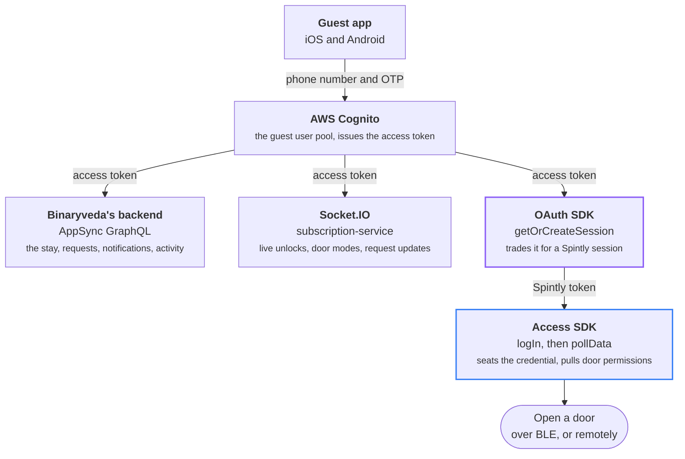
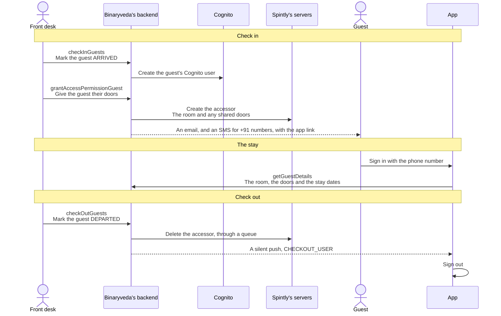

# Connected Lock Guest App

Hotel guests use this app during a stay. It opens their room door and any shared
doors they were given, sends requests to hotel staff, and shows who has opened
their room. It does not book, check in or check out. The front desk does all
three from the admin console, and the app only works between check in and check
out.

The app has three tabs: [Home](home.md), [Assistance](assistance.md) and
[Activity Trail](activity-trail.md). The bell opens the
[notification centre](notifications.md), and the menu icon opens the
[side menu](profile-and-logout.md) with the profile and Log out.

## What the app is made of

Cognito issues one access token, and the app sends it to three places: the
GraphQL API, the socket, and Spintly's OAuth SDK.

## A stay, from check in to check out

The app sees only the middle of a stay. Everything before the first sign in and
after checkout happens between the front desk and the backend.

A guest cannot sign themselves up. The Cognito user is created at check in, so a
number the front desk has not checked in gets **"User does not exist"** at the
OTP step.

### The guest's status

`getGuestDetails` returns a `guest.status`, and both apps read it.

| Status | Set when | What the app does |
|---|---|---|
| `ARRIVED` | Check in | Everything works |
| `GRACE_PERIOD` | The checkout time passes, on a site whose policy has a grace period and `revokeAccessPostCheckout` turned on | Everything still works. The accessor is still in place |
| `GRACE_EXPIRED` | The grace period ends | The backend deletes the accessor and sends `LOCK_PERMISSION_UPDATED`. Sign in is refused on both platforms, and Android also signs out an open session the next time Home loads |
| `DEPARTED` | The front desk checks the guest out | `CHECKOUT_USER` signs the app out, and sign in is refused |

On a site without a grace period, nothing happens at the checkout time. The
accessor stays until the front desk checks the guest out.

## The two SDKs

The guest app ships the same **two** Spintly SDKs as the staff app, at the same
versions. They share nothing except the session token the OAuth SDK produces.

### OAuth SDK: the session token

Exchanges the Cognito access token for a Spintly **session token**. Nothing else
can talk to Spintly until this succeeds. The exchange runs over callbacks: the
app asks for a session, the SDK asks how to authenticate, the app hands back a
token exchange request, and the SDK returns the session.

### Access SDK: the credential

Holds the signed in credential and the guest's door permissions. `logIn` seats
the Spintly token, `pollData` pulls down which doors the guest may open,
`bleUnlockAccessPoint` opens one over Bluetooth, and `remoteUnlockAccessPoint`
opens one through the internet when Bluetooth fails.

### There is no Config SDK

The third Spintly SDK, the one that writes to lock hardware, is **not shipped**.
Guests cannot change anything about a lock. Privacy mode and passage mode are
shown, but set elsewhere: privacy mode by the deadbolt inside the room, and
passage mode from the admin console.

### Versions shipped

| Short name | iOS (`Godrej-Locks-iOS-SpintlySDK` 2.1.0) | Android |
|---|---|---|
| **OAuth** | `SpintlyOauth` | `oauthsdk-0.7.0.aar` (`com.mrinq.oauthsdk`) |
| **Access** | `SmartAccessFramework` | `smartaccesssdk-1.16.0.0.aar` (`com.mrinq.smartaccesssdk`) |

!!! info "Accessor"

    Spintly's word for a person who can open a door is an **accessor**. A
    guest's accessor is created by the backend in `grantAccessPermissionGuest`,
    with the guest's Cognito `sub` as its identity. The doors on it are the room
    and any shared access areas. Their `accessPointId` is what the unlock calls
    take, and `getGuestDetails` returns it as `spintlyId`.
