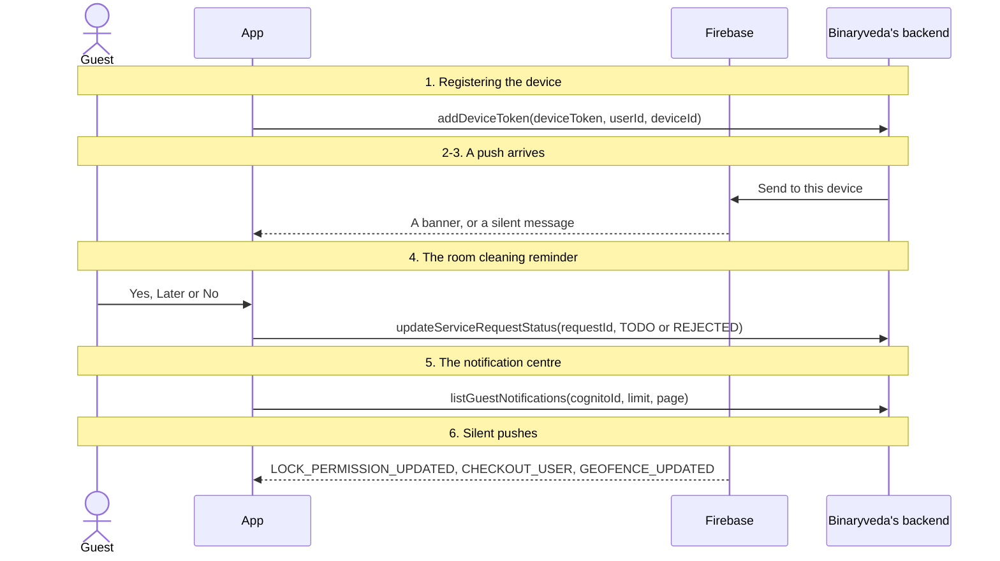
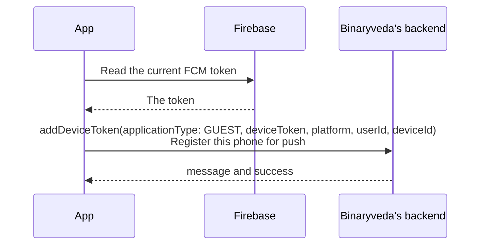
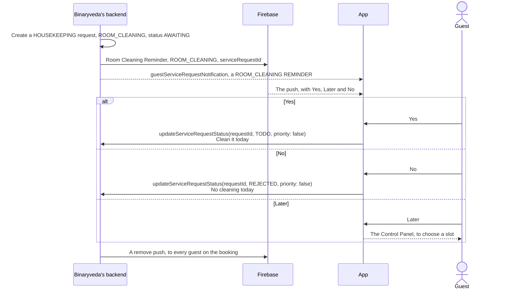
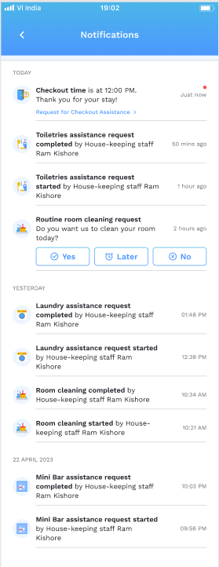
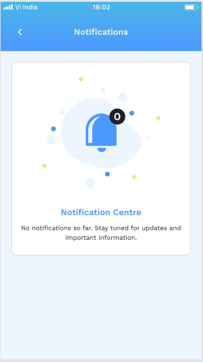
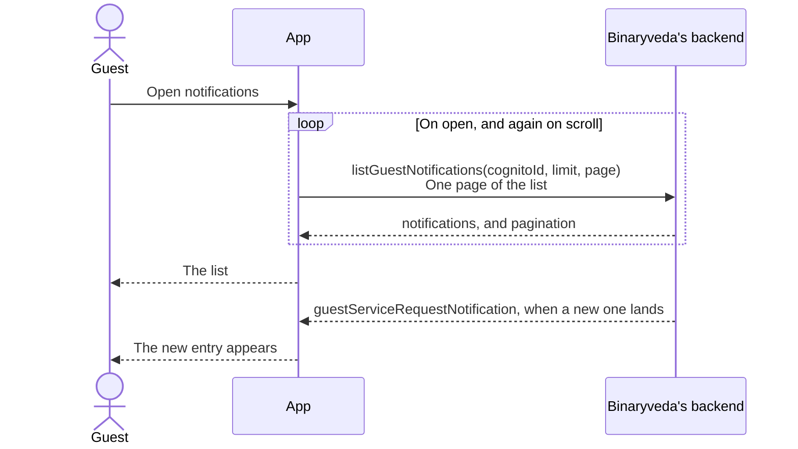
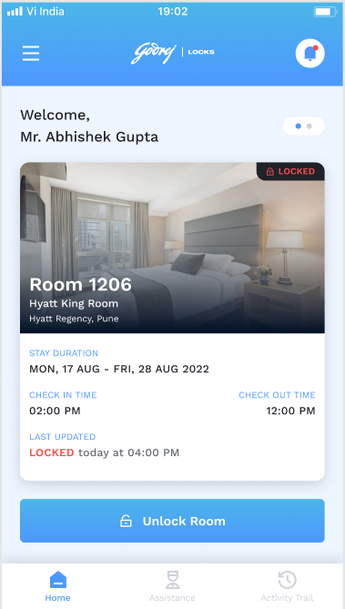
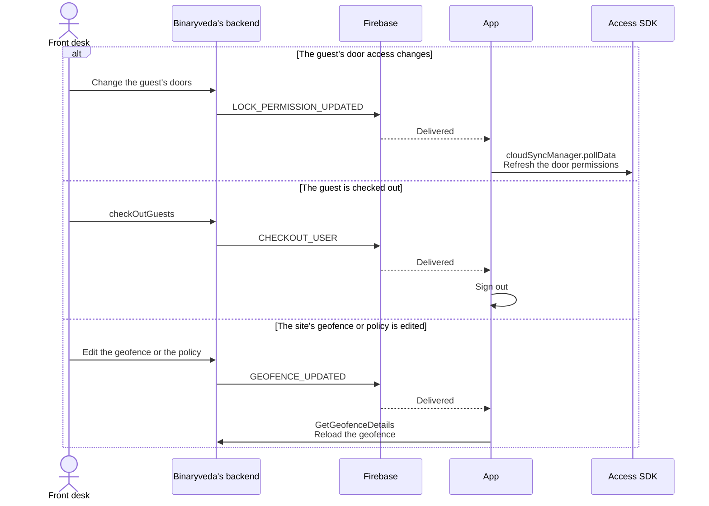

# 6. Notifications

**What it is.** Three things that share a name. **Push** tells the guest when
their room is opened, when a request moves, or when a reminder is due. **Silent
push** changes the app without showing anything. The **notification centre** is
the list behind the bell.

**How to get there.** Tap the bell in the Dashboard header. Tapping most push
banners opens the same screen.

!!! warning "Key point"

    Three silent push categories act instead of showing a banner.
    `LOCK_PERMISSION_UPDATED` refreshes the door permissions, `CHECKOUT_USER`
    signs the app out, and `GEOFENCE_UPDATED` reloads the geofence. See
    [step 6](#6-silent-pushes).

## Participants

This page uses Guest, App, Firebase, Binaryveda's backend, Access SDK and Front
desk.

Each one is defined, with the colour it keeps across the site, in
[Reading these pages](conventions.md).

## The whole flow

Six steps. Each one has its own section below.



## 1. Registering the device

The device is registered at sign in, as part of
[checking the stay](user-onboarding.md#4-checking-the-stay). The backend turns
the token into an SNS endpoint for the guest app, and every push to this guest
goes to every endpoint they have.



=== "iOS"

    Registered once, at sign in. `deviceId` is a new random UUID on every call.
    When Firebase rotates the token, the new one is stored on the phone but not
    sent to the backend.

=== "Android"

    Registered at sign in, and again from
    `GodrejMessagingService.onNewToken` whenever Firebase rotates the token, as
    long as a user ID is stored. `deviceId` is a UUID minted on first sign in and
    kept across logouts.

On logout the FCM token is deleted, so the phone stops receiving pushes. See
[Profile and Logout](profile-and-logout.md#2-logging-out).

## 2. What the backend sends

Eight pushes in all. Four show the guest something, and four change the app
without showing anything.

### The four the guest sees

| Push | Sent when | `category` |
|---|---|---|
| **Room Unlocked** | Someone else opens the room door: a staff member, a mechanical key, or another guest on the booking | None |
| **Room Cleaning Reminder** | Once a day, at the site's housekeeping trigger time, for each room booking | `ROOM_CLEANING`, with the `serviceRequestId` |
| **Check Out Reminder** | 30 minutes before the booking's checkout time | `CHECK_OUT` |
| **Request started or completed** | Staff start or complete a Housekeeping or Checkout request | None |

Only the room cleaning reminder carries buttons, Yes, Later and No. The other
three are plain banners.

Each of these also carries a `page`, which Android reads to decide which screen
a tap opens: `activityTrail` for Room Unlocked, and `notification` for the other
three.

### The four that show nothing

| Push | Sent when | What the app does with it |
|---|---|---|
| **Remove** | A reminder has been answered, or unanswered ones were accepted automatically | Clears that reminder's notification. Carries `remove: true` and the `serviceRequestId` |
| **`LOCK_PERMISSION_UPDATED`** | The guest's door access changes, or the grace period ends | Refreshes the door permissions |
| **`CHECKOUT_USER`** | The front desk checks the guest out | Signs the app out |
| **`GEOFENCE_UPDATED`** | The site's geofence or policy is edited | Reloads the geofence |

These carry the category and nothing else. The last three are
[step 6](#6-silent-pushes).

**Which service sends which.** `notification-service` sends Room Unlocked, both
reminders, the Remove that follows an automatic acceptance, and
`LOCK_PERMISSION_UPDATED` when the grace period ends. `assistance-service` sends
the started and completed pushes, and the Remove that follows an answer.
`booking-service` sends `CHECKOUT_USER`, and `LOCK_PERMISSION_UPDATED` when the
guest's access changes. `inventory-service` sends `GEOFENCE_UPDATED`.

## 3. A push arrives

=== "iOS"

    ```mermaid
    sequenceDiagram
        participant F as Firebase
        participant A as App
        actor G as Guest

        F-->>A: The message
        alt Silent, with content-available
            A->>A: handleSilentPush, by category (step 6)
            opt It carries a serviceRequestId
                A->>A: Remove delivered notifications with the same ID
            end
        else In the foreground
            A-->>G: The banner. A new ROOM_CLEANING one replaces older ones
        else Tapped
            alt The title is Room Unlocked
                A-->>G: The Activity Trail tab
            else Anything else
                A-->>G: The notification centre
            end
        end
    ```

    Pushes are handled in `AppDelegate`, through
    `UNUserNotificationCenterDelegate`. The Yes, Later and No buttons belong to
    the `ROOM_CLEANING` notification category, registered when the guest allows
    notifications.

=== "Android"

    ```mermaid
    sequenceDiagram
        participant F as Firebase
        participant A as App
        actor G as Guest

        F-->>A: GodrejMessagingService.onMessageReceived
        alt remove is true
            A->>A: Cancel the room cleaning notification
        else A silent category
            A->>A: Act on it (step 6), and show nothing
        else ROOM_CLEANING
            A-->>G: A notification with Yes, Later and No buttons
        else Anything else
            A-->>G: A notification, on the ACTIVITY_TRAIL channel when page is activityTrail
        end
        opt page is notification
            A->>A: Turn on the unseen dot
        end
        G->>A: Tap it
        A-->>G: The screen named by page: the notification centre, the Activity Trail tab, or the Control Panel
    ```

    Android draws the notification itself from the data payload, on one of the
    two channels created at launch: `HOUSEKEEPING` or `ACTIVITY_TRAIL`.

## 4. The room cleaning reminder

Once a day, at the time the site's policy sets as its housekeeping trigger, the
backend creates a room cleaning request for every occupied room and asks the
guests whether they want it.



**Yes** and **No** work straight from the push without opening the app: iOS runs
them as notification actions, and Android sends them to
`UpdateServiceRequestService`. **Later** opens the app on the
[Control Panel](control-panel.md#5-answering-a-reminder-with-later). The same
three buttons appear on the reminder in the notification centre.

**Nobody answers.** At the policy's housekeeping time the backend moves every
reminder still waiting to `TODO`, so the room is cleaned, and sends the remove
push.

## 5. The notification centre

A paged list, newest first and grouped by day, with a socket event telling the
app when something new has landed.

<div class="screens">
<figure>
<a href="images/notifications/02-notification-centre.png"></a>
<figcaption><strong>The list</strong>One page of <code>listGuestNotifications</code>. The top two rows are the <code>REMINDER</code> entries from the table below, and the rest are <code>GENERAL</code> ones, which carry no actions.</figcaption>
</figure>
<figure>
<a href="images/notifications/03-empty.png"></a>
<figcaption><strong>Nothing yet</strong>What a guest sees before the first notification lands.</figcaption>
</figure>
</div>



Each entry carries a `category`, a `type`, a `state`, `subCategory`,
`checkoutTime`, the `staff` who acted, and the `serviceRequestId`.

| `category` and `type` | The row | Actions |
|---|---|---|
| `ROOM_CLEANING`, `REMINDER` | Routine room cleaning request. Do you want us to clean your room today? | Yes, Later, No |
| `CHECK_OUT`, `REMINDER` | Checkout time is at the given time. Thank you for your stay! | Request for checkout assistance, which opens [Checkout](assistance.md#3-checkout) |
| `ROOM_CLEANING`, `GENERAL` | Room cleaning started, or completed, by the staff member | None |
| `ASSISTANCE`, `GENERAL` | The item's assistance request started, or completed, by the staff member | None |
| `CHECK_OUT`, `GENERAL` | Initiate checkout assistance request started, or completed | None |

Answering a reminder removes it from the list straight away, and puts it back if
the call fails.

**The unseen dot.** Both platforms remember which notification IDs the guest has
already seen, and mark new ones with a red dot in the list. The bell shows a dot
when the newest entry has not been seen.

<div class="screens">
<figure>
<a href="images/notifications/01-bell-dot.png"></a>
<figcaption><strong>The bell, with the dot</strong>The newest entry has not been seen. Opening the centre and coming back clears it.</figcaption>
</figure>
</div>

=== "iOS"

    Fifteen entries a page. Home fetches the first page to decide the bell's
    dot, and a socket event or a tapped push turns it on.

=== "Android"

    Twenty entries a page. The Dashboard fetches the first three on every
    `ON_RESUME` to decide the bell's dot, and a push with `page` set to
    `notification` turns it on. A socket event reloads the list.

## 6. Silent pushes



**`LOCK_PERMISSION_UPDATED`** is the only way a change to the guest's doors
reaches the Access SDK before the next poll. Without it, an unlock on a newly
granted door fails with `UnauthorisedError` 7. On Android the handler creates
the SDK first if the push woke the app, only polls when the SDK is logged in,
and logs the SDK out if the poll fails.

**`CHECKOUT_USER`** runs the sign out described on
[Profile and Logout](profile-and-logout.md#3-the-ways-a-session-ends).

**`GEOFENCE_UPDATED`** reloads the shape used for remote unlocks. Android also
refetches `getGuestDetails`, in case geofencing was switched on or off.

## Differences between the two

| | iOS | Android |
|---|---|---|
| Where push is handled | `AppDelegate` | `GodrejMessagingService` |
| A rotated token | Stored, not sent | `onNewToken` calls `addDeviceToken` |
| `deviceId` | A new UUID on every call | One UUID, kept across logouts |
| Which screen a tap opens | Activity Trail for a Room Unlocked title, the notification centre otherwise | The screen named by `page` |
| Reminder buttons | Notification category actions | Buttons drawn into the notification |
| A remove push | Clears delivered notifications with the same `serviceRequestId` | Cancels the room cleaning notification |
| The checkout reminder's time | Always shown as 12:00 PM | The `checkoutTime` on the entry |
| A new entry over the socket | Inserted at the top | The list reloads |
| `GEOFENCE_UPDATED` | Reloads the geofence | Reloads the geofence and `getGuestDetails` |

## Every SDK member this flow uses

??? note "iOS"

    | SDK | Member | When | What it is for |
    |---|---|---|---|
    | Access | `cloudSyncManager.pollData` | A `LOCK_PERMISSION_UPDATED` push | Refresh the door permissions |

??? note "Android"

    | SDK | Member | When | What it is for |
    |---|---|---|---|
    | Access | `SpintlyLibHelper.initialise(context)` | A `LOCK_PERMISSION_UPDATED` push on a cold start | Create the SDK before using it |
    | Access | `credentialManager.isLoggedIn` | A `LOCK_PERMISSION_UPDATED` push | Skip the refresh when nobody is signed in |
    | Access | `cloudSyncManager.pollData(CompletionCallback)` | A `LOCK_PERMISSION_UPDATED` push | Refresh the door permissions |
    | Access | `credentialManager.logOut()` | The poll fails | Drop the credential |
    | OAuth | `oauthManager.clearSession()` | The poll fails | Drop the Spintly session |
