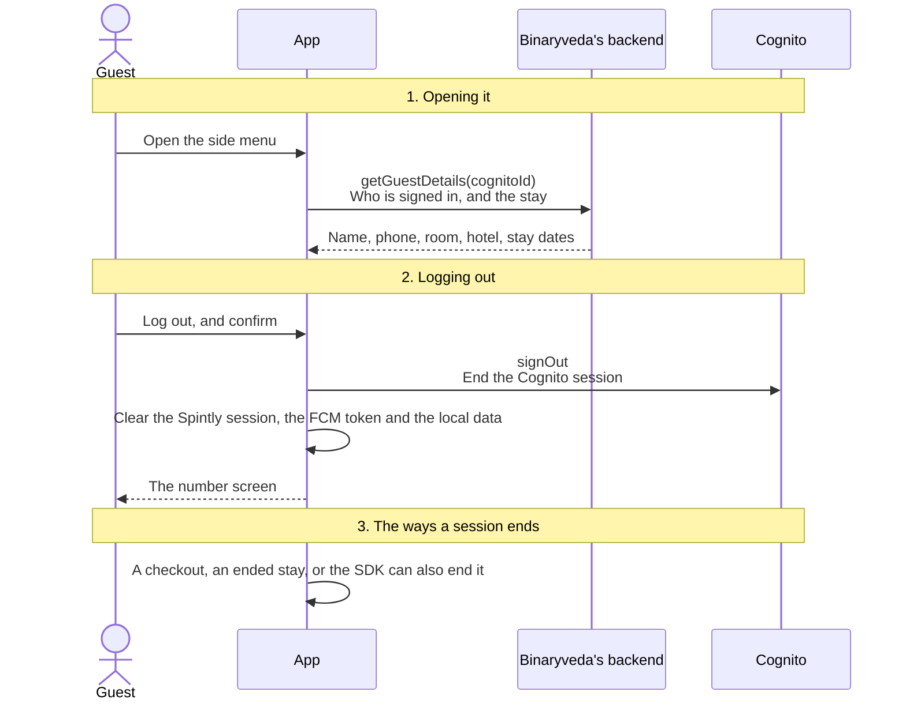
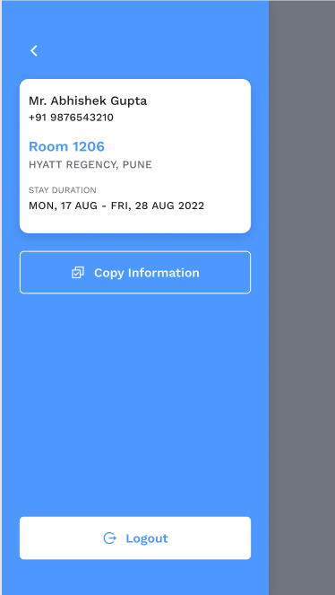

# 7. Profile and Logout

**What it is.** The side menu. It shows who is signed in, which room they are
in, and the dates of the stay, and it holds the only Log out button in the app.
There is no profile editing and no way to delete the account.

**How to get there.** Tap the menu icon in the Dashboard header. On iOS it slides
in over the Dashboard, and on Android it opens as a drawer.

## Participants

This page uses Guest, App, Binaryveda's backend, Cognito, OAuth SDK, Access SDK
and Firebase.

Each one is defined, with the colour it keeps across the site, in
[Reading these pages](conventions.md).

## The whole flow

Three steps. Each one has its own section below.



## 1. Opening it

| Shown | Where it comes from |
|---|---|
| Name | `guest.salutation`, `firstName`, `lastName` |
| Phone | `guest.mobileCode` and `mobileNumber` |
| Room | `room.number` |
| Hotel | `site.name` and `site.location` |
| Stay duration | `checkIn` and `checkOut`, as dates |

<div class="screens">
<figure>
<a href="images/profile-and-logout/01-side-menu.png"></a>
<figcaption><strong>The side menu</strong>Every row in the table above, in order, with Copy Information under them and Logout held at the foot.</figcaption>
</figure>
</div>

**Copy Information** copies those lines to the clipboard and shows **Details
Copied**.

=== "iOS"

    `getGuestDetails` is called each time the menu opens. A copy fetched
    recently is reused instead, and the last cached copy is shown if the call
    fails.

=== "Android"

    `getGuestDetails` is called on the drawer's `ON_START`. Copy Information
    stays disabled until it has returned.

## 2. Logging out

Log out is behind a confirmation dialog.

=== "iOS"

    ```mermaid
    sequenceDiagram
        actor G as Guest
        participant A as App
        participant C as Cognito
        participant O as OAuth SDK
        participant S as Access SDK
        participant F as Firebase

        G->>A: Logout, then Yes on Logout?
        A->>C: Amplify.Auth.signOut()<br/>End the Cognito session
        C-->>A: Signed out
        A->>S: credentialManager.logOut()<br/>Drop the Spintly credential
        A->>O: oauthManager.clearSession()<br/>Drop the Spintly session
        A->>A: Clear the stored data, reset Analytics and Crashlytics
        A->>F: Messaging.messaging().deleteToken<br/>Stop push to this phone
        A->>A: Stop the unlock timer, disconnect the socket
        A-->>G: The number screen
    ```

    If the Cognito sign out fails, the menu shows an error and nothing is
    cleared.

=== "Android"

    ```mermaid
    sequenceDiagram
        actor G as Guest
        participant A as App
        participant C as Cognito
        participant O as OAuth SDK
        participant S as Access SDK
        participant F as Firebase

        G->>A: Logout, then Yes
        A->>C: Amplify.Auth.signOut<br/>End the Cognito session
        C-->>A: Signed out
        A->>S: credentialManager.logOut()<br/>Drop the Spintly credential
        A->>O: oauthManager.clearSession()<br/>Drop the Spintly session
        A->>A: Clear the preferences, keeping the device UUID, and the local database
        A->>F: FirebaseMessaging.getInstance().deleteToken()<br/>Stop push to this phone
        A->>A: Cancel every posted notification
        A-->>G: The number screen
    ```

Nothing is sent to Binaryveda's backend. The device token row stays where it
is, and deleting the FCM token is what stops pushes reaching the phone.

## 3. The ways a session ends

Only the first is something the guest chooses.

| | What triggers it | Platforms | Cognito signed out |
|---|---|---|---|
| **The guest logs out** | This screen | Both | Yes |
| **The guest is checked out** | A `CHECKOUT_USER` silent push | Both | iOS yes, Android no |
| **The stay has ended at sign in** | `guest.status` is `GRACE_EXPIRED` or `DEPARTED` straight after the OTP | Both | iOS yes, Android no |
| **The stay has ended while signed in** | The same status, or no guest found, when Home loads | Android | No |
| **The SDK forced it** | The Access SDK reports `LOGGED_OUT` with an error, or `LOGGED_OUT_DELETED_USER` | Android | No |

iOS runs its full sign out for every case it handles. Android runs a **forced
logout** for every case except the first: it clears the Spintly session, the
local data and the FCM token, and returns to the number screen, but skips the
call to Cognito. A flag stops a burst of SDK login state changes from running it
twice.

## Differences between the two

| | iOS | Android |
|---|---|---|
| When the profile is fetched | Each time the menu opens, reusing a recent copy | On the drawer's `ON_START` |
| Local data on logout | Cleared | Cleared, except the device UUID |
| Posted notifications on logout | Left in place | Cancelled |
| A checkout or an ended stay | The full sign out, including Cognito | A forced logout, without Cognito |

## Every SDK member this flow uses

??? note "Both platforms"

    | SDK | Member | When | What it is for |
    |---|---|---|---|
    | Access | `credentialManager.logOut()` | Every way a session ends | Drop the credential |
    | OAuth | `oauthManager.clearSession()` | Every way a session ends | Drop the Spintly session |
