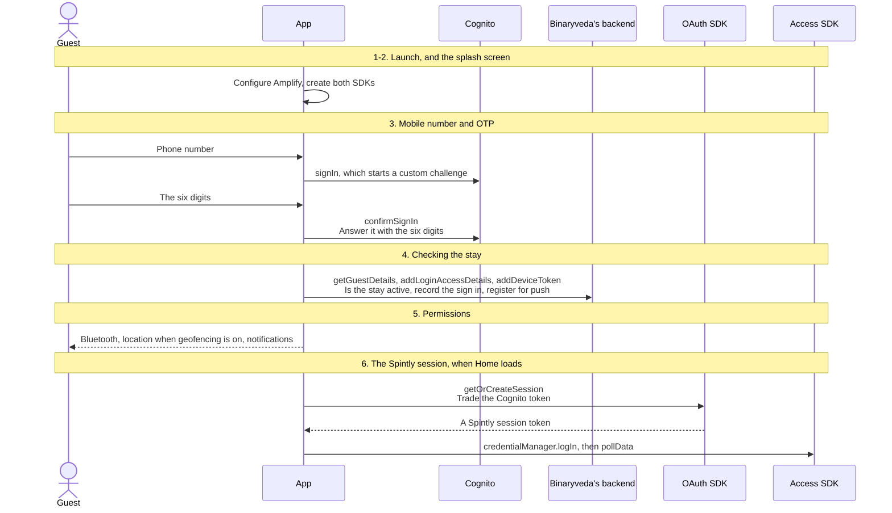
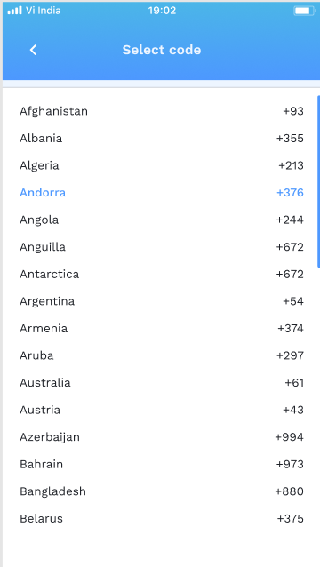
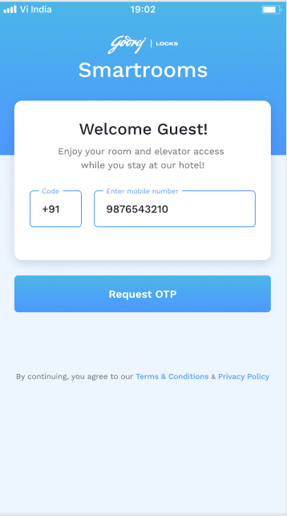
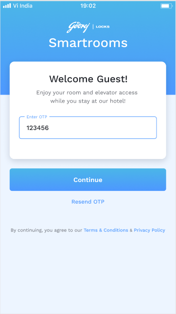

# 1. User Onboarding

**What it is.** Everything from a cold launch to a working session: creating the
SDKs, signing in with a phone number and an OTP, checking that the stay is still
active, registering the device for push, asking for permissions, and trading the
Cognito token for a Spintly session so the Access SDK can open doors.

!!! warning "Key point"

    Sign in only works for a guest the front desk has checked in, and only while
    the stay is active. `getGuestDetails` runs straight after the OTP and turns
    away a guest whose status is `GRACE_EXPIRED` or `DEPARTED`. See
    [step 4](#4-checking-the-stay).

## Participants

This page uses Guest, App, Cognito, Binaryveda's backend, Firebase, OAuth SDK and
Access SDK.

Each one is defined, with the colour it keeps across the site, in
[Reading these pages](conventions.md).

## The whole flow

Seven steps. Each one has its own section below. Ending a session is the other
direction, and it is on
[Profile and Logout](profile-and-logout.md#2-logging-out).



## 1. App launch

Both SDKs are created before anything is signed in, so they are ready the moment
a session appears.

=== "iOS"

    ```mermaid
    sequenceDiagram
        participant A as App
        participant C as Cognito
        participant F as Firebase
        participant O as OAuth SDK
        participant S as Access SDK

        Note over A,S: AppDelegate.didFinishLaunchingWithOptions
        A->>C: Amplify.add(AWSCognitoAuthPlugin), then Amplify.configure<br/>Set up Cognito
        A->>F: FirebaseApp.configure()<br/>Start Firebase
        A->>O: SpintlyOauthManager(clientId:provider:environment:)<br/>Create the OAuth manager
        A->>S: SpintlyACServiceProvider.defaultInstance<br/>then environmentManager.setEnvironment
        A->>S: credentialManager.setRefreshTokenDelegate<br/>Register the token refresh handler
        A->>F: Messaging.apnsToken, once Apple returns it<br/>Firebase then issues the FCM token
    ```

    The SDK work sits in `SmartAccessHelper.initialise()`. The service provider
    is only built when it is still nil. The notification permission is not asked
    for here. It is a card on the permissions screen in
    [step 5](#5-permissions).

=== "Android"

    ```mermaid
    sequenceDiagram
        participant A as App
        participant C as Cognito
        participant O as OAuth SDK
        participant S as Access SDK

        Note over A,S: GodrejApplication.onCreate
        A->>C: Amplify.addPlugin(AWSCognitoAuthPlugin), then Amplify.configure<br/>Set up Cognito
        A->>O: SpintlyOauthManager(context, clientId, providerId, environment)<br/>Create the OAuth manager
        A->>S: SpintlyACServiceProvider.getDefaultInstance(context)<br/>then environmentManager.environment

        Note over A,S: GodrejActivity.onCreate
        A->>A: Root detection, and the app stops here if the device is rooted
        A->>S: credentialManager.loginStatusLiveData<br/>Start observing the login state
        A->>A: Watch for an auto logout signal, create the notification channels
    ```

    Android refuses to run on a rooted device: `RootDetection` replaces the
    whole UI with a dialog whose only button closes the app. The token refresh
    handler is registered later, when Home opens. See
    [step 7](#7-while-signed-in).

## 2. The splash screen

The splash screen decides where to go from a **logged in flag** the app stores
itself after a successful sign in. Amplify keeps the Cognito tokens between
launches, so a returning guest goes straight to the Dashboard.

<div class="screens">
<figure>
<a href="images/user-onboarding/01-splash.png"></a>
<figcaption><strong>The splash screen</strong>Shown while the app decides where to go. Both SDKs were created before it appeared, so a returning guest can be sent straight on.</figcaption>
</figure>
</div>

## 3. Mobile number and OTP

The guest user pool is configured for a **custom auth challenge**, so `signIn`
does not take a password. It starts a challenge, and `confirmSignIn` answers it
with the six digits.

If Cognito has no user for the number, the challenge trigger throws **"User does
not exist"**, which the app shows as it is. The Cognito user only exists once the
front desk has checked the guest in.

The challenge returns the guest's Cognito username in its additional info. Both
apps store it as the **`cognitoId`**, and every call that identifies the guest
sends it: `getGuestDetails`, `addLoginAccessDetails` and
`listGuestNotifications`.

<div class="screens">
<figure>
<a href="images/user-onboarding/02-country-code.png"></a>
<figcaption><strong>The country code picker</strong>Filled from <code>listCountryCodes</code>. iOS picks the code in a sheet, and Android opens it as a screen of its own.</figcaption>
</figure>
<figure>
<a href="images/user-onboarding/03-mobile-filled.png"></a>
<figcaption><strong>Ready to send</strong>Request OTP is <code>signIn</code>, which starts the custom challenge. The app signs out first, so a half finished attempt does not leak into this one.</figcaption>
</figure>
<figure>
<a href="images/user-onboarding/04-otp-filled.png"></a>
<figcaption><strong>Six digits in</strong>Continue is <code>confirmSignIn</code>, answering the challenge. The resend link below it is on a 60 second countdown.</figcaption>
</figure>
</div>

=== "iOS"

    ```mermaid
    sequenceDiagram
        actor G as Guest
        participant A as App
        participant C as Cognito
        participant B as Binaryveda's backend

        A->>B: listCountryCodes<br/>Fill the country code picker
        B-->>A: The list, cached after the first fetch
        G->>A: Country code and phone number
        A->>C: signOut, to clear any half finished attempt
        A->>C: Amplify.Auth.signIn(username:)<br/>Start the custom challenge
        C-->>A: nextStep = confirmSignInWithCustomChallenge, with the username
        A->>A: Store the username as the cognitoId
        A-->>G: The OTP field, and a 60 second resend countdown
        G->>A: The six digits
        A->>C: Amplify.Auth.confirmSignIn(challengeResponse:)<br/>Answer it with the six digits
        alt Signed in
            C-->>A: isSignedIn
            A->>A: Store the logged in flag
        else Wrong code
            C-->>A: Not signed in
            A-->>G: Invalid OTP
        end
    ```

    One scene handles both halves. `currentScreen` moves from `.enterNumber` to
    `.enterOtp`, and the country code is picked in a sheet with India selected
    by default.

=== "Android"

    ```mermaid
    sequenceDiagram
        actor G as Guest
        participant A as App
        participant C as Cognito
        participant B as Binaryveda's backend

        G->>A: Tap the country code field
        A->>B: listCountryCodes<br/>A screen of its own, cached for ten days
        B-->>A: The list, with India pinned at the top
        G->>A: Phone number
        A->>C: Amplify.Auth.signOut, to clear any half finished attempt
        A->>C: Amplify.Auth.signIn(number, "")<br/>Start the custom challenge
        C-->>A: nextStep.additionalInfo["USERNAME"]
        A->>A: Store it as the cognitoId
        A-->>G: The OTP screen, and a 60 second resend countdown
        G->>A: The six digits
        A->>C: Amplify.Auth.confirmSignIn(code)<br/>Answer it with the six digits
        alt isSignInComplete
            C-->>A: true
            A->>A: Store the logged in flag, and the Crashlytics user
        else Not complete
            C-->>A: false
            A-->>G: Invalid OTP
        end
    ```

!!! warning "The code is fixed outside production"

    In the non-production environments the `CreateAuthChallenge` Lambda answers
    every challenge with a fixed code and sends no SMS. Five wrong answers fail
    the whole sign in attempt.

**Opening the app from a link.** If the app is opened from a link whose query
carries a JSON value with `mobileCode` and `mobileNumber`, both platforms fill in
the country code and number for the guest. iOS reads it through its custom URL
scheme, and Android through an `https` intent filter.

**Terms and Privacy Policy.** Two links on the number screen open the matching
PDF inside the app. iOS loads it in a web view directly, and Android loads it
through Google's document viewer. Neither link touches Cognito or the backend.

## 4. Checking the stay

With a Cognito session in hand, the app records the sign in, loads the stay,
turns away a guest whose stay has ended, and registers the device for push. Both
platforms make the same three calls in a different order.

=== "iOS"

    ```mermaid
    sequenceDiagram
        actor G as Guest
        participant A as App
        participant B as Binaryveda's backend
        participant F as Firebase

        A->>B: addLoginAccessDetails(cognitoId, ios, guest, accessedAt)<br/>Record this sign in
        B-->>A: success
        A->>B: getGuestDetails(cognitoId)<br/>The guest, the room, the doors and the stay
        B-->>A: The stay, with guest.status
        alt status is GRACE_EXPIRED or DEPARTED
            A-->>G: The user has checked out!
            A->>A: Sign out after two seconds
        else The stay is active
            A->>A: Store roomId, guestId, userId, siteId and the geofencing flag
            A->>A: Reset the permissions count to 0
            A->>A: Read the FCM token Firebase issued at launch
            A->>B: addDeviceToken(guest, deviceId, deviceToken, ios, userId)<br/>Register this phone for push
            B-->>A: success
            A-->>G: The permissions screen, or the Dashboard
        end
    ```

    A failure in any of the three calls sets the logged in flag back to false.
    If `addLoginAccessDetails` fails with "User not found", the guest sees
    **Checked Out!!** and is sent back to the number field.

=== "Android"

    ```mermaid
    sequenceDiagram
        actor G as Guest
        participant A as App
        participant B as Binaryveda's backend
        participant F as Firebase

        A->>B: getGuestDetails(cognitoId)<br/>The guest, the room, the doors and the stay
        alt status is GRACE_EXPIRED or DEPARTED, or errorType 404
            B-->>A: A stay that has ended, or no guest
            A-->>G: A checked out message
            A->>A: Raise the auto logout signal
        else The stay is active
            B-->>A: The stay
            A->>A: Read or mint a device UUID, and store it
            par Both are started from the same callback
                A->>F: FirebaseMessaging.getInstance().token
                F-->>A: The token
                A->>B: addDeviceToken(token, userId, GUEST, ANDROID, uuid)<br/>Register this phone for push
            and
                A->>B: addLoginAccessDetails(accessedAt, GUEST, ANDROID, cognitoId)<br/>Record this sign in
            end
            A-->>G: The Dashboard
        end
    ```

    Android opens the Dashboard whether `addDeviceToken` succeeds or fails. A
    failure only shows a snackbar. The auto logout signal is what
    [Profile and Logout](profile-and-logout.md#3-the-ways-a-session-ends)
    describes as a forced logout.

Everything `getGuestDetails` returns, and what each field is used for, is on
[Home and Unlock](home.md#1-loading-the-stay). What `addDeviceToken` is for is on
[Notifications](notifications.md#1-registering-the-device).

## 5. Permissions

An unlock needs Bluetooth. A site with geofencing turned on also needs location,
because a remote unlock is only allowed inside the site's geofence. The
notification permission is asked for on the same screen.

The screen is not shown every launch, and it can also be opened by Unlock when
something is missing. Opened that way it has a back button instead of Skip, and
it leaves out the notification card.

=== "iOS"

    | Card | Shown when | What tapping it does |
    |---|---|---|
    | Location | Geofencing is on | `requestWhenInUseAuthorization` |
    | Bluetooth | Always | Creates a `CBCentralManager`, which prompts for the permission |
    | Nearby devices | Always | Checks that Bluetooth is switched on, and offers the Bluetooth settings when it is not |
    | Push notifications | Not opened from Unlock | `requestAuthorization`, and registers the `ROOM_CLEANING` notification category with its Yes, Later and No actions |

    **Continue** is enabled once Bluetooth is allowed and switched on, and
    location is allowed when geofencing is on. A denied permission shows a dialog
    that opens the Settings app.

    **When it appears.** Straight after the first sign in, if anything is
    missing. After that the app counts Dashboard appearances, and once there
    have been ten since the last showing, the next cold launch shows it from the
    splash screen. It is skipped whenever nothing is missing.

=== "Android"

    | Card | Shown when | What tapping it does |
    |---|---|---|
    | Location permission | Geofencing is on, or the phone runs Android 11 or older | Requests `ACCESS_FINE_LOCATION` |
    | Nearby devices | Android 12 and newer | Requests `BLUETOOTH_SCAN`, `BLUETOOTH_ADVERTISE` and `BLUETOOTH_CONNECT` |
    | Location service | Geofencing is on | Asks the system to turn location on |
    | Bluetooth | Always | `ACTION_REQUEST_ENABLE`, then `accessManager.startBleScan()` |
    | Push notifications | Android 13 and newer, and not opened from Unlock | Requests `POST_NOTIFICATIONS` |

    A card disappears once its permission is in place. **Continue** is enabled
    when every card that applies is satisfied. A permission denied for good
    shows a dialog that opens the app's settings.

    **When it appears.** Home counts its own launches. After the first
    successful `pollData` on a launch whose count is a multiple of ten, which
    includes the very first, the screen opens if anything is missing. When
    Unlock opened it, **Continue** goes back and Home retries the unlock on its
    own.

## 6. Trading the Cognito token for a Spintly session

No unlock is possible until this handshake completes. It runs when Home loads
the stay, not at sign in.

The Cognito **access token** is the client token handed to the OAuth SDK. The
SDK does not take it directly. It asks the app for authentication details
through a callback, and the app answers with a token exchange request built
around that token.

=== "iOS"

    ```mermaid
    sequenceDiagram
        participant A as App
        participant C as Cognito
        participant O as OAuth SDK
        participant S as Access SDK

        Note over A,S: Each time getGuestDetails succeeds on Home
        A->>C: AWSMobileClient.getTokens<br/>The Cognito access token
        A->>O: oauthManager.getOrCreateSession(delegate:)<br/>Trade the Cognito token
        O-->>A: AuthorizationDelegate → getAuthenticationDetails(_:)
        A->>O: AuthenticationDetails.createWithTokenExchangeGrantType(clientToken:)<br/>then continueTask()
        O-->>A: didGetSession(_:) → session.accessToken.jwtToken
        A->>S: credentialManager.logIn(accessToken:)<br/>Seat the Spintly token
        opt The SDK answers that the accessor does not exist
            A->>S: credentialManager.logOut(), and oauthManager.clearSession()
            A->>A: Try the whole login again after 0.3 seconds
        end
    ```

    **iOS logs in on every Home load**, without checking whether the SDK is
    already logged in. It does not call `pollData` here. `pollData` runs just
    before each unlock and on a `LOCK_PERMISSION_UPDATED` push.

    "Accessor doesn't exist" means the guest signed in before the front desk
    granted door access. The login is retried until the accessor exists.

=== "Android"

    ```mermaid
    sequenceDiagram
        actor G as Guest
        participant A as App
        participant O as OAuth SDK
        participant S as Access SDK

        Note over G,S: When getGuestDetails succeeds on Home, until one pollData has succeeded
        alt credentialManager.isLoggedIn
            A->>S: cloudSyncManager.pollData(callback)<br/>Pull down the door permissions
        else Not logged in
            A->>S: credentialManager.logOut()<br/>Drop any old credential
            A->>O: oauthManager.clearSession()<br/>Clear any half finished session
            A->>O: oauthManager.getOrCreateSession(AuthorizationCallback)<br/>Trade the Cognito token
            O-->>A: getAuthenticationDetails(AuthenticationContinuation)
            A->>O: AuthenticationDetails.createWithTokenExchangeGrantType(token)<br/>then continueTask()
            O-->>A: onSuccess(session) → session.accessToken.jwtToken
            A->>S: credentialManager.logIn(token, CompletionCallback)<br/>Seat the Spintly token
            alt completed
                A->>S: cloudSyncManager.pollData(callback)<br/>Pull down the door permissions
            else failed
                A->>S: logOut and clearSession<br/>Roll the whole attempt back
                A-->>G: loginIntoSpintly Error
            end
        end
        alt pollData completes
            A->>A: Show the permissions screen if it is due
        else pollData fails
            A-->>G: Poll Data Error
            A->>S: logOut and clearSession
        end
    ```

    **Android runs this once per Home view model.** After one successful
    `pollData`, later Home loads skip it. An unlock tapped before it has
    finished runs the missing step instead of unlocking, which is covered on
    [Home and Unlock](home.md#3-unlocking).

`pollData` is what fills the door list. Until it has run, the Access SDK holds no
permissions and `bleUnlockAccessPoint` has nothing to match a `spintlyId`
against.

## 7. While signed in

### The token refresh handler

The Spintly session token expires. When it does, the Access SDK asks the app for
a new one rather than failing.

=== "iOS"

    ```mermaid
    sequenceDiagram
        participant S as Access SDK
        participant A as App
        participant O as OAuth SDK

        S->>A: TokenRefreshDelegate.refreshAuthentication
        A->>O: oauthManager.getOrCreateSession<br/>Ask for a fresh session
        alt A session comes back
            O-->>A: session.accessToken.jwtToken
            A-->>S: The new token
        else The SDK asks for a fresh client token
            O-->>A: getAuthenticationDetails
            A-->>S: Failure: Client token needs to be refreshed
        end
    ```

    A Spintly session that needs a new Cognito token is not repaired in the
    background. The next Home load logs in again from scratch.

=== "Android"

    ```mermaid
    sequenceDiagram
        participant S as Access SDK
        participant A as App
        participant O as OAuth SDK

        Note over S,O: Registered with setTokenRefreshHandler when Home opens
        S->>A: The session token has expired
        A->>O: oauthManager.getOrCreateSession<br/>Ask for a fresh session
        opt The SDK asks for a fresh client token
            O-->>A: getAuthenticationDetails
            A->>O: createWithTokenExchangeGrantType(current Cognito access token)
        end
        O-->>A: onSuccess(session)
        A-->>S: completionCallback.completed(the new token)
    ```

    Android answers with the current Cognito access token, so the session is
    repaired without the guest noticing.

### The login status observer

Android only. `loginStatusLiveData` is observed for as long as the activity is
alive, but only acted on while the app is signed in. An exception is recorded to
Crashlytics and shown in a snackbar. A `LOGGED_OUT` **with** an exception, or
`LOGGED_OUT_DELETED_USER`, is treated as a forced logout. A plain `LOGGED_OUT`
with no exception is the app's own sign out and is ignored.

## Differences between the two

| | iOS | Android |
|---|---|---|
| Splash delay | 0.7 seconds | 2 seconds |
| Phone number and OTP | One scene, two states | Two routes, plus a third for the country code |
| Order after the OTP | `addLoginAccessDetails`, then `getGuestDetails`, then `addDeviceToken` | `getGuestDetails`, then `addDeviceToken` and `addLoginAccessDetails` together |
| A stay that has ended | Signs out, including the Cognito session | Raises the auto logout signal, which skips the Cognito sign out |
| What a failed call does | Sets the logged in flag back to false | `addDeviceToken` failing still opens the Dashboard |
| When permissions appear | After the first sign in, then from the splash screen every ten Dashboard appearances | On the first Home load, then every tenth, after `pollData` |
| Spintly login | On every Home load, without checking the SDK first | Once, and only when the SDK is logged out |
| First `pollData` | Just before the first unlock | Straight after the login |
| Token refresh | Fails when a fresh Cognito token is needed | Repairs itself with the current Cognito token |

## Every SDK member this flow uses

??? note "iOS"

    | SDK | Member | When | What it is for |
    |---|---|---|---|
    | OAuth | `SpintlyOauthManager(clientId:provider:environment:)` | App launch | Create the OAuth manager |
    | OAuth | `oauthManager.getOrCreateSession(delegate:)` | Every Home load, and every token refresh | Trade the Cognito token for a Spintly session |
    | OAuth | `AuthenticationDetails.createWithTokenExchangeGrantType(clientToken:)` | Inside `getAuthenticationDetails` | Hand the Cognito token over for exchange |
    | OAuth | `AuthorizationDelegate` → `getAuthenticationDetails(_:)`, `didGetSession(_:)`, `didFailWithError(_:)` | The Spintly login | How the exchange reports back |
    | OAuth | `oauthManager.clearSession()` | Before a retry, and at logout | Drop the Spintly session |
    | Access | `SpintlyACServiceProvider.defaultInstance` | App launch | Create the Access SDK |
    | Access | `environmentManager.setEnvironment(_:)` | App launch | Point it at the environment |
    | Access | `credentialManager.setRefreshTokenDelegate(_:)` | App launch | Register the token refresh handler |
    | Access | `credentialManager.logIn(accessToken:)` | Every Home load | Seat the Spintly token |
    | Access | `credentialManager.logOut()` | Before a retry, and at logout | Drop the credential |

??? note "Android"

    | SDK | Member | When | What it is for |
    |---|---|---|---|
    | OAuth | `SpintlyOauthManager(context, clientId, providerId, environment)` | App launch | Create the OAuth manager |
    | OAuth | `oauthManager.getOrCreateSession(AuthorizationCallback)` | The Spintly login, and every token refresh | Trade the Cognito token for a Spintly session |
    | OAuth | `AuthenticationDetails.createWithTokenExchangeGrantType(token)` | Inside `getAuthenticationDetails` | Hand the Cognito token over for exchange |
    | OAuth | `AuthorizationCallback` → `getAuthenticationDetails`, `onSuccess`, `onFailure` | The Spintly login | How the exchange reports back |
    | OAuth | `oauthManager.clearSession()` | Before every login, and on failure | Drop the Spintly session |
    | Access | `SpintlyACServiceProvider.getDefaultInstance(context)` | App launch | Create the Access SDK |
    | Access | `environmentManager.environment` | App launch | Point it at the environment |
    | Access | `credentialManager.loginStatusLiveData` | App launch | Observe the login state |
    | Access | `credentialManager.setTokenRefreshHandler(TokenRefreshHandler)` | When Home opens | Register the token refresh handler |
    | Access | `credentialManager.isLoggedIn` | Before the Spintly login | Skip the login when already logged in |
    | Access | `credentialManager.logIn(token, CompletionCallback)` | The Spintly login | Seat the Spintly token |
    | Access | `credentialManager.logOut()` | Before every login, and on failure | Drop the credential |
    | Access | `cloudSyncManager.pollData(CompletionCallback)` | After the login | Pull down the door permissions |
