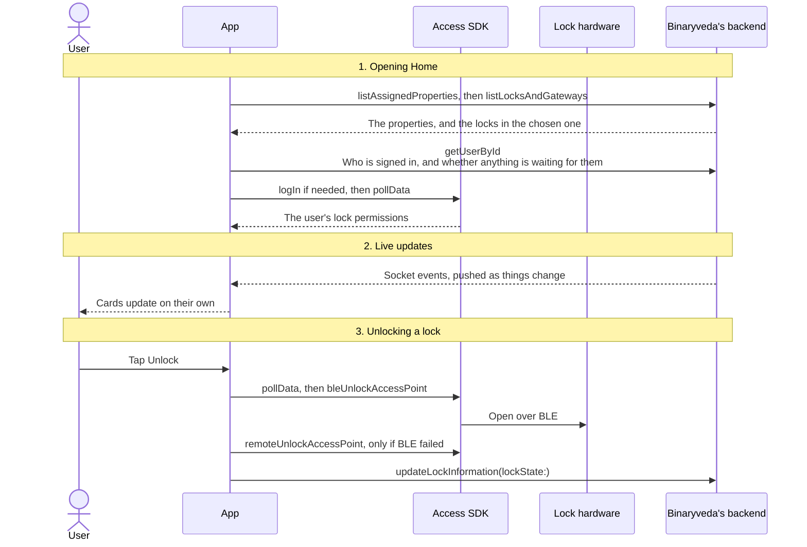
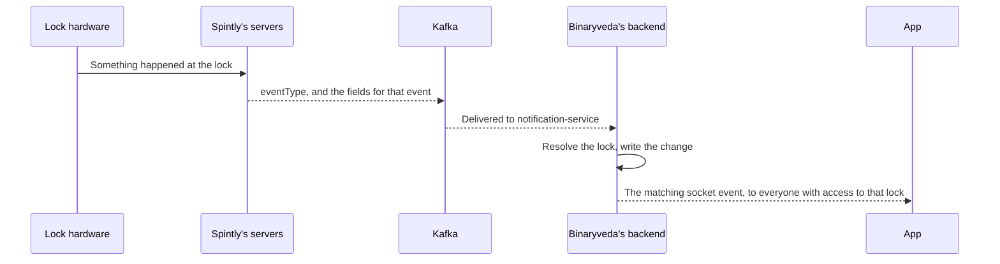

# 3. Home

**What it is.** The screen the user lands on after signing in: pick a property,
see its locks, and open one. The app opens a lock over Bluetooth when the phone
is close enough to reach it, and over the internet through the gateway when it
is not.

!!! warning "Key point"

    Every SDK call on Home belongs to the **Access SDK**. The Config SDK is not
    used here at all.

## Participants

This page uses User, App, Access SDK, Lock hardware, and Binaryveda's backend.

Each one is defined, with the colour it keeps across the site, in
[Reading these pages](conventions.md).

## The whole flow

Three steps. Each one has its own section below.



## 1. Opening Home

The app fetches the property list, then the locks in whichever property is
selected. Separately it makes sure the Access SDK is logged in and pulls down
the user's lock permissions, which an unlock needs.

=== "iOS"

    ```mermaid
    sequenceDiagram
        actor U as User
        participant A as App
        participant S as Access SDK
        participant B as Binaryveda's backend

        Note over U,B: Load what the screen shows
        A->>B: listAssignedProperties<br/>Fetch the user's properties
        B-->>A: The property list
        A->>B: listLocksAndGateways(propertyId:)<br/>Fetch the locks in the selected property
        B-->>A: Locks first, then gateways
        A->>B: getUserById<br/>The signed-in user, and the two waiting flags
        B-->>A: name, id, accessorId, hasNotifications

        Note over U,B: Get the Access SDK ready to unlock
        A->>S: credentialManager.isLoggedIn()<br/>A method on iOS
        opt If the SDK reports it is logged out
            A->>S: credentialManager.logIn(accessToken:)<br/>Seat the Spintly token
        end
        A->>S: cloudSyncManager.pollData<br/>Pull down the user's lock permissions
        S-->>A: completion<br/>Done, or failed with an error
        A-->>U: The lock cards
    ```

    **When the Access SDK work runs.** `setPermissionsToLock` fires once the
    lock list comes back with at least one lock, and again before every unlock.

    **`getUserById` runs after the lock list, not before it.** If the profile it
    returns has no email, the app sends the user straight to the change email
    screen.

=== "Android"

    ```mermaid
    sequenceDiagram
        actor U as User
        participant A as App
        participant S as Access SDK
        participant B as Binaryveda's backend

        Note over U,B: Load what the screen shows
        A->>B: listAssignedProperties<br/>Fetch the user's properties
        B-->>A: The property list
        A->>B: listLocksAndGateways(propertyId:)<br/>Fetch the locks in the selected property
        B-->>A: Locks first, then gateways
        A->>B: getUserById<br/>The signed-in user, and the two waiting flags
        B-->>A: name, id, accessorId, hasNotification, hasInvites

        Note over U,B: Get the Access SDK ready to unlock
        A->>S: credentialManager.isLoggedIn<br/>A property on Android
        opt If the SDK is not logged in yet
            A->>S: credentialManager.logIn(token, CompletionCallback)<br/>Seat the Spintly token
        end
        A->>S: cloudSyncManager.pollData(callback)<br/>Pull down the user's lock permissions
        S-->>A: CompletionCallback → completed or failed
        A->>S: accessManager.startBleScan()<br/>Start listening for the user's locks nearby
        A-->>U: The lock cards
    ```

    **`hasInvites` opens a screen on its own.** When it comes back true, Android
    sends the user to the notification screen without being asked, once per
    session. The invite itself is
    [User Management](user-management.md#3-accepting-the-invite).

## 2. Live updates

The cards do not need a pull to refresh. Binaryveda's backend keeps a socket
open and sends an event whenever something changes. The app redraws the card
that event belongs to.

=== "iOS"

    ```mermaid
    sequenceDiagram
        actor U as User
        participant A as App
        participant B as Binaryveda's backend

        A->>B: Open the socket
        B-->>A: inventoryStatus<br/>Battery, and online or offline
        B-->>A: doorModes<br/>Privacy mode and passage mode
        B-->>A: doorStatus<br/>The door was opened or closed
        B-->>A: deadbolt<br/>The deadbolt was thrown or withdrawn
        A-->>U: The card redraws itself
    ```

    iOS Home ignores the activityTrail event. On iOS that event feeds the
    activity trail screen instead, so the card's last-action line does not move
    until the list is fetched again.

=== "Android"

    ```mermaid
    sequenceDiagram
        actor U as User
        participant A as App
        participant B as Binaryveda's backend

        A->>B: Open the socket
        B-->>A: activityTrail<br/>Someone locked or unlocked the door
        B-->>A: inventoryStatus<br/>Battery, and online or offline
        B-->>A: doorModes<br/>Privacy mode and passage mode
        B-->>A: doorStatus<br/>The door was opened or closed
        Note over A: deadbolt is subscribed to under the wrong name,<br/>so it is never delivered
        A-->>U: The card redraws itself
    ```

Both platforms open the same socket and subscribe to the same five events. They
differ in which of them Home acts on, and in one case in whether the event
arrives at all: **Android never receives `deadbolt`**, because it subscribes
under the name `deadBolt` and the backend emits `deadbolt`. That is covered on
the [Lock Control Panel](lock-control-panel.md#2-live-updates), where the event
matters more.

No SDK is involved here. The socket is Binaryveda's, not Spintly's.

### Where these events come from

The socket is the last leg of a longer path. The lock reports to Spintly,
Spintly publishes to Kafka, and `notification-service` turns each message into
the event the app receives.



Which message becomes which event:

| Kafka message | Socket event |
|---|---|
| `mobile_access`, `card_access`, `remote_access` and the other unlock types | `activityTrail` |
| `deadbolt_event` | `deadbolt`, and an `activityTrail` row when the state is LOCKED |
| `door_open`, `door_close` | `doorStatus` |
| `door_mode_changed` | `doorModes` |
| `device_status`, `gateway_status`, `device_battery_status` | `inventoryStatus` |

The messages themselves, and everything else each one sets off, are in
Binaryveda's Kafka events document.

!!! note "Why an event sometimes does not arrive"

    Before sending anything for an unlock or a deadbolt, the backend checks the
    event against the newest row already stored for that lock and drops it if it
    is not newer. An event that loses that check is still recorded in the
    activity trail, but no socket event and no push go out for it.

## 3. Unlocking a lock

The user taps **Unlock**. The app refreshes the lock permissions first, then
tries Bluetooth. If Bluetooth fails it falls back to the internet, which routes
through the gateway. The same sequence runs from the
[Lock Control Panel](lock-control-panel.md), call for call.

Whether the tap does anything at all depends on the lock's mode, and that rule
is the same on both platforms and on both screens: passage mode blocks everyone,
privacy mode blocks everyone except the owner and primary users. It is set out
in [Who can unlock, and when](lock-control-panel.md#who-can-unlock-and-when).

=== "iOS"

    ```mermaid
    sequenceDiagram
        actor U as User
        participant A as App
        participant S as Access SDK
        participant L as Lock hardware
        participant B as Binaryveda's backend

        U->>A: Tap Unlock
        A->>S: logIn if needed, then cloudSyncManager.pollData<br/>Refresh the permissions before trying
        opt If Bluetooth or nearby devices are not granted
            A-->>U: The permissions screen, and the unlock resumes after Continue
        end
        A->>S: accessManager.bleUnlockAccessPoint(_:delegate:)<br/>Try Bluetooth first
        S->>L: Open the lock over BLE
        alt If Bluetooth worked
            L-->>S: Opened
            S-->>A: UnlockDelegate → didUnlock(readerInfo:customParameter:)
            A->>B: updateLockInformation(id:lockState:)<br/>Record the new state
            A-->>U: Unlocked, over Bluetooth
        else If Bluetooth failed
            S-->>A: UnlockDelegate → didFail(_:)
            A->>S: accessManager.remoteUnlockAccessPoint(_:delegate:)<br/>Fall back to the internet
            S-->>A: RemoteUnlockDelegate → didUnlock or didFail
            A->>B: updateLockInformation(id:lockState:)<br/>On success only
            A-->>U: Unlocked over the internet, or an error
        end
        A->>A: After 5.5 seconds, draw the lock as locked again
    ```

    **The SDK work runs before the permission check**, so the session and the
    permissions are refreshed even on an attempt that then stops at the
    permissions screen.

    **Dual auth cancels the fallback.** When the lock has dual auth turned on,
    a failed Bluetooth attempt shows the error and stops. Remote unlock is never
    tried.

=== "Android"

    ```mermaid
    sequenceDiagram
        actor U as User
        participant A as App
        participant S as Access SDK
        participant L as Lock hardware
        participant B as Binaryveda's backend

        U->>A: Tap Unlock
        opt If Bluetooth is off, or Bluetooth or location are not granted
            A-->>U: The permissions screen, and the unlock is replayed after Continue
        end
        A->>S: credentialManager.isLoggedIn<br/>Log in first if it says no
        A->>S: accessManager.startBleScan()<br/>Make sure the lock is being listened for
        A->>S: cloudSyncManager.pollData(callback)<br/>Refresh the permissions before trying
        A->>S: accessManager.bleUnlockAccessPoint(accessPointId, UnlockCallback)<br/>Try Bluetooth first
        S->>L: Open the lock over BLE
        alt If Bluetooth worked
            L-->>S: Opened
            S-->>A: UnlockCallback → onSuccess(accessPointId, deviceTag, customParameter)
            A->>B: updateLockInformation(lockState: UNLOCKED)<br/>Record the new state
            A-->>U: Unlocked, over Bluetooth
        else If Bluetooth failed
            S-->>A: UnlockCallback → onFailure(exception)
            A->>S: cloudSyncManager.pollData(callback)<br/>Refreshed again before the second attempt
            A->>S: accessManager.remoteUnlockAccessPoint(accessPointId, RemoteUnlockCallback)<br/>Fall back to the internet
            S-->>A: RemoteUnlockCallback → onSuccess or onFailure
            A->>B: updateLockInformation(lockState: UNLOCKED)<br/>On success only
            A-->>U: Unlocked over the internet, or an error
        end
        A->>A: After 7 seconds, draw the lock as locked again
    ```

    **The permission check runs before any SDK call**, so nothing is refreshed
    on an attempt that stops at the permissions screen.

    **Dual auth cancels the fallback.** The unlock is requested as `BLE` rather
    than `BOTH` when the lock has dual auth turned on, so there is no second
    attempt. The successful Bluetooth attempt is also not drawn as an unlock,
    and no relock timer is started. The card waits for the lock to report the
    door opening instead.

    **`pollData` runs twice on the fallback path**, once before each attempt.
    iOS runs it once, before the Bluetooth attempt only.

### After the unlock

Both platforms tell Binaryveda's backend with `updateLockInformation`, and
neither waits for it or surfaces a failure. If it does not land, the backend
holds the older state until the next socket event or the next fetch of the lock
list corrects it.

Each then redraws the lock as locked on a timer, 5.5 seconds on iOS and 7 on
Android. Nothing is sent when it fires. It exists so the card does not sit on
unlocked after the lock has already relocked itself. Android skips that repaint
when the lock is **Online**, since a gateway backed lock reports its real state
over the socket.

## Differences between the two

| | iOS | Android |
|---|---|---|
| When the Access SDK login runs | When the lock list arrives, and before every unlock | Once, when the Home screen opens |
| What `getUserById` triggers | Sends the user to the change email screen when the profile has no email | Opens the notification screen when `hasInvites` is true |
| Logged-in check | `isLoggedIn()`, a method | `isLoggedIn`, a property |
| `pollData` on the remote fallback | Not repeated | Runs again before the second attempt |
| The permission check against the SDK calls | After the session refresh and `pollData` | Before any SDK call |
| Which permissions the check covers | Bluetooth and nearby devices | Bluetooth permission, Bluetooth switched on, and location |
| The activityTrail socket event | Ignored on Home | Updates the card in place, its locked state, time, who and how |
| How the unlock result arrives | `UnlockDelegate`, `RemoteUnlockDelegate` | `UnlockCallback`, `RemoteUnlockCallback` |
| What `updateLockInformation` carries after an unlock | The lock state held before the unlock is applied | `UNLOCKED` |
| The relock repaint | After 5.5 seconds, always | After 7 seconds, skipped when the lock is Online or dual auth is on |

## Every SDK member this flow uses

Every call below is the Access SDK. iOS reaches it through `SpintlyHelper` and
`DefaultSpintlyViewModel`, Android through `SpintlySDKManager`.

??? note "iOS"

    | SDK | Member | When | What it is for |
    |---|---|---|---|
    | Access | `credentialManager.isLoggedIn()` | Before the Access SDK login | Check before logging in again |
    | Access | `credentialManager.loginStatus.appLoginState` | Before the Access SDK login | Check the SDK reports itself logged out |
    | Access | `credentialManager.logIn(accessToken:)` | The Access SDK login | Seat the Spintly token |
    | Access | `cloudSyncManager.pollData` | Once the lock list arrives, and before every unlock | Pull down the user's lock permissions |
    | Access | `accessManager.startBleScan()` | While Home is showing locks | Start listening for the user's locks nearby |
    | Access | `accessManager.bleUnlockAccessPoint(_:delegate:)` | Tapping Unlock | Open the lock over Bluetooth |
    | Access | `UnlockDelegate` → `didUnlock(readerInfo:customParameter:)`, `didFail(_:)` | Tapping Unlock | How the Bluetooth attempt reports back |
    | Access | `accessManager.remoteUnlockAccessPoint(_:delegate:)` | After a failed Bluetooth attempt | Open the lock over the internet |
    | Access | `RemoteUnlockDelegate` → `didUnlock(_:)`, `didFail(_:)` | After a failed Bluetooth attempt | How the internet attempt reports back |

??? note "Android"

    | SDK | Member | When | What it is for |
    |---|---|---|---|
    | Access | `credentialManager.isLoggedIn` | Before the Access SDK login, and before every unlock | Check before logging in again |
    | Access | `credentialManager.logIn(token, CompletionCallback)` | The Access SDK login | Seat the Spintly token |
    | Access | `cloudSyncManager.pollData(callback)` | When Home opens, and before every unlock attempt | Pull down the user's lock permissions |
    | Access | `accessManager.startBleScan()` | While Home is showing locks, and before each Bluetooth unlock | Start listening for the user's locks nearby |
    | Access | `accessManager.stopBleScan()` | Leaving Home | Stop the scan |
    | Access | `accessManager.bleUnlockAccessPoint(accessPointId, UnlockCallback)` | Tapping Unlock | Open the lock over Bluetooth |
    | Access | `UnlockCallback` → `onSuccess`, `onFailure` | Tapping Unlock | How the Bluetooth attempt reports back |
    | Access | `accessManager.remoteUnlockAccessPoint(accessPointId, RemoteUnlockCallback)` | After a failed Bluetooth attempt | Open the lock over the internet |
    | Access | `RemoteUnlockCallback` → `onSuccess`, `onFailure` | After a failed Bluetooth attempt | How the internet attempt reports back |
