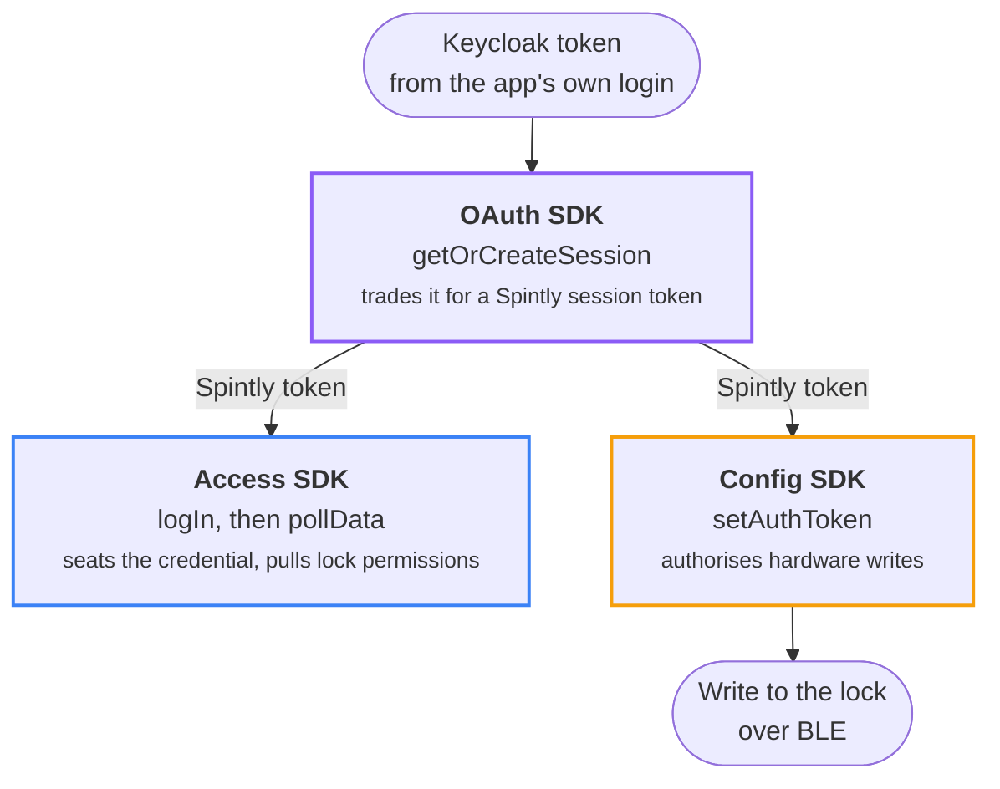

# SDK &amp; Backend Calls

Every Spintly SDK member and backend endpoint the app touches: what calls it,
when it fires, and what it is for.

## What this reference is

The app depends on three separate Spintly SDKs, each shipped as a prebuilt
binary, an `.xcframework` on iOS and an `.aar` on Android. Because they are
closed binaries, the only reliable record of **what the app actually calls** is
the app's own source. This site is that record, kept in one place so the iOS and
Android sides do not each hold their own notes.

Read it to:

- see which SDK member runs at which moment in a flow, on iOS and on Android
- follow the order calls happen in, and what each one is for
- find where the two platforms diverge, and how
- tell which flows reach Spintly's servers and which never leave Keycloak

This is a **reference** to the integration as it stands today. It does not
prescribe how to build a new one.

## The three SDKs

The three SDKs version independently and share nothing except the **session
token** the OAuth SDK produces. Everything on this site is tagged with the SDK
it belongs to.

### OAuth SDK: the session token

Exchanges the Keycloak token from the app's own login for a Spintly **session
token**. Nothing else in the app can talk to Spintly until this succeeds, so it runs
first and everything downstream depends on it.

The exchange runs over callbacks rather than a single call. The app asks for a
session, the SDK asks the app how to authenticate, the app hands back a
token-exchange request, and the SDK returns the session.

### Access SDK: the credential

Holds the logged-in credential and the user's lock permissions. `logIn` seats
the Spintly token inside the SDK, and `pollData` pulls down which doors the user
is allowed to open. It also calls back into the app when it needs a fresh token
or when the login state changes, so the app registers handlers for both at
launch.

### Config SDK: the lock hardware

The only SDK that talks to the **lock hardware** over BLE, covering passcodes,
lock onboarding, wifi, and firmware. It needs the same session token the Access
SDK gets, handed to it through `setAuthToken`, before it can write anything.

The app uses one member of it:
[writing a user's passcode to a lock](lock-share-invites.md#writing-the-passcode-to-the-lock).

### Versions shipped

| Short name | iOS | Android |
|---|---|---|
| **OAuth** | `SpintlyOauth 1.2.1.0.xcframework` | `oauth-sdk-0.2.4.aar` (`com.mrinq.oauthsdk`) |
| **Access** | `SmartAccessFramework 0.11.0.0.xcframework` | `smartaccesssdk-1.10.0.1.aar` (`com.mrinq.smartaccesssdk`) |
| **Config** | `SpintlyConfigurationFramework 0.13.0.0.xcframework` | `configurationsdk-0.8.3.1.aar` (`com.spintly.configurationsdk`) |

## The order they run in

**OAuth** produces the token, which goes to **Access** through `logIn` and to
**Config** through `setAuthToken`. Only then can Config write to a lock.

!!! note "Also at app launch"

    All three must be constructed and pointed at an environment at app launch,
    before any of the above can happen. That work is
    [step 1 of User Onboarding](user-onboarding.md#1-app-launch).

## How to read these pages

Each flow page walks through the SDK work as a series of **moments in the app's
life**, such as app launch, a login starting, and the work that follows a login,
with one diagram per moment.

  OAuth SDK
  Access SDK
  Config SDK
  app / platform step
  failure path

- **A box's outline colour** says which SDK the member belongs to, per the key
  above.
- **The number** is a reading order within that diagram. It says nothing about
  thread scheduling.
- **A dashed edge or box** marks a conditional path: an optional step, a
  shortcut, or a failure.
- **iOS / Android tabs** are linked across the whole page. Pick your platform
  once at the top and every diagram below follows.

!!! info "Accessor"

    Spintly's word for a person who can open a door is an **accessor**. Their
    IDs (`accessorId`, `organisationId`, `accessPointId`) show up throughout
    [Lock Share Invites](lock-share-invites.md).
