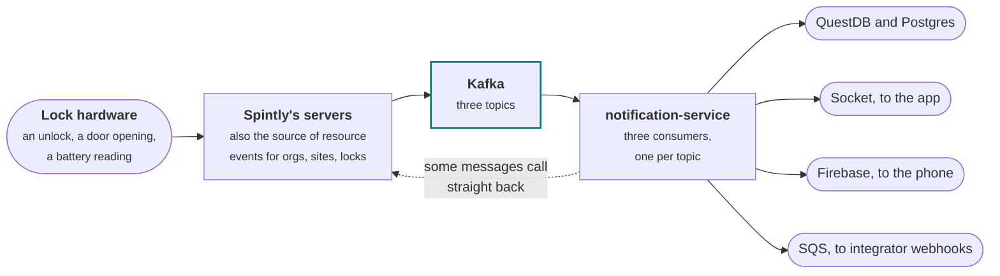
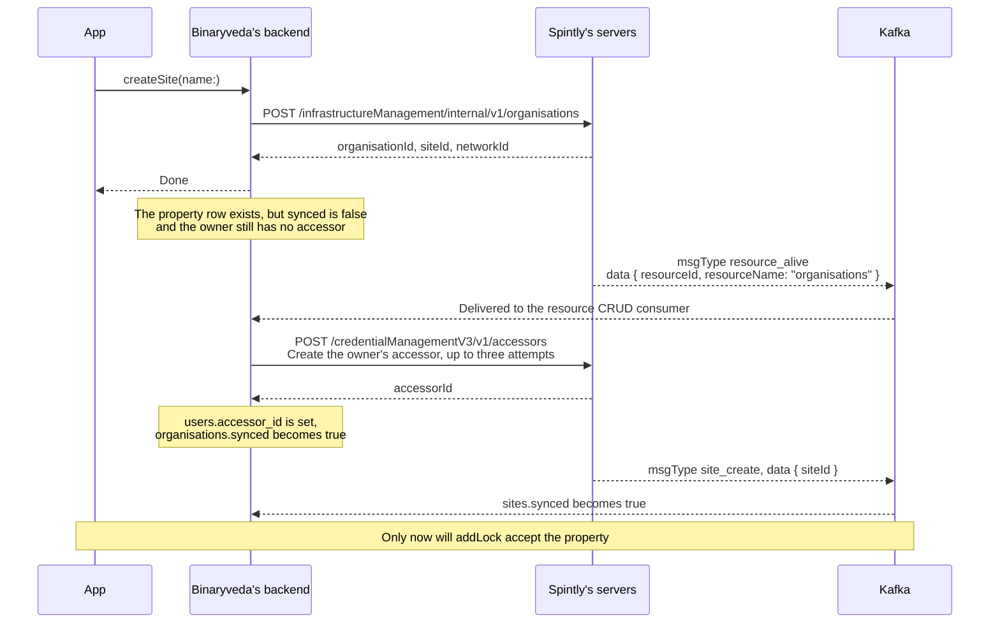
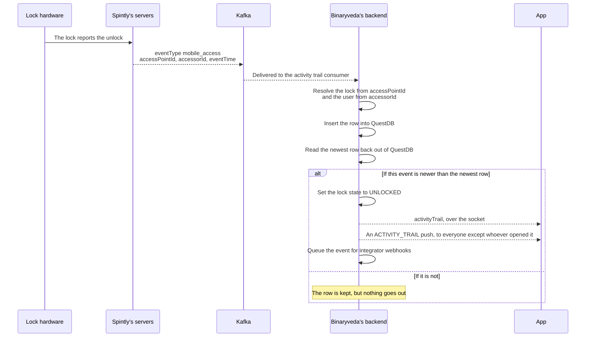

# Kafka events

**What it is.** Spintly does not answer every question over REST. A lot of what
the app ends up seeing arrives at Binaryveda as a **Kafka message** from Spintly
first, and only then turns into a database write, a socket event, a push
notification, a webhook, or a further call back into Spintly.

This page is the record of those messages: the three topics, every message type
on each one, what the body looks like, and exactly what Binaryveda does when one
arrives.

!!! warning "Key point"

    **Binaryveda only consumes.** Spintly is the producer for all three topics.
    Nothing in the estate publishes to Kafka. When Binaryveda needs to send
    something onward it uses the socket, Firebase, or an SQS queue instead.

## Participants

This page uses App, Binaryveda's backend, Spintly's servers, Lock hardware and
Kafka, all defined, with the colour each one keeps across the site, in
[Reading these pages](conventions.md).

## Where it sits



The dotted line back into Spintly is the part that surprises people, and it is
covered in [Messages that call back into Spintly](#messages-that-call-back-into-spintly)
below. Some messages are not just news. They are the trigger for Binaryveda's
next REST call.

### Which service does this

All of it is `notification-service`, in `src/kafka`. The other four repositories
have no Kafka client at all:

| Service | Involvement |
|---|---|
| `notification-service` | The only consumer. Three consumers, three handlers, plus the QuestDB writes, socket emits, pushes and webhook publishing that follow |
| `lock-service` | None. It writes lock and gateway rows that Kafka handlers later update, and it produces its own webhook events to SQS |
| `user-service` | None |
| `graphql-gateway` | None. It federates the services that read the resulting rows |
| `liquibase` | Owns the two Postgres tables the consumers depend on, `kafka_offsets` and `crud_requests_ids` |

## The three topics

Each topic gets its own consumer group and its own handler.

| Topic env var | Consumer group | Handler | Carries |
|---|---|---|---|
| `KAFKA_TOPIC_RESOURCE_CRUD` | `spintly-resource-crud-consumer-group` | `handleResourceCRUD` | Organisations, sites, access points, locks and gateways being created, updated, deleted, or going live |
| `KAFKA_TOPIC_ACTIVITY_TRAIL` | `spintly-lock-unlock-updates-consumer-group` | `handleSmartLock` | Everything a lock does: unlocks, the deadbolt, the door, door modes, the doorbell, alarms, card enrolment |
| `KAFKA_TOPIC_ONLINE_OFFLINE` | `spintly-lock-online-offline-updates-consumer-group` | `handleDeviceStatus` | Locks and gateways going online or offline, battery readings, BLE remotes being paired |

### Connection

The client id is `spintly-consumer`, brokers come from `KAFKA_ENDPOINT` as a
comma separated list, and the connection is SSL with SASL `scram-sha-512` using
`KAFKA_CONSUMER_USERNAME` and `KAFKA_CONSUMER_PASSWORD`. All six values are
pulled from SSM by `ssm.sh` at container start.

Two things about how the consumers subscribe are worth holding on to:

- They subscribe with `fromBeginning: false`, then immediately `seek` to the
  stored offset.
- They do not start at all unless `NODE_ENV` is set and contains neither `dev`
  nor `local`. A local backend never sees any of this, and neither does one
  running with `NODE_ENV` unset.

### Three topics, three different envelopes

The three topics do not agree on a message shape, and the field that says what
kind of message it is has a different name on each. This catches people out:

| Topic | Kind field | Where the body is | Versioning |
|---|---|---|---|
| Resource CRUD | `messageData.msgType` | `messageData.data` | `messageVersion` at the top level, `dataVersion` inside `messageData` |
| Activity trail | `eventType` | The top level of the message | `version`, and a `hash` on every message |
| Online and offline | `msgType` | `data` | `version`, plus a `dataVersion` on `device_status` and the two beacon messages |

Every message on all three topics is versioned, and the version is per message
type rather than per topic. On the resource CRUD topic `messageVersion` has been
`1` throughout while `dataVersion` differs by message type, `4` on
`access_point_create` and `1` on `organisation_delete`. On the activity trail the
`version` genuinely changes the shape: `door_mode_changed` exists as v1 and v3
with different fields, and `no_permission_card` as v2 and v3. None of the
handlers branch on a version today, so a new one arriving is something to watch
for rather than something the code already absorbs.

## 1. Resource CRUD

The wrapper carries a `requestId`, which is how repeats are recognised.

```json
{
  "messageVersion": 1,
  "messageData": {
    "requestId": "8f2c...",
    "msgType": "access_point_create",
    "dataVersion": 4,
    "data": { "accessPointId": 12345 }
  }
}
```

`_processResourceCrud` handles `resource_alive` first. Everything else is
matched against a fixed list of message types, and anything not on that list is
logged as an unrecognised `msgType` and dropped. For the ones that do match, the
resource is the first word of `msgType` and the action is the last.

### Every message type on this topic

| `msgType` | What `data` carries | What Binaryveda does |
|---|---|---|
| `resource_alive` | `resourceId`, `resourceName` | The one that matters. See below |
| `site_create` | `siteId` | Marks the site `synced` |
| `site_delete` | `siteId` | Marks the site `synced` and inactive |
| `access_point_create` | `accessPointId` | Marks the lock `synced` and its config status `ACCESS_POINT_CREATED`, then calls Spintly. See below |
| `access_point_delete` | `accessPointId` | Marks the lock `synced`, config status `ACCESS_POINT_DELETED`, and inactive |
| `gateway_create` | `serialNumber` | Sets the gateway's config status to `GATEWAY_CREATED` |
| `gateway_delete` | `serialNumber` | Sets it to `GATEWAY_DELETED` and marks the gateway inactive |
| `organisation_create`, `organisation_update`, `organisation_delete` | The organisation | Recognised, then nothing. Organisations are handled through `resource_alive` |
| `site_update` | `siteId` | Recognised, then nothing |
| `device_create`, `device_delete` | `serialNumber` | Recognised, then nothing. Lock rows are written by `lock-service`, and the lock's Spintly side is tracked through its access point |
| `meshio_create`, `meshio_delete` | The mesh IO module | Not on the recognised list. Logged as an unrecognised `msgType` and ignored. See below |
| `network_create`, `network_update`, `network_delete` | `networkId`, `name` | Also not on the recognised list, and ignored the same way. Networks are tracked through the site |

!!! warning "`meshio` is one word on the wire, two in `MESSAGE_TYPES`"

    Spintly sends `meshio_create` and `meshio_delete`, with no underscore. The
    matching `resource_alive` value is `mesh_ios`, with one. `MESSAGE_TYPES` in
    `constants.ts` has the wrong spelling for both, `mesh_io_create` and
    `mesh_io_delete`, so the real messages never match and fall through to the
    unrecognised branch.

    Nothing breaks today, because the mesh IO messages were never meant to do
    anything. It matters only if mesh IO ever needs handling, and it is the
    reason a `[ResourceCRUD] Unrecognized msgType, ignoring` line appears in the
    logs for these.

!!! note "`device_update` and `gateway_update`"

    Neither is consumed, and removal does not depend on them. `lock-service`
    calls `DELETE /infrastructureManagement/internal/v1/accessPoints/{accessPointId}`
    or `DELETE /infrastructureManagement/internal/v1/gateways/{serialNumber}`
    directly when a lock or gateway is removed, and the `access_point_delete`
    or `gateway_delete` message that comes back is what closes out the row.

### `resource_alive`

This is Spintly's signal that a resource exists across **all** of Spintly's own
internal services, rather than just having been accepted by the one that
answered the REST call. `resourceId` is the same id Binaryveda stores as
`spintly_id`.

| `resourceName` | What happens |
|---|---|
| `organisations` | Creates or registers the owner's accessor, then marks the organisation `synced` |
| `sites` | Marks the site `synced` |
| `access_points` | Marks the lock `synced` again. `access_point_create` already did this, so it is a re-affirm |
| `networks`, `devices` | Ignored |

The organisation branch has three outcomes, decided before the `synced` flag is
written:

1. **The owner has no accessor.** Calls
   `POST /credentialManagementV3/v1/accessors` with no access points, retried up
   to three times, 1.5 seconds apart. The accessor id is saved to
   `users.accessor_id`.
2. **The owner already has an accessor from another organisation, and this
   organisation has not been processed before.** Calls
   `POST /credentialManagementV3/v1/organisations/{orgId}/accessors/{accessorId}`
   once, with no access points added.
3. **Neither.** Nothing, which is what a repeat of the same message hits.

!!! info "Why `resource_alive` and not `organisation_create`"

    `organisation_create` arrives while the organisation is still being set up
    inside Spintly, so an accessor call made on the back of it can reach
    Spintly before the organisation is ready to accept one. Gating on
    `resource_alive` avoids that ordering problem.

    Open question for Spintly: is `resource_alive` the intended readiness
    signal for accessor creation, or is there an earlier event that is safe to
    act on?

!!! info "Why `access_points` alive is not the only place `synced` is set"

    The access point alive event only fires after the BLE configure step, and
    `resumeOnboarding` gates that step on the lock already being synced. Making
    the alive event the sole setter would deadlock onboarding, so
    `access_point_create` sets it and the alive event re-affirms it.

## 2. Activity trail

Flat: no wrapper, and `eventTime` is Unix **seconds**, not milliseconds.

```json
{
  "version": 1,
  "eventType": "mobile_access",
  "eventTime": 1755765432,
  "accessPointId": 12345,
  "accessorId": 67890,
  "accessPointDirection": "entry",
  "mobileAccessMode": "clickToAccess",
  "customParameter": 0,
  "hash": "e8743922075b791de26c2ceec3783360ec41d885e5215cbcdd731b3b73bc1701"
}
```

Every message on this topic carries a `version` and a `hash`. Neither is read.
The handlers key off `eventType` alone, and the `hash` is not verified against
anything.

!!! note "How `eventTime` is converted"

    `toEventTimestamp` multiplies by 1000, and clamps anything that is not a
    finite number, is earlier than 1 January 2024, or is more than 24 hours in
    the future, to server time.

    The clamp keeps the event rather than dropping it. A timestamp outside that
    window is recorded at server time instead.

### Unlock events

These are the ones that become rows in the activity trail. The lock comes from
`accessPointId` and the user from `accessorId`.

| `eventType` | Shows in the trail as |
|---|---|
| `card_access` | Card |
| `mobile_access` | Mobile, plus a suffix built from `mobileAccessMode`. See below |
| `remote_access` | Remote |
| `fingerprint_access` | Fingerprint |
| `keypad_accessor_access` | Passcode |
| `keypad_passcode_access` | OTP. Carries `passcodeId`, and the one time user is retired on arrival |
| `dual_auth_access` | 2FA. Carries `firstAccessType` and `secondAccessType`, each with its own mobile access mode |
| `web_remote_access` | Web Remote |
| `mechanical_key_unlock` | **Nothing.** A physical key unlock is excluded from the trail |

#### `mobileAccessMode` has four values, and only two are mapped

Spintly sends one of four words. `MOBILE_ACCESS_MODES` in `constants.ts` has an
entry for two of them:

| Value on the wire | Suffix in the trail |
|---|---|
| `clickToAccess` | `_Bluetooth` |
| `mobileNfcAccess` | `_NFC` |
| `tapToAccess` | `_undefined` |
| `proximity` | `_undefined` |

!!! warning "The lookup is not guarded"

    The suffix is built as `'_' + MOBILE_ACCESS_MODES[mode]` whenever
    `mobileAccessMode` is present. A mode that is not in the map returns
    `undefined`, and the row is written to the trail as `Mobile_undefined`
    rather than falling back to `Mobile`.

    The same lookup runs twice more on `dual_auth_access`, once for
    `firstMobileAccessMode` and once for `secondMobileAccessMode`. On that event
    Spintly only ever sends three of the four, `proximity` is not among them.

    It carries into the push as well. `NOTIFICATION_UNLOCK_METHODS` is keyed on
    the same string and only has `Mobile_Bluetooth` and `Mobile_NFC`, and the
    body is built as `` `using ${NOTIFICATION_UNLOCK_METHODS[event_source]}` ``,
    so the phone would read *"Unlocked by Yash using undefined"*.

    Whether this is reachable in practice depends on whether Godrej locks are
    configured to send `tapToAccess` at all. Worth confirming with Spintly, and
    worth a fallback in the map either way.

### Everything else on the same topic

| `eventType` | What it means |
|---|---|
| `deadbolt_event` | `deadBoltState` of `0` is LOCKED, anything else UNLOCKED. Only the LOCKED case is written to the trail, as an `autolock` row |
| `door_open`, `door_close` | The door itself, separate from the deadbolt |
| `door_mode_changed` | Carries `oldDoorMode` and `updatedDoorMode`. `locked` means privacy mode, `unlocked` means passage mode, `accessControl` means neither |
| `doorbell` | Somebody pressed the bell |
| `door_tamper`, `door_tamper_reset` | The tamper switch |
| `door_open_too_long` | Door ajar |
| `latch_locking_failure` | The door did not latch |
| `prank_alarm` | Wrong passcode too many times |
| `card_enrolled`, `card_unenrolled` | Carries `orgId` and `credentialId`, which is the RFID |

## 3. Online and offline

Wrapped in `data`, and keyed on `msgType` rather than `eventType`.

```json
{
  "version": 2,
  "msgType": "device_status",
  "dataVersion": 2,
  "data": {
    "serialNumber": "...",
    "status": "online",
    "activeGatewaySerialNumber": "...",
    "statusTime": 1755765432,
    "gatewayTime": 1755765432,
    "cloudTime": 1755765434
  }
}
```

| `msgType` | What `data` carries |
|---|---|
| `device_status` | `serialNumber`, `status`, `activeGatewaySerialNumber`, `statusTime`, `gatewayTime`, `cloudTime`. The gateway serial is what builds the lock to gateway mapping, and only while the lock is online |
| `gateway_status` | `serialNumber`, `status`, `gatewayTime`, `cloudTime`. No `statusTime`, and no `dataVersion` |
| `device_battery_status` | `serialNumber`, `deviceBatteryVoltage`, `deviceBatteryPercentage`, `eventTime`, `gatewayTime`, `cloudTime` |
| `beacon_attached`, `beacon_detached` | `deviceSerialNumber`, `beaconId`, `beaconMacId`, `cloudTime`. A BLE remote being paired to or cleared from a lock |

!!! warning "Three field names that catch people out"

    - The serial on the beacon messages is `deviceSerialNumber`, not
      `serialNumber` as it is on every other message on this topic. The handler
      reads `data.serialNumber` here, so it gets `undefined`. Harmless today,
      because the only line that used it was the row create, which is commented
      out. The lock is not resolved from the message at all: the remote is found
      by MAC address alone.
    - `beaconId` is a small integer, `2` in Spintly's sample, and is not read.
      It is not the same thing as `beaconMacId`, which is what the handler
      matches the stored BLE remote row on.
    - `statusTime` belongs to `device_status` only. `gateway_status` has
      `gatewayTime` and `cloudTime` and nothing else time related. The handler
      reads `statusTime` in one place, to stamp the `DEVICE_STATUS` webhook, and
      that is inside the `device_status` branch. Anything added later that
      expects a `statusTime` on a gateway message will get `undefined`.

!!! note "How a battery percentage becomes a status"

    `0` is `DEAD`, anything up to and including `50` is `CRITICAL`, up to `80` is
    `GOOD`, and above that `EXCELLENT`. `AVERAGE` is defined but never assigned,
    and there is no separate band between 20 and 50.

    A `beacon_attached` or `beacon_detached` message updates a BLE remote that
    already has a row with that MAC address.

## What each message sets off

Read this as: a message arrives, and the handler does some combination of
writing to a database, calling Spintly, emitting a socket event, sending a push,
and queuing a webhook.

### Messages that call back into Spintly

Two messages are not news at all. They are the trigger for the next REST call,
and nothing else in the estate makes that call.

| Message | What Binaryveda does with it |
|---|---|
| `resource_alive`, `organisations` | `POST /credentialManagementV3/v1/accessors` up to three times, or `POST /credentialManagementV3/v1/organisations/{orgId}/accessors/{accessorId}` once. See [`resource_alive`](#resource_alive) |
| `access_point_create` | **Either** `POST /credentialManagementV3/v1/accessors` when the owner has no accessor, **or** `PATCH /permissionManagementV3/v1/organisations/{orgId}/accessors/{accessorId}/permissions` when they already have one. Never both |

### The accessor chain, in full

This is the chain [Lock Onboarding](lock-onboarding.md) runs on, and the reason
the app has to poll rather than read the answer off the response.



`addLock` refuses a property whose `synced` is still false, answering *"The site
has not synced yet"*. The Kafka round trip is not a background detail here. It
is the gate on the next step of onboarding.

### What an unlock message turns into

One `mobile_access` message fans out to as many as five places.



That freshness check is the usual explanation for a trail row that exists while
nobody's phone lit up. An event that arrives after a newer one is kept in the
trail, but nothing goes out over the socket or as a push. The same check gates
`deadbolt_event`.

### The full table

| Message | Database | Socket | Push | Webhook |
|---|---|---|---|---|
| Unlock events | Row in QuestDB, lock state to UNLOCKED | `activityTrail` | `ACTIVITY_TRAIL` | `ACTIVITY_TRAIL` |
| `deadbolt_event`, LOCKED | Row in QuestDB as `autolock`, lock state to LOCKED | `activityTrail`, `deadbolt` | `DEADBOLT`, watch only | `LOCK_STATUS_UPDATE` |
| `deadbolt_event`, UNLOCKED | Lock state only | | | `LOCK_STATUS_UPDATE` |
| `door_open`, `door_close` | Door state on the lock | `doorStatus` | `DOOR_STATUS`, watch only | `DOOR_STATE_CHANGED` |
| `door_mode_changed` | Privacy mode or passage mode on the lock | `doorModes` | | `DOOR_MODE_CHANGED` |
| `doorbell` | | | `DOORBELL`, silent and high priority | `DOORBELL_ALARM` |
| `door_tamper` | | | `DOOR_TAMPER` | `THEFT_ALARM` |
| `door_tamper_reset` | | | `DOOR_TAMPER_RESET` | |
| `door_open_too_long` | | | `DOOR_AJAR` | `DOOR_AJAR_ALARM` |
| `latch_locking_failure` | | | `LATCH_LOCKING_FAILURE` | |
| `prank_alarm` | | | `PRANK_ALARM` | `PRANK_ALARM` |
| `card_enrolled`, `card_unenrolled` | Card assignment row | | | |
| `device_status` | Lock online or offline, lock to gateway mapping | `inventoryStatus` | `INVENTORY_STATUS`, watch only | `DEVICE_STATUS` |
| `gateway_status` | Gateway online or offline | `inventoryStatus` | `INVENTORY_STATUS`, watch only | |
| `device_battery_status` | Row in QuestDB, battery level and status | `inventoryStatus` | `LOCK_BATTERY` when critical or dead | `CRITICAL_BATTERY_ALERT`, on the change into critical only |
| `beacon_attached`, `beacon_detached` | BLE remote state | | | |

Three of these only go out on a change. `device_status`, `gateway_status` and
`device_battery_status` compare the incoming value against the stored one, and
send the socket event and the watch push only when it differs. The database
write happens either way.

Any message on the activity trail topic carrying an `accessPointId`, and every
`device_status` message, also queues a `REPORT_STATE` message for Google Home,
for every user on that lock who has linked their account.

!!! note "Who gets a push"

    Not everyone with access gets everything.

    - **Unlocks** go to the owner and primary users. Secondary users are added
      only when the person who unlocked was themselves a secondary.
    - **Whoever performed the action** is filtered out of the alert push, so
      nobody is notified about their own unlock. They still get the silent watch
      push, which goes only to them.
    - **Alarms**, meaning the doorbell, tamper, ajar, latch and prank topics, go
      to owner, primary and secondary.
    - **`LOCK_BATTERY`** goes to owner and primary, at most once in 24 hours per
      lock, and also writes a row to `user_notifications`.
    - **Lock and door state**, meaning `DEADBOLT`, `DOOR_STATUS`,
      `INVENTORY_STATUS` and the `ACTIVITY_TRAIL` data push, goes **only** to
      tokens registered as `WATCH_OS`. The phone apps never see them.
    - **Gateway status** reaches every user with access to any lock in that
      gateway's organisation, not just one site.

### How a webhook leaves

The webhook column above means the handler called `publishKafkaEventToSqs`. That
is a publish to an SQS FIFO queue, not an HTTP call. The delivery itself is a
separate consumer's job.

Before publishing, it drops the event if the timestamp cannot be parsed, then
looks up every integrator mapped to that lock which is active, has webhooks
enabled, has a URL, and whose contract period covers now. Each eligible
integrator gets its own message, with a deduplication id of
`{integratorId}_{eventId}` and a group id of `{integratorId}_{lockId}`, so
ordering is preserved per integrator and lock. A lock with no eligible
integrator produces nothing.

## Delivery, repeats and failure

The consumers do not use Kafka's own offset commits, so a few of these
behaviours are Binaryveda's rather than Kafka's.

| | How it works |
|---|---|
| Offsets | Committed by hand. `autoCommit` is off, and each handler writes `message.offset + 1` to the `kafka_offsets` table once it finishes. On startup the consumer seeks to the stored offset |
| Repeats, resource CRUD | Deduplicated on `requestId` against the `crud_requests_ids` table. A repeat is logged and dropped |
| Repeats, `resource_alive` | Spintly sends it more than once per resource. The accessor call is guarded on the owner not already having one, so a repeat after a failure retries naturally, and a repeat after a success does nothing |
| A message that keeps crashing the consumer | On a crash where Kafka says it will not restart, the stored offset is bumped by one to step over the message |
| Ordering | The QuestDB freshness check, described above, and the FIFO group id on the webhook queue, which preserves order per integrator and lock |

## Where these messages surface

| This page | Reads |
|---|---|
| [Lock Onboarding](lock-onboarding.md) | `resource_alive`, `site_create`, `access_point_create`. The polling in steps 1 and 4 is waiting on these |
| [Home](home.md) | `activityTrail`, `inventoryStatus`, `doorModes`, `doorStatus`, `deadbolt` on the socket |
| [Lock Control Panel](lock-control-panel.md) | The same five socket events, landing on different parts of the screen |
| [Activity Trail](activity-trail.md) | `activityTrail`, as a signal to fetch again |
| [Notifications](notifications.md) | The push topics in the table above |
| [Lock Settings](lock-settings.md) | `access_point_delete` and `gateway_delete`, which close out a removal, and `beacon_attached` and `beacon_detached` behind the accessory screens |
