# 2. Lock Onboarding

**What it is.** Turning a factory fresh lock into a working one on the user's
account: choose a property → put the lock into configuration mode → scan for it
over BLE → name it → provision it → update the firmware if it is out of date →
set a master passcode → optionally add a fingerprint or an RFID card.

!!! warning "Key point"

    The **Config SDK** drives this flow from the scan onwards. The **Access
    SDK** is not used at all.

!!! info "Two of the eight steps below wait on Kafka, not on a REST response"

    **Step 1, Choose a property** and **step 4, Customise the lock** both end
    with the app waiting. What it is waiting for is not a slow Spintly call. It
    is a **Kafka message** coming back from Spintly, which is what creates the
    owner's accessor and sets the flags the app is polling for.

    | | What the app is waiting for | The message that provides it |
    |---|---|---|
    | Step 1, Choose a property | The property to become usable, so `addLock` will accept a lock on it | `resource_alive` for the organisation, then `site_create` |
    | Step 4, Customise the lock | `accessorId` on iOS, the status `ACCESS_POINT_CREATED` on Android | `access_point_create` |

    Those messages are named on the arrows in both diagrams. Their full shape,
    and everything else each one sets off, is in [Kafka events](kafka-events.md).

    The other six steps are the app talking to the Config SDK and the lock over
    BLE, and no Kafka message is involved in any of them.

## Participants

This page uses User, App, Config SDK, Lock hardware, Binaryveda's backend,
Spintly's servers, and Kafka.

Each one is defined, with the colour it keeps across the site, in
[Reading these pages](conventions.md).

## The whole flow

Eight steps, each with its own section below. Every section opens with the
screens the user actually sees, then the diagram of what is running behind
them. Any screen can be clicked to open it full size.

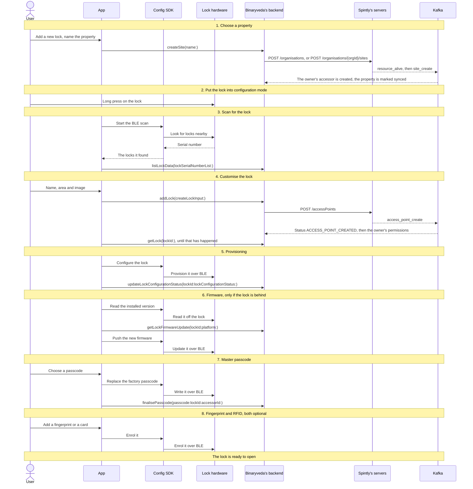

## 1. Choose a property

A lock has to live somewhere, so the first screen asks which property it belongs
to. A new user has none yet and creates one here.

<div class="screens">
<figure>
<a href="images/lock-onboarding/01-home-empty.png">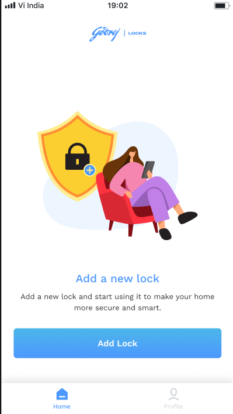</a>
<figcaption><strong>Home, with no locks</strong>Where the flow starts. Add Lock is the only thing on the screen until a lock exists.</figcaption>
</figure>
<figure>
<a href="images/lock-onboarding/02-no-properties.png">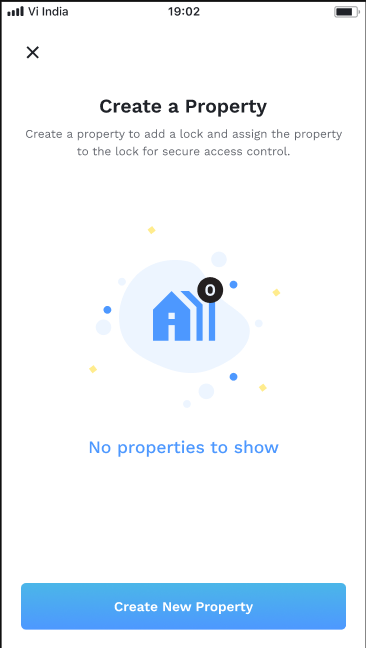</a>
<figcaption><strong>No properties yet</strong>This is <code>listSites</code> having come back empty. The first lock on an account always lands here, so a property has to be made before anything else.</figcaption>
</figure>
<figure class="crop">
<a href="images/lock-onboarding/03-create-property.png">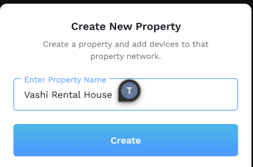</a>
<figcaption><strong>Naming it</strong>Create sends <code>createSite</code>. Everything on the lower half of the diagram below is set off by this one tap.</figcaption>
</figure>
<figure>
<a href="images/lock-onboarding/04-select-property-none.png">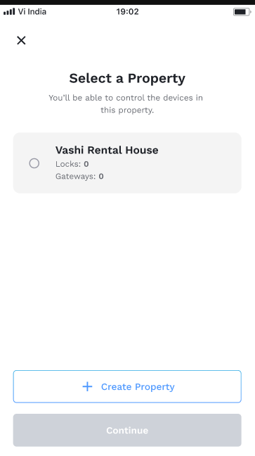</a>
<figcaption><strong>Made, but not chosen</strong>Continue stays greyed out until a row is picked. Locks and Gateways both read 0, because nothing has been added to it yet.</figcaption>
</figure>
<figure>
<a href="images/lock-onboarding/05-select-property-chosen.png">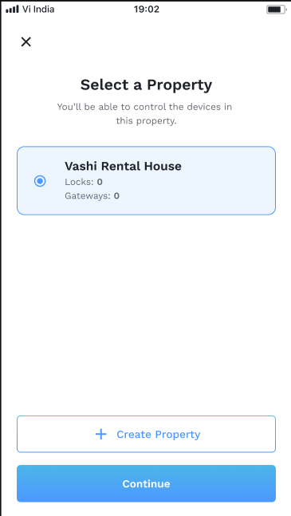</a>
<figcaption><strong>Chosen</strong>The <code>siteId</code> behind this row is what <code>addLock</code> is handed in step 4, and what has to be <code>synced</code> before it will be accepted.</figcaption>
</figure>
<figure>
<a href="images/lock-onboarding/06-select-property-many.png">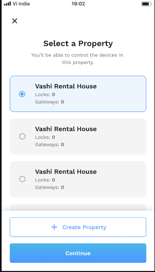</a>
<figcaption><strong>What a returning user sees</strong>The account already has an organisation, so this is the second branch below: no organisation is created, and the accessor is made inline rather than off a Kafka message.</figcaption>
</figure>
</div>

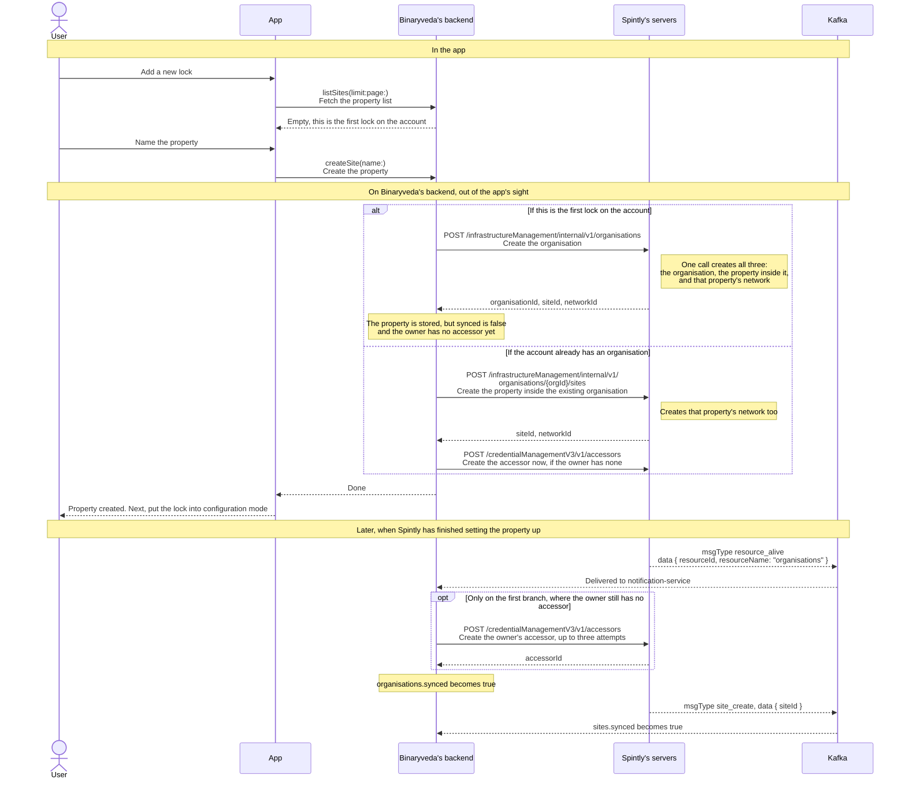

The app sends the same `createSite` whichever branch runs, and gets the same
answer back either way, so it never finds out which one it was. Choosing between
them is Binaryveda's backend's job.

!!! warning "The accessor is created in a different place on each branch"

    On the **first** property, the organisation does not exist inside Spintly
    yet when the REST call returns, so the accessor cannot be created there.
    It is created later, when the `resource_alive` message arrives.

    On **every property after that** the organisation is already live, so the
    accessor is created inline, in the same request.

    The difference matters because `addLock` in step 4 refuses a property whose
    `synced` flag is still false, answering *"The site has not synced yet"*.
    On the first property that flag is set by a Kafka message, so the user can
    reach the next screen before the backend will accept a lock on it.

No SDK is used in this step. The two operations live in `ListProperties.graphql`
and `CreateProperty.graphql`.

## 2. Put the lock into configuration mode

The app does nothing on this screen. A factory fresh lock stays silent over BLE
until someone puts it into configuration mode by hand: remove the back panel,
hold the button marked **R** for 3 seconds, and wait for the sound cue. Only
then will it answer a scan.

So this step is instructions and a **Scan** button. No SDK, no Binaryveda's
backend, no Spintly. Four cards, swiped through in order.

<div class="screens">
<figure>
<a href="images/lock-onboarding/07-open-door.png">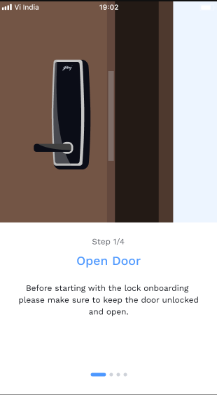</a>
<figcaption><strong>1 of 4 &mdash; open the door</strong>Asked first because setup writes to the lock. A door left latched while that is happening can shut someone out of the room they are standing outside.</figcaption>
</figure>
<figure>
<a href="images/lock-onboarding/08-remove-back-panel.png">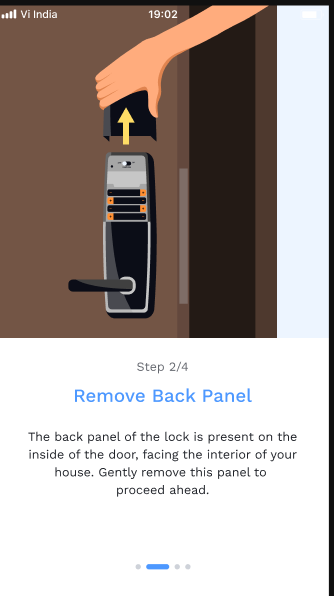</a>
<figcaption><strong>2 of 4 &mdash; take the back panel off</strong>The panel on the inside face of the door. The button in the next card is underneath it.</figcaption>
</figure>
<figure>
<a href="images/lock-onboarding/09-configuration-mode.png">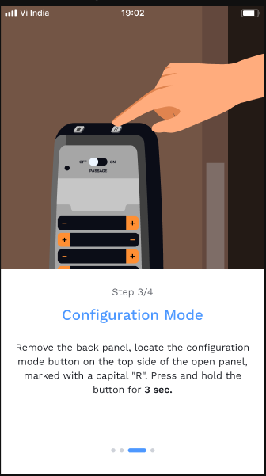</a>
<figcaption><strong>3 of 4 &mdash; hold R for 3 seconds</strong>The one action in this whole flow that happens on the hardware rather than in the app, and nothing after it works without it. A factory fresh lock ignores a BLE scan until this is done.</figcaption>
</figure>
<figure>
<a href="images/lock-onboarding/10-scan-prompt.png">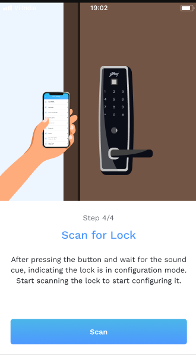</a>
<figcaption><strong>4 of 4 &mdash; wait for the sound cue, then scan</strong>The cue is how the user knows the lock is listening. This Scan button is the first thing on the page to reach the Config SDK, and it starts step 3.</figcaption>
</figure>
</div>

## 3. Scan for the lock

The app asks the Config SDK to scan, and the SDK reports back any locks
advertising nearby. Each result carries a serial number, which the app sends to
Binaryveda's backend to find out which model it is.

<div class="screens">
<figure>
<a href="images/lock-onboarding/11-scanning.png">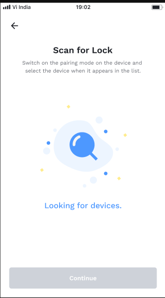</a>
<figcaption><strong>Scanning</strong>The scan has started and the SDK has reported nothing back yet. It runs for 40 seconds on iOS and 60 on Android before giving up.</figcaption>
</figure>
<figure>
<a href="images/lock-onboarding/12-locks-found.png">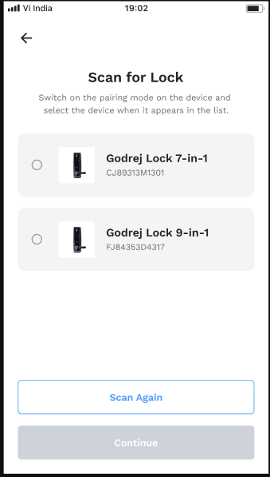</a>
<figcaption><strong>What came back</strong>One row per lock the SDK handed over. The model name and picture are <em>not</em> from the lock: it only broadcast a serial number, and the rest was looked up on it. Any gateway that advertised has already been dropped by this point.</figcaption>
</figure>
<figure>
<a href="images/lock-onboarding/13-lock-selected.png">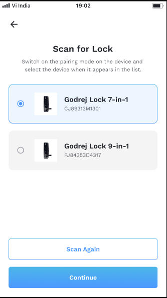</a>
<figcaption><strong>One picked</strong>Its serial number is carried forward to step 4 and lands in the access point Spintly creates. Scan Again is there because a lock drops out of configuration mode after a while.</figcaption>
</figure>
</div>

Gateways advertise on the same channel, so both platforms have to keep them out
of the list. They go about it differently.

=== "iOS"

    ```mermaid
    sequenceDiagram
        actor U as User
        participant A as App
        participant C as Config SDK
        participant L as Lock hardware
        participant B as Binaryveda's backend

        U->>A: Start the scan
        A->>C: configurableDeviceStopScan()<br/>Clear a scan left running from an earlier attempt
        A->>C: configurableDeviceStartScan(_:)<br/>Start looking for locks nearby
        C->>L: BLE scan, 40 second timeout
        L-->>C: Serial number and name
        C-->>A: ConfigurableDeviceListener → onDeviceListUpdated<br/>Hands back the devices found so far
        A->>A: Drop anything named Spintly_Gateway
        A->>B: listLockData(lockSerialNumberList:)<br/>Look the serial numbers up in the catalogue
        B-->>A: The model and display details for each one
        alt If at least one lock came back
            A-->>U: The list of locks. Pick one
        else If the list is empty
            A-->>U: Nothing nearby, scan again
        end
    ```

    **iOS filters gateways out by name**, before the catalogue lookup, because
    they advertise on the same channel as locks.

=== "Android"

    ```mermaid
    sequenceDiagram
        actor U as User
        participant A as App
        participant C as Config SDK
        participant L as Lock hardware
        participant B as Binaryveda's backend

        U->>A: Start the scan
        A->>C: configurableDeviceStartScan(ConfigurableDeviceListener)<br/>Start looking for locks nearby
        C->>L: BLE scan, 60 second timeout
        L-->>C: Serial number and name
        C-->>A: ConfigurableDeviceListener → onDeviceListUpdated<br/>Hands back the devices found so far
        A->>B: listLockData(lockSerialNumberList:)<br/>Look the serial numbers up in the catalogue
        B-->>A: Only known models come back, so gateways drop out here
        alt If at least one lock came back
            A-->>U: The list of locks. Pick one
        else If the list is empty
            A-->>U: Nothing nearby, scan again
        end
        A->>C: configurableDeviceStopScan()<br/>Stop the scan, once the app is finished with it
    ```

    **Android needs no gateway filter.** Gateways have no row in the catalogue,
    so they fall out of the `listLockData` lookup on their own.

## 4. Customise the lock

The user names the lock and picks where in the house it sits. `addLock` then
tells Binaryveda's backend to build it on Spintly's side.

Three things have to exist at Spintly for that: the **access point**, which is
the lock, the **accessor**, which is the owner, and the owner's **permissions**
on the lock.

Only the first is created by `addLock`. Spintly then publishes an
`access_point_create` message, and the second and third are done by
`notification-service` when that message arrives. So the work is split across a
Kafka round trip, `addLock` comes back before any of it has finished, and the
app polls until it has.

<div class="screens">
<figure>
<a href="images/lock-onboarding/14-customise-lock.png">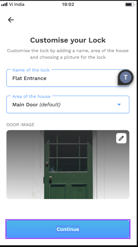</a>
<figcaption><strong>Name, area and image</strong>The area dropdown is filled by <code>listAreaOfHouse</code> and defaults to Main Door. A picture the user chooses goes straight to S3 through a presigned URL, never through Binaryveda's backend. Continue sends <code>addLock</code>, and the waiting below begins on this tap.</figcaption>
</figure>
</div>

=== "iOS"

    ```mermaid
    sequenceDiagram
        actor U as User
        participant A as App
        participant B as Binaryveda's backend
        participant S as Spintly's servers
        participant K as Kafka

        Note over U,K: Fill in the lock's details
        U->>A: Pick the lock from the list
        A->>B: listAreaOfHouse<br/>Fetch the areas of the house
        U->>A: Name it, pick an area, choose an image
        opt If the user picked a custom image
            A->>B: getUploadPresignedUrl(fileType:)<br/>Ask for a presigned upload URL
            A->>A: PUT the image to that URL<br/>Straight to S3, not through Binaryveda's backend
        end

        Note over U,K: Create it, then wait for it to exist at Spintly
        A->>B: addLock(createLockInput:)<br/>Create the lock on Binaryveda's side and on Spintly's
        B->>S: POST /infrastructureManagement/internal/v2/<br/>networks/{networkId}/accessPoints<br/>Create the access point, which is the lock
        Note right of S: The serial number from the scan lands here
        B-->>A: Accepted, before any of the work below has run
        par Spintly tells Binaryveda the access point is there
            S-->>K: msgType access_point_create<br/>data { accessPointId }
            K-->>B: Delivered to notification-service
            Note over B: Status becomes ACCESS_POINT_CREATED
            alt If the owner has no accessor yet
                B->>S: POST /credentialManagementV3/v1/accessors<br/>Create the accessor, which is the owner
                Note right of S: Carries the owner Keycloak sub, the provider id,<br/>and this access point
            else If the owner already has one
                B->>S: PATCH /permissionManagementV3/v1/organisations/{orgId}/<br/>accessors/{accessorId}/permissions<br/>Give the owner access to the new lock
                Note right of S: Mobile, card, fingerprint, passcode and admin are on.<br/>Face and dual auth are off
            end
        and Meanwhile the app keeps asking whether it is ready
            loop Every 2 seconds, until all three ids arrive
                A->>B: getLock(lockId:)
                B-->>A: The ids so far
            end
        end
        A-->>U: All ids are in. Next, provisioning
    ```

    **iOS waits for all three ids** before it moves on: `organisationId`,
    `accessorId` and `accessPointId`.

=== "Android"

    ```mermaid
    sequenceDiagram
        actor U as User
        participant A as App
        participant B as Binaryveda's backend
        participant S as Spintly's servers
        participant K as Kafka

        Note over U,K: Fill in the lock's details
        U->>A: Pick the lock from the list
        A->>B: listAreaOfHouse<br/>Fetch the areas of the house
        U->>A: Name it, pick an area, choose an image
        opt If the user picked a custom image
            A->>B: getUploadPresignedUrl(fileType:)<br/>Ask for a presigned upload URL
            A->>A: PUT the image to that URL<br/>Straight to S3, not through Binaryveda's backend
        end

        Note over U,K: Create it, then wait for it to exist at Spintly
        A->>B: addLock(createLockInput:)<br/>Create the lock on Binaryveda's side and on Spintly's
        B->>S: POST /infrastructureManagement/internal/v2/<br/>networks/{networkId}/accessPoints<br/>Create the access point, which is the lock
        Note right of S: The serial number from the scan lands here
        B-->>A: Accepted, before any of the work below has run
        par Spintly tells Binaryveda the access point is there
            S-->>K: msgType access_point_create<br/>data { accessPointId }
            K-->>B: Delivered to notification-service
            Note over B: This message is what writes<br/>ACCESS_POINT_CREATED
            alt If the owner has no accessor yet
                B->>S: POST /credentialManagementV3/v1/accessors<br/>Create the accessor, which is the owner
                Note right of S: Carries the owner Keycloak sub, the provider id,<br/>and this access point
            else If the owner already has one
                B->>S: PATCH /permissionManagementV3/v1/organisations/{orgId}/<br/>accessors/{accessorId}/permissions<br/>Give the owner access to the new lock
                Note right of S: Mobile, card, fingerprint, passcode and admin are on.<br/>Face and dual auth are off
            end
        and Meanwhile the app keeps asking whether it is ready
            loop Every 5 seconds, until the status is right
                A->>B: getLock(lockId:)
                B-->>A: The status so far
            end
        end
        A-->>U: Status reached ACCESS_POINT_CREATED. Next, provisioning
    ```

    **Android waits on a status rather than on ids.** It walks
    `ACCESS_POINT_CREATE_PENDING` → `ACCESS_POINT_CREATED` → `MESH_CONFIGURED`,
    and the app moves on at `ACCESS_POINT_CREATED`.

The two platforms wait differently, but the same three ids come out either way:
`organisationId`, `accessorId` and `accessPointId`. Every Config SDK call from
provisioning onwards needs them.

!!! warning "The accessor call and the permission call are alternatives"

    Only one of the two runs. A user onboarding their **first** lock has no
    accessor, so one is created, and it carries the access point with it, which
    grants the permission at the same time. A user adding a **second** lock
    already has an accessor, so only the permission call runs.

    Neither is made by the service that handled `addLock`. Both are made by
    `notification-service`, off the Kafka message.

**What the app is polling for is written by the Kafka consumer.** Android's
`ACCESS_POINT_CREATED` and the `accessorId` iOS waits for are both set when the
`access_point_create` message is handled, not when the access point REST call
returns. If the message never arrives, the poll never finishes, and neither
platform will show an error: they will simply keep asking.

**Screens reached later look the three ids up again** with
`spintlyDetails(lockSerialNumber:)`, which returns exactly those and nothing
else. It is how [My Access](lock-settings.md#2-my-access), a user's detail
screen in [User Management](user-management.md), and an invited user setting up
their own access all get what a Config SDK call needs, without carrying the ids
across from here.

Whichever of the two runs, it has to run after the access point exists, because
it names the access point. That ordering is what the Kafka message provides:
Spintly does not publish `access_point_create` until the access point is there.

!!! note "Resuming an interrupted onboarding"

    A lock left half onboarded is picked up again with a different query,
    `resumeOnboarding`, polled every 2 seconds until Spintly confirms the three
    ids and reports the site, access point and organisation as synced. Android
    gives up after 15 tries and iOS keeps going. iOS only takes this path in
    non-production builds and stays on `getLock` everywhere else.

    **`resumeOnboarding` is a state machine over those same synced flags**, and
    every one of them is set by a Kafka message. Each step refuses to run until
    the flag the previous step waits on has arrived: the property is only
    created once the organisation is synced, the access point only once the
    property is synced, and the accessor or permission only once the access
    point is synced. Repeating the query is how it walks forward as each message
    lands.

    The diagrams above are the normal path, for a lock being added for the first
    time.

A lock in that state is visible on Home, drawn differently from a working one.

<div class="screens">
<figure>
<a href="images/lock-onboarding/39-onboarding-pending.png">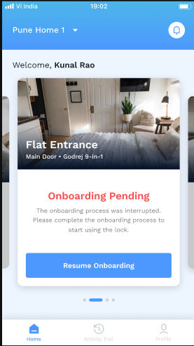</a>
<figcaption><strong>Onboarding pending</strong>No tiles and no Unlock button, because none of it works yet. Resume Onboarding is what runs the query in the note above rather than starting the flow again from the top, which is how the half finished lock is picked up where it stopped.</figcaption>
</figure>
</div>

## 5. Provisioning

The lock now exists on Spintly's side and the app has its ids. Provisioning
writes that same setup onto the lock itself, over BLE.

<div class="screens">
<figure>
<a href="images/lock-onboarding/15-provisioning.png">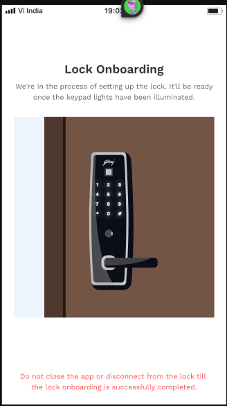</a>
<figcaption><strong>The wait while the lock is written to</strong>Nothing to do here but stay put. The keypad lighting up is the lock's own signal that the write landed. The warning in red is the point of the screen: this is a BLE write with no resume, so closing the app or walking out of range part way through leaves the lock half configured.</figcaption>
</figure>
</div>

=== "iOS"

    ```mermaid
    sequenceDiagram
        actor U as User
        participant A as App
        participant C as Config SDK
        participant L as Lock hardware
        participant B as Binaryveda's backend

        A-->>U: Provisioning screen, please wait
        A->>C: startDeviceMeshConfiguration(_:)<br/>Write the lock's setup onto the lock
        C->>L: Provision the lock over BLE
        L-->>C: Configured
        C-->>A: completion<br/>Done, or failed with an error
        A->>B: updateLockConfigurationStatus(lockId:lockConfigurationStatus:)<br/>Record that the lock is provisioned, status MESH_CONFIGURED
        A-->>U: Provisioned. Next, the firmware check
    ```

    **iOS never calls `meshConfigurationClose()`** and waits no settle time
    afterwards.

    **If the lock turns out to be configured already**, the SDK error is shown
    to the user.

=== "Android"

    ```mermaid
    sequenceDiagram
        actor U as User
        participant A as App
        participant C as Config SDK
        participant L as Lock hardware
        participant B as Binaryveda's backend

        A-->>U: Provisioning screen, please wait
        A->>C: startDeviceMeshConfiguration(serial, callback)<br/>Write the lock's setup onto the lock
        C->>L: Provision the lock over BLE
        L-->>C: Configured
        C-->>A: SpintlyCompletionCallback → completed or failed<br/>How the SDK reports the result
        A->>C: meshConfigurationClose()<br/>Close the session, whether it worked or not
        A->>A: Wait 5 seconds for the lock to settle
        A->>B: updateLockConfigurationStatus(lockId:lockConfigurationStatus:)<br/>Record that the lock is provisioned, status MESH_CONFIGURED
        A-->>U: Provisioned. Next, the firmware check
    ```

    **If the lock turns out to be configured already**, the SDK reports
    `domain 2` and `code 24`. Android ignores it and carries on.

## 6. Firmware

The app reads the version off the lock and compares it against the version
Binaryveda's backend says it should be running. The update screen has no skip
button, so cancelling there leaves the lock unfinished on Home.

<div class="screens">
<figure class="crop">
<a href="images/lock-onboarding/16-firmware-required.png">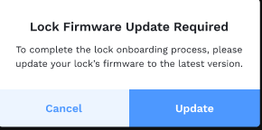</a>
<figcaption><strong>The two versions did not match</strong>Shown only when the version read off the lock differs from the target. Update is the only way forward: Cancel does not skip the step, it abandons the onboarding and leaves the lock unfinished on Home.</figcaption>
</figure>
<figure>
<a href="images/lock-onboarding/17-firmware-updated.png">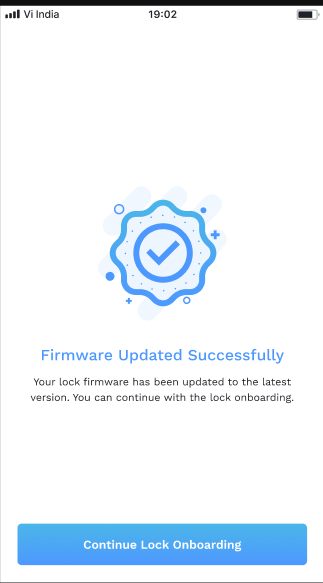</a>
<figcaption><strong>Pushed</strong>Continue does not simply move on. Both platforms re-enter the check and read the two versions again, so a push that did not take is caught rather than assumed.</figcaption>
</figure>
</div>

=== "iOS"

    ```mermaid
    sequenceDiagram
        actor U as User
        participant A as App
        participant C as Config SDK
        participant L as Lock hardware
        participant B as Binaryveda's backend

        Note over U,B: Compare the two versions
        A->>C: getListOfFirmwareForSerialNumber(_:)<br/>Ask which firmware the lock is running
        C->>L: Read the installed firmware
        L-->>C: ProdSwVersionsWithBleDeviceInfo
        C-->>A: bleDeviceInfo.prodSwVersion<br/>The version number on the lock
        A->>B: getLockFirmwareUpdate(lockId:platform:)<br/>What should this lock be running?
        B-->>A: updateFirmware.nordicVersion<br/>The target version

        Note over U,B: Update only if they differ
        alt If the lock is out of date
            A-->>U: Firmware update screen, with no skip
            A->>C: firmwareUpdateToSelectedVersion(_:)<br/>Send the new firmware to the lock
            C->>L: Push the new firmware over BLE
            L-->>C: Updated
            A->>B: updateLockInformation(currentFirmwareVersion:id:)<br/>or updateLockFirmwareStatus(lockId:firmwareType:), see below
            A->>A: Re-enter the flow and read the version again
        else If it is already up to date
            A-->>U: Next, the master passcode
        end
    ```

    **iOS checks the firmware after the access point, the accessor and the
    permission are all in place**, because step 4 waits for all three ids.

    **The new version is recorded afterwards**, through
    `updateLockInformation(currentFirmwareVersion:id:)` when the lock has no
    pending actions, and `updateLockFirmwareStatus(lockId:firmwareType:)` when
    it does. Both stop at Binaryveda's backend.

=== "Android"

    ```mermaid
    sequenceDiagram
        actor U as User
        participant A as App
        participant C as Config SDK
        participant L as Lock hardware
        participant B as Binaryveda's backend

        Note over U,B: Compare the two versions
        A->>C: getListOfFirmwareForSerialNumber(...)<br/>Ask which firmware the lock is running
        C->>L: Read the installed firmware
        L-->>C: ProdSwVersionsWithBleDeviceInfo
        C-->>A: bleDeviceInfo.prodSwVersion<br/>The version number on the lock
        A->>B: getLockFirmwareUpdate(lockId:platform:)<br/>What should this lock be running?
        B-->>A: The target version

        Note over U,B: Update only if they differ
        alt If the lock is out of date
            A-->>U: Firmware update screen, with no skip
            A->>C: firmwareUpdateToSelectedVersion(...)<br/>Send the new firmware to the lock
            C->>L: Push the new firmware over BLE
            L-->>C: Updated
            A->>A: onboardLock(force = true) reads both versions again
        else If it is already up to date
            A-->>U: Next, the master passcode
        end
    ```

    **Android checks the firmware before that work has necessarily finished**,
    because step 4 moves on at `ACCESS_POINT_CREATED`, which is written before
    the accessor or permission call is made.

    **The new version is recorded too**, through the same two mutations as iOS,
    but from a different place. `LockOnboardingViewModel` only reads the two
    versions. `FirmwareUpdateViewModel`, the screen the flow hands off to, is
    what calls `updateLockFirmwareStatus` and `updateLockInformation` once the
    push finishes.

Nothing in this step reaches Spintly. The target version comes from Binaryveda's
backend, through `getLockFirmwareUpdate(lockId:platform:)`.

## 7. Master passcode

The lock ships with a factory passcode and this step replaces it. The Config SDK
writes the new one onto the lock, and Binaryveda's backend saves it afterwards.

<div class="screens">
<figure>
<a href="images/lock-onboarding/18-set-passcode.png">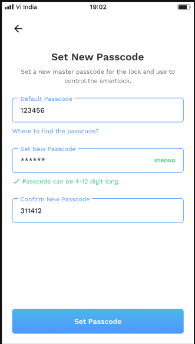</a>
<figcaption><strong>Old on top, new below</strong>Both fields are arguments to the same SDK call: the top one is <code>old</code> and the second is <code>new</code>. 4 to 12 digits. The lock will not take the new passcode unless the factory one it already holds is given alongside it.</figcaption>
</figure>
<figure class="crop">
<a href="images/lock-onboarding/19-default-passcode-help.png">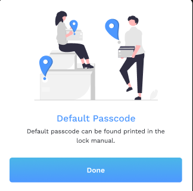</a>
<figcaption><strong>Behind &ldquo;Where to find the passcode?&rdquo;</strong>The factory passcode is printed in the manual, not held anywhere in the app or on the backend, which is why the user has to type it rather than the app filling it in.</figcaption>
</figure>
</div>

=== "iOS"

    ```mermaid
    sequenceDiagram
        actor U as User
        participant A as App
        participant C as Config SDK
        participant L as Lock hardware
        participant B as Binaryveda's backend

        U->>A: Choose a new master passcode
        A->>C: updateMasterPasscode(serial, orgId, accessorId, old, new, completion)<br/>Replace the passcode held on the lock
        Note right of C: old is the factory passcode.<br/>orgId and accessorId are the ids Spintly returned<br/>when the lock was created
        C->>L: Write the master passcode over BLE
        L-->>C: Written
        C-->>A: completion<br/>Done, or failed with an error
        A->>B: finalisePasscode(passcode:lockId:accessorId:)<br/>Save the passcode on Binaryveda's backend
        A-->>U: Passcode set. Add a fingerprint or a card, or finish here
    ```

    **If the passcode is already in use**, the SDK returns code
    `1_899_102_215`. iOS treats that as a success, but only when the error
    message also contains `duplicate key value violates unique constraint`.
    The same code with any other message is shown to the user.

=== "Android"

    ```mermaid
    sequenceDiagram
        actor U as User
        participant A as App
        participant C as Config SDK
        participant L as Lock hardware
        participant B as Binaryveda's backend

        U->>A: Choose a new master passcode
        A->>C: generateMasterPasscode(serial, orgId, accessorId, old, new, callback)<br/>Replace the passcode held on the lock
        Note right of C: Same arguments as iOS, different member.<br/>old is the factory passcode
        C->>L: Write the master passcode over BLE
        L-->>C: Written
        C-->>A: SpintlyCompletionCallback → completed or failed<br/>How the SDK reports the result
        A->>B: finalisePasscode(passcode, lockId, accessorId)<br/>Save the passcode on Binaryveda's backend
        A-->>U: Passcode set. Add a fingerprint or a card, or finish here
    ```

    **If the passcode is already in use**, Android shows the SDK error to the
    user.

## 8. Fingerprint and RFID

Both are optional and both can be added later from the lock's settings instead.

The screen they are added from is a hub. Each row opens its own enrolment and
returns here afterwards, so the two can be done in either order, or not at all.

<div class="screens">
<figure>
<a href="images/lock-onboarding/20-access-methods.png">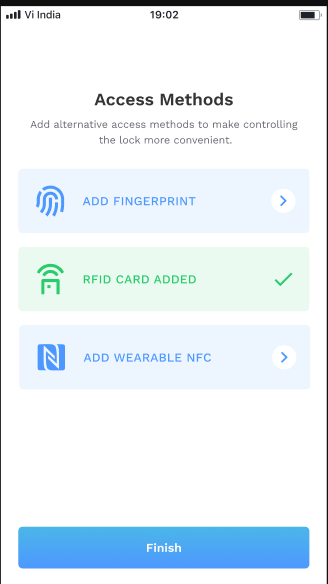</a>
<figcaption><strong>One done</strong>A row turns green with a tick once that method is on the lock. The blue rows are still open, and a chevron means tapping the row starts its enrolment.</figcaption>
</figure>
<figure>
<a href="images/lock-onboarding/25-access-methods-both.png">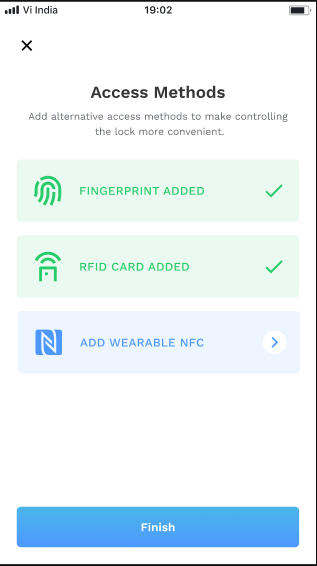</a>
<figcaption><strong>Both done</strong>Finish ends onboarding whether either row was used or not, which is what makes them optional. The tick is drawn from what the lock reports, not from anything held on Binaryveda's backend.</figcaption>
</figure>
</div>

### Fingerprint

Twelve screens, and ten of them are the same press and lift cycle going round
again. The ring is the progress: it closes a little further on every capture the
reader accepts, and the prompt alternates because one touch is not enough to
build a template. Each change of wording is an `EnrollmentPromptStatus` coming
back from the SDK, so the loop in the diagram below runs once per screen here.

<div class="screens">
<figure>
<a href="images/lock-onboarding/27-add-fingerprint-intro.png">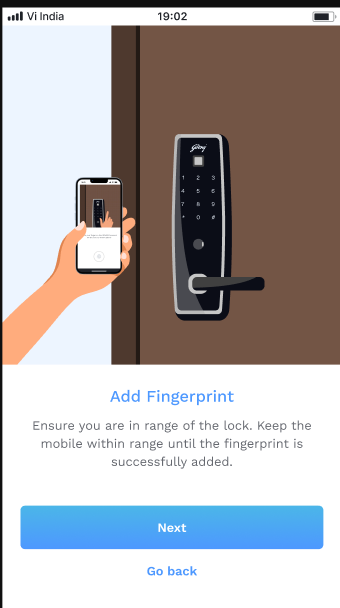</a>
<figcaption><strong>Before anything connects</strong>The same warning as the card flow, for the same reason: the reader is in the lock, not in the phone, so everything below runs over BLE. Next calls <code>scanAndConnectFingerprintDevice</code> to open that connection.</figcaption>
</figure>
<figure>
<a href="images/lock-onboarding/28-place-finger.png">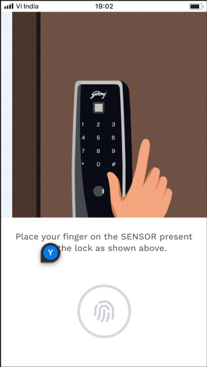</a>
<figcaption><strong>Reader live, ring empty</strong>Nothing captured yet. <code>performFPEnrollmentOnDevice</code> is running from here, and it has 60 seconds to get through the whole cycle.</figcaption>
</figure>
<figure>
<a href="images/lock-onboarding/29-lift-1.png">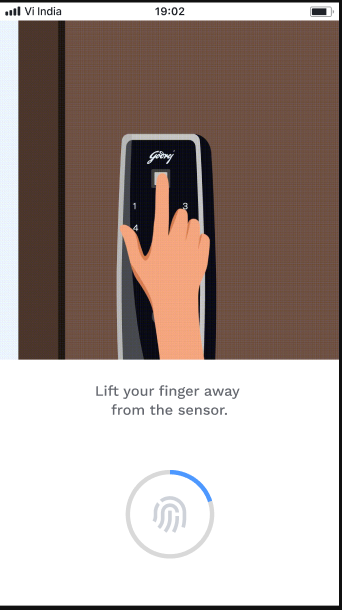</a>
<figcaption><strong>Lift</strong>The first capture was accepted and the ring gains its first arc.</figcaption>
</figure>
<figure>
<a href="images/lock-onboarding/30-place-again.png">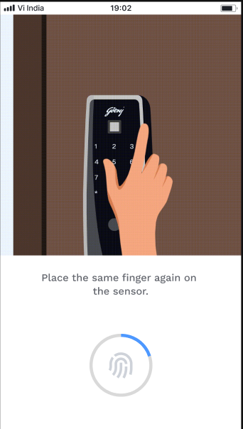</a>
<figcaption><strong>Press, the same finger</strong>&ldquo;The same finger&rdquo; is the part that matters. The captures are being combined into one template, not kept as separate fingers.</figcaption>
</figure>
<figure>
<a href="images/lock-onboarding/31-lift-2.png">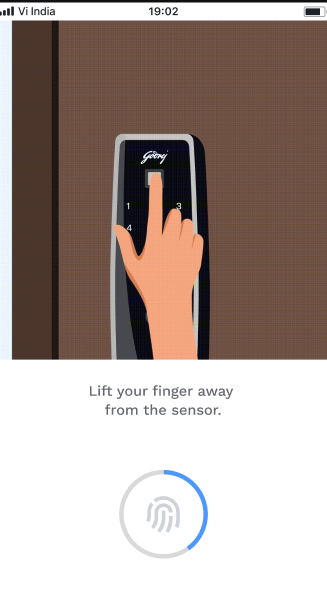</a>
<figcaption><strong>Lift</strong>Second capture in.</figcaption>
</figure>
<figure>
<a href="images/lock-onboarding/32-place-3.png">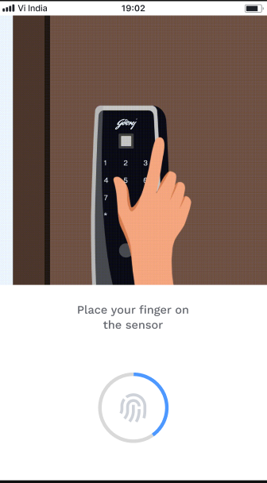</a>
<figcaption><strong>Press</strong>About a third of the way round.</figcaption>
</figure>
<figure>
<a href="images/lock-onboarding/33-place-4.png">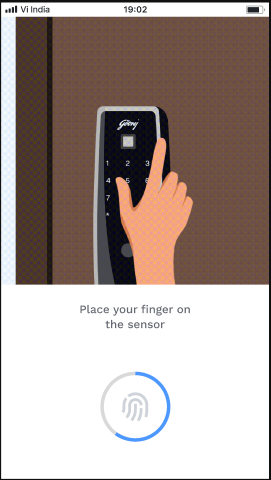</a>
<figcaption><strong>Press</strong>Half. The wording has not changed, so the ring is the only thing telling the user it is still working.</figcaption>
</figure>
<figure>
<a href="images/lock-onboarding/34-lift-3.png">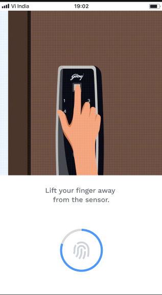</a>
<figcaption><strong>Lift</strong>Three quarters.</figcaption>
</figure>
<figure>
<a href="images/lock-onboarding/35-almost-done.png">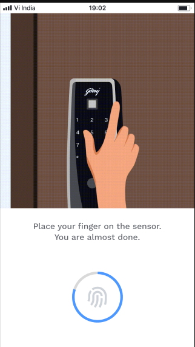</a>
<figcaption><strong>Almost done</strong>The one prompt in the cycle that says how far along it is, and the signal to the user not to walk off now.</figcaption>
</figure>
<figure>
<a href="images/lock-onboarding/36-ring-complete.png">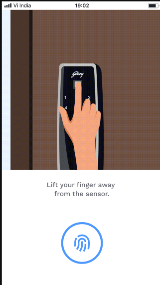</a>
<figcaption><strong>The ring closes</strong>The last capture landed and the template is built. This is the loop ending, not a button being waited on.</figcaption>
</figure>
<figure>
<a href="images/lock-onboarding/37-fingerprint-added.png">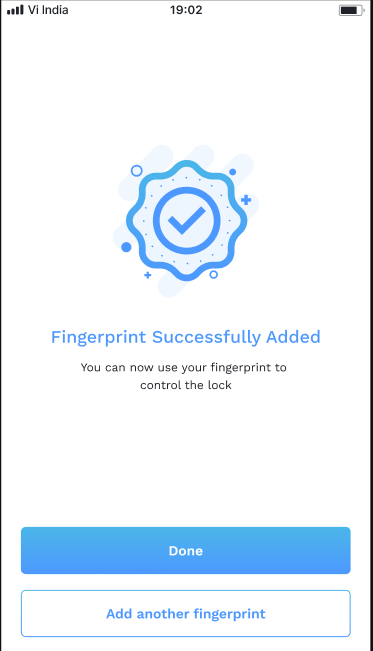</a>
<figcaption><strong>Enrolled</strong>The template is on the lock and the session is closed. Add another fingerprint runs the whole cycle again, which is how one lock ends up holding several fingers.</figcaption>
</figure>
<figure>
<a href="images/lock-onboarding/38-access-methods-fingerprint.png">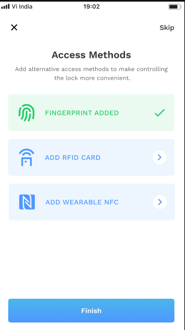</a>
<figcaption><strong>Back on the hub</strong>The fingerprint row is green and the card row is still open, so the two can be done in either order. Skip sits in the corner as well as Finish at the foot: the lock already opens without either of them, because the passcode was set in step 7.</figcaption>
</figure>
</div>

=== "iOS"

    ```mermaid
    sequenceDiagram
        actor U as User
        participant A as App
        participant C as Config SDK
        participant L as Lock hardware

        U->>A: Add a fingerprint
        A->>C: fingerprintClose()<br/>Close any fingerprint session left open
        A->>C: scanAndConnectFingerprintDevice(orgId, accessPointId, 1)<br/>Connect to the lock's fingerprint reader
        C->>L: Open a BLE connection
        A->>C: performFPEnrollmentOnDevice(orgId, accessPointId, 1, accessorId, name, 60, delegate)<br/>Record the finger, 60 second timeout
        loop Once for each press of the finger
            U->>L: Press a finger on the reader
            L-->>C: Scan captured
            C-->>A: EnrollmentPromptStatus<br/>Progress after each press
            A-->>U: Press again, or lift and press again
        end
        C-->>A: Enrolment complete
        A->>C: fingerprintClose()<br/>Close the session
        A-->>U: The lock is ready
    ```

=== "Android"

    ```mermaid
    sequenceDiagram
        actor U as User
        participant A as App
        participant C as Config SDK
        participant L as Lock hardware

        U->>A: Add a fingerprint
        A->>C: scanAndConnectFingerprintDevice(orgId, accessPointId, 1)<br/>Connect to the lock's fingerprint reader
        C->>L: Open a BLE connection
        A->>C: performFPEnrollmentOnDevice(orgId, accessPointId, 1, accessorId, templateName, 60, FPEnrollCallback)<br/>Record the finger, 60 second timeout
        loop Once for each press of the finger
            U->>L: Press a finger on the reader
            L-->>C: Scan captured
            C-->>A: FPEnrollCallback → onPrompt<br/>Progress after each press
            A-->>U: Press again, or lift and press again
        end
        C-->>A: FPEnrollCallback → onComplete or onFailure<br/>How the SDK reports the result
        A->>C: fingerprintClose()<br/>Close the session, whether it worked or not
        A-->>U: The lock is ready
    ```

### RFID

Four screens, and the middle two are not decoration: each one is the app
redrawing on an `NFCProcessState` the SDK has just reported. The user is being
shown where the enrolment has got to, one callback at a time.

<div class="screens">
<figure>
<a href="images/lock-onboarding/21-add-rfid-intro.png">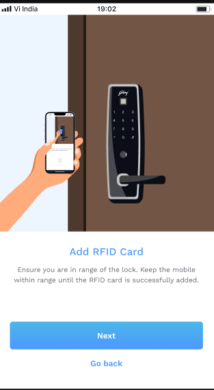</a>
<figcaption><strong>Before anything connects</strong>The whole enrolment runs over BLE to the lock, so the phone has to stay near it throughout. Next is what calls <code>scanAndConnectCardDevice</code>.</figcaption>
</figure>
<figure>
<a href="images/lock-onboarding/22-tap-card.png">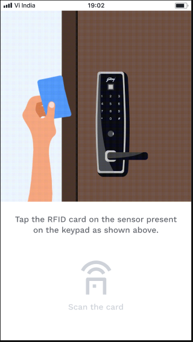</a>
<figcaption><strong>Connected, waiting for the card</strong><code>CONNECTED</code> has arrived, so the reader is live. The greyed &ldquo;Scan the card&rdquo; is the app waiting for <code>CARD_PLACED</code>, which only the user can cause by holding a card to the keypad.</figcaption>
</figure>
<figure>
<a href="images/lock-onboarding/23-card-read.png">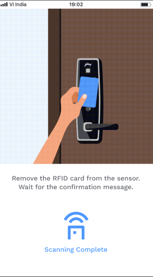</a>
<figcaption><strong>Card read, not yet enrolled</strong><code>CARD_PLACED</code> came back and the same icon turns solid. The card can come away now, but the enrolment is still open: this screen is the wait for the assign result.</figcaption>
</figure>
<figure>
<a href="images/lock-onboarding/24-rfid-added.png">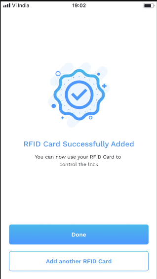</a>
<figcaption><strong>Enrolled</strong>The assign succeeded and the session is closed. Add another RFID Card runs the whole thing again, which is how a lock ends up with more than one card.</figcaption>
</figure>
</div>

=== "iOS"

    ```mermaid
    sequenceDiagram
        actor U as User
        participant A as App
        participant C as Config SDK
        participant L as Lock hardware

        U->>A: Add a card
        A->>C: nfcEnrollmentStopScan()<br/>Clear an NFC scan left running
        A->>C: scanAndConnectCardDevice(orgId, accessPointId, 1)<br/>Connect to the lock's card reader
        C->>L: Open a BLE connection
        C-->>A: NFCProcessState CONNECTED<br/>The reader is ready
        A->>C: assignCardToAccessorWithPermissionOnDevice(true, orgId, accessorId, 1, 1, true, delegate)<br/>Record the card and give it access
        Note right of C: accessorId is the current user's,<br/>falling back to the lock's
        A-->>U: Hold the card against the reader
        U->>L: Card presented
        C-->>A: NFCProcessState CARD_PLACED<br/>The card has been read
        C-->>A: AssignAndEnrollListener → onAssignedSuccess or onFailure<br/>How the SDK reports the result
        A->>C: nfcEnrollmentClose()<br/>Close the session, whether it worked or not
        A-->>U: The lock is ready
    ```

=== "Android"

    ```mermaid
    sequenceDiagram
        actor U as User
        participant A as App
        participant C as Config SDK
        participant L as Lock hardware

        U->>A: Add a card
        A->>C: scanAndConnectCardDevice(orgId, accessPointId, 1)<br/>Connect to the lock's card reader
        C->>L: Open a BLE connection
        C-->>A: RFIDPromptStatus.CONNECTED<br/>The reader is ready
        A->>C: nfcEnrollmentStopScan()<br/>Stop scanning, after connecting rather than before
        A->>C: assignCardToAccessorWithPermissionOnDevice(...)<br/>Record the card and give it access
        Note right of C: accessorId is always the lock's
        A-->>U: Hold the card against the reader
        U->>L: Card presented
        C-->>A: RFIDPromptStatus.CARD_PLACED<br/>The card has been read
        C-->>A: Enrolled
        A->>C: nfcEnrollmentClose()<br/>Close the session
        A-->>U: The lock is ready
    ```

### Where each access method ends up

| Access method | On the lock | Saved on Binaryveda's backend |
|---|---|---|
| Master passcode | Yes | Yes, through `finalisePasscode` |
| Fingerprint | Yes | No |
| RFID card | Yes | No |

A fingerprint or a card added during setup exists only on the lock itself.
Binaryveda's backend is never told about it. There is no mutation for
fingerprints at all, and the one that exists for cards, `assignRfid`, is never
sent: the iOS call site is commented out, and Android's `AssignRfidUseCase` has
no caller.

## Where the flow ends

Finish closes onboarding and drops the user on Home, with the lock they just
built on it.

<div class="screens">
<figure>
<a href="images/lock-onboarding/26-home-lock-ready.png">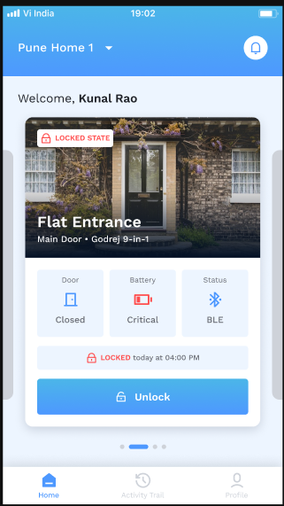</a>
<figcaption><strong>The lock, onboarded</strong>The name, area and image from step 4 are what the card is drawn from, and the model came out of the catalogue lookup in step 3. Status BLE means the phone is reaching the lock directly rather than through a gateway. <a href="home.md">Home</a> covers what keeps this card live.</figcaption>
</figure>
</div>

## Differences between the two

| | iOS | Android |
|---|---|---|
| Config SDK environment | Set once at app launch | Re-applied before every call |
| BLE scan timeout | 40 seconds | 60 seconds |
| Keeping gateways out | Filters on `ConfigurableDevice.name == "Spintly_Gateway"` | No filter. Gateways have no catalogue row and drop out of the lookup |
| Waiting for the Spintly ids | `getLock` every 2 seconds, waits for all ids | `getLock` every 5 seconds, waits for `ACCESS_POINT_CREATED` |
| When the firmware is checked | After the Spintly calls have finished | Before they have |
| Firmware retry after an update | Re-enters the flow and reads both versions again | `onboardLock(force = true)` reads both versions again |
| `meshConfigurationClose()` | Not called | Called on success and on failure |
| Settle delay after configuring | None | 5 seconds |
| A lock that is already configured | The SDK error is shown | `domain 2` and `code 24` ignored |
| **Master passcode SDK member** | **`updateMasterPasscode`** | **`generateMasterPasscode`** |
| Duplicate passcode SDK error | Treated as success, but only when the message also mentions a duplicate key | Shown to the user |
| `nfcEnrollmentStopScan` position | Before connecting to the reader | After connecting |
| RFID `accessorId` argument | The current user's, falling back to the lock's | Always the lock's |

## Every SDK member this flow uses

Apart from the first row of each table, every call below is the Config SDK, on
`configurationProvider`. iOS reaches them through `SpintlyHelper` and
`DefaultSpintlyViewModel`, Android through `SpintlySDKManager`.

??? note "iOS"

    | SDK | Member | When | What it is for |
    |---|---|---|---|
    | OAuth | `SpintlyHelper.login` → `setConfigSDKToken(token:)` | Before every call below | A fresh Spintly token per call, with no cache |
    | Config | `configurableDeviceStopScan()` | Before scanning | Clear a scan left running |
    | Config | `configurableDeviceStartScan(_:)` | Scan | Start the BLE scan, 40 second timeout |
    | Config | `ConfigurableDeviceListener` → `onDeviceListUpdated`, `onFailure` | Scan | How discovered devices arrive |
    | Config | `ConfigurableDevice.serialNumber`, `.name` | Scan | Serial for the catalogue lookup, `name` filters out `Spintly_Gateway` |
    | Config | `getListOfFirmwareForSerialNumber(_:)` | Firmware check | Read installed firmware off the lock |
    | Config | `ProdSwVersionsWithBleDeviceInfo.bleDeviceInfo.prodSwVersion` | Firmware check | The installed version number |
    | Config | `firmwareUpdateToSelectedVersion(_:)` | Firmware update | Push the new firmware |
    | Config | `startDeviceMeshConfiguration(_:)` | Provisioning | Provision the lock over BLE |
    | Config | `updateMasterPasscode(serial, orgId, accessorId, old, new, completion)` | Master passcode | Write the master passcode to the lock |
    | Config | `fingerprintClose()` | Before and after fingerprint | Close any open fingerprint session |
    | Config | `scanAndConnectFingerprintDevice(orgId, accessPointId, 1)` | Fingerprint | Connect to the fingerprint reader |
    | Config | `performFPEnrollmentOnDevice(orgId, accessPointId, 1, accessorId, name, 60, delegate)` | Fingerprint | Enrol the finger, 60 second timeout |
    | Config | `EnrollmentPromptStatus` | Fingerprint | Progress on each scan |
    | Config | `nfcEnrollmentStopScan()` | Before RFID | Stop a stale NFC scan |
    | Config | `scanAndConnectCardDevice(orgId, accessPointId, 1)` | RFID | Connect to the card reader |
    | Config | `assignCardToAccessorWithPermissionOnDevice(true, orgId, accessorId, 1, 1, true, delegate)` | RFID | Enrol the card and assign it to the accessor |
    | Config | `AssignAndEnrollListener` → `onAssignedSuccess`, `onStatusUpdate`, `onFailure` | RFID | How card enrolment reports back |
    | Config | `nfcEnrollmentClose()` | After RFID | Close the NFC session, on success and on failure |
    | Config | `NFCProcessState` | RFID | `CONNECTED` and `CARD_PLACED` progress |

??? note "Android"

    | SDK | Member | When | What it is for |
    |---|---|---|---|
    | OAuth | `loginWithOauthAndConfigurationSDK()` → `setEnvironment` + `setAuthToken` | Before every call below | A fresh token and environment per call |
    | Config | `configurableDeviceStartScan(ConfigurableDeviceListener)` | Scan | Start the BLE scan, exposed as a `Flow`, 60 second timeout |
    | Config | `ConfigurableDeviceListener` → `onDeviceListUpdated`, `onFailure` | Scan | How discovered devices arrive |
    | Config | `configurableDeviceStopScan()` | Scan | Stop the scan when the flow closes |
    | Config | `getListOfFirmwareForSerialNumber(...)` | Firmware check | Read installed firmware off the lock |
    | Config | `ProdSwVersionsWithBleDeviceInfo.bleDeviceInfo.prodSwVersion` | Firmware check | The installed version number |
    | Config | `firmwareUpdateToSelectedVersion(...)` | Firmware update | Push the new firmware |
    | Config | `startDeviceMeshConfiguration(serial, SpintlyCompletionCallback<Void>)` | Provisioning | Provision the lock over BLE |
    | Config | `meshConfigurationClose()` | Provisioning | Close the mesh session, on success and on failure |
    | Config | `SpintlyCFServiceException.domain` / `.code` | Provisioning | `2 / 24` means already configured, ignored |
    | Config | `generateMasterPasscode(serial, orgId, accessorId, old, new, callback)` | Master passcode | Write the master passcode to the lock |
    | Config | `scanAndConnectFingerprintDevice(orgId, accessPointId, 1)` | Fingerprint | Connect to the fingerprint reader |
    | Config | `performFPEnrollmentOnDevice(orgId, accessPointId, 1, accessorId, templateName, 60, FPEnrollCallback)` | Fingerprint | Enrol the finger, 60 second timeout |
    | Config | `FPEnrollCallback` → `onComplete`, `onPrompt`, `onFailure` | Fingerprint | Result and progress on each scan |
    | Config | `fingerprintClose()` | After fingerprint | Close the session, on completion and on failure |
    | Config | `scanAndConnectCardDevice(orgId, accessPointId, 1)` | RFID | Connect to the card reader |
    | Config | `nfcEnrollmentStopScan()` | RFID | Stop scanning once connected |
    | Config | `assignCardToAccessorWithPermissionOnDevice(...)` | RFID | Enrol the card and assign it to the accessor |
    | Config | `nfcEnrollmentClose()` | After RFID | Close the NFC session |
    | Config | `NFCProcessState` → `RFIDPromptStatus.CONNECTED` / `CARD_PLACED` | RFID | Progress |
    | Config | `SpintlyCompletionCallback<T>` → `completed`, `failed` | All | How the Config SDK reports back |
