# 7. Lock Settings

**What it is.** Everything behind the **Settings** button on the
[Lock Control Panel](lock-control-panel.md). One menu, whose entries cover the
lock's name and photo, the hardware settings written into the lock itself, the
accessories attached to it, firmware, third party access, and the two ways of
getting rid of the lock.

!!! warning "Key point"

    This is the **Config SDK's** page. Hardware settings, accessories and
    firmware are all written to the lock over BLE, so the phone has to be near
    it. The menu itself, the lock's name and photo, and the records of what was
    done are Binaryveda's backend.

    Three actions reach Spintly's servers, and all three take something away:
    a factory reset, removing a lock from your own account, and removing a
    gateway.

## Participants

This page uses User, App, Config SDK, Lock hardware, Binaryveda's backend, and
Spintly's servers.

Each one is defined, with the colour it keeps across the site, in
[Reading these pages](conventions.md).

## The menu, and who sees what

Thirteen entries exist. Which of them are drawn depends on the signed in user's
role on that lock, and on whether the lock has finished onboarding.

| Entry | Owner | Primary | Secondary |
|---|---|---|---|
| **Lock Details** | Yes | Yes | No |
| **My Access** | Yes | Yes | Yes |
| **Hardware Settings** | Yes | Yes | No |
| **Accessories** | Yes | No | No |
| **Voice Assistants** | Yes | Yes | Yes |
| **System Integrators** | Yes | Yes | iOS only |
| **FAQs**, **Manual**, **Get Help** | Yes | Yes | Yes |
| **Firmware Update** | Yes | iOS only | No |
| **Factory Reset** | Yes | No | No |
| **About Lock** | Yes | Yes | Yes |
| **Remove Device** | No | Yes | Yes |

**Factory Reset and Remove Device are the same idea at two scales**, and no role
ever sees both. The owner gets Factory Reset, which wipes the lock and takes it
off everyone's account. Everyone else gets Remove Device, which drops it from
their own account and leaves the lock alone.

<div class="screens">
<figure>
<a href="images/lock-settings/01-menu-full.png">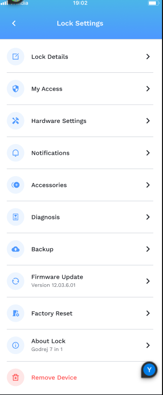</a>
<figcaption><strong>The menu at its longest</strong>Every row a design carries, including Notifications, Diagnosis and Backup, which are not in the table above. The version under Firmware Update is the one thing here that costs a call, <code>getLockFirmwareUpdate</code>.</figcaption>
</figure>
<figure>
<a href="images/lock-settings/02-menu-owner.png">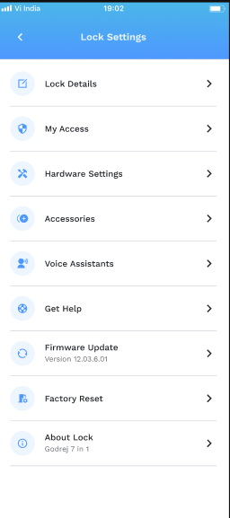</a>
<figcaption><strong>An owner's menu</strong>Factory Reset is present and Remove Device is not, which is the split described above. Voice Assistants and Get Help sit where Notifications and Backup were.</figcaption>
</figure>
<figure>
<a href="images/lock-settings/03-notifications-off.png">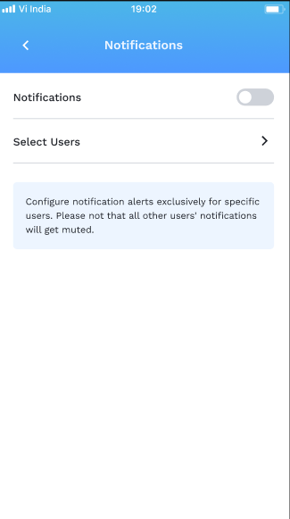</a>
<figcaption><strong>Notifications, off</strong>Behind the Notifications row. The note warns that choosing specific users mutes everyone else's alerts for this lock.</figcaption>
</figure>
<figure>
<a href="images/lock-settings/04-notifications-on.png">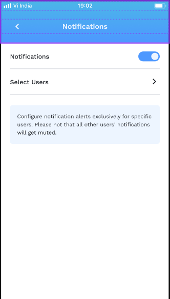</a>
<figcaption><strong>And on</strong>The toggle is the whole screen apart from the row under it. What each push topic carries is in <a href="notifications.md">Notifications</a>.</figcaption>
</figure>
<figure>
<a href="images/lock-settings/05-notification-users.png">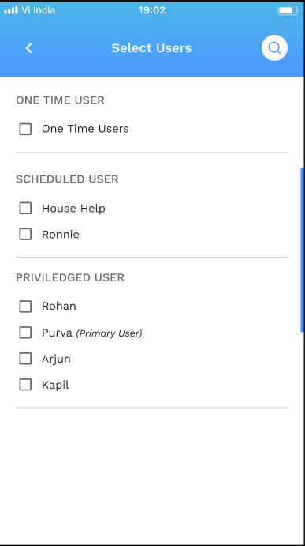</a>
<figcaption><strong>Picking who counts</strong>The same three groups as the Users screen, with the primary user marked. Ticking nobody is what leaves the alerts as they were.</figcaption>
</figure>
</div>

### While the lock is still being set up

A lock with onboarding left to finish shows a cut down menu, because most
entries would act on a lock that is not fully configured yet. The owner keeps
FAQs, Get Help, About Lock and Factory Reset, so the reset is always available
as a way out of a half finished lock. A primary or secondary user keeps FAQs,
Get Help and About Lock.

A lock counts as unfinished when it has a pending master or user passcode, a
pending critical firmware update, or a configuration status that is anything
other than fully meshed.

## The whole flow

The menu itself costs one call. Everything below it is its own flow, and each
has its own section.

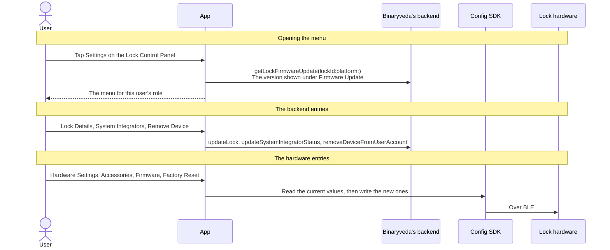
```mermaid
sequenceDiagram
    actor U as User
    participant A as App
    participant B as Binaryveda's backend
    participant C as Config SDK
    participant L as Lock hardware

    Note over U,L: Opening the menu
    U->>A: Tap Settings on the Lock Control Panel
    A->>B: getLockFirmwareUpdate(lockId:platform:)<br/>The version shown under Firmware Update
    A-->>U: The menu for this user's role

    Note over U,L: The backend entries
    U->>A: Lock Details, System Integrators, Remove Device
    A->>B: updateLock, updateSystemIntegratorStatus, removeDeviceFromUserAccount

    Note over U,L: The hardware entries
    U->>A: Hardware Settings, Accessories, Firmware, Factory Reset
    A->>C: Read the current values, then write the new ones
    C->>L: Over BLE
```

Nothing else is fetched when the menu opens. The lock's name, role, model and
serial number all arrive with the lock that
[Home](home.md) and the Control Panel already hold.

## 1. Lock Details

Renaming the lock, changing which area of the house it sits in, and changing its
photo. All three go out on one mutation, and a new photo is uploaded before it.

<div class="screens">
<figure>
<a href="images/lock-settings/06-lock-details.png">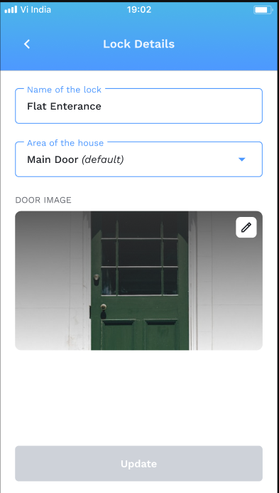</a>
<figcaption><strong>Three fields, one mutation</strong>The picker is filled by <code>listAreaOfHouse</code>, and the default area is marked as such. Update is <code>updateLock</code>, carrying all three whether or not each changed.</figcaption>
</figure>
</div>

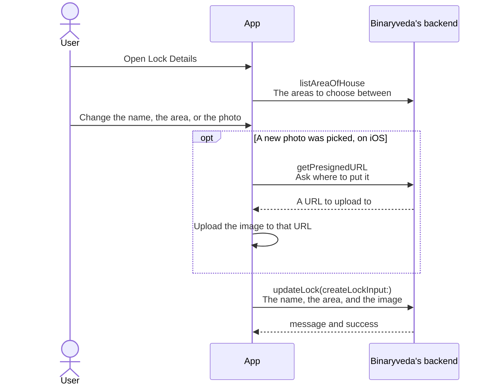
```mermaid
sequenceDiagram
    actor U as User
    participant A as App
    participant B as Binaryveda's backend

    U->>A: Open Lock Details
    A->>B: listAreaOfHouse<br/>The areas to choose between
    U->>A: Change the name, the area, or the photo
    opt A new photo was picked, on iOS
        A->>B: getPresignedURL<br/>Ask where to put it
        B-->>A: A URL to upload to
        A->>A: Upload the image to that URL
    end
    A->>B: updateLock(createLockInput:)<br/>The name, the area, and the image
    B-->>A: message and success
```

On iOS the photo goes straight to storage rather than through the backend, and
only the resulting key travels on `updateLock`. Android has no presigned URL
step and sends the image with the mutation.

## 2. My Access

Your own access methods on this lock: your passcode, your enrolled fingerprints,
and your RFID cards. Only the methods you were granted are listed, and
**enrolling** a fingerprint or a card is the same work as at the end of lock
onboarding, covered in
[Fingerprint and RFID](lock-onboarding.md#8-fingerprint-and-rfid). What belongs
to this screen is the passcode, seeing what you already have, and removing it.

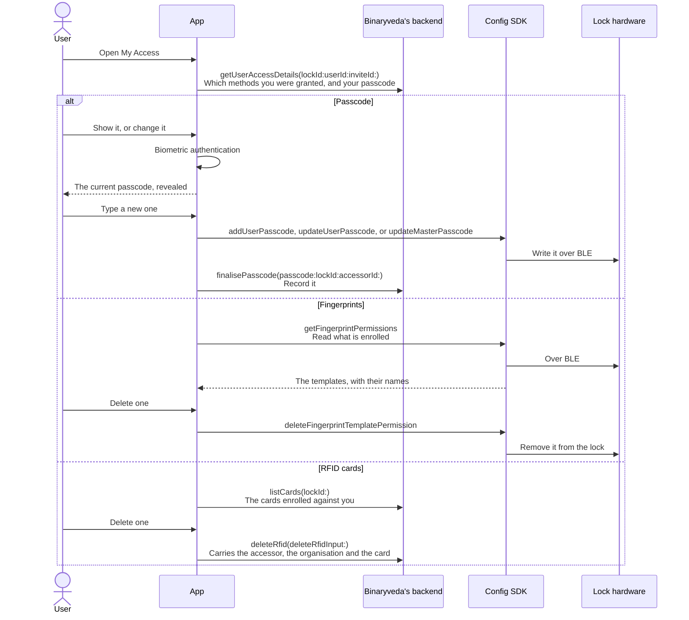
```mermaid
sequenceDiagram
    actor U as User
    participant A as App
    participant B as Binaryveda's backend
    participant C as Config SDK
    participant L as Lock hardware

    U->>A: Open My Access
    A->>B: getUserAccessDetails(lockId:userId:inviteId:)<br/>Which methods you were granted, and your passcode
    alt Passcode
        U->>A: Show it, or change it
        A->>A: Biometric authentication
        A-->>U: The current passcode, revealed
        U->>A: Type a new one
        A->>C: addUserPasscode, updateUserPasscode, or updateMasterPasscode
        C->>L: Write it over BLE
        A->>B: finalisePasscode(passcode:lockId:accessorId:)<br/>Record it
    else Fingerprints
        A->>C: getFingerprintPermissions<br/>Read what is enrolled
        C->>L: Over BLE
        C-->>A: The templates, with their names
        U->>A: Delete one
        A->>C: deleteFingerprintTemplatePermission
        C->>L: Remove it from the lock
    else RFID cards
        A->>B: listCards(lockId:)<br/>The cards enrolled against you
        U->>A: Delete one
        A->>B: deleteRfid(deleteRfidInput:)<br/>Carries the accessor, the organisation and the card
    end
```

The passcode comes back on `getUserAccessDetails`, and biometric authentication
guards both showing it and changing it. Which write member runs depends on what
is there already: `addUserPasscode` for a first one, `updateUserPasscode` to
replace it, and `updateMasterPasscode` for the owner's master passcode. Both
update members send the old value with the new.

<div class="screens">
<figure>
<a href="images/lock-settings/60-my-access.png">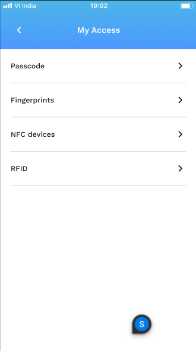</a>
<figcaption><strong>Your own methods</strong>One row per method, drawn from what <code>getUserAccessDetails</code> says you were granted. NFC is among them here, which the note at the end of this section covers.</figcaption>
</figure>
<figure>
<a href="images/lock-settings/61-passcode-empty.png">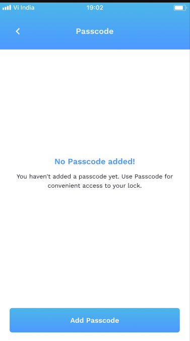</a>
<figcaption><strong>No passcode yet</strong>The state that sends the write down the <code>addUserPasscode</code> path rather than an update.</figcaption>
</figure>
<figure>
<a href="images/lock-settings/62-passcode-masked.png">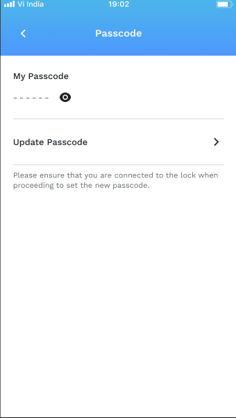</a>
<figcaption><strong>Held, but hidden</strong>The value already came back on <code>getUserAccessDetails</code>. The eye is what reveals it, and biometric authentication guards that.</figcaption>
</figure>
<figure>
<a href="images/lock-settings/63-passcode-revealed.png">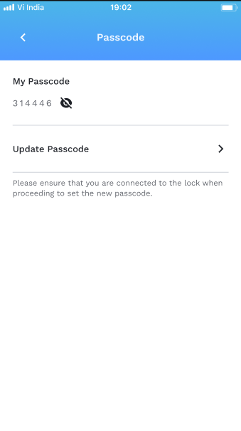</a>
<figcaption><strong>Revealed</strong>The note underneath is about the next step rather than this one: showing the passcode needs no lock, but writing a new one does.</figcaption>
</figure>
<figure>
<a href="images/lock-settings/64-update-passcode-empty.png">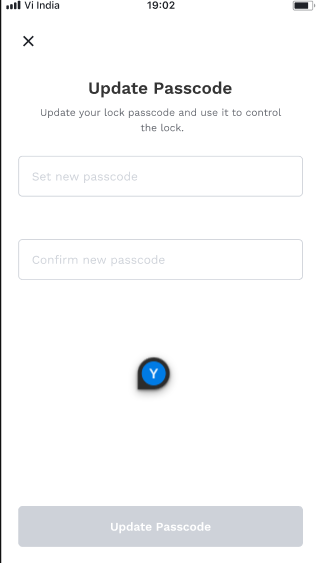</a>
<figcaption><strong>Setting a new one</strong>Typed twice, and the button stays dead until both match.</figcaption>
</figure>
<figure>
<a href="images/lock-settings/65-update-passcode-filled.png">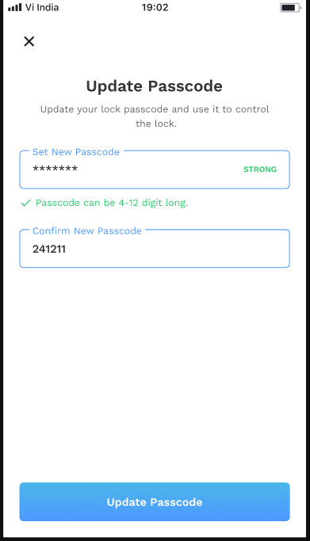</a>
<figcaption><strong>Filled in</strong>Four to twelve digits, with a strength label beside the field. Where weak becomes strong differs by platform, as <a href="user-management.md#differences-between-the-two">User Management</a> records. The write goes to the lock over BLE, then <code>finalisePasscode</code> records it.</figcaption>
</figure>
<figure>
<a href="images/lock-settings/66-fingerprints-empty.png">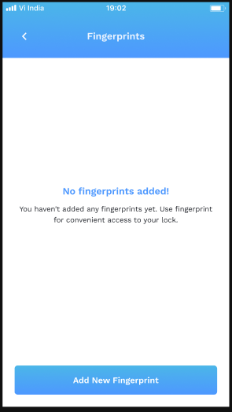</a>
<figcaption><strong>None enrolled</strong>This list is read off the lock with <code>getFingerprintPermissions</code>, so reaching even an empty one needs the phone near the lock.</figcaption>
</figure>
<figure>
<a href="images/lock-settings/67-fingerprints-three.png">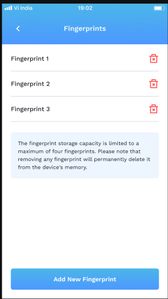</a>
<figcaption><strong>Three of four</strong>Each row is a template held in the lock, with a delete beside it. Adding another is the enrolment flow from lock onboarding.</figcaption>
</figure>
<figure>
<a href="images/lock-settings/68-fingerprints-full.png">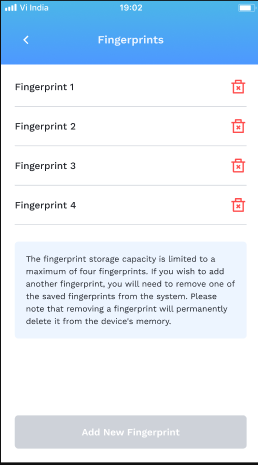</a>
<figcaption><strong>Full</strong>At four the button is dead, which matches the cap this page records. The note says one has to be removed before another can be enrolled.</figcaption>
</figure>
<figure class="crop">
<a href="images/lock-settings/69-delete-fingerprint.png">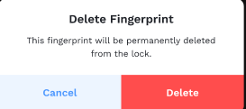</a>
<figcaption><strong>Deleting one</strong><code>deleteFingerprintTemplatePermission</code>, and the wording is exact: it goes from the lock, not from a server.</figcaption>
</figure>
<figure>
<a href="images/lock-settings/70-nfc-devices.png">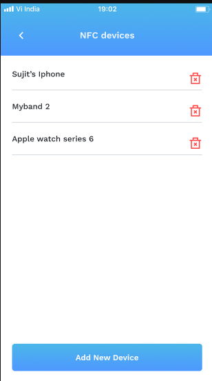</a>
<figcaption><strong>The screen that is never reached</strong>NFC has a full screen, listing the phones and wearables registered against you. The note at the end of this section is about this one: both apps build it and neither draws its row.</figcaption>
</figure>
<figure class="crop">
<a href="images/lock-settings/71-delete-nfc.png">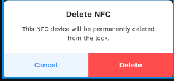</a>
<figcaption><strong>And its dialog</strong>Built alongside the screen, and unreachable for the same reason.</figcaption>
</figure>
<figure>
<a href="images/lock-settings/72-rfid-empty.png">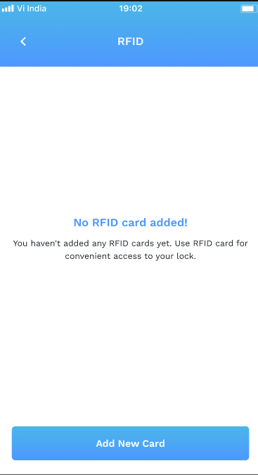</a>
<figcaption><strong>No cards</strong>The list comes from <code>listCards(lockId:)</code> at the backend rather than off the lock, so this one does not need the phone nearby.</figcaption>
</figure>
<figure>
<a href="images/lock-settings/73-rfid-one.png">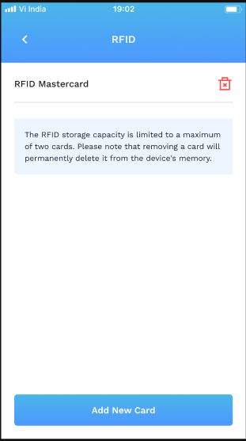</a>
<figcaption><strong>One card</strong>Named rather than numbered, since a card is enrolled with a name. Add New Card leads to the same tap and read as onboarding.</figcaption>
</figure>
<figure>
<a href="images/lock-settings/74-rfid-full.png">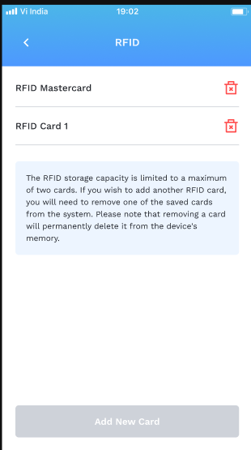</a>
<figcaption><strong>Full at two</strong>The note here puts the cap at two cards. This page records iOS capping them at one, so the two are worth checking against the build.</figcaption>
</figure>
<figure class="crop">
<a href="images/lock-settings/75-delete-rfid.png">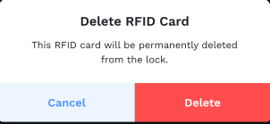</a>
<figcaption><strong>Deleting one</strong><code>deleteRfid(deleteRfidInput:)</code>, carrying the accessor, the organisation and the card. Refused while dual authentication is on for you.</figcaption>
</figure>
</div>

Cards are unassigned at the backend, so one can be deleted from anywhere.
Fingerprint templates sit in the lock, so that list needs the phone nearby and
is the only entry here that asks for Bluetooth and location permission.

Deleting anything is refused while
[dual authentication](user-management.md#6-managing-users-afterwards) is on for
you. Fingerprints are capped at four, and iOS caps cards at one.

!!! note "NFC is built but never shown"

    Both apps carry a fourth method, **NFC**, with its own name, icon and
    screen. Both also leave it out of the list that the screen draws, so it
    never appears on either platform. `getUserAccessDetails` still returns a
    `mobileNfc` flag, and both apps ignore it here.

    NFC tap is still granted on the invite and still opens the lock. It is only
    the My Access entry that is dead, which matches
    [User Management](user-management.md#5-the-other-access-methods), where NFC
    needs no enrolment and never appears on an invited user's setup list.

## 3. Hardware Settings

Everything here is stored **in the lock**, not on the backend, and the screen is
blocked when the lock is out of range.

**All four groups work the same way**, so one diagram covers them. Read the
current values out of the lock, show them, write the new ones back.

<div class="screens">
<figure>
<a href="images/lock-settings/07-hardware-menu.png">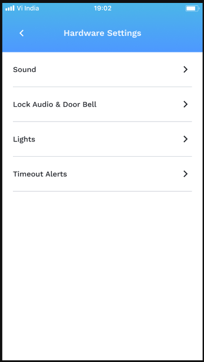</a>
<figcaption><strong>The four groups</strong>One row per group in the table below. Opening any of them is a BLE read before anything is drawn.</figcaption>
</figure>
<figure>
<a href="images/lock-settings/08-sound.png">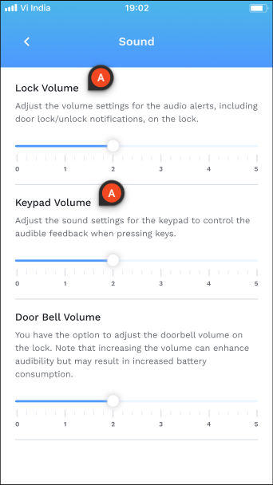</a>
<figcaption><strong>Sound</strong>Three sliders, each 0 to 5, read together with <code>readSoundSettings</code> and written with <code>updateLockSoundSettings</code>. Zero is available here, unlike the lights.</figcaption>
</figure>
<figure>
<a href="images/lock-settings/09-lights.png">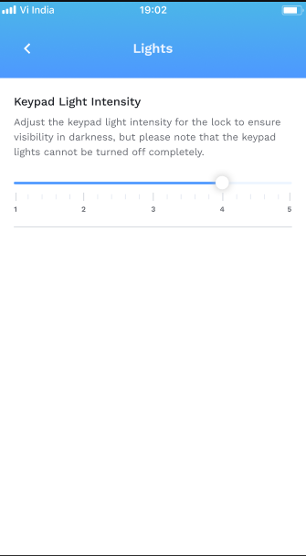</a>
<figcaption><strong>Lights</strong>One slider, and it starts at 1 rather than 0. The text says outright that the keypad lights cannot be turned off.</figcaption>
</figure>
<figure>
<a href="images/lock-settings/10-timeout-alerts.png">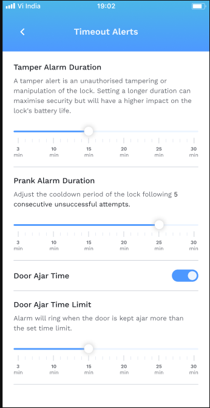</a>
<figcaption><strong>Timeout Alerts</strong>Read in one go, written in three. Tamper and prank are durations in minutes; the door ajar alarm is a toggle and a duration that go out together on <code>updateDOTLSettings</code>.</figcaption>
</figure>
<figure>
<a href="images/lock-settings/11-timeout-alerts-off.png">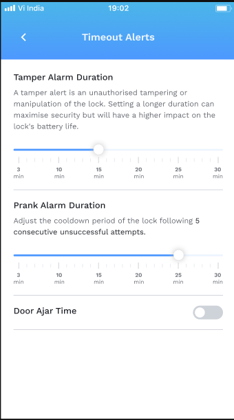</a>
<figcaption><strong>With the door ajar alarm off</strong>The limit slider is hidden, but a duration is still sent with the write, because the one member carries both.</figcaption>
</figure>
<figure>
<a href="images/lock-settings/12-hardware-restricted.png">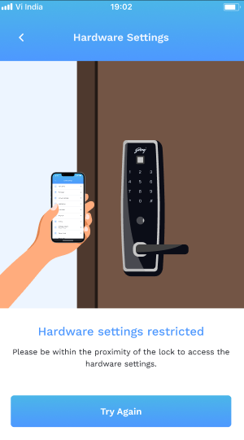</a>
<figcaption><strong>Out of range</strong>What the whole section looks like when the phone cannot reach the lock. Nothing on it is held on the backend, so there is nothing to show without a BLE read.</figcaption>
</figure>
</div>

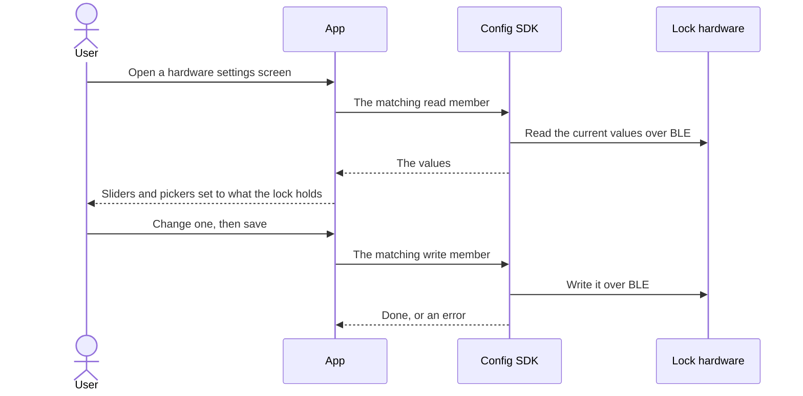
```mermaid
sequenceDiagram
    actor U as User
    participant A as App
    participant C as Config SDK
    participant L as Lock hardware

    U->>A: Open a hardware settings screen
    A->>C: The matching read member
    C->>L: Read the current values over BLE
    C-->>A: The values
    A-->>U: Sliders and pickers set to what the lock holds
    U->>A: Change one, then save
    A->>C: The matching write member
    C->>L: Write it over BLE
    C-->>A: Done, or an error
```

What changes between them is only which members run. These are the same on both
platforms.

| Group | What it holds | Read with | Written with |
|---|---|---|---|
| **Sound** | Lock volume, keypad volume and doorbell volume, each 0 to 5 | `readSoundSettings` | `updateLockSoundSettings` |
| **Lights** | Keypad light intensity, 1 to 5 | `readLEDIntensitySettings` | `updateLEDIntensitySettings` |
| **Timeout Alerts** | Tamper alarm duration, prank alarm duration, and the door ajar alarm | `readTimeoutAlertSettings` | `updateTamperAlarmSettings`, `updatePrankAlarmSettings`, `updateDOTLSettings` |
| **Lock Audio and Door Bell** | The lock's spoken language and its doorbell tone | `getCurrentLanguageAndDoorbellTone` | `updateVoicePackage`, `setDoorbellTone` |

Keypad light intensity starts at 1, so the lights cannot be turned off entirely.

Timeout Alerts reads its three values together but writes them separately, so
changing more than one runs more than one BLE write. `updateDOTLSettings` carries
both the door ajar timeout and whether the alarm is on, so turning it off still
sends a duration.

### Changing the lock's audio language

Lock Audio Language is the one setting that breaks the pattern above, because
the voice pack has to come from the backend before it can go to the lock.

<div class="screens">
<figure>
<a href="images/lock-settings/13-audio-doorbell.png">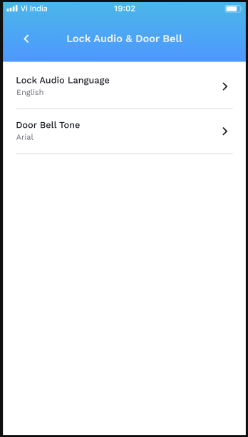</a>
<figcaption><strong>Two settings, one read</strong>Both values come off the lock together on <code>getCurrentLanguageAndDoorbellTone</code>, which is why they share a screen.</figcaption>
</figure>
<figure>
<a href="images/lock-settings/14-language-list.png">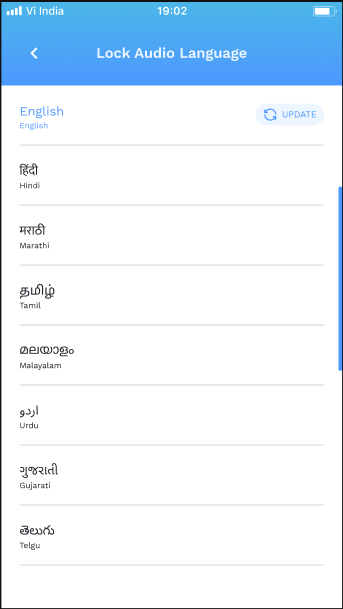</a>
<figcaption><strong>What the lock can take</strong>From <code>listAvailableLanguages</code> on iOS and <code>listLanguages</code> on Android. Each row is shown in its own script with the English name under it.</figcaption>
</figure>
<figure>
<a href="images/lock-settings/15-language-list-download.png">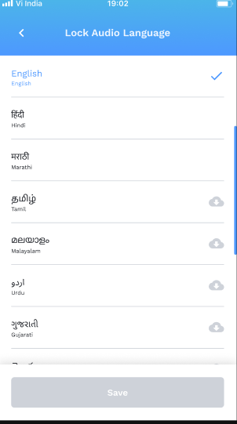</a>
<figcaption><strong>Not yet on the phone</strong>A download icon marks a pack that still has to be fetched with <code>getLanguageUpdate</code> before it can be written to the lock.</figcaption>
</figure>
<figure>
<a href="images/lock-settings/16-language-update-prompt.png">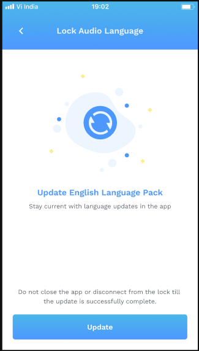</a>
<figcaption><strong>Refreshing the pack it already has</strong>The same language, a newer pack. The warning under it is there because this is a file transfer over BLE rather than a single write.</figcaption>
</figure>
<figure>
<a href="images/lock-settings/17-language-update-progress.png">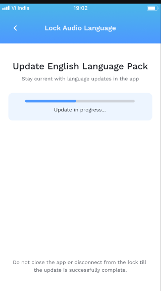</a>
<figcaption><strong>Mid transfer</strong>The bar is the SDK reporting progress back through <code>updateVoicePackage</code>: downloading, connecting, uploading, then the lock processing it.</figcaption>
</figure>
<figure>
<a href="images/lock-settings/18-language-change-prompt.png">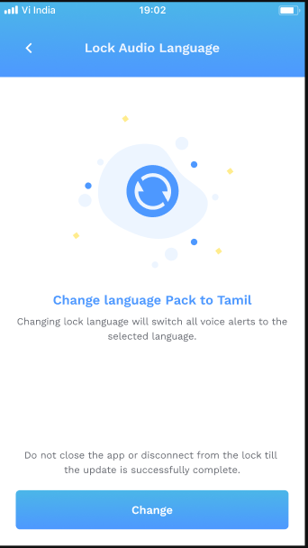</a>
<figcaption><strong>Switching to another one</strong>The wording changes but the work does not. It is the same fetch and the same transfer as an update.</figcaption>
</figure>
<figure>
<a href="images/lock-settings/19-language-change-progress.png">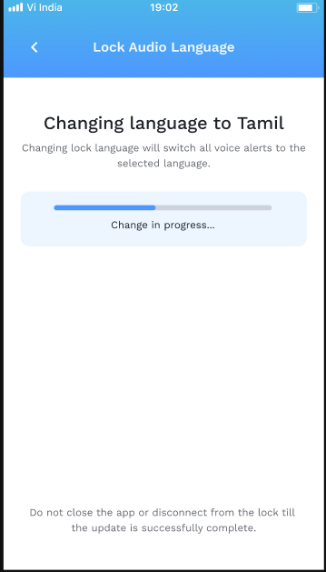</a>
<figcaption><strong>And its progress</strong>These are the lock's spoken prompts, not the app's own language, so nothing in the interface changes when it finishes.</figcaption>
</figure>
<figure>
<a href="images/lock-settings/20-doorbell-tones.png">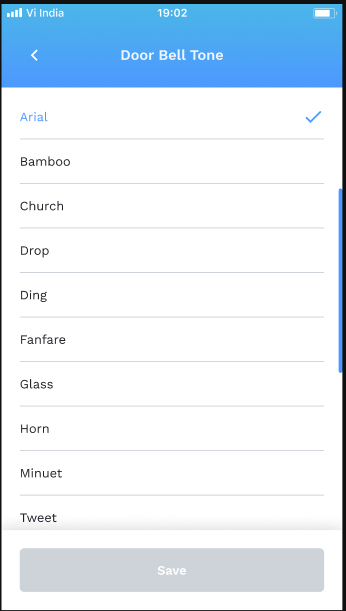</a>
<figcaption><strong>The doorbell tones</strong>Read with the language and written on its own with <code>setDoorbellTone</code>. Save stays greyed until a different row is picked.</figcaption>
</figure>
<figure>
<a href="images/lock-settings/21-doorbell-change-progress.png">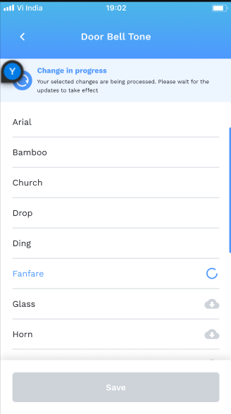</a>
<figcaption><strong>A tone being written</strong>The banner sits over the list while the write runs, and the row being applied carries the spinner. Tones can be downloaded the same way a language pack is.</figcaption>
</figure>
</div>

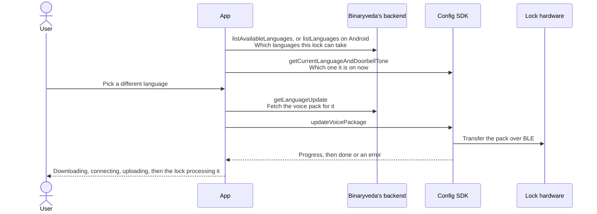
```mermaid
sequenceDiagram
    actor U as User
    participant A as App
    participant B as Binaryveda's backend
    participant C as Config SDK
    participant L as Lock hardware

    A->>B: listAvailableLanguages, or listLanguages on Android<br/>Which languages this lock can take
    A->>C: getCurrentLanguageAndDoorbellTone<br/>Which one it is on now
    U->>A: Pick a different language
    A->>B: getLanguageUpdate<br/>Fetch the voice pack for it
    A->>C: updateVoicePackage
    C->>L: Transfer the pack over BLE
    C-->>A: Progress, then done or an error
    A-->>U: Downloading, connecting, uploading, then the lock processing it
```

This is the lock's spoken prompts, not the app's own language. The transfer runs
in stages and reports progress back, because it moves a file rather than a
handful of bytes.

**The two platforms ask for the language list with different queries.** iOS
sends `listAvailableLanguages`; Android's screen sends `listLanguages`.

## 4. Accessories

Owner only. Two devices sit behind it:

- **BLE Remote**, a key fob that opens the lock.
- **VDP Module**, which connects a video door phone panel to the lock. The app
  only provisions it. Video and intercom stay in that hardware.

The Config SDK treats both as beacons, so every call below is the same for
either one. Only the backend field names differ.

<div class="screens">
<figure>
<a href="images/lock-settings/22-accessories.png">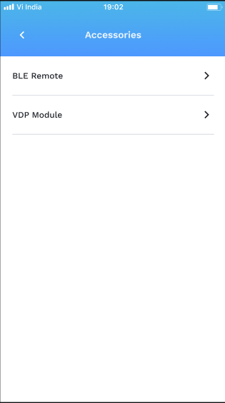</a>
<figcaption><strong>The two of them</strong>Nothing else lives under Accessories. The screens behind these two rows are identical apart from the wording and the picture.</figcaption>
</figure>
</div>

### Attaching one

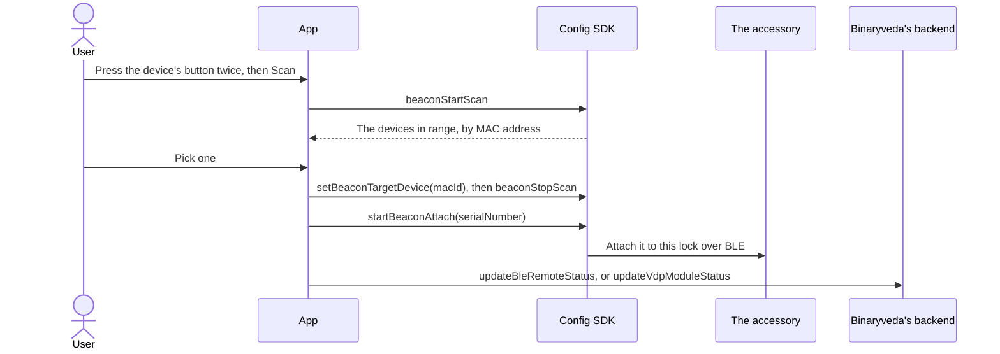
```mermaid
sequenceDiagram
    actor U as User
    participant A as App
    participant C as Config SDK
    participant D as The accessory
    participant B as Binaryveda's backend

    U->>A: Press the device's button twice, then Scan
    A->>C: beaconStartScan
    C-->>A: The devices in range, by MAC address
    U->>A: Pick one
    A->>C: setBeaconTargetDevice(macId), then beaconStopScan
    A->>C: startBeaconAttach(serialNumber)
    C->>D: Attach it to this lock over BLE
    A->>B: updateBleRemoteStatus, or updateVdpModuleStatus
```

<div class="screens">
<figure>
<a href="images/lock-settings/23-ble-empty.png">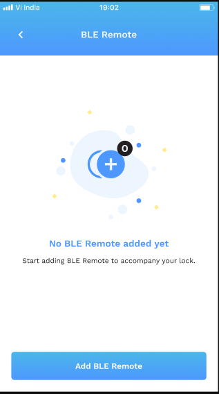</a>
<figcaption><strong>Nothing attached yet</strong><code>listBleRemotes</code> having come back empty. The counterpart for the other accessory is <code>listVdpModules</code>.</figcaption>
</figure>
<figure>
<a href="images/lock-settings/24-ble-scan-intro.png">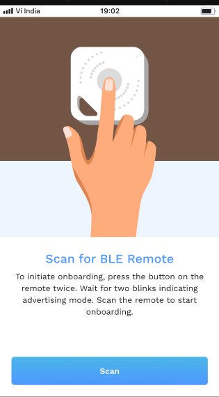</a>
<figcaption><strong>Press it twice first</strong>The accessory has to be advertising before the SDK can see it, and two blinks are how the user knows it is. Scan is <code>beaconStartScan</code>.</figcaption>
</figure>
<figure class="crop">
<a href="images/lock-settings/25-leave-setup.png">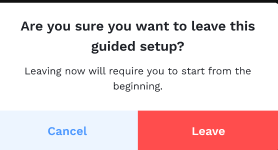</a>
<figcaption><strong>Backing out</strong>Shown on the way out of either accessory's setup. There is no half finished state to return to, so leaving means starting again.</figcaption>
</figure>
<figure>
<a href="images/lock-settings/26-ble-scanning.png">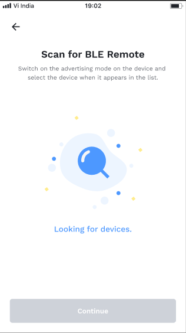</a>
<figcaption><strong>Scanning</strong>The SDK reports what is in range by MAC address. Continue is greyed because nothing has been picked.</figcaption>
</figure>
<figure>
<a href="images/lock-settings/27-ble-none-found.png">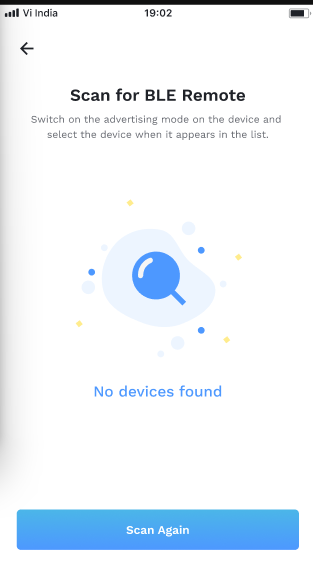</a>
<figcaption><strong>Nothing in range</strong>Usually the advertising window having closed rather than the remote being absent, which is why the way out is to scan again.</figcaption>
</figure>
<figure>
<a href="images/lock-settings/28-ble-found.png">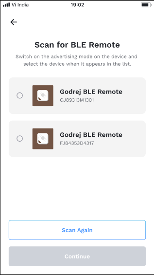</a>
<figcaption><strong>What came back</strong>One row per device the SDK saw. The name and picture are the app's; only an identifier came off the air.</figcaption>
</figure>
<figure>
<a href="images/lock-settings/29-ble-selected.png">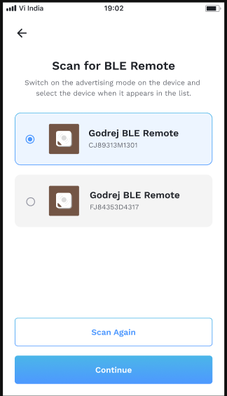</a>
<figcaption><strong>One picked</strong>Choosing a row is <code>setBeaconTargetDevice(macId)</code> followed by <code>beaconStopScan</code>. Continue starts the attach.</figcaption>
</figure>
<figure>
<a href="images/lock-settings/30-ble-onboarding.png">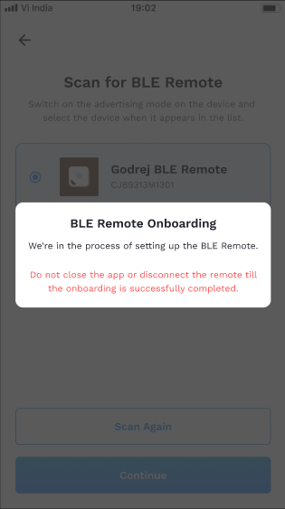</a>
<figcaption><strong>Attaching</strong><code>startBeaconAttach</code> running against the lock, with <code>updateBleRemoteStatus</code> after it. The warning is because both halves have to land.</figcaption>
</figure>
</div>

### Once it is attached

`listBleRemotes` and `listVdpModules` say what this lock has. An accessory has
no name, only a MAC address, so its settings screen holds two entries:

- **Firmware Update**, which is `getListOfFirmwareForBeacon` and then
  `firmwareUpdateToSelectedVersion`. The firmware transfers from the phone over
  BLE. Android asks the backend what is available first, with
  `getBLERemoteFirmwareUpdate` or `getVDPModuleFirmwareUpdate` depending on the
  accessory. iOS takes the list from the SDK alone.
- **Factory Reset**, which is biometric authentication, then `resetBeacon`, then
  `removeBleRemote` or `removeVdpModule`.

<div class="screens">
<figure>
<a href="images/lock-settings/31-ble-list.png">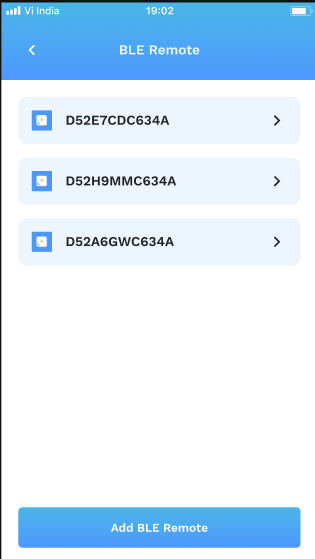</a>
<figcaption><strong>What this lock has</strong><code>listBleRemotes</code>. A remote has no name, so the MAC address is the row, and more than one can be attached to a lock.</figcaption>
</figure>
<figure>
<a href="images/lock-settings/32-accessory-settings.png">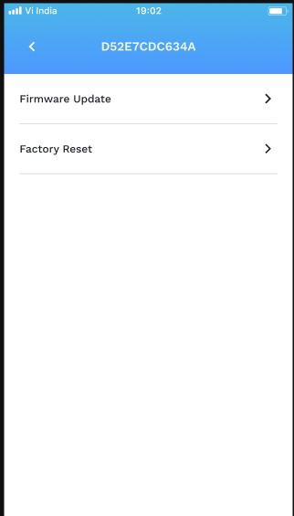</a>
<figcaption><strong>Two entries, and the title is the address</strong>Everything an accessory can be told to do. Firmware Update transfers from the phone over BLE, the same as the lock's own.</figcaption>
</figure>
<figure>
<a href="images/lock-settings/33-ble-factory-reset.png">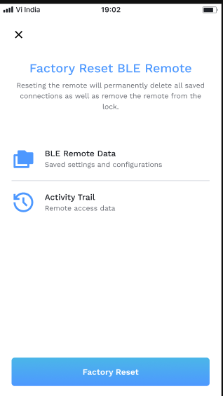</a>
<figcaption><strong>What the reset takes with it</strong>The saved settings and the remote's own activity trail. Resetting also takes the remote off the lock, not just off the app.</figcaption>
</figure>
<figure>
<a href="images/lock-settings/34-accessory-biometric.png">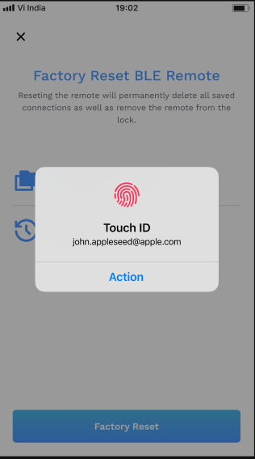</a>
<figcaption><strong>Biometric first</strong>The same guard the lock's own factory reset uses. Nothing is sent to the accessory until it passes.</figcaption>
</figure>
<figure>
<a href="images/lock-settings/35-ble-prepare-reset.png">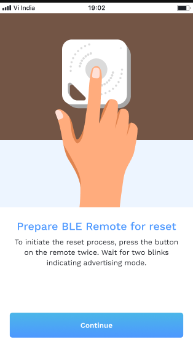</a>
<figcaption><strong>Advertising again</strong>The same two presses as the attach. The SDK has to reach the accessory over BLE to wipe it, so it has to be listening.</figcaption>
</figure>
<figure>
<a href="images/lock-settings/36-ble-reset-progress.png">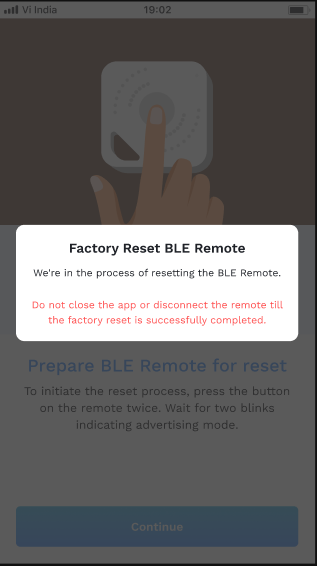</a>
<figcaption><strong>Resetting</strong><code>resetBeacon</code> over BLE, then <code>removeBleRemote</code> at the backend.</figcaption>
</figure>
<figure>
<a href="images/lock-settings/37-ble-reset-done.png">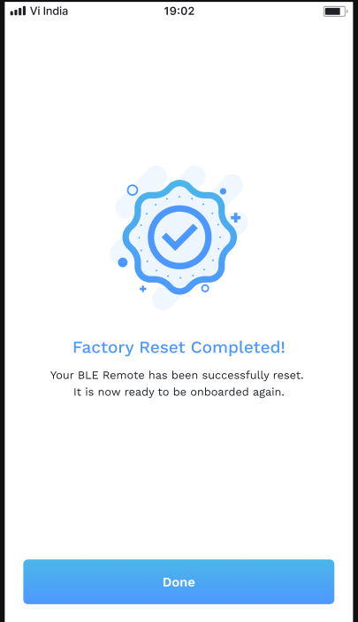</a>
<figcaption><strong>Done</strong>The remote is now unattached rather than gone, so it can be added to this lock or another one.</figcaption>
</figure>
<figure>
<a href="images/lock-settings/38-vdp-empty.png">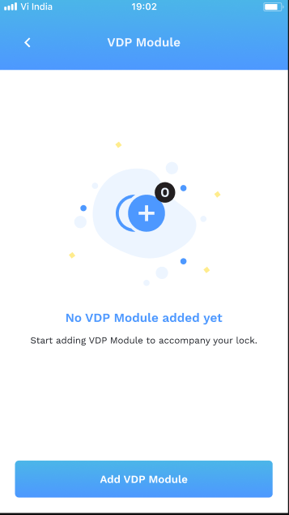</a>
<figcaption><strong>The other accessory, from the top</strong>The VDP module's flow from here on is the remote's flow with different wording. It is shown in full below because the two are separate screens in the app.</figcaption>
</figure>
<figure>
<a href="images/lock-settings/39-vdp-scan-intro.png">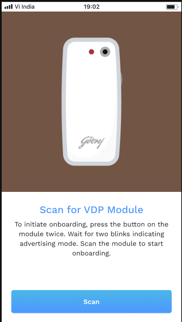</a>
<figcaption><strong>Press it twice</strong>Same instruction, different hardware. The app only provisions the module; video and intercom stay in that hardware.</figcaption>
</figure>
<figure>
<a href="images/lock-settings/40-vdp-scanning.png">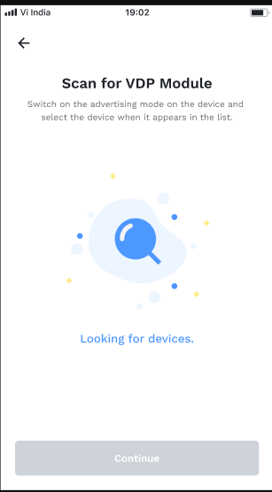</a>
<figcaption><strong>Scanning</strong><code>beaconStartScan</code> again. The SDK does not distinguish the two accessories, so this is the same call.</figcaption>
</figure>
<figure>
<a href="images/lock-settings/41-vdp-none-found.png">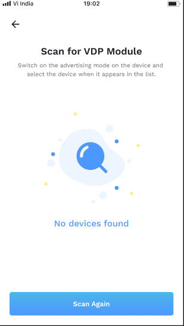</a>
<figcaption><strong>Nothing in range</strong>And the same way out, another scan.</figcaption>
</figure>
<figure>
<a href="images/lock-settings/42-vdp-found.png">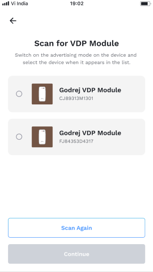</a>
<figcaption><strong>What came back</strong>Two modules advertising, listed by identifier as the remotes were.</figcaption>
</figure>
<figure>
<a href="images/lock-settings/43-vdp-selected.png">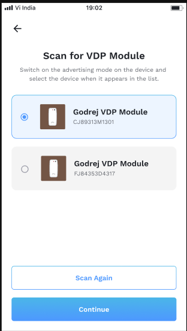</a>
<figcaption><strong>One picked</strong><code>setBeaconTargetDevice</code>, then the attach.</figcaption>
</figure>
<figure>
<a href="images/lock-settings/44-vdp-onboarding.png">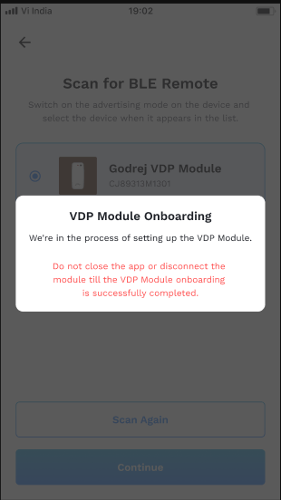</a>
<figcaption><strong>Attaching</strong>Ends at <code>updateVdpModuleStatus</code> rather than <code>updateBleRemoteStatus</code>. That backend field is the only difference in the whole flow. The heading behind the dialog still reads Scan for BLE Remote, which is the design's own slip rather than the wrong screen.</figcaption>
</figure>
<figure>
<a href="images/lock-settings/45-vdp-list.png">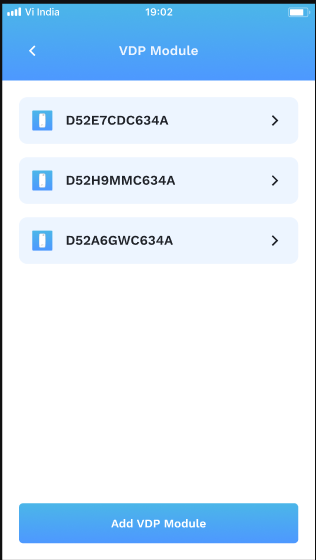</a>
<figcaption><strong>What this lock has</strong><code>listVdpModules</code>, the counterpart of the remote's list.</figcaption>
</figure>
<figure>
<a href="images/lock-settings/46-vdp-settings.png">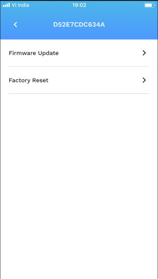</a>
<figcaption><strong>The same two entries</strong>Android asks the backend what firmware is available first, with <code>getVDPModuleFirmwareUpdate</code> here and <code>getBLERemoteFirmwareUpdate</code> for a remote. iOS takes the list from the SDK alone.</figcaption>
</figure>
<figure>
<a href="images/lock-settings/47-vdp-factory-reset.png">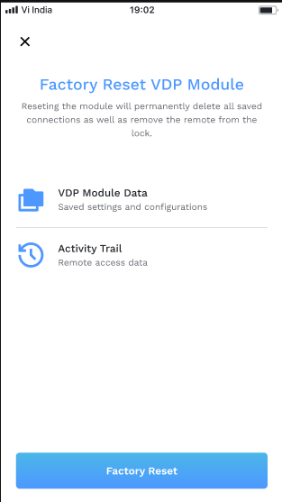</a>
<figcaption><strong>What the reset takes</strong>The module's saved settings and its activity trail, as with the remote.</figcaption>
</figure>
<figure>
<a href="images/lock-settings/48-vdp-biometric.png">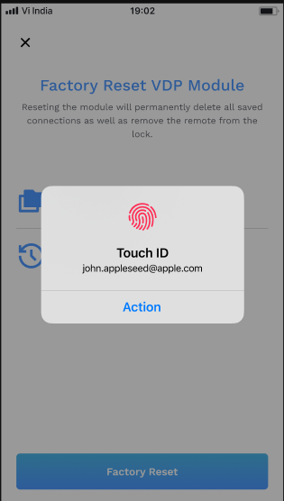</a>
<figcaption><strong>Biometric first</strong>The same guard, on the same step.</figcaption>
</figure>
<figure>
<a href="images/lock-settings/49-vdp-prepare-reset.png">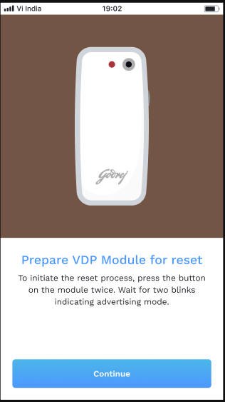</a>
<figcaption><strong>Advertising again</strong>Two presses, then Continue, so the SDK can reach it.</figcaption>
</figure>
<figure>
<a href="images/lock-settings/50-vdp-reset-progress.png">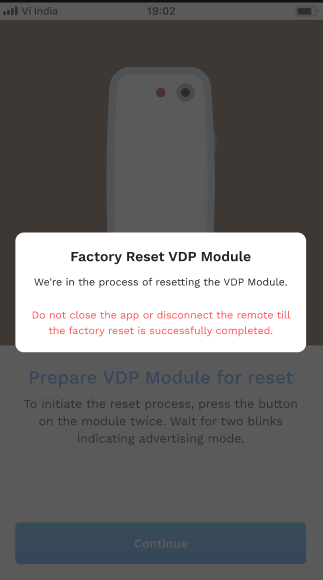</a>
<figcaption><strong>Resetting</strong><code>resetBeacon</code>, then <code>removeVdpModule</code>.</figcaption>
</figure>
<figure>
<a href="images/lock-settings/51-vdp-reset-done.png">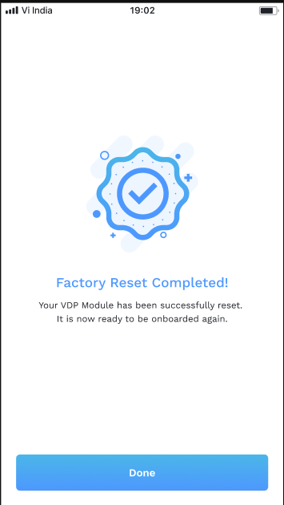</a>
<figcaption><strong>Done</strong>Unattached and ready to be onboarded again, the same end the remote reaches.</figcaption>
</figure>
</div>

## 5. Firmware Update

The lock's own firmware. The backend says what is available, the Config SDK
lists what the lock will accept, and the transfer runs over BLE.

<div class="screens">
<figure>
<a href="images/lock-settings/76-firmware-current.png">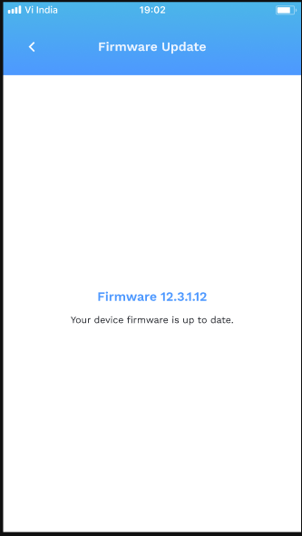</a>
<figcaption><strong>Nothing to do</strong>What the screen shows when <code>getLockFirmwareUpdate</code> comes back with no newer version. The number is the same one the menu row carries.</figcaption>
</figure>
<figure>
<a href="images/lock-settings/77-firmware-available.png">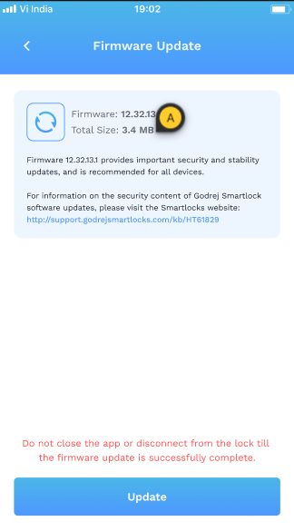</a>
<figcaption><strong>One available</strong>The version, the size and the release notes all come back on the same query. The size is there because this transfers from the phone to the lock over BLE.</figcaption>
</figure>
<figure>
<a href="images/lock-settings/78-firmware-progress.png">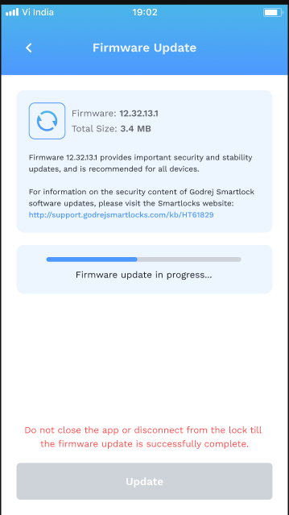</a>
<figcaption><strong>Transferring</strong><code>firmwareUpdateToSelectedVersion</code> reporting progress. <code>updateLockFirmwareStatus</code> records it at the backend once it lands, and the red warning is why: the app has to stay connected for the whole transfer.</figcaption>
</figure>
</div>

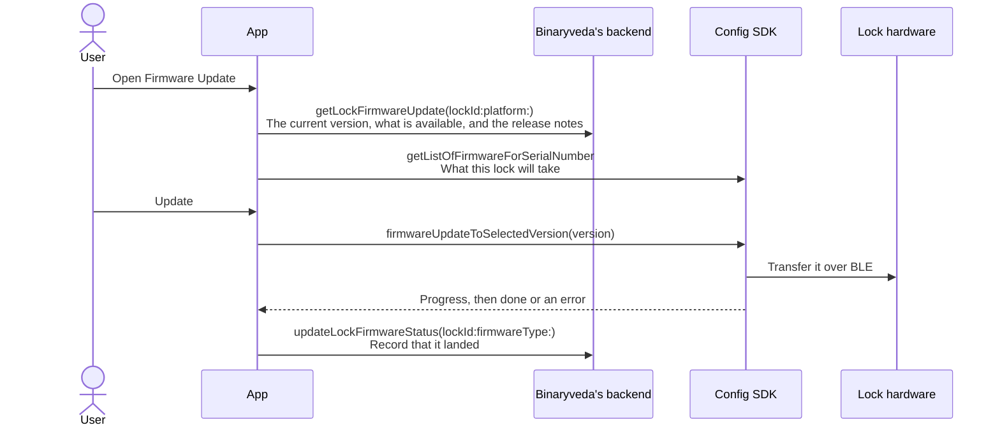
```mermaid
sequenceDiagram
    actor U as User
    participant A as App
    participant B as Binaryveda's backend
    participant C as Config SDK
    participant L as Lock hardware

    U->>A: Open Firmware Update
    A->>B: getLockFirmwareUpdate(lockId:platform:)<br/>The current version, what is available, and the release notes
    A->>C: getListOfFirmwareForSerialNumber<br/>What this lock will take
    U->>A: Update
    A->>C: firmwareUpdateToSelectedVersion(version)
    C->>L: Transfer it over BLE
    C-->>A: Progress, then done or an error
    A->>B: updateLockFirmwareStatus(lockId:firmwareType:)<br/>Record that it landed
```

`getLockFirmwareUpdate` is also called when the menu opens, to put the version
under the Firmware Update row.

An update marked **critical** holds the lock in the unfinished state described
above until it is applied.

## 6. System Integrators

Third party services that have been given access to the lock. **They are not
invited from this app.** Linking starts in the integrator's own application, and
this screen only switches an already linked integrator on or off for one lock.

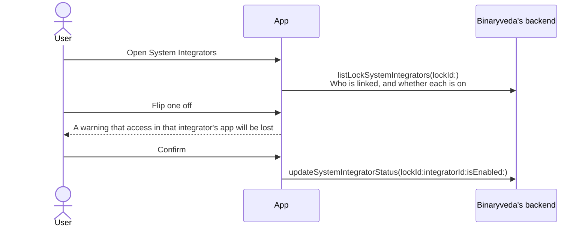
```mermaid
sequenceDiagram
    actor U as User
    participant A as App
    participant B as Binaryveda's backend

    U->>A: Open System Integrators
    A->>B: listLockSystemIntegrators(lockId:)<br/>Who is linked, and whether each is on
    U->>A: Flip one off
    A-->>U: A warning that access in that integrator's app will be lost
    U->>A: Confirm
    A->>B: updateSystemIntegratorStatus(lockId:integratorId:isEnabled:)
```

The switch is per lock, so turning an integrator off here leaves it on for every
other lock it was linked to.

<div class="screens">
<figure>
<a href="images/lock-settings/52-system-integrators.png">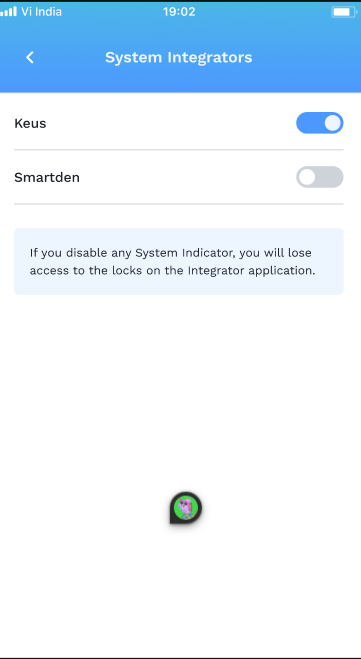</a>
<figcaption><strong>Switches, not invitations</strong><code>listLockSystemIntegrators(lockId:)</code> fills the rows and each switch is one <code>updateSystemIntegratorStatus</code>. The note is the warning shown before an integrator is turned off.</figcaption>
</figure>
</div>

## 7. Voice Assistants

Alexa and Google Home, switched on or off for this lock. Linking the account
itself happens under Profile rather than here, and this screen only decides
whether an already linked assistant may act on this lock. It goes out on
`updateVoiceAssistancePreferences`.

Voice commands can read whether a lock is locked or unlocked, read its mode, and
unlock it. There is no command to lock.

<div class="screens">
<figure>
<a href="images/lock-settings/53-voice-none.png">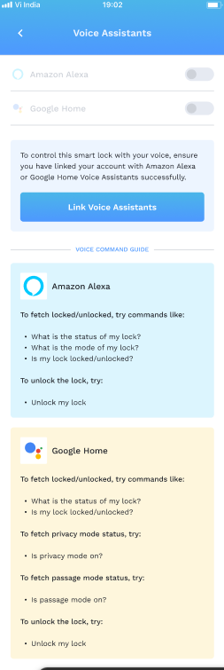</a>
<figcaption><strong>Neither linked</strong>Both switches are dead until the account itself is linked under <a href="profile-and-account.md#5-voice-assistants">Profile</a>, which is what the button leads to. The guide below lists the commands each assistant understands.</figcaption>
</figure>
<figure>
<a href="images/lock-settings/54-voice-alexa-available.png">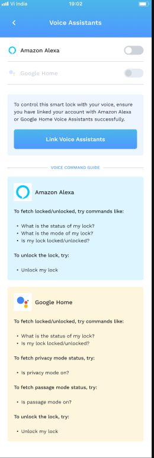</a>
<figcaption><strong>Linked, not enabled</strong>Alexa is linked to the account and its switch is live, but this lock is not one it may act on yet. The two states are separate on purpose.</figcaption>
</figure>
<figure>
<a href="images/lock-settings/55-voice-alexa-on.png">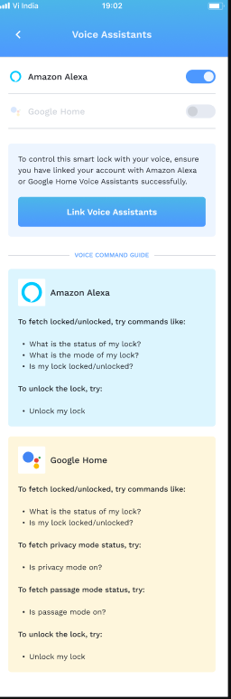</a>
<figcaption><strong>Enabled for this lock</strong>The switch is <code>updateVoiceAssistancePreferences</code>. It applies to this lock alone, so a second lock has to be enabled on its own screen.</figcaption>
</figure>
<figure>
<a href="images/lock-settings/56-voice-both-on.png">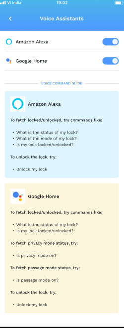</a>
<figcaption><strong>Both on</strong>The guide notes what each can do. Google's list includes privacy and passage mode, and neither assistant has a command to lock.</figcaption>
</figure>
</div>

## 8. Factory Reset and Remove Device

Two different actions that both end with the lock gone from the app.

**Factory Reset is the owner's**, needs the phone near the lock, and needs
biometric authentication. It wipes the lock over BLE and then tells the backend
to take it apart, which is what removes it from every other user's app too.

<div class="screens">
<figure>
<a href="images/lock-settings/79-factory-reset.png">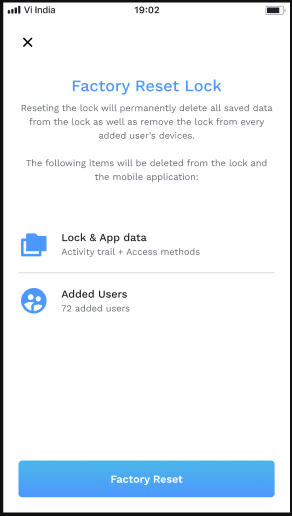</a>
<figcaption><strong>What it takes with it</strong>The warning the diagram below refers to, itemised: the activity trail, the access methods, and every added user. The count makes the scale of it plain before anything runs.</figcaption>
</figure>
<figure>
<a href="images/lock-settings/80-factory-reset-biometric.png">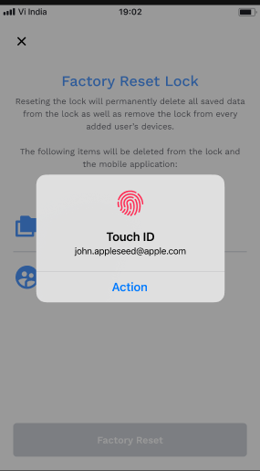</a>
<figcaption><strong>Biometric next</strong>Nothing reaches the lock until this passes. It is the same guard the accessories use for their own reset.</figcaption>
</figure>
<figure>
<a href="images/lock-settings/81-factory-reset-master-passcode.png">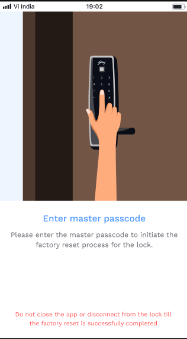</a>
<figcaption><strong>And the master passcode, on the lock</strong>Typed on the keypad rather than in the app. The phone can start the reset, but only someone at the door with the master passcode can authorise it.</figcaption>
</figure>
<figure>
<a href="images/lock-settings/82-factory-reset-keypad.png">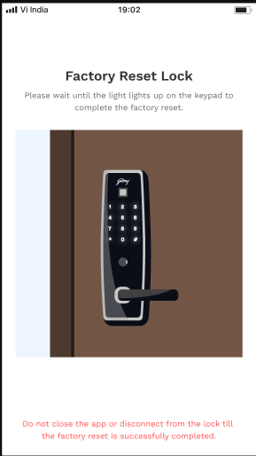</a>
<figcaption><strong>Waiting on the hardware</strong>The lock signals with its own keypad light. This step is the app watching the lock rather than doing anything.</figcaption>
</figure>
<figure>
<a href="images/lock-settings/83-factory-reset-progress.png">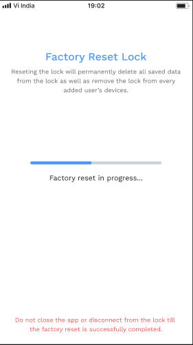</a>
<figcaption><strong>Wiping</strong><code>resetDevice</code> over BLE. The two backend calls that follow are what take the lock off everyone else's account.</figcaption>
</figure>
<figure>
<a href="images/lock-settings/84-factory-reset-done.png">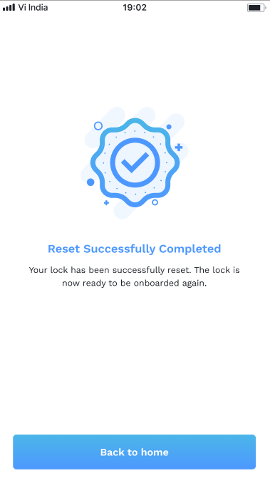</a>
<figcaption><strong>Done</strong>The lock is blank rather than gone, so it can be onboarded again from scratch, by this account or another one.</figcaption>
</figure>
</div>

<div class="screens">
<figure>
<a href="images/lock-settings/57-remove-device.png">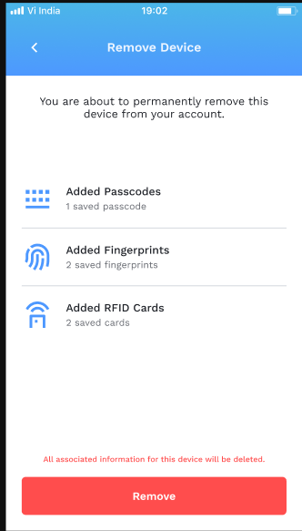</a>
<figcaption><strong>What goes with it</strong>The counts are the user's own methods on this lock. The line in red is the warning the diagram below refers to.</figcaption>
</figure>
<figure>
<a href="images/lock-settings/58-remove-device-progress.png">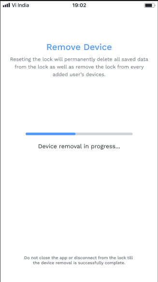</a>
<figcaption><strong>In progress</strong>The body text here describes wiping the lock and clearing it from every user, which is the factory reset's job rather than this one. Worth checking against the build.</figcaption>
</figure>
</div>

**Remove Device is everyone else's**, needs nothing but a confirmation, and
touches neither the lock nor anyone else's account.

=== "Factory Reset"

    ```mermaid
    sequenceDiagram
        actor U as User
        participant A as App
        participant C as Config SDK
        participant L as Lock hardware
        participant B as Binaryveda's backend
        participant S as Spintly's servers

        U->>A: Factory Reset, then confirm
        A-->>U: A warning covering the activity trail, the access methods and every added user
        U->>A: Pass biometric authentication
        A->>C: resetDevice
        C->>L: Wipe the lock over BLE
        C-->>A: Done, or an error
        A->>B: updateLockConfigurationStatus(lockId:lockConfigurationStatus:)<br/>Mark the reset as under way
        A->>B: removeLock(lockSerialNumber:)
        B->>S: DELETE /infrastructureManagement/internal/v1/<br/>accessPoints/{accessPointId}<br/>Take the lock's access point away
        A-->>U: Back to Home, with the lock gone
    ```

    **The configuration status is written before the removal.** If the BLE wipe
    succeeds and the removal does not, the lock is left in a reset pending state
    rather than looking untouched, and the reduced menu offers the reset again.

=== "Remove Device"

    ```mermaid
    sequenceDiagram
        actor U as User
        participant A as App
        participant B as Binaryveda's backend
        participant S as Spintly's servers

        U->>A: Remove Device, then confirm
        A-->>U: A warning that saved passcodes and fingerprints go with it
        A->>B: removeDeviceFromUserAccount(lockId:)
        B->>S: PATCH /permissionManagementV3/v1/organisations/{orgId}/<br/>accessors/{accessorId}/permissions<br/>The access point goes in permissionsToRemove
        Note right of S: One call only. The accessor itself is left alone,<br/>so the user keeps their access to every other lock
        A-->>U: Back to Home
    ```

    **No SDK member runs and the lock is never contacted**, so this works from
    anywhere. The lock keeps working for everyone else.

    **This is not the same as an owner removing someone**, which is
    [removeUser in User Management](user-management.md#what-changing-a-user-does-at-spintly)
    and can take the accessor out of the organisation. Leaving a lock yourself
    never does.

Both Spintly paths above are the same ones
[User Management](user-management.md#what-changing-a-user-does-at-spintly) uses
when an owner removes somebody else. The difference is only who asked.

## 9. About Lock, FAQs, Manual and Get Help

The four read only entries.

| Entry | Where its content comes from |
|---|---|
| **About Lock** | The lock the app already holds, for the device name, model name and number, and serial number. The fingerprint count is read from the lock with `getFingerprintPermissions`, so no backend call is made |
| **FAQs** | `getFaqs` |
| **Manual** | `getProductManualLink`, keyed on the lock's model id, opened in a web view |
| **Get Help** | `createSupportTicket`, then `listSupportTickets` and `viewSupportTicket` on iOS |

<div class="screens">
<figure>
<a href="images/lock-settings/59-about-device.png">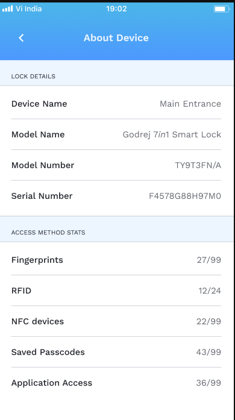</a>
<figcaption><strong>About Lock</strong>The four details at the top are already held by the app. The stats below are what the lock has room for, each as a count against its maximum, and the fingerprint figure is read off the lock with <code>getFingerprintPermissions</code>.</figcaption>
</figure>
</div>

## The Wi-Fi Gateway

**The gateway is not a Lock Settings entry.** It is a device of its own, added
during onboarding and managed from its own card on [Home](home.md). It is
covered here because it is the third piece of hardware the Config SDK writes to,
and because its firmware works differently from everything else on this page.

The gateway bridges the lock to the internet. It is what makes a lock report
Online or Offline, what carries push notifications while the user is away, and
what the remote unlock falls back to when Bluetooth is out of range.

<div class="screens">
<figure>
<a href="images/lock-settings/85-gateway-card.png">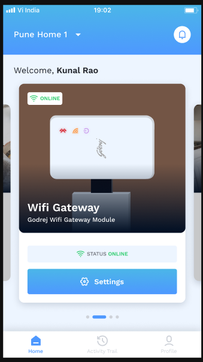</a>
<figcaption><strong>Its own card on Home</strong>The gateway sits in the same carousel as the locks, with a status line and one button. Everything below is reached from that Settings button, not from a lock.</figcaption>
</figure>
</div>

### Adding one, and changing its network

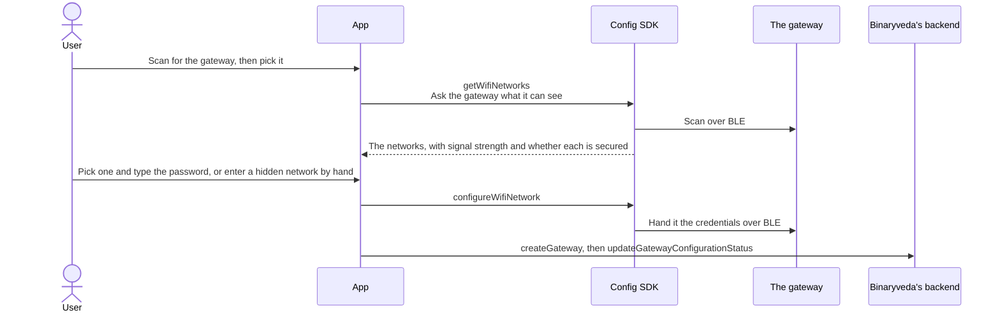
```mermaid
sequenceDiagram
    actor U as User
    participant A as App
    participant C as Config SDK
    participant G as The gateway
    participant B as Binaryveda's backend

    U->>A: Scan for the gateway, then pick it
    A->>C: getWifiNetworks<br/>Ask the gateway what it can see
    C->>G: Scan over BLE
    C-->>A: The networks, with signal strength and whether each is secured
    U->>A: Pick one and type the password, or enter a hidden network by hand
    A->>C: configureWifiNetwork
    C->>G: Hand it the credentials over BLE
    A->>B: createGateway, then updateGatewayConfigurationStatus
```

**The gateway does the scanning, not the phone.** The network list is whatever
the gateway can reach from where it is plugged in, which is the point.

A hidden network is typed in by hand, with its security type picked from a list.
Failures come back as the access point not being found, or the password being
wrong.

<div class="screens">
<figure>
<a href="images/lock-settings/86-gateway-wifi-networks.png">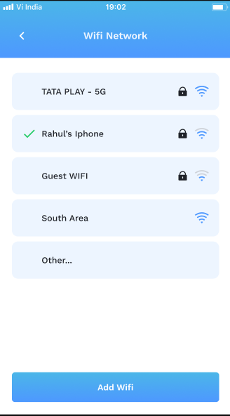</a>
<figcaption><strong>What the gateway can see</strong>The list came back from <code>getWifiNetworks</code>, so it is the gateway's view from where it is plugged in rather than the phone's. The padlock is whether a network is secured, the bars are its signal, and the tick is the one it is on. <strong>Other</strong> is the hidden network typed in by hand.</figcaption>
</figure>
</div>

### Gateway settings

Six entries, from the gateway's card on Home: **Edit Module Name**,
**Connections**, **Wi-Fi Network**, **About**, **Firmware Update** and
**Factory Reset**. The last two are owner only.

Opening the settings reads the gateway itself with `getGateway`, which is what
About is drawn from. Connections lists the locks this gateway serves, from
`listConnections`. Renaming goes out on `updateGateway`.

<div class="screens">
<figure>
<a href="images/lock-settings/87-gateway-settings.png">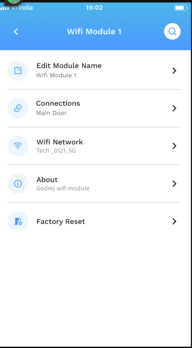</a>
<figcaption><strong>The gateway's own menu</strong>Each row carries its current value underneath, all of it from the one <code>getGateway</code> read. Firmware Update is absent here, which is the owner only pair reduced to one for this user.</figcaption>
</figure>
<figure>
<a href="images/lock-settings/88-gateway-edit-name.png">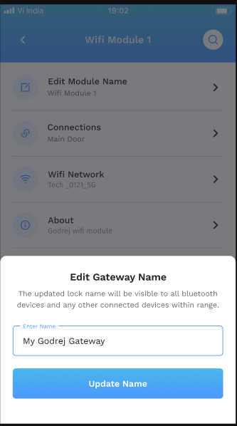</a>
<figcaption><strong>Renaming it</strong><code>updateGateway</code>. The note warns that the name is what other Bluetooth devices in range will see, so it is not only a label in the app.</figcaption>
</figure>
<figure>
<a href="images/lock-settings/89-gateway-about.png">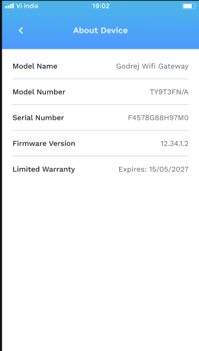</a>
<figcaption><strong>About</strong>Drawn from the same <code>getGateway</code>. It carries a warranty expiry, which the lock's own About screen does not.</figcaption>
</figure>
<figure>
<a href="images/lock-settings/90-gateway-connections-locks.png">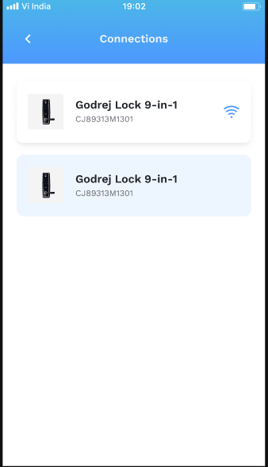</a>
<figcaption><strong>Connections</strong><code>listConnections</code>, the locks this gateway carries. One gateway can serve several, which is why this is a list rather than a line on the menu.</figcaption>
</figure>
<figure>
<a href="images/lock-settings/91-connections-gateway.png">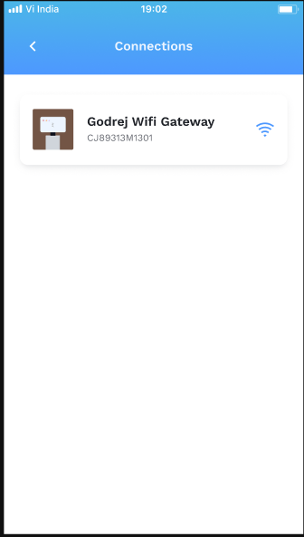</a>
<figcaption><strong>The same screen holding a gateway</strong>A Connections list with a gateway in it rather than locks, which is the pairing seen from the lock's side. Worth confirming where this one is reached from, since Connections is documented above as the gateway's own entry.</figcaption>
</figure>
<figure>
<a href="images/lock-settings/92-gateway-factory-reset.png">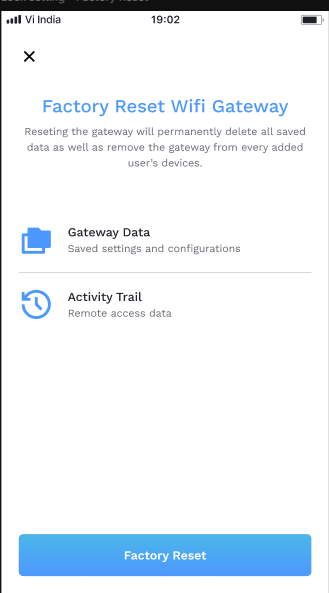</a>
<figcaption><strong>Factory Reset</strong>The same shape as the accessories' reset screens: what goes, then the button. Owner only, as the firmware entry is.</figcaption>
</figure>
<figure>
<a href="images/lock-settings/93-gateway-reset-biometric.png">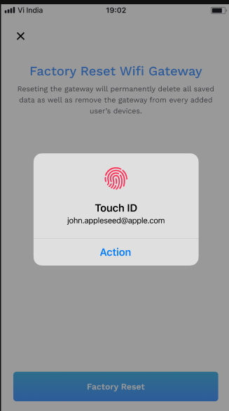</a>
<figcaption><strong>Biometric first</strong>The same guard the lock and the accessories use before anything is wiped.</figcaption>
</figure>
<figure>
<a href="images/lock-settings/94-gateway-reset-progress.png">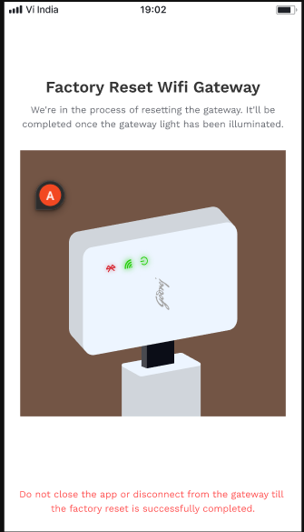</a>
<figcaption><strong>Watching the light</strong><code>resetGateway</code> over BLE, with <code>removeGateway</code> after it. The gateway reports it is done by its own indicator rather than back through the app.</figcaption>
</figure>
<figure>
<a href="images/lock-settings/95-gateway-reset-done.png">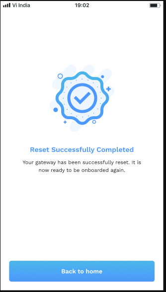</a>
<figcaption><strong>Done</strong>Blank rather than gone, the same end the lock and the accessories reach. The <code>DELETE</code> at Spintly has taken its record away by this point.</figcaption>
</figure>
</div>

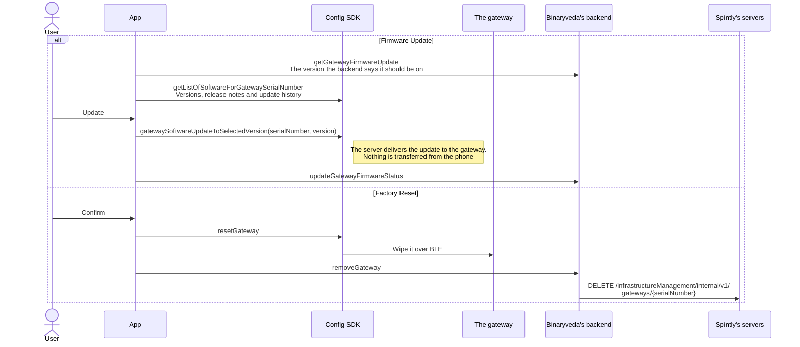
```mermaid
sequenceDiagram
    actor U as User
    participant A as App
    participant C as Config SDK
    participant G as The gateway
    participant B as Binaryveda's backend
    participant S as Spintly's servers

    alt Firmware Update
        A->>B: getGatewayFirmwareUpdate<br/>The version the backend says it should be on
        A->>C: getListOfSoftwareForGatewaySerialNumber<br/>Versions, release notes and update history
        U->>A: Update
        A->>C: gatewaySoftwareUpdateToSelectedVersion(serialNumber, version)
        Note right of C: The server delivers the update to the gateway.<br/>Nothing is transferred from the phone
        A->>B: updateGatewayFirmwareStatus
    else Factory Reset
        U->>A: Confirm
        A->>C: resetGateway
        C->>G: Wipe it over BLE
        A->>B: removeGateway
        B->>S: DELETE /infrastructureManagement/internal/v1/<br/>gateways/{serialNumber}
    end
```

**Gateway firmware is the one update the phone does not carry.** The SDK asks
for the version and the server delivers it to the gateway in the background. A
lock, a BLE remote and a VDP module all take their firmware from the phone over
BLE instead.

## Differences between the two

| | iOS | Android |
|---|---|---|
| Firmware Update for a primary user | Shown | Hidden |
| System Integrators for a secondary user | Shown | Hidden |
| System Integrators overall | Behind a feature flag | Always built in |
| Voice Assistants overall | Always built in | Behind a build flag |
| The reduced menu while a lock is unfinished | FAQs, Get Help, About Lock, and Factory Reset for an owner | The same, plus Manual and Voice Assistants, and plus Remove Device for a primary or secondary user |
| Renaming a fingerprint | A sheet opens, but its Update button only closes it. Nothing is saved and no call is made | No rename anywhere |
| Menu entries defined but unreachable | The fingerprint rename sheet | Notifications, Diagnosis and Backup are defined, appear in no menu, and do nothing when tapped |

## Every SDK member this flow uses

All of them belong to the **Config SDK**, and all of them need a Spintly session
token handed over with `setAuthToken` first. The members are the same on both
platforms, and differ only in how each reports back: a `completion` closure on
iOS, a callback interface on Android.

??? note "iOS"

    | Member | When | What it is for |
    |---|---|---|
    | `configurationProvider.setAuthToken(token:)` | Before any write | Authorise the SDK |
    | `configurationProvider.addUserPasscode` | My Access | Write a first passcode |
    | `configurationProvider.updateUserPasscode` | My Access | Replace an existing one, carrying the old value |
    | `configurationProvider.updateMasterPasscode` | My Access | Replace the owner's master passcode |
    | `configurationProvider.getFingerprintPermissions` | My Access | List the fingerprints enrolled in the lock |
    | `configurationProvider.deleteFingerprintTemplatePermission` | My Access | Remove one from the lock |
    | `configurationProvider.readSoundSettings` | Sound | Read the three volumes |
    | `configurationProvider.updateLockSoundSettings` | Sound | Write them back |
    | `configurationProvider.readLEDIntensitySettings` | Lights | Read the keypad intensity |
    | `configurationProvider.updateLEDIntensitySettings` | Lights | Write it back |
    | `configurationProvider.readTimeoutAlertSettings` | Timeout Alerts | Read all three timeouts |
    | `configurationProvider.updateTamperAlarmSettings` | Timeout Alerts | Write the tamper duration |
    | `configurationProvider.updatePrankAlarmSettings` | Timeout Alerts | Write the prank cooldown |
    | `configurationProvider.updateDOTLSettings` | Timeout Alerts | Write the door ajar timeout and its flag |
    | `configurationProvider.getCurrentLanguageAndDoorbellTone` | Lock Audio and Door Bell | Read the current pair |
    | `configurationProvider.setDoorbellTone` | Door Bell | Write the tone |
    | `configurationProvider.updateVoicePackage` | Lock Audio Language | Transfer the voice pack |
    | `configurationProvider.getListOfFirmwareForSerialNumber` | Firmware Update | Versions the lock will take |
    | `configurationProvider.firmwareUpdateToSelectedVersion` | Firmware Update, and accessories | Transfer the firmware |
    | `configurationProvider.beaconStartScan`, `beaconStopScan` | Accessories | Find one in range |
    | `configurationProvider.setBeaconTargetDevice` | Accessories | Aim at the one picked |
    | `configurationProvider.startBeaconAttach` | Accessories | Tie it to the lock |
    | `configurationProvider.getListOfFirmwareForBeacon` | Accessories | Versions the accessory will take |
    | `configurationProvider.resetBeacon` | Accessories | Wipe it |
    | `configurationProvider.resetDevice` | Factory Reset | Wipe the lock |
    | `configurationProvider.getWifiNetworks` | Gateway | What the gateway can see |
    | `configurationProvider.configureWifiNetwork` | Gateway | Hand it the credentials |
    | `configurationProvider.getListOfSoftwareForGatewaySerialNumber` | Gateway | Versions, notes and history |
    | `configurationProvider.gatewaySoftwareUpdateToSelectedVersion` | Gateway | Ask the server to deliver it |
    | `configurationProvider.resetGateway` | Gateway | Wipe it |

??? note "Android"

    The same members, in the same places. Android takes a callback object where
    iOS takes a `completion` closure, and `setAuthToken(authToken)` drops the
    argument label.

    Three names differ:

    | iOS | Android |
    |---|---|
    | `updateUserPasscode` | `updatePasscode` |
    | `updateMasterPasscode` | `generateMasterPasscode` |
    | `getVersion`, `setDebugLogging` | Neither exists |
