# 9. Profile and Account

**What it is.** The Profile tab and everything behind it: the account's own
details, the properties it holds, the assistants and third party services linked
to it, and the two ways of leaving.

!!! warning "Key point"

    This is Binaryveda's backend's page. **Only Manage Properties reaches
    Spintly's servers**, because a property is a Spintly site, and the only
    entry that reaches a Spintly SDK is Delete Account, on iOS alone.

    Two entries make no call at all: Support and Terms & Policies both read
    values built into the app.

## Participants

This page uses User, App, Binaryveda's backend, Keycloak, Spintly's servers, and
the File store a profile photo is uploaded to. Voice Assistants adds the
assistant's own app, which is not one of the shared participants.

Each one is defined, with the colour it keeps across the site, in
[Reading these pages](conventions.md).

## The menu

Nine entries, in the same order on both platforms. None of them depends on the
user's role, because nothing on this page belongs to a lock. What varies between
the two is which entries are built in at all.

| Entry | What it is |
|---|---|
| **Update Profile** | The name and the photo, and the way in to changing the phone number or the email |
| **Manage Properties** | The properties on the account, and the locks and gateways in each |
| **Add Device** | Opens the sheet for adding a lock or a gateway, which is [Lock Onboarding](lock-onboarding.md). It makes no call of its own |
| **Voice Assistants** | Links or unlinks Alexa and Google Home for the whole account |
| **System Integrators** | The third party services linked to the account, and removing one |
| **Support** | Two phone numbers, an email address and a website |
| **Terms & Policies** | The terms and conditions, and the privacy policy |
| **Delete Account** | Deletes the account, behind biometric authentication |
| **Sign Out** | Covered in [User Onboarding](user-onboarding.md#7-sign-out) |

<figure>
<a href="images/profile-and-account/01-profile-top.png">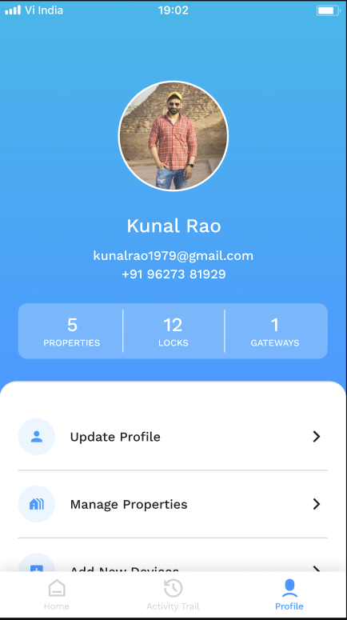</a>
<figcaption><strong>The header</strong>Everything above the menu is one <code>getUserProfile</code>: the photo, the name, the email, the number, and the three counts. The counts are built differently on each platform, which is in <a href="#differences-between-the-two">Differences</a>.</figcaption>
</figure>
<figure>
<a href="images/profile-and-account/02-menu.png">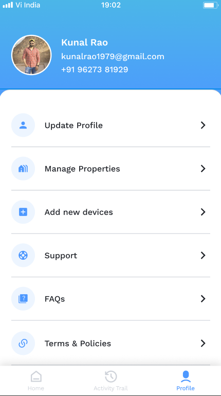</a>
<figcaption><strong>The menu</strong>The header shrinks as the list scrolls under it. Neither Voice Assistants nor System Integrators is present here, which is what the two flags in Differences decide.</figcaption>
</figure>
<figure>
<a href="images/profile-and-account/03-menu-voice.png">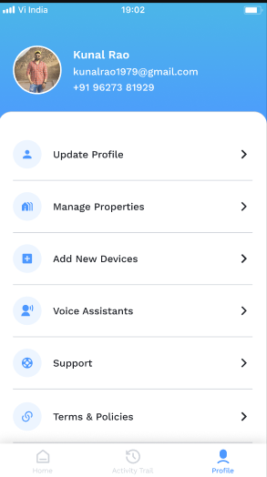</a>
<figcaption><strong>With Voice Assistants</strong>The row sits fourth, above Support. Nothing about it depends on a lock, which is why it is on this page rather than in Lock Settings.</figcaption>
</figure>
<figure>
<a href="images/profile-and-account/04-menu-integrators.png">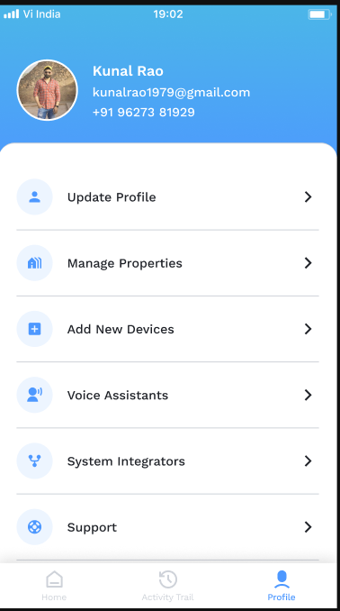</a>
<figcaption><strong>With both</strong>System Integrators follows Voice Assistants. This is the fullest the list gets before the entries that sit at the foot of it.</figcaption>
</figure>
<figure class="crop">
<a href="images/profile-and-account/05-menu-bottom.png">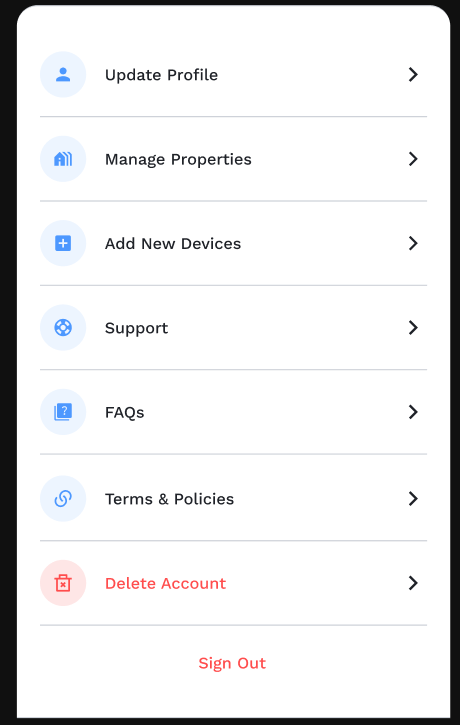</a>
<figcaption><strong>The foot of it</strong>Delete Account is the last row, and Sign Out sits under the list rather than in it. Where Sign Out is drawn is one of the platform differences.</figcaption>
</figure>
<figure>
<a href="images/profile-and-account/06-add-device-sheet.png">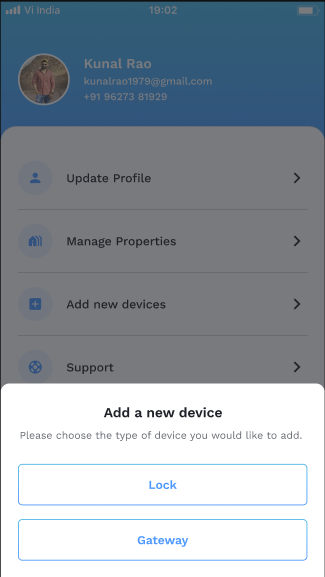</a>
<figcaption><strong>Add Device, in full</strong>The whole of that menu entry. It asks which of the two to add and hands over to <a href="lock-onboarding.md">Lock Onboarding</a>, making no call of its own.</figcaption>
</figure>

## The whole flow

Opening the tab costs one query. Everything below it is its own flow, and each
has its own section.

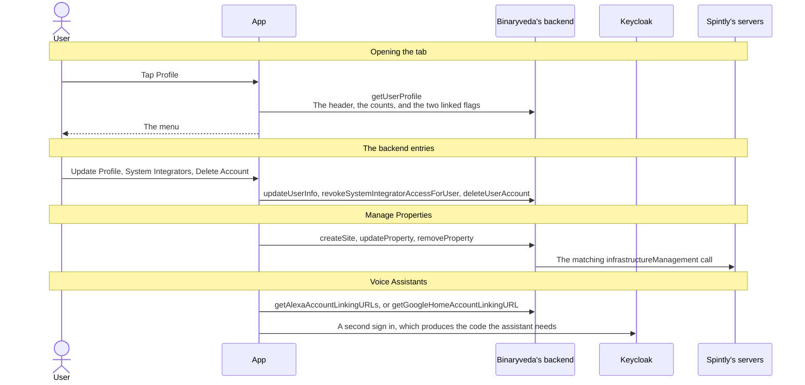
```mermaid
sequenceDiagram
    actor U as User
    participant A as App
    participant B as Binaryveda's backend
    participant K as Keycloak
    participant S as Spintly's servers

    Note over U,S: Opening the tab
    U->>A: Tap Profile
    A->>B: getUserProfile<br/>The header, the counts, and the two linked flags
    A-->>U: The menu

    Note over U,S: The backend entries
    U->>A: Update Profile, System Integrators, Delete Account
    A->>B: updateUserInfo, revokeSystemIntegratorAccessForUser, deleteUserAccount

    Note over U,S: Manage Properties
    A->>B: createSite, updateProperty, removeProperty
    B->>S: The matching infrastructureManagement call

    Note over U,S: Voice Assistants
    A->>B: getAlexaAccountLinkingURLs, or getGoogleHomeAccountLinkingURL
    A->>K: A second sign in, which produces the code the assistant needs
```

## 1. Opening the tab

`getUserProfile` fills the header on its own. It carries the name, email, mobile
code and number, the profile photo, the counts shown under them, and
`alexaLinked` and `googleAssistanceLinked`, which the Voice Assistants screen
reads again when it opens.

Nothing else is fetched. The same query runs at the end of sign in, covered in
[Mobile number and OTP](user-onboarding.md#2-mobile-number-and-otp).

## 2. Update Profile

The name and the photo. The phone number and the email are drawn greyed out with
a **Change** link each, and those two go to the next section.

<figure>
<a href="images/profile-and-account/07-update-profile.png">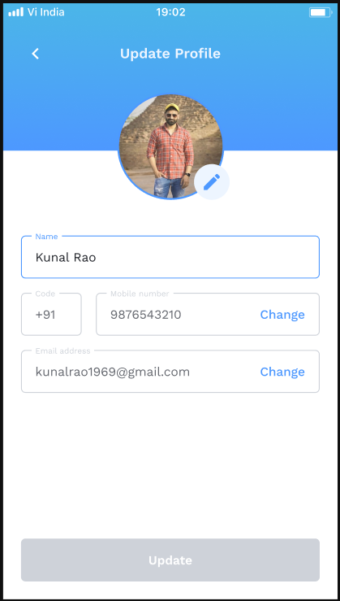</a>
<figcaption><strong>Two fields, and two links</strong>Name is the only thing typed here, and it is the only thing besides the photo that <code>updateUserInfo</code> carries. The number and the email are shown for reference, with Change beside each.</figcaption>
</figure>
<figure class="crop">
<a href="images/profile-and-account/08-photo-sheet.png">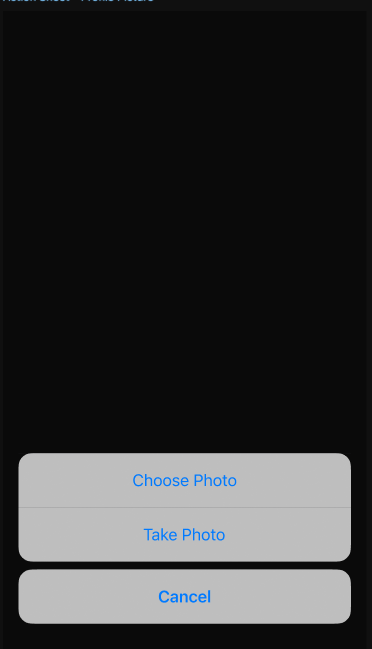</a>
<figcaption><strong>Picking the photo</strong>Behind the pencil on the picture. Whichever is picked, the image goes to the file store first and only its key reaches the mutation.</figcaption>
</figure>

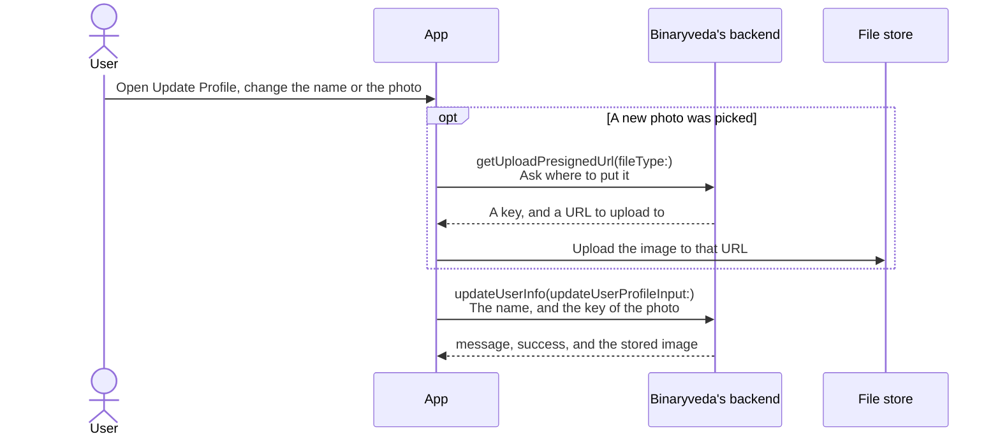
```mermaid
sequenceDiagram
    actor U as User
    participant A as App
    participant B as Binaryveda's backend
    participant F as File store

    U->>A: Open Update Profile, change the name or the photo
    opt A new photo was picked
        A->>B: getUploadPresignedUrl(fileType:)<br/>Ask where to put it
        B-->>A: A key, and a URL to upload to
        A->>F: Upload the image to that URL
    end
    A->>B: updateUserInfo(updateUserProfileInput:)<br/>The name, and the key of the photo
    B-->>A: message, success, and the stored image
```

**The photo never travels through the backend.** It goes straight to the file
store on both platforms, and only its key is sent on the mutation. This is the
same arrangement Lock Details uses for a lock's photo on iOS, described in
[Lock Settings](lock-settings.md#1-lock-details).

`UpdateUserProfileInput` holds `name` and `profileImage` and nothing else, so the
number and the email cannot be changed here.

## 3. Changing the phone number or the email

**Each is verified against the other.** Changing the number starts by proving
the email, and changing the email starts by proving the number. Whichever is
being changed, it is four calls and two codes.

<figure>
<a href="images/profile-and-account/09-verify-existing-email.png">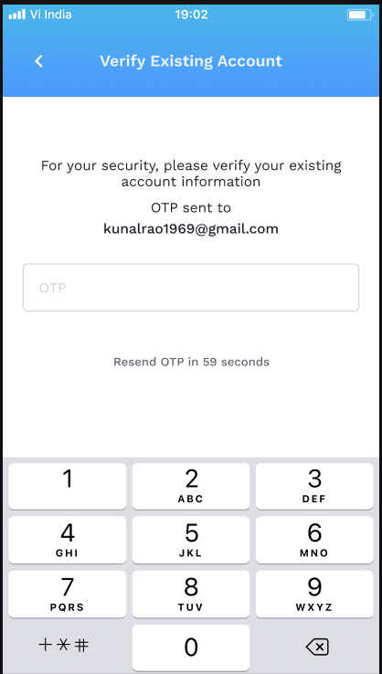</a>
<figcaption><strong>Changing the number, step 1</strong>The code goes to the <em>email</em>, which is the field that is not changing. This is <code>requestOtp</code> with <code>updateDetailsOf</code> and <code>requestFor</code> set to opposites.</figcaption>
</figure>
<figure>
<a href="images/profile-and-account/10-change-mobile.png">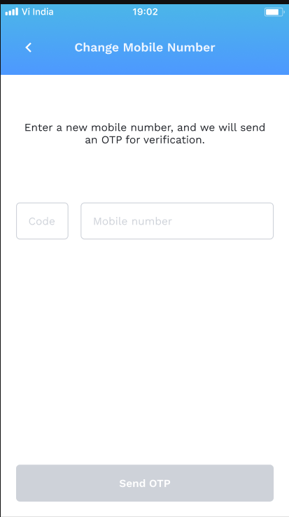</a>
<figcaption><strong>The new number</strong>Reached only once the email has been proved. Send OTP is the second <code>requestOtp</code>, this time with both enums pointing at the mobile.</figcaption>
</figure>
<figure>
<a href="images/profile-and-account/11-verify-new-number.png">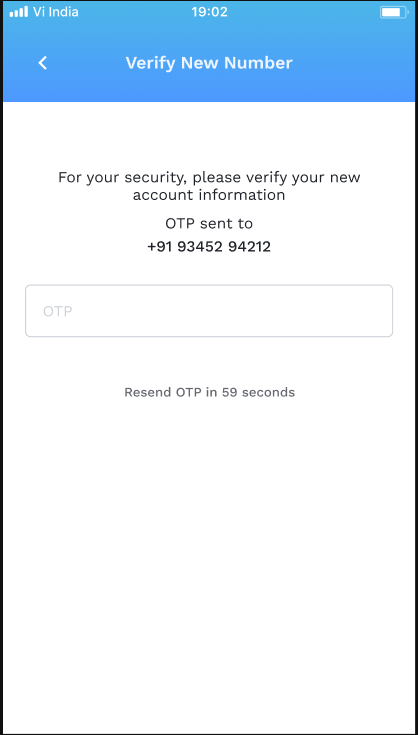</a>
<figcaption><strong>And proving it</strong>There is no separate verify call here. The code and the new number go up together on <code>updateUserMobile</code>, which is what writes the change.</figcaption>
</figure>
<figure>
<a href="images/profile-and-account/12-verify-existing-mobile.png">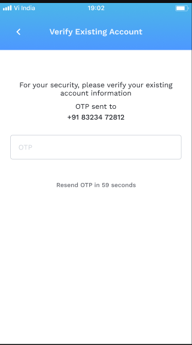</a>
<figcaption><strong>Changing the email, step 1</strong>The same screen the other way round: the code goes to the <em>number</em>. An account with no email yet never sees this one, as the note below explains.</figcaption>
</figure>
<figure>
<a href="images/profile-and-account/13-change-email.png">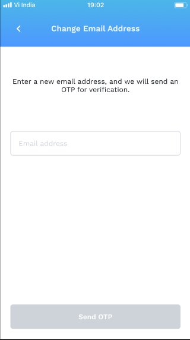</a>
<figcaption><strong>The new email</strong>The mirror of the number screen, and the same second <code>requestOtp</code> behind Send OTP.</figcaption>
</figure>
<figure>
<a href="images/profile-and-account/14-verify-new-email.png">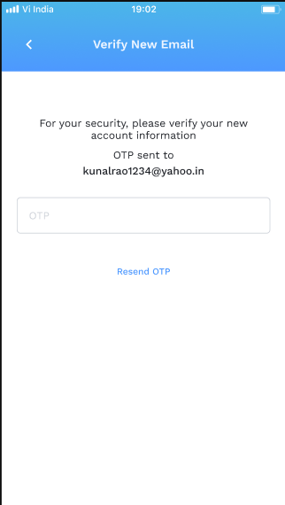</a>
<figcaption><strong>And proving it</strong>Ends at <code>updateUserEmail</code>, the counterpart of <code>updateUserMobile</code>. What Resend does here differs by platform, which is in <a href="#differences-between-the-two">Differences</a>.</figcaption>
</figure>

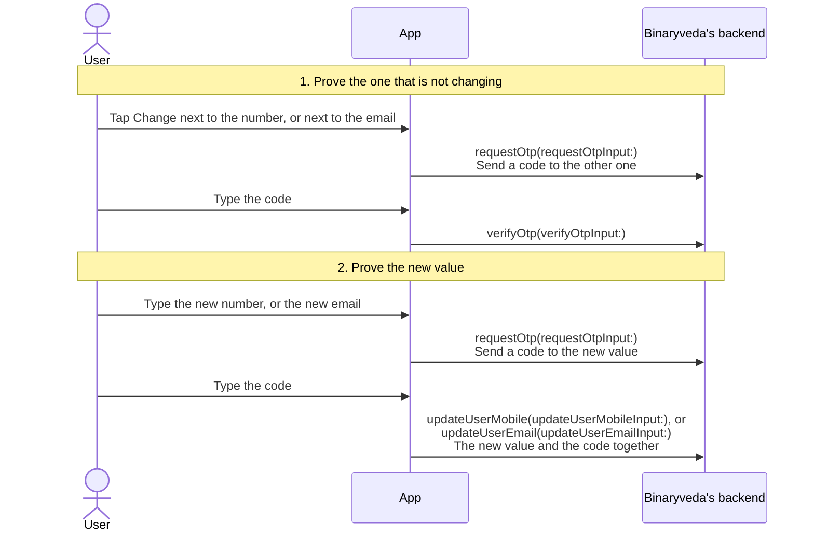
```mermaid
sequenceDiagram
    actor U as User
    participant A as App
    participant B as Binaryveda's backend

    Note over U,B: 1. Prove the one that is not changing
    U->>A: Tap Change next to the number, or next to the email
    A->>B: requestOtp(requestOtpInput:)<br/>Send a code to the other one
    U->>A: Type the code
    A->>B: verifyOtp(verifyOtpInput:)

    Note over U,B: 2. Prove the new value
    U->>A: Type the new number, or the new email
    A->>B: requestOtp(requestOtpInput:)<br/>Send a code to the new value
    U->>A: Type the code
    A->>B: updateUserMobile(updateUserMobileInput:), or<br/>updateUserEmail(updateUserEmailInput:)<br/>The new value and the code together
```

`requestOtp` and `verifyOtp` both carry the same two enums, and that pair is the
only thing separating the four calls above.

| Field | What it says |
|---|---|
| `updateDetailsOf` | Which field is being changed, `MOBILE` or `EMAIL` |
| `requestFor` | Where the code is being sent |

The two are opposites in step 1 and identical in step 2.

The last call has no separate verify step. `updateUserMobile` and
`updateUserEmail` take the code alongside the new value and write it in one go.

!!! note "An account with no email yet skips step 1"

    There is nothing to verify against, so both platforms send
    `verifyEmailForFirstLogin(email:)` in place of the first `requestOtp` and go
    straight to the new value. The app lands on this screen on its own when
    [Home](home.md#1-opening-home) finds the profile has no email.
Both apps submit the code as soon as the field is full, and both stop doing so
after a wrong one, so the button matters only on a retry.

## 4. Manage Properties

A property is a Spintly **site**, so creating one and deleting one both reach
Spintly's servers. Creating is the same call the first step of
[Lock Onboarding](lock-onboarding.md#1-choose-a-property) makes, including its
branch for the first property on an account.

<figure>
<a href="images/profile-and-account/15-properties.png">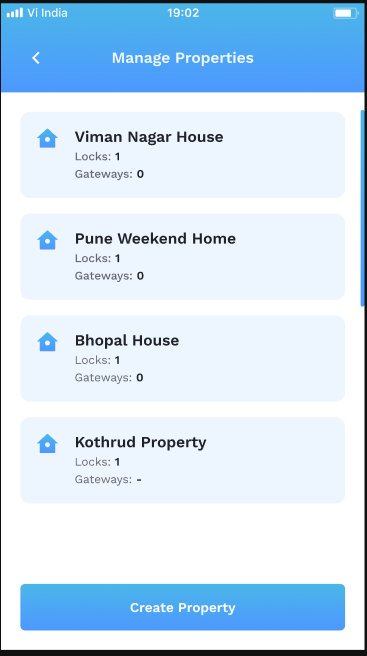</a>
<figcaption><strong>One page of sites</strong><code>listSites(limit:page:listNonEmpty:)</code>, one row per property. The two counts on a row are what Android reads before it will let a property be deleted.</figcaption>
</figure>
<figure>
<a href="images/profile-and-account/16-property-in-progress.png">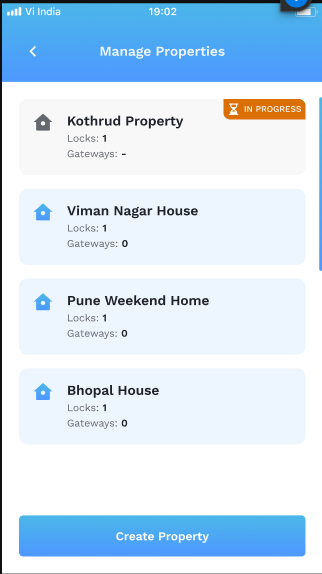</a>
<figcaption><strong>Not finished yet</strong>A property whose site is still being made at Spintly is badged and sorted to the top. The rest of the list is unaffected while it settles.</figcaption>
</figure>
<figure>
<a href="images/profile-and-account/17-create-property.png">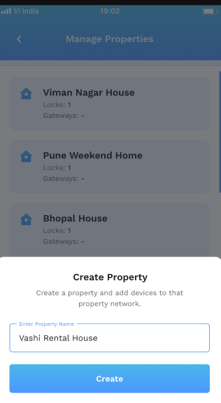</a>
<figcaption><strong>Creating one</strong>A name and nothing else. Create is <code>createSite(name:)</code>, the same call the first step of lock onboarding makes, including its branch for the very first property on an account.</figcaption>
</figure>
<figure>
<a href="images/profile-and-account/18-property-devices.png">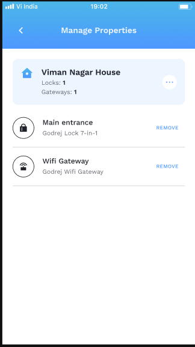</a>
<figcaption><strong>Opened</strong><code>listLocksAndGateways(propertyId:)</code>. The menu on the property card holds the three things that can be done to it, and Remove beside a device moves that device rather than deleting it.</figcaption>
</figure>
<figure>
<a href="images/profile-and-account/19-property-actions.png">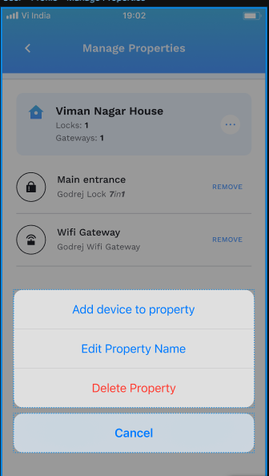</a>
<figcaption><strong>The three actions</strong>Adding a device, renaming, and deleting. Only the first and last change what is inside the property.</figcaption>
</figure>
<figure class="crop">
<a href="images/profile-and-account/20-edit-property-name.png">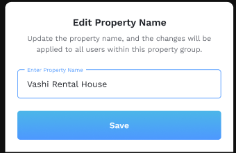</a>
<figcaption><strong>Renaming</strong><code>updateProperty(updateSiteInput:)</code>, the id and the new name. The note is there because a property is shared, so the new name is what every user of it sees.</figcaption>
</figure>
<figure class="crop">
<a href="images/profile-and-account/21-delete-property.png">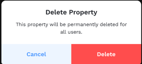</a>
<figcaption><strong>Deleting</strong><code>removeProperty(id:)</code>, and a <code>DELETE</code> against the site at Spintly behind it. Permanently, and for everyone the property was shared with.</figcaption>
</figure>
<figure class="crop">
<a href="images/profile-and-account/22-property-not-deleted.png">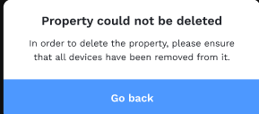</a>
<figcaption><strong>Refused, because it still holds devices</strong>The rule the two platforms enforce in different places: Android checks the counts and never sends, iOS sends and shows what came back.</figcaption>
</figure>
<figure>
<a href="images/profile-and-account/23-devices-none-selected.png">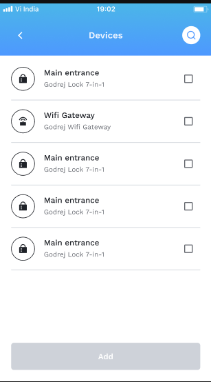</a>
<figcaption><strong>Adding a device to a property</strong>The account's locks and gateways that are not already in this one. Add stays greyed until something is ticked.</figcaption>
</figure>
<figure>
<a href="images/profile-and-account/24-devices-selected.png">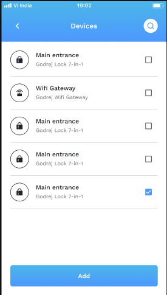</a>
<figcaption><strong>One picked</strong>More than one can go at a time, which is why the confirmation is worded for a set rather than a device.</figcaption>
</figure>
<figure class="crop">
<a href="images/profile-and-account/25-add-devices-confirm.png">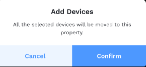</a>
<figcaption><strong>Moved, not copied</strong>The wording is the important part. A device belongs to one property, so adding it here takes it out of wherever it was.</figcaption>
</figure>
<figure class="crop">
<a href="images/profile-and-account/26-no-devices-to-add.png">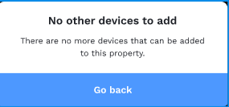</a>
<figcaption><strong>Nothing left to move</strong>Shown instead of the list when every device on the account is already in this property.</figcaption>
</figure>
<figure>
<a href="images/profile-and-account/27-move-device.png">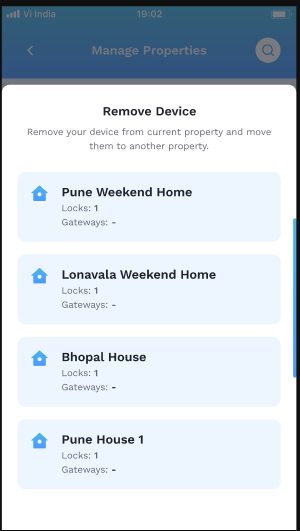</a>
<figcaption><strong>Remove is a move</strong>Taking a device out of a property means choosing which property it goes to instead. It cannot be left in none.</figcaption>
</figure>
<figure>
<a href="images/profile-and-account/28-move-device-empty.png">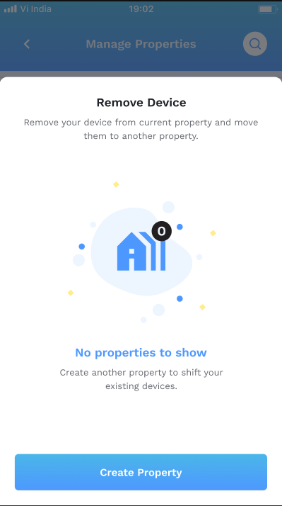</a>
<figcaption><strong>Nowhere to put it</strong>With only one property on the account there is no destination, so the sheet offers to create one rather than to move.</figcaption>
</figure>
<figure class="crop">
<a href="images/profile-and-account/29-remove-device-confirm.png">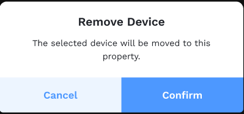</a>
<figcaption><strong>The confirmation</strong>Worded as a move as well, against the property that was picked on the sheet before it.</figcaption>
</figure>

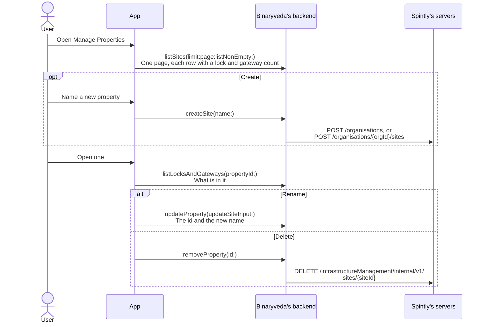
```mermaid
sequenceDiagram
    actor U as User
    participant A as App
    participant B as Binaryveda's backend
    participant S as Spintly's servers

    U->>A: Open Manage Properties
    A->>B: listSites(limit:page:listNonEmpty:)<br/>One page, each row with a lock and gateway count
    opt Create
        U->>A: Name a new property
        A->>B: createSite(name:)
        B->>S: POST /organisations, or<br/>POST /organisations/{orgId}/sites
    end
    U->>A: Open one
    A->>B: listLocksAndGateways(propertyId:)<br/>What is in it
    alt Rename
        A->>B: updateProperty(updateSiteInput:)<br/>The id and the new name
    else Delete
        A->>B: removeProperty(id:)
        B->>S: DELETE /infrastructureManagement/internal/v1/<br/>sites/{siteId}
    end
```

**A property holding a lock or a gateway cannot be deleted.** Android checks the
two counts and refuses before sending. iOS sends and shows what comes back.

## 5. Voice Assistants

Alexa and Google Home, linked to the **account** here and then switched on per
lock in [Lock Settings](lock-settings.md#7-voice-assistants). Both steps are
needed before a voice command reaches a lock.

**Linking is an account linking handshake rather than a call.** The app sends the
user to the assistant's own app, the assistant sends them back, and the app then
runs a second Keycloak sign in to produce the authorisation code the assistant is
waiting for.

<figure>
<a href="images/profile-and-account/30-voice-assistants.png">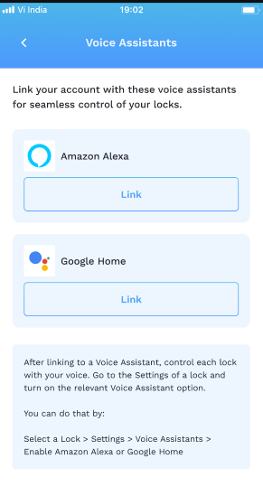</a>
<figcaption><strong>Linked to the account</strong>Two cards, one call each behind them. The note at the foot is the second half of the job: linking here does nothing until the assistant is switched on for a lock in <a href="lock-settings.md#7-voice-assistants">Lock Settings</a>.</figcaption>
</figure>
<figure>
<a href="images/profile-and-account/31-link-alexa.png">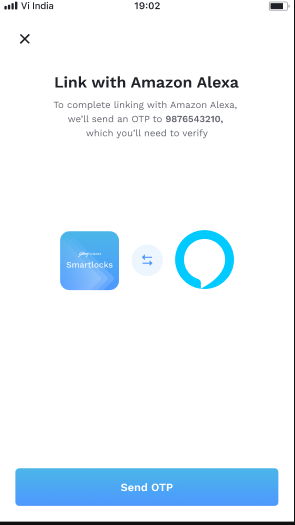</a>
<figcaption><strong>Back from Alexa</strong>The consent panel shown once the assistant's app has handed the user back with its own code. Send OTP starts the second sign in, against the account's own number.</figcaption>
</figure>
<figure>
<a href="images/profile-and-account/32-link-google.png">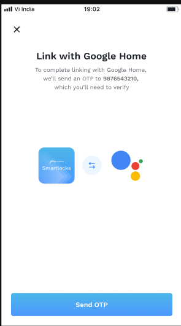</a>
<figcaption><strong>The same panel for Google</strong>Identical up to this point. The two only diverge at the end, where Alexa's code goes to Binaryveda and Google's goes back to Google.</figcaption>
</figure>
<figure>
<a href="images/profile-and-account/33-voice-otp.png">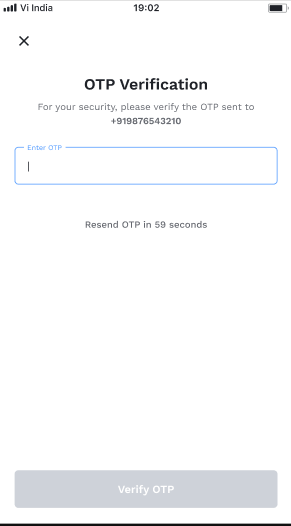</a>
<figcaption><strong>A second sign in, not a mutation</strong>This code goes to Keycloak rather than to Binaryveda's backend. What comes back is the authorisation code the assistant has been waiting for.</figcaption>
</figure>
<figure>
<a href="images/profile-and-account/34-voice-linked.png">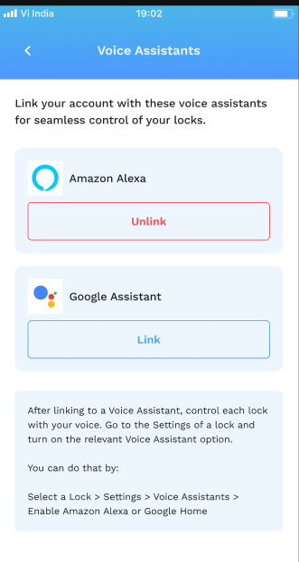</a>
<figcaption><strong>One linked, one not</strong>The buttons come from <code>alexaLinked</code> and <code>googleAssistanceLinked</code> on <code>getUserProfile</code>. Unlink is a single call with no handshake behind it.</figcaption>
</figure>

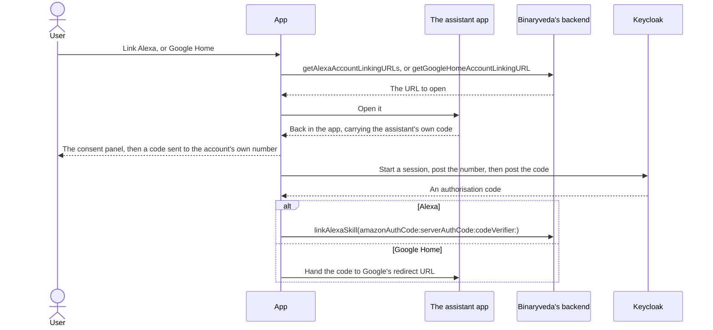
```mermaid
sequenceDiagram
    actor U as User
    participant A as App
    participant V as The assistant app
    participant B as Binaryveda's backend
    participant K as Keycloak

    U->>A: Link Alexa, or Google Home
    A->>B: getAlexaAccountLinkingURLs, or getGoogleHomeAccountLinkingURL
    B-->>A: The URL to open
    A->>V: Open it
    V-->>A: Back in the app, carrying the assistant's own code
    A-->>U: The consent panel, then a code sent to the account's own number
    A->>K: Start a session, post the number, then post the code
    K-->>A: An authorisation code
    alt Alexa
        A->>B: linkAlexaSkill(amazonAuthCode:serverAuthCode:codeVerifier:)
    else Google Home
        A->>V: Hand the code to Google's redirect URL
    end
```

**Only Alexa finishes at Binaryveda's backend.** Google Home's code goes back to
Google, which redeems it itself, so there is no matching mutation for it.

Alexa's URL arrives as a pair: `alexaAppURL`, a universal link into the Alexa
app, and `lwaFallbackURL`, used when that app is not installed.

Unlinking is one call either way, `unlinkAccountWithAlexa` or
`unlinkAccountWithGoogleAssistance`, with no handshake and no code.

## 6. System Integrators

The integrators linked to the **account**, as against the per lock switch of the
same name in [Lock Settings](lock-settings.md#6-system-integrators). Linking
still starts in the integrator's own application, so this screen lists and
removes, and nothing else.

<figure>
<a href="images/profile-and-account/35-system-integrators.png">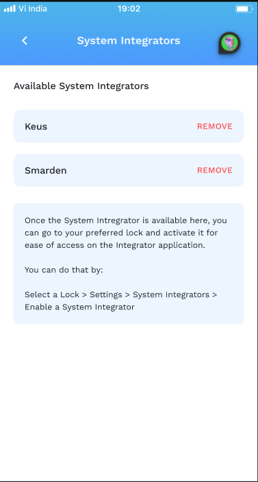</a>
<figcaption><strong>The list</strong>Two rows and no way to add one, because linking happens in the integrator's own application. The note points at the per lock switch that turns an integrator on once it is here.</figcaption>
</figure>
<figure class="crop">
<a href="images/profile-and-account/36-remove-integrator.png">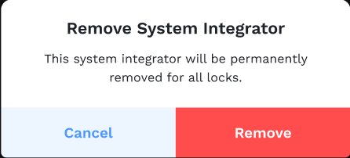</a>
<figcaption><strong>Removing one</strong><code>revokeSystemIntegratorAccessForUser(integratorId:)</code>. The dialog says for all locks because this is the account level revoke, not the per lock switch.</figcaption>
</figure>

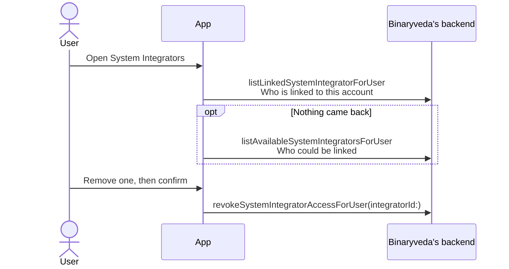
```mermaid
sequenceDiagram
    actor U as User
    participant A as App
    participant B as Binaryveda's backend

    U->>A: Open System Integrators
    A->>B: listLinkedSystemIntegratorForUser<br/>Who is linked to this account
    opt Nothing came back
        A->>B: listAvailableSystemIntegratorsForUser<br/>Who could be linked
    end
    U->>A: Remove one, then confirm
    A->>B: revokeSystemIntegratorAccessForUser(integratorId:)
```

**The second query only runs when the first returns nothing.** An account with
no integrator sees what it could link instead, as a read only list with nothing
to tap.

Revoking here takes the integrator off the whole account, so it covers every lock
at once. The Lock Settings switch is one lock at a time.

## 7. Support and Terms & Policies

Neither reaches the backend.

| Entry | Where its content comes from |
|---|---|
| **Support** | Two phone numbers, an email address and a website, all constants in the app. Tapping one opens the dialler, the mail client, or the browser |
| **Terms & Policies** | Two URLs from the app's build configuration. iOS opens them in a web view, Android in its PDF viewer |

<figure>
<a href="images/profile-and-account/37-terms-policies.png">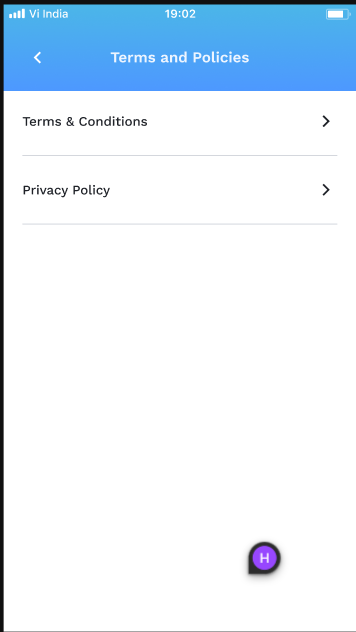</a>
<figcaption><strong>Two rows, two URLs</strong>The screen holds nothing but the pair of links. Tapping one opens the document in the viewer that platform uses.</figcaption>
</figure>

This is the account level counterpart of **Get Help** in
[Lock Settings](lock-settings.md#9-about-lock-faqs-manual-and-get-help), which
does raise a ticket. Support here only hands over the contact details.

## 8. Delete Account

Biometric authentication, one mutation, then the app tears down what it holds.

<figure class="crop">
<a href="images/profile-and-account/38-delete-account.png">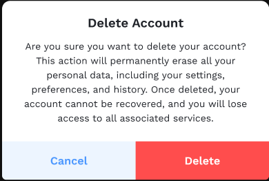</a>
<figcaption><strong>Before the biometric</strong>The confirmation comes first and the biometric check after it, so nothing is sent until both have been passed.</figcaption>
</figure>
<figure class="crop">
<a href="images/profile-and-account/39-sign-out.png">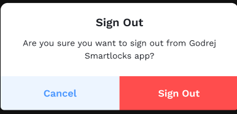</a>
<figcaption><strong>The lighter one</strong>Sign Out ends much the same way in the app, with <code>logOut</code> in place of the deletion and no biometric in front of it.</figcaption>
</figure>

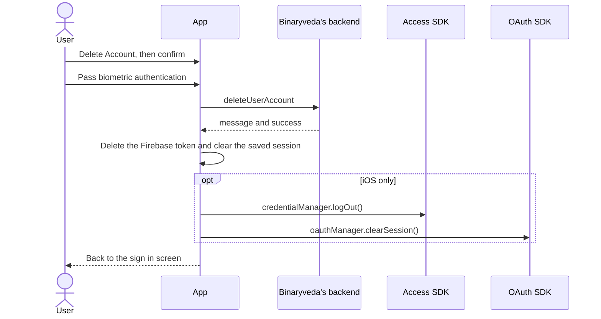
```mermaid
sequenceDiagram
    actor U as User
    participant A as App
    participant B as Binaryveda's backend
    participant S as Access SDK
    participant O as OAuth SDK

    U->>A: Delete Account, then confirm
    U->>A: Pass biometric authentication
    A->>B: deleteUserAccount
    B-->>A: message and success
    A->>A: Delete the Firebase token and clear the saved session
    opt iOS only
        A->>S: credentialManager.logOut()
        A->>O: oauthManager.clearSession()
    end
    A-->>U: Back to the sign in screen
```

**The teardown only runs on a success.** A failed mutation leaves the user signed
in with the error shown, and the biometric check has to be passed again.

**Android leaves the Spintly sessions alone here.** It clears them when the next
sign in starts instead, which is the platform difference already recorded in
[User Onboarding](user-onboarding.md#differences-between-the-two).

Sign Out ends much the same way, with `logOut` in place of `deleteUserAccount`
and no biometric. The order those calls run in is in
[User Onboarding](user-onboarding.md#7-sign-out).

## Differences between the two

| | iOS | Android |
|---|---|---|
| Sign Out | A button under the menu | The last row of the menu |
| System Integrators | Behind a feature flag | Always built in |
| Voice Assistants | Always built in | Behind a build flag |
| The counts under the header | `propertyCount`, `ownedLockCount` and `ownedGatewayCount`, all from `getUserProfile` | `lockCount` and `gatewayCount` from `getUserProfile`, and the property count from the length of `listAssignedProperties`, which Home already holds |
| Resending the code for a new number or email | Sends the request against the other channel with empty values, so no code arrives | Sends it again to the new value |
| `codeVerifier` on `linkAlexaSkill` | The PKCE verifier generated for the session | The literal string `toBeRemoved` |
| Deleting a property that still holds devices | Sent, and the backend's answer is shown | Refused before sending |
| Clearing the Spintly sessions after Delete Account | Part of the same teardown | Left to the next sign in |
| Developer only entry | **Developer Dashboard**, a menu row hidden in production | A long press on Terms & Policies, which opens a Quick Access screen |
| Menu entries defined but unreachable | None | **FAQs**, defined and commented out of the list |

## Every SDK member this flow uses

**Only iOS reaches an SDK anywhere on this page**, and only from Delete Account.
It runs the same two members a sign out does, through `SpintlyHelper.logout()`.

| SDK | Member | When | What it is for |
|---|---|---|---|
| Access | `credentialManager.logOut()` | Once the account is deleted | Clear the Access SDK session |
| OAuth | `oauthManager.clearSession()` | Once the account is deleted | Clear the OAuth session |

Android calls neither. Nothing else on this page, on either platform, touches an
SDK at all.
