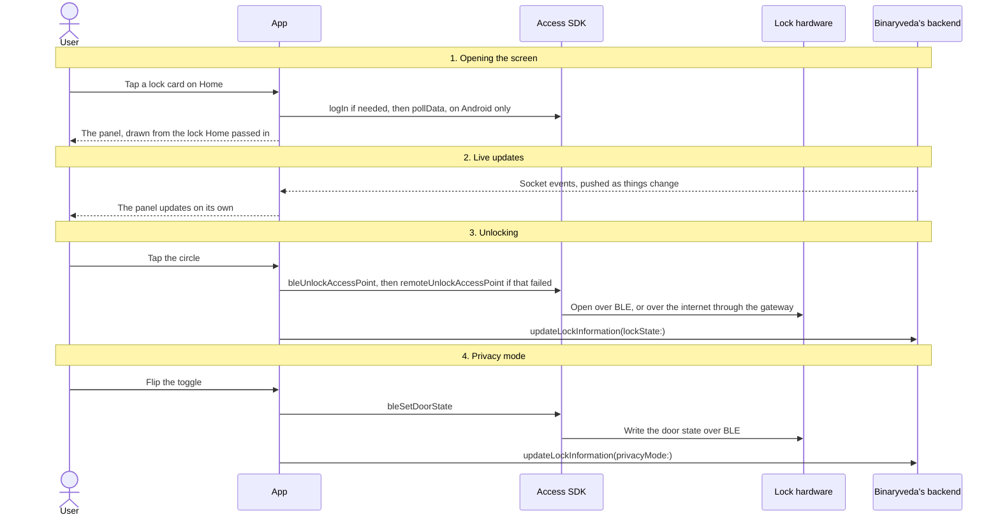

# 4. Lock Control Panel

**What it is.** The screen for a single lock. Tapping a lock's card on
[Home](home.md) opens it, and from here the user opens the door, reads the
lock's current state, turns privacy mode on or off, and moves on to that lock's
activity, users and settings.

!!! warning "Key point"

    Two actions on this screen reach a Spintly SDK, and both belong to the
    **Access SDK**: the unlock, and the privacy mode write. The Config SDK is
    not used. Opening the screen fetches nothing, since it is given the lock
    Home already holds.

## Participants

This page uses User, App, Access SDK, Lock hardware, and Binaryveda's backend.

Each one is defined, with the colour it keeps across the site, in
[Reading these pages](conventions.md).

## Roles on this screen

Each lock carries the signed-in user's role on that lock, and the backend sends
it with the lock. The screen reads it to decide what to show.

| Role | Who they are | What they get here |
|---|---|---|
| **Owner** | The person who onboarded the lock, and the accessor created for it during [Lock Onboarding](lock-onboarding.md) | Everything on the screen |
| **Primary** | Someone the owner invited and marked as primary | The same as the owner here: unlock, the privacy toggle, and the Users button |
| **Everyone else** | Anyone invited without that mark, such as a secondary or a scheduled user | Unlock, Activity and Settings. No privacy toggle, no Users button |

Inviting people and assigning these roles is covered in
[User Management](user-management.md).

## What is on the screen

| Element | What it shows or does |
|---|---|
| **Lock name and subtitle** | The lock's name, with its area of the house and model beneath |
| **Privacy mode toggle** | Turns privacy mode on or off by writing the lock's door state over Bluetooth |
| **Banner above the circle** | Reads **TAP TO UNLOCK**, **PRIVACY MODE** or **PASSAGE MODE**, so the user can tell why the circle is inert when it is |
| **Circle** | The unlock button. Red when locked, green when unlocked, and grey while a request is in flight or while the lock's mode blocks it |
| **Room is locked / unlocked** | The current state, in red or green |
| **"by {who} using {method}"** | Who last opened the door and how, with the date and time underneath. The user's own actions read as "You" |
| **Door, Battery and Status tiles** | The same three values as the Home card: open or closed, a battery category rather than a percentage, and Online, Offline or BLE |
| **Activity, Users and Settings buttons** | The three screens scoped to this lock, listed further down |

### Who can unlock, and when

The lock's mode decides this, and it decides it the same way on both platforms.

| Lock mode | Owner and primary | Everyone else |
|---|---|---|
| **Locked or unlocked** | Can unlock | Can unlock |
| **Privacy** | Can unlock. The banner still reads TAP TO UNLOCK | Cannot unlock. The banner reads PRIVACY MODE |
| **Passage** | Cannot unlock | Cannot unlock |

The privacy toggle is unavailable to everyone while the lock is in passage mode,
and while a write of its own is still in flight. iOS hides it from anyone who is
not an owner or a primary user, Android draws it for them but ignores the tap.

!!! note "Passage mode is read only"

    The app never writes passage mode. It is set at the lock, reaches the app
    over the socket, and only limits what can be done here. Privacy mode is the
    one mode the app can change.

## The whole flow

Four steps. Each one has its own section below.



## 1. Opening the screen

Home passes the lock in, so the panel has everything it needs to draw itself and
asks the backend for nothing. What differs is when each platform gets the Access
SDK ready for the unlock that usually follows.

=== "iOS"

    ```mermaid
    sequenceDiagram
        actor U as User
        participant A as App
        participant B as Binaryveda's backend

        U->>A: Tap a lock card on Home
        A->>B: Connect the socket, if it is not already connected
        A-->>U: The panel, drawn from the lock Home passed in
    ```

    **No Access SDK call runs on the way in.** The session check and the
    permission refresh happen as part of the unlock instead.

=== "Android"

    ```mermaid
    sequenceDiagram
        actor U as User
        participant A as App
        participant S as Access SDK

        U->>A: Tap a lock card on Home
        A->>S: credentialManager.isLoggedIn<br/>A property on Android
        opt If the SDK is not logged in yet
            A->>S: oauthManager.getOrCreateSession(AuthorizationCallback)<br/>Fetch the Spintly session token
            A->>S: credentialManager.logIn(token, CompletionCallback)<br/>Seat it in the Access SDK
        end
        A->>S: cloudSyncManager.pollData(callback)<br/>Pull down the user's lock permissions
        A->>S: accessManager.startBleScan()<br/>Start listening for the lock nearby
        A-->>U: The panel
    ```

    **This runs every time the screen comes to the front**, including on the way
    back from Settings, so the permissions are refreshed again each time.

    **The BLE scan is skipped when the Bluetooth and location permissions are
    not granted.** The unlock asks for them when it runs.

## 2. Live updates

The panel reads the same socket as Home, so nothing new is opened or subscribed
to here. What changes is where each event lands, since this screen shows the
lock's mode and its last action in full.

| Socket event | What it carries | On this screen, iOS | On this screen, Android |
|---|---|---|---|
| `activityTrail` | Someone locked or unlocked the door | Not handled | The locked state, the time, and the "by {who} using {method}" line |
| `inventoryStatus` | Battery, and online or offline | The Battery and Status tiles | The Battery and Status tiles |
| `doorModes` | Privacy mode and passage mode | The banner, the toggle and the circle | The banner, the toggle and the circle |
| `doorStatus` | The door was opened or closed | The Door tile | The Door tile |
| `deadbolt` | The deadbolt was thrown or withdrawn | The locked state and the time of it | Never acted on |

**On iOS the last action line does not move on its own**, because
`activityTrail` is routed to the activity trail screen instead. It changes on
the user's own unlock, or the next time the lock list is fetched.

**On Android that event is filtered twice.** Events for other locks are dropped,
and so are the user's own Bluetooth and remote unlocks, which the screen has
already drawn.

**The deadbolt event never reaches the Android screen.** The app subscribes to
it and has a handler ready, but the code that reads the event returns nothing,
so the handler never runs.

## 3. Unlocking

Tapping the circle runs the same unlock as the Unlock button on the Home card,
call for call: refresh the lock permissions, try Bluetooth, fall back to the
internet through the gateway, then record the result with
`updateLockInformation`. That sequence, the permission check around it, the
relock timer after it, and where the two platforms differ inside it are covered
in [Unlocking a lock, on Home](home.md#3-unlocking-a-lock).

Only one thing about it belongs to this screen: the lock's mode can stop the tap
before any of it runs, as set out in
[Who can unlock, and when](#who-can-unlock-and-when) above.

## 4. Privacy mode

Privacy mode shuts every other user out of the lock, so only the owner and
primary users can set it. It is written to the lock as a **door state** byte
over Bluetooth. There is no internet path for it, so the phone has to be near
the lock for the toggle to work.

| Byte | Door state | Used for |
|---|---|---|
| `0x01` | Access control | Privacy mode off, the normal state |
| `0x02` | Unlocked | Not used in this app |
| `0x03` | Locked | Privacy mode on |

=== "iOS"

    ```mermaid
    sequenceDiagram
        actor U as User
        participant A as App
        participant S as Access SDK
        participant L as Lock hardware
        participant B as Binaryveda's backend

        U->>A: Flip the privacy toggle
        opt If Bluetooth or nearby devices are not granted
            A-->>U: The permissions screen, and the toggle resumes after Continue
        end
        A-->>U: The banner reads "Updating Privacy Mode" and the circle greys out
        A->>S: accessManager.bleSetDoorState(_:doorState:delegate:)<br/>0x03 to turn it on, 0x01 to turn it off
        S->>L: Write the door state over BLE
        alt If the write worked
            S-->>A: SetDoorStateDelegate → didSetDoorState(_:newDoorState:oldDoorState:)
            A->>B: updateLockInformation(id:privacyMode:)<br/>Record it
            A-->>U: The toggle settles in its new position
        else If the write failed
            S-->>A: SetDoorStateDelegate → didFail(_:)
            A-->>U: An error toast, and the toggle stays where it was
        end
    ```

    **The session is not checked first.** The door state write goes straight to
    the SDK, so it relies on the login the last unlock or Home left in place.

=== "Android"

    ```mermaid
    sequenceDiagram
        actor U as User
        participant A as App
        participant S as Access SDK
        participant L as Lock hardware
        participant B as Binaryveda's backend

        U->>A: Flip the privacy toggle
        opt If Bluetooth is off, or Bluetooth or location are not granted
            A-->>U: The permissions screen, and the toggle is replayed after Continue
        end
        A-->>U: The toggle shows a spinner and stops accepting taps
        A->>S: credentialManager.isLoggedIn, then getOrCreateSession and logIn if it says no
        A->>S: accessManager.bleSetDoorState(accessPointId, newState, SetDoorStateCallback)<br/>0x03 to turn it on, 0x01 to turn it off
        S->>L: Write the door state over BLE
        alt If the write worked
            S-->>A: SetDoorStateCallback → onSuccess(accessPointId, newState, oldState)
            A->>B: updateLockInformation(privacyMode:)<br/>Record it
            A-->>U: The toggle settles in its new position
        else If the write failed
            S-->>A: SetDoorStateCallback → onFailure(exception)
            A-->>U: An error message, and the toggle stays where it was
        end
    ```

    **The screen and the mutation use different values.** The banner and the
    toggle are drawn from the byte the lock sends back, mapped to access
    control, privacy or passage, while `updateLockInformation` carries the value
    the user asked for.

## Where the three buttons go

| Button | Who sees it | What it opens |
|---|---|---|
| **Activity** | Everyone | The [Activity Trail](activity-trail.md) for this lock, scoped by its lock id rather than by the property |
| **Users** | Owner and primary | [User Management](user-management.md) for this lock |
| **Settings** | Everyone | [Lock Settings](lock-settings.md). Edits made there are reflected back here on return, and a factory reset closes the screen |

The activity trail and Lock Settings each have a page of their own.

## What Binaryveda's backend does here

Two writes, both the same mutation. `updateLockInformation(privacyMode:)` after
the privacy toggle, and `updateLockInformation(lockState:)` after an unlock.
Neither is waited on, and neither failure is shown to the user.

!!! info "No Spintly call sits behind this screen's backend write"

    None of the Spintly REST endpoints the backend services call covers lock
    state or privacy mode, so `updateLockInformation` stops at Binaryveda.

    The backend does have a remote unlock endpoint,
    `POST /mobileManagement/v3/webRemoteOpen`, but it is not on this screen's
    path. Its callers are the gateway's GraphQL and system integrator routes and
    `user-service`'s queue handler. The unlock here runs phone to Access SDK to
    Spintly, the same as it does on [Home](home.md#3-unlocking-a-lock).

## Differences between the two

These are the differences on this screen. The ones inside the unlock itself are
on [Home](home.md#differences-between-the-two).

| | iOS | Android |
|---|---|---|
| Access SDK work when the screen opens | None. The session and the permissions are refreshed per unlock instead | `isLoggedIn`, a login if needed, `pollData`, then `startBleScan` |
| Session check before the privacy write | None | Checked, and the login is performed if needed |
| What the privacy write records | The value held before the toggle is applied | The value the user asked for |
| `activityTrail` socket event | Not handled here | Updates the locked state, the time and the by line |
| `deadbolt` socket event | Handled | Subscribed to, but never delivered |
| The privacy toggle for anyone other than an owner or primary user | Hidden | Drawn, but the tap does nothing |

## Every SDK member this flow uses

Below are the members this screen calls on its own: what it does when it opens,
and the privacy write. The unlock calls the same members as the Home card, and
they are listed in
[Every SDK member this flow uses, on Home](home.md#every-sdk-member-this-flow-uses).

iOS reaches them through `SpintlyHelper` and `DefaultSpintlyViewModel`, Android
through `SpintlySDKManager`.

??? note "iOS"

    | SDK | Member | When | What it is for |
    |---|---|---|---|
    | Access | `accessManager.bleSetDoorState(_:doorState:delegate:)` | Flipping the privacy toggle | Write the lock's door state over Bluetooth |
    | Access | `SetDoorStateDelegate` → `didSetDoorState(_:newDoorState:oldDoorState:)`, `didFail(_:)` | Flipping the privacy toggle | How the door state write reports back |

    Nothing else runs on this screen. Opening it calls no SDK member, and the
    privacy write does not check the session first.

??? note "Android"

    | SDK | Member | When | What it is for |
    |---|---|---|---|
    | OAuth | `oauthManager.getOrCreateSession(AuthorizationCallback)` | Opening the screen, and before a privacy write, whenever the SDK is logged out | Fetch the Spintly session token |
    | Access | `credentialManager.isLoggedIn` | Opening the screen, and before every privacy write | Check before logging in again |
    | Access | `credentialManager.logIn(token, CompletionCallback)` | When that check says no | Seat the Spintly token |
    | Access | `cloudSyncManager.pollData(callback)` | Opening the screen | Pull down the user's lock permissions |
    | Access | `accessManager.startBleScan()` | Opening the screen | Start listening for the lock nearby |
    | Access | `accessManager.bleSetDoorState(accessPointId, newState, SetDoorStateCallback)` | Flipping the privacy toggle | Write the lock's door state over Bluetooth |
    | Access | `SetDoorStateCallback` → `onSuccess`, `onFailure` | Flipping the privacy toggle | How the door state write reports back |
