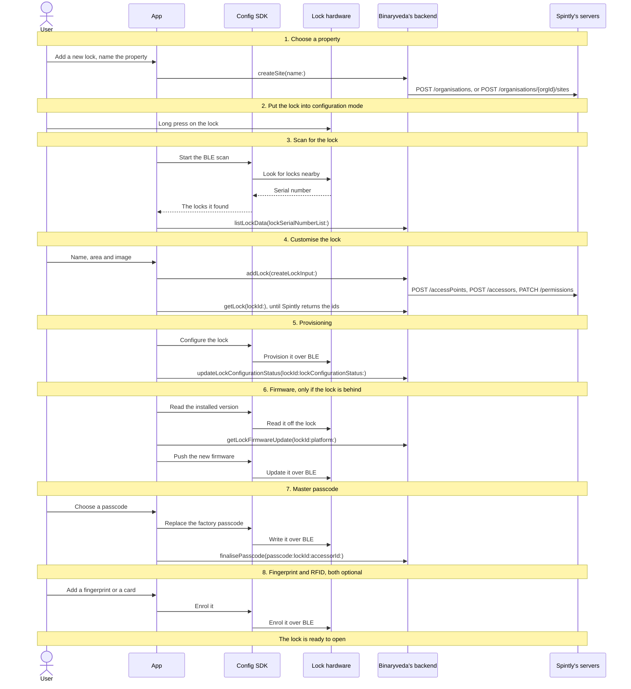
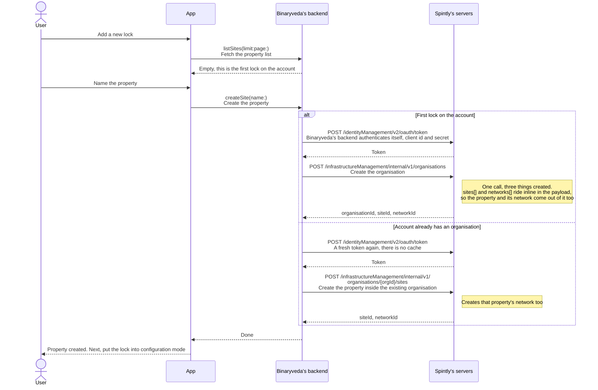

# 3. Lock Onboarding

**What it is.** Turning a factory fresh lock into a working one on the user's
account: choose a property → put the lock into configuration mode → scan for it
over BLE → name it → provision it → update the firmware if it is out of date →
set a master passcode → optionally add a fingerprint or an RFID card.

!!! warning "Key point"

    The **Config SDK** drives this flow from the scan onwards. The **Access
    SDK** is not used at all.

## Who does what

Six participants appear in the diagrams, in the same order every time.

| Participant | What it is |
|---|---|
| **User** | The person setting the lock up, standing next to it |
| **App** | The iOS or Android app |
| **Config SDK** | Spintly's `configurationProvider`, the only SDK this flow uses and the only one that can talk to the lock |
| **Lock hardware** | The lock itself, over BLE, in configuration mode |
| **Binaryveda's backend** | Binaryveda's GraphQL API, with `lock-service` behind it |
| **Spintly's servers** | Spintly's REST APIs, which only Binaryveda's backend calls |

!!! tip "Reading the diagrams"

    - Each diagram reads top to bottom, and each arrow is one call.
    - A solid arrow is a call going out. A dashed arrow is the answer coming
      back.
    - Where an arrow carries an SDK call, the **first line is the member name**
      and the second line says what it does.
    - Arrows into Binaryveda's backend carry the **GraphQL field** and its
      arguments. Arrows into Spintly carry the **HTTP method and path**
      Binaryveda's backend uses. In both cases the second line says what the
      call does.
    - A **labelled box** groups the arrows inside it. `alt` means only one of
      its halves happens, and the condition is in brackets. `opt` means the
      arrows inside may not happen at all. `loop` means they repeat. `par`
      means the two halves are happening at the same time.
    - The iOS and Android tabs are linked across the site. Pick a platform once
      and every diagram follows.

## The whole flow

Eight steps, one screen each. Each one has its own section below.



## 1. Choose a property

A lock has to live somewhere, so the first screen asks which property it belongs
to. A new user has none yet and creates one here.



The query file is `ListProperties.graphql` and the mutation file is
`CreateProperty.graphql`; the fields they call are `listSites` and `createSite`.
No SDK is involved. The app cannot tell which of the two Spintly branches ran.

## 2. Put the lock into configuration mode

A screen of instructions, no calls. The lock only answers a scan while it is in
configuration mode, which the user triggers with a long press on the lock itself.

## 3. Scan for the lock

The app asks the Config SDK to scan, and the SDK reports back any locks
advertising nearby. Each result carries a serial number, which the app sends to
Binaryveda's backend to find out which model it is.

Gateways advertise on the same channel, so both platforms have to keep them out
of the list. iOS filters them out by name. Android does nothing, because gateways
have no row in the catalogue and drop out of the lookup on their own.

=== "iOS"

    ```mermaid
    sequenceDiagram
        actor U as User
        participant A as App
        participant C as Config SDK
        participant L as Lock hardware
        participant B as Binaryveda's backend

        U->>A: Start the scan
        A->>C: configurableDeviceStopScan()<br/>Clear a scan left running from an earlier attempt
        A->>C: configurableDeviceStartScan(_:)<br/>Start looking for locks nearby
        C->>L: BLE scan, 40 second timeout
        L-->>C: Serial number and name
        C-->>A: ConfigurableDeviceListener → onDeviceListUpdated<br/>Hands back the devices found so far
        A->>A: Drop anything named Spintly_Gateway
        A->>B: listLockData(lockSerialNumberList:)<br/>Look the serial numbers up in the catalogue
        B-->>A: The model and display details for each one
        alt Locks found
            A-->>U: The list of locks. Pick one
        else Nothing found
            A-->>U: Nothing nearby, scan again
        end
    ```

=== "Android"

    ```mermaid
    sequenceDiagram
        actor U as User
        participant A as App
        participant C as Config SDK
        participant L as Lock hardware
        participant B as Binaryveda's backend

        U->>A: Start the scan
        A->>C: configurableDeviceStartScan(ConfigurableDeviceListener)<br/>Start looking for locks nearby
        C->>L: BLE scan, 60 second timeout
        L-->>C: Serial number and name
        C-->>A: ConfigurableDeviceListener → onDeviceListUpdated<br/>Hands back the devices found so far
        A->>B: listLockData(lockSerialNumberList:)<br/>Look the serial numbers up in the catalogue
        B-->>A: Only known models come back, so gateways drop out here
        alt Locks found
            A-->>U: The list of locks. Pick one
        else Nothing found
            A-->>U: Nothing nearby, scan again
        end
        A->>C: configurableDeviceStopScan()<br/>Stop the scan, once the app is finished with it
    ```

## 4. Customise the lock

The user names the lock and picks where in the house it sits. `addLock` then
tells Binaryveda's backend to build it on Spintly's side.

That takes three operations at Spintly, six HTTP requests once each one's token
fetch is counted, and they run in the background, so `addLock` returns straight
away. The app polls until the ids come back, because every Config SDK call after
this needs them.

=== "iOS"

    ```mermaid
    sequenceDiagram
        actor U as User
        participant A as App
        participant B as Binaryveda's backend
        participant S as Spintly's servers

        U->>A: Pick the lock from the list
        A->>B: listAreaOfHouse<br/>Fetch the areas of the house
        U->>A: Name it, pick an area, choose an image
        opt Custom image
            A->>B: getUploadPresignedUrl(fileType:)<br/>Ask for a presigned upload URL
            A->>A: PUT the image to that URL<br/>Straight to S3, not through Binaryveda's backend
        end
        A->>B: addLock(createLockInput:)<br/>Create the lock on Binaryveda's side and on Spintly's
        B-->>A: Accepted
        par On Binaryveda's backend
            B->>S: POST /identityManagement/v2/oauth/token<br/>A fresh token before each of the three calls below
            B->>S: POST /infrastructureManagement/internal/v2/<br/>networks/{networkId}/accessPoints<br/>Create the access point, the lock itself
            Note right of S: The serial number from the scan lands here.<br/>lock-service is on the internal/v2 contract
            B->>S: POST /identityManagement/v2/oauth/token<br/>Another token, there is no cache
            B->>S: POST /credentialManagementV3/v1/accessors<br/>Create the accessor, the owner
            Note right of S: Carries their Keycloak sub and the provider id.<br/>lock-service has no add-accessor-to-organisation call,<br/>so an owner who is an accessor elsewhere still comes through here
            B->>S: POST /identityManagement/v2/oauth/token<br/>And a third
            B->>S: PATCH /permissionManagementV3/v1/organisations/{orgId}/<br/>accessors/{accessorId}/permissions<br/>Grant the owner everything at the new lock
            Note right of S: Mobile, card, fingerprint, passcode and admin
        and In the app, meanwhile
            loop Every 2 seconds
                A->>B: getLock(lockId:)
                B-->>A: The ids so far
            end
        end
        A-->>U: All ids are in. Next, provisioning
    ```

=== "Android"

    ```mermaid
    sequenceDiagram
        actor U as User
        participant A as App
        participant B as Binaryveda's backend
        participant S as Spintly's servers

        U->>A: Pick the lock from the list
        A->>B: listAreaOfHouse<br/>Fetch the areas of the house
        U->>A: Name it, pick an area, choose an image
        opt Custom image
            A->>B: getUploadPresignedUrl(fileType:)<br/>Ask for a presigned upload URL
            A->>A: PUT the image to that URL<br/>Straight to S3, not through Binaryveda's backend
        end
        A->>B: addLock(createLockInput:)<br/>Create the lock on Binaryveda's side and on Spintly's
        B-->>A: Accepted
        par On Binaryveda's backend
            B->>S: POST /identityManagement/v2/oauth/token<br/>A fresh token before each of the three calls below
            B->>S: POST /infrastructureManagement/internal/v2/<br/>networks/{networkId}/accessPoints<br/>Create the access point, the lock itself
            Note right of S: The serial number from the scan lands here.<br/>lock-service is on the internal/v2 contract
            B->>S: POST /identityManagement/v2/oauth/token<br/>Another token, there is no cache
            B->>S: POST /credentialManagementV3/v1/accessors<br/>Create the accessor, the owner
            Note right of S: Carries their Keycloak sub and the provider id.<br/>lock-service has no add-accessor-to-organisation call,<br/>so an owner who is an accessor elsewhere still comes through here
            B->>S: POST /identityManagement/v2/oauth/token<br/>And a third
            B->>S: PATCH /permissionManagementV3/v1/organisations/{orgId}/<br/>accessors/{accessorId}/permissions<br/>Grant the owner everything at the new lock
            Note right of S: Mobile, card, fingerprint, passcode and admin
        and In the app, meanwhile
            loop Every 5 seconds
                A->>B: getLock(lockId:)
                B-->>A: The status so far
            end
        end
        A-->>U: Status reached ACCESS_POINT_CREATED. Next, provisioning
    ```

Three ids come back and the rest of the flow depends on them:
`organisationId`, `accessorId` and `accessPointId`. iOS waits for all three.
Android waits for the status to reach `ACCESS_POINT_CREATED`, which walks
`ACCESS_POINT_CREATE_PENDING` → `ACCESS_POINT_CREATED` → `MESH_CONFIGURED`.

The order of the three Spintly calls is taken from the fields the app polls,
since the backend source is not available.

## 5. Provisioning

The lock now exists on Spintly's side and the app has its ids. Provisioning
writes that same setup onto the lock itself, over BLE.

=== "iOS"

    ```mermaid
    sequenceDiagram
        actor U as User
        participant A as App
        participant C as Config SDK
        participant L as Lock hardware
        participant B as Binaryveda's backend

        A-->>U: Provisioning screen, please wait
        A->>C: startDeviceMeshConfiguration(_:)<br/>Write the lock's setup onto the lock
        C->>L: Provision the lock over BLE
        L-->>C: Configured
        C-->>A: completion<br/>Done, or failed with an error
        A->>B: updateLockConfigurationStatus(lockId:lockConfigurationStatus:)<br/>Record that the lock is provisioned, status MESH_CONFIGURED
        A-->>U: Provisioned. Next, the firmware check
    ```

    iOS never calls `meshConfigurationClose()` and waits no settle time
    afterwards. If the lock turns out to be configured already, the SDK error is
    shown to the user.

=== "Android"

    ```mermaid
    sequenceDiagram
        actor U as User
        participant A as App
        participant C as Config SDK
        participant L as Lock hardware
        participant B as Binaryveda's backend

        A-->>U: Provisioning screen, please wait
        A->>C: startDeviceMeshConfiguration(serial, callback)<br/>Write the lock's setup onto the lock
        C->>L: Provision the lock over BLE
        L-->>C: Configured
        C-->>A: SpintlyCompletionCallback → completed or failed<br/>How the SDK reports the result
        A->>C: meshConfigurationClose()<br/>Close the session, whether it worked or not
        A->>A: Wait 5 seconds for the lock to settle
        A->>B: updateLockConfigurationStatus(lockId:lockConfigurationStatus:)<br/>Record that the lock is provisioned, status MESH_CONFIGURED
        A-->>U: Provisioned. Next, the firmware check
    ```

    If the lock turns out to be configured already, the SDK reports `domain 2`
    and `code 24`. Android ignores it and carries on.

## 6. Firmware

The app reads the version off the lock and compares it against the version
Binaryveda's backend says it should be running. The update screen has no skip
button, so cancelling there leaves the lock unfinished on Home.

=== "iOS"

    ```mermaid
    sequenceDiagram
        actor U as User
        participant A as App
        participant C as Config SDK
        participant L as Lock hardware
        participant B as Binaryveda's backend

        Note over A,B: iOS checks after the Spintly calls in step 4 have finished
        A->>C: getListOfFirmwareForSerialNumber(_:)<br/>Ask which firmware the lock is running
        C->>L: Read the installed firmware
        L-->>C: ProdSwVersionsWithBleDeviceInfo
        C-->>A: bleDeviceInfo.prodSwVersion<br/>The version number on the lock
        A->>B: getLockFirmwareUpdate(lockId:platform:)<br/>What should this lock be running?
        B-->>A: updateFirmware.nordicVersion<br/>The target version
        alt Out of date
            A-->>U: Firmware update screen, with no skip
            A->>C: firmwareUpdateToSelectedVersion(_:)<br/>Send the new firmware to the lock
            C->>L: Push the new firmware over BLE
            L-->>C: Updated
            A->>B: updateLockInformation(currentFirmwareVersion:id:)<br/>or updateLockFirmwareStatus(lockId:firmwareType:), see below
            A->>A: Re-enter the flow and read the version again
        else Up to date
            A-->>U: Next, the master passcode
        end
    ```

=== "Android"

    ```mermaid
    sequenceDiagram
        actor U as User
        participant A as App
        participant C as Config SDK
        participant L as Lock hardware
        participant B as Binaryveda's backend

        Note over A,B: Android checks before the Spintly calls in step 4 have finished
        A->>C: getListOfFirmwareForSerialNumber(...)<br/>Ask which firmware the lock is running
        C->>L: Read the installed firmware
        L-->>C: ProdSwVersionsWithBleDeviceInfo
        C-->>A: bleDeviceInfo.prodSwVersion<br/>The version number on the lock
        A->>B: getLockFirmwareUpdate(lockId:platform:)<br/>What should this lock be running?
        B-->>A: The target version
        alt Out of date
            A-->>U: Firmware update screen, with no skip
            A->>C: firmwareUpdateToSelectedVersion(...)<br/>Send the new firmware to the lock
            C->>L: Push the new firmware over BLE
            L-->>C: Updated
            A->>A: onboardLock(force = true) reads both versions again
        else Up to date
            A-->>U: Next, the master passcode
        end
    ```

Nothing here reaches Spintly. The target version comes from Binaryveda's
backend, through `getLockFirmwareUpdate(lockId:platform:)`.

On iOS the version is recorded afterwards as well:
`updateLockInformation(currentFirmwareVersion:id:)` when the lock has no pending
actions, and `updateLockFirmwareStatus(lockId:firmwareType:)` when it does. Both
stop at Binaryveda's backend.

## 7. Master passcode

The lock ships with a factory passcode and this step replaces it. The Config SDK
writes the new one onto the lock, and Binaryveda's backend saves it afterwards.

=== "iOS"

    ```mermaid
    sequenceDiagram
        actor U as User
        participant A as App
        participant C as Config SDK
        participant L as Lock hardware
        participant B as Binaryveda's backend

        U->>A: Choose a new master passcode
        A->>C: updateMasterPasscode(serial, orgId, accessorId, old, new, completion)<br/>Replace the passcode held on the lock
        Note right of C: old is the factory passcode.<br/>orgId and accessorId came from step 4
        C->>L: Write the master passcode over BLE
        L-->>C: Written
        C-->>A: completion<br/>Done, or failed with an error
        A->>B: finalisePasscode(passcode:lockId:accessorId:)<br/>Save the passcode on Binaryveda's backend
        A-->>U: Passcode set. Add a fingerprint or a card, or finish here
    ```

    If the passcode is already in use the SDK returns code `1_899_102_215`. iOS
    treats that as a success.

=== "Android"

    ```mermaid
    sequenceDiagram
        actor U as User
        participant A as App
        participant C as Config SDK
        participant L as Lock hardware
        participant B as Binaryveda's backend

        U->>A: Choose a new master passcode
        A->>C: generateMasterPasscode(serial, orgId, accessorId, old, new, callback)<br/>Replace the passcode held on the lock
        Note right of C: Same arguments as iOS, different member.<br/>old is the factory passcode
        C->>L: Write the master passcode over BLE
        L-->>C: Written
        C-->>A: SpintlyCompletionCallback → completed or failed<br/>How the SDK reports the result
        A->>B: finalisePasscode(passcode, lockId, accessorId)<br/>Save the passcode on Binaryveda's backend
        A-->>U: Passcode set. Add a fingerprint or a card, or finish here
    ```

    If the passcode is already in use, Android shows the error to the user.

## 8. Fingerprint and RFID

Both are optional and both can be added later from the lock's settings instead.

### Fingerprint

=== "iOS"

    ```mermaid
    sequenceDiagram
        actor U as User
        participant A as App
        participant C as Config SDK
        participant L as Lock hardware

        U->>A: Add a fingerprint
        A->>C: fingerprintClose()<br/>Close any fingerprint session left open
        A->>C: scanAndConnectFingerprintDevice(orgId, accessPointId, 1)<br/>Connect to the lock's fingerprint reader
        C->>L: Open a BLE connection
        A->>C: performFPEnrollmentOnDevice(orgId, accessPointId, 1, accessorId, name, 60, delegate)<br/>Record the finger, 60 second timeout
        loop Each press of the finger
            U->>L: Press a finger on the reader
            L-->>C: Scan captured
            C-->>A: EnrollmentPromptStatus<br/>Progress after each press
            A-->>U: Press again, or lift and press again
        end
        C-->>A: Enrolment complete
        A->>C: fingerprintClose()<br/>Close the session
        A-->>U: The lock is ready
    ```

=== "Android"

    ```mermaid
    sequenceDiagram
        actor U as User
        participant A as App
        participant C as Config SDK
        participant L as Lock hardware

        U->>A: Add a fingerprint
        A->>C: scanAndConnectFingerprintDevice(orgId, accessPointId, 1)<br/>Connect to the lock's fingerprint reader
        C->>L: Open a BLE connection
        A->>C: performFPEnrollmentOnDevice(orgId, accessPointId, 1, accessorId, templateName, 60, FPEnrollCallback)<br/>Record the finger, 60 second timeout
        loop Each press of the finger
            U->>L: Press a finger on the reader
            L-->>C: Scan captured
            C-->>A: FPEnrollCallback → onPrompt<br/>Progress after each press
            A-->>U: Press again, or lift and press again
        end
        C-->>A: FPEnrollCallback → onComplete or onFailure<br/>How the SDK reports the result
        A->>C: fingerprintClose()<br/>Close the session, whether it worked or not
        A-->>U: The lock is ready
    ```

### RFID

=== "iOS"

    ```mermaid
    sequenceDiagram
        actor U as User
        participant A as App
        participant C as Config SDK
        participant L as Lock hardware

        U->>A: Add a card
        A->>C: nfcEnrollmentStopScan()<br/>Clear an NFC scan left running
        A->>C: scanAndConnectCardDevice(orgId, accessPointId, 1)<br/>Connect to the lock's card reader
        C->>L: Open a BLE connection
        C-->>A: NFCProcessState CONNECTED<br/>The reader is ready
        A->>C: assignCardToAccessorWithPermissionOnDevice(true, orgId, accessorId, 1, 1, true, delegate)<br/>Record the card and give it access
        Note right of C: accessorId is the current user's,<br/>falling back to the lock's
        A-->>U: Hold the card against the reader
        U->>L: Card presented
        C-->>A: NFCProcessState CARD_PLACED<br/>The card has been read
        C-->>A: AssignAndEnrollListener → onAssignedSuccess or onFailure<br/>How the SDK reports the result
        A->>C: nfcEnrollmentClose()<br/>Close the session, whether it worked or not
        A-->>U: The lock is ready
    ```

=== "Android"

    ```mermaid
    sequenceDiagram
        actor U as User
        participant A as App
        participant C as Config SDK
        participant L as Lock hardware

        U->>A: Add a card
        A->>C: scanAndConnectCardDevice(orgId, accessPointId, 1)<br/>Connect to the lock's card reader
        C->>L: Open a BLE connection
        C-->>A: RFIDPromptStatus.CONNECTED<br/>The reader is ready
        A->>C: nfcEnrollmentStopScan()<br/>Stop scanning, after connecting rather than before
        A->>C: assignCardToAccessorWithPermissionOnDevice(...)<br/>Record the card and give it access
        Note right of C: accessorId is always the lock's
        A-->>U: Hold the card against the reader
        U->>L: Card presented
        C-->>A: RFIDPromptStatus.CARD_PLACED<br/>The card has been read
        C-->>A: Enrolled
        A->>C: nfcEnrollmentClose()<br/>Close the session
        A-->>U: The lock is ready
    ```

### Where each access method ends up

| Access method | On the lock | Saved on Binaryveda's backend |
|---|---|---|
| Master passcode | Yes | Yes, through `finalisePasscode` |
| Fingerprint | Yes | No |
| RFID card | Yes | No |

A fingerprint or a card added during setup lives on the lock and nowhere else.
There is no mutation for fingerprints at all. `assignRfid` exists for cards, but
the iOS call site is commented out and Android's `AssignRfidUsecase` has no
caller, so neither platform ever sends it.

## Which calls reach Spintly

Two of the app's calls reach Spintly, and both go through Binaryveda's backend
on the way. Both platforms behave the same. The endpoints each one triggers are
on the arrows in [step 1](#1-choose-a-property) and
[step 4](#4-customise-the-lock).

| Step | Binaryveda's GraphQL operation | What Binaryveda's backend does at Spintly |
|---|---|---|
| 1 | `createSite(name:)` | Create the organisation, or create the site |
| 4 | `addLock(createLockInput:)` | Create the access point, then the accessor, then the permissions |

Every Spintly call is preceded by its own
`POST /identityManagement/v2/oauth/token`, because there is no token cache. A
first lock therefore costs two HTTP calls at step 1 and six at step 4.

Everything else stops at Binaryveda's backend: `listSites`, `listLockData`,
`listAreaOfHouse`, `getUploadPresignedUrl`, the `getLock` polling in step 4,
`updateLockConfigurationStatus`, `finalisePasscode`, and the firmware calls.

## Differences between the two

| | iOS | Android |
|---|---|---|
| Config SDK environment | Set once at app launch | Re-applied before every call |
| BLE scan timeout | 40 seconds | 60 seconds |
| Keeping gateways out | Filters on `ConfigurableDevice.name == "Spintly_Gateway"` | No filter. Gateways have no catalogue row and drop out of the lookup |
| Waiting in step 4 | `getLock` every 2 seconds, waits for all ids | `getLock` every 5 seconds, waits for `ACCESS_POINT_CREATED` |
| When the firmware is checked | After the Spintly calls have finished | Before they have |
| Firmware retry after an update | Re-enters the flow | `onboardLock(force = true)` reads both versions again |
| `meshConfigurationClose()` | Not called | Called on success and on failure |
| Settle delay after configuring | None | 5 seconds |
| A lock that is already configured | The SDK error is shown | `domain 2` and `code 24` ignored |
| **Master passcode SDK member** | **`updateMasterPasscode`** | **`generateMasterPasscode`** |
| Duplicate passcode SDK error | Code `1_899_102_215` treated as success | Shown to the user |
| `nfcEnrollmentStopScan` position | Before connecting to the reader | After connecting |
| RFID `accessorId` argument | The current user's, falling back to the lock's | Always the lock's |

## Every SDK member this flow uses

Apart from the first row of each table, every call below is the Config SDK, on
`configurationProvider`. iOS reaches them through `SpintlyHelper` and
`DefaultSpintlyViewModel`, Android through `SpintlySDKManager`.

??? note "iOS"

    | SDK | Member | When | What it is for |
    |---|---|---|---|
    | OAuth | `SpintlyHelper.login` → `setConfigSDKToken(token:)` | Before every call below | A fresh Spintly token per call, with no cache |
    | Config | `configurableDeviceStopScan()` | Before scanning | Clear a scan left running |
    | Config | `configurableDeviceStartScan(_:)` | Scan | Start the BLE scan, 40 second timeout |
    | Config | `ConfigurableDeviceListener` → `onDeviceListUpdated`, `onFailure` | Scan | How discovered devices arrive |
    | Config | `ConfigurableDevice.serialNumber`, `.name` | Scan | Serial for the catalogue lookup, `name` filters out `Spintly_Gateway` |
    | Config | `getListOfFirmwareForSerialNumber(_:)` | Firmware check | Read installed firmware off the lock |
    | Config | `ProdSwVersionsWithBleDeviceInfo.bleDeviceInfo.prodSwVersion` | Firmware check | The installed version number |
    | Config | `firmwareUpdateToSelectedVersion(_:)` | Firmware update | Push the new firmware |
    | Config | `startDeviceMeshConfiguration(_:)` | Provisioning | Provision the lock over BLE |
    | Config | `updateMasterPasscode(serial, orgId, accessorId, old, new, completion)` | Master passcode | Write the master passcode to the lock |
    | Config | `fingerprintClose()` | Before and after fingerprint | Close any open fingerprint session |
    | Config | `scanAndConnectFingerprintDevice(orgId, accessPointId, 1)` | Fingerprint | Connect to the fingerprint reader |
    | Config | `performFPEnrollmentOnDevice(orgId, accessPointId, 1, accessorId, name, 60, delegate)` | Fingerprint | Enrol the finger, 60 second timeout |
    | Config | `EnrollmentPromptStatus` | Fingerprint | Progress on each scan |
    | Config | `nfcEnrollmentStopScan()` | Before RFID | Stop a stale NFC scan |
    | Config | `scanAndConnectCardDevice(orgId, accessPointId, 1)` | RFID | Connect to the card reader |
    | Config | `assignCardToAccessorWithPermissionOnDevice(true, orgId, accessorId, 1, 1, true, delegate)` | RFID | Enrol the card and assign it to the accessor |
    | Config | `AssignAndEnrollListener` → `onAssignedSuccess`, `onStatusUpdate`, `onFailure` | RFID | How card enrolment reports back |
    | Config | `nfcEnrollmentClose()` | After RFID | Close the NFC session, on success and on failure |
    | Config | `NFCProcessState` | RFID | `CONNECTED` and `CARD_PLACED` progress |

??? note "Android"

    | SDK | Member | When | What it is for |
    |---|---|---|---|
    | OAuth | `loginWithOauthAndConfigurationSDK()` → `setEnvironment` + `setAuthToken` | Before every call below | A fresh token and environment per call |
    | Config | `configurableDeviceStartScan(ConfigurableDeviceListener)` | Scan | Start the BLE scan, exposed as a `Flow`, 60 second timeout |
    | Config | `ConfigurableDeviceListener` → `onDeviceListUpdated`, `onFailure` | Scan | How discovered devices arrive |
    | Config | `configurableDeviceStopScan()` | Scan | Stop the scan when the flow closes |
    | Config | `getListOfFirmwareForSerialNumber(...)` | Firmware check | Read installed firmware off the lock |
    | Config | `ProdSwVersionsWithBleDeviceInfo.bleDeviceInfo.prodSwVersion` | Firmware check | The installed version number |
    | Config | `firmwareUpdateToSelectedVersion(...)` | Firmware update | Push the new firmware |
    | Config | `startDeviceMeshConfiguration(serial, SpintlyCompletionCallback<Void>)` | Provisioning | Provision the lock over BLE |
    | Config | `meshConfigurationClose()` | Provisioning | Close the mesh session, on success and on failure |
    | Config | `SpintlyCFServiceException.domain` / `.code` | Provisioning | `2 / 24` means already configured, ignored |
    | Config | `generateMasterPasscode(serial, orgId, accessorId, old, new, callback)` | Master passcode | Write the master passcode to the lock |
    | Config | `scanAndConnectFingerprintDevice(orgId, accessPointId, 1)` | Fingerprint | Connect to the fingerprint reader |
    | Config | `performFPEnrollmentOnDevice(orgId, accessPointId, 1, accessorId, templateName, 60, FPEnrollCallback)` | Fingerprint | Enrol the finger, 60 second timeout |
    | Config | `FPEnrollCallback` → `onComplete`, `onPrompt`, `onFailure` | Fingerprint | Result and progress on each scan |
    | Config | `fingerprintClose()` | After fingerprint | Close the session, on completion and on failure |
    | Config | `scanAndConnectCardDevice(orgId, accessPointId, 1)` | RFID | Connect to the card reader |
    | Config | `nfcEnrollmentStopScan()` | RFID | Stop scanning once connected |
    | Config | `assignCardToAccessorWithPermissionOnDevice(...)` | RFID | Enrol the card and assign it to the accessor |
    | Config | `nfcEnrollmentClose()` | After RFID | Close the NFC session |
    | Config | `NFCProcessState` → `RFIDPromptStatus.CONNECTED` / `CARD_PLACED` | RFID | Progress |
    | Config | `SpintlyCompletionCallback<T>` → `completed`, `failed` | All | How the Config SDK reports back |
