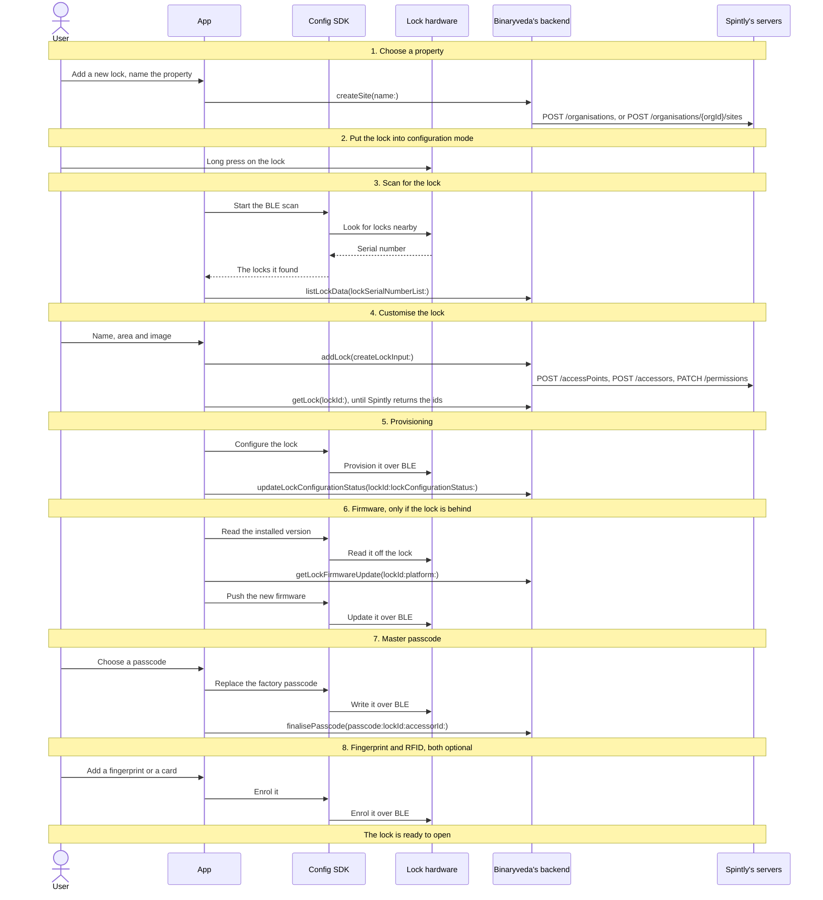
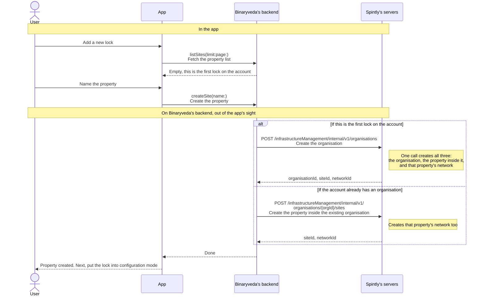

# 2. Lock Onboarding

**What it is.** Turning a factory fresh lock into a working one on the user's
account: choose a property → put the lock into configuration mode → scan for it
over BLE → name it → provision it → update the firmware if it is out of date →
set a master passcode → optionally add a fingerprint or an RFID card.

!!! warning "Key point"

    The **Config SDK** drives this flow from the scan onwards. The **Access
    SDK** is not used at all.

## Participants

This page uses User, App, Config SDK, Lock hardware, Binaryveda's backend, and
Spintly's servers.

Each one is defined, along with the shapes the diagrams use, in
[Reading these pages](conventions.md).

## The whole flow

Eight steps, one screen each. Each one has its own section below.



## 1. Choose a property

A lock has to live somewhere, so the first screen asks which property it belongs
to. A new user has none yet and creates one here.



The app sends the same `createSite` whichever branch runs, and gets the same
answer back either way, so it never finds out which one it was. Choosing between
them is Binaryveda's backend's job.

No SDK is used in this step. The two operations live in `ListProperties.graphql`
and `CreateProperty.graphql`.

## 2. Put the lock into configuration mode

The app does nothing on this screen. A factory fresh lock stays silent over BLE
until someone puts it into configuration mode by hand: remove the back panel,
hold the button marked **R** for 3 seconds, and wait for the sound cue. Only
then will it answer a scan.

So this step is instructions and a **Scan** button. No SDK, no Binaryveda's
backend, no Spintly.

## 3. Scan for the lock

The app asks the Config SDK to scan, and the SDK reports back any locks
advertising nearby. Each result carries a serial number, which the app sends to
Binaryveda's backend to find out which model it is.

Gateways advertise on the same channel, so both platforms have to keep them out
of the list. They go about it differently.

=== "iOS"

    ```mermaid
    sequenceDiagram
        actor U as User
        participant A as App
        participant C as Config SDK
        participant L as Lock hardware
        participant B as Binaryveda's backend

        U->>A: Start the scan
        A->>C: configurableDeviceStopScan()<br/>Clear a scan left running from an earlier attempt
        A->>C: configurableDeviceStartScan(_:)<br/>Start looking for locks nearby
        C->>L: BLE scan, 40 second timeout
        L-->>C: Serial number and name
        C-->>A: ConfigurableDeviceListener → onDeviceListUpdated<br/>Hands back the devices found so far
        A->>A: Drop anything named Spintly_Gateway
        A->>B: listLockData(lockSerialNumberList:)<br/>Look the serial numbers up in the catalogue
        B-->>A: The model and display details for each one
        alt If at least one lock came back
            A-->>U: The list of locks. Pick one
        else If the list is empty
            A-->>U: Nothing nearby, scan again
        end
    ```

    **iOS filters gateways out by name**, before the catalogue lookup, because
    they advertise on the same channel as locks.

=== "Android"

    ```mermaid
    sequenceDiagram
        actor U as User
        participant A as App
        participant C as Config SDK
        participant L as Lock hardware
        participant B as Binaryveda's backend

        U->>A: Start the scan
        A->>C: configurableDeviceStartScan(ConfigurableDeviceListener)<br/>Start looking for locks nearby
        C->>L: BLE scan, 60 second timeout
        L-->>C: Serial number and name
        C-->>A: ConfigurableDeviceListener → onDeviceListUpdated<br/>Hands back the devices found so far
        A->>B: listLockData(lockSerialNumberList:)<br/>Look the serial numbers up in the catalogue
        B-->>A: Only known models come back, so gateways drop out here
        alt If at least one lock came back
            A-->>U: The list of locks. Pick one
        else If the list is empty
            A-->>U: Nothing nearby, scan again
        end
        A->>C: configurableDeviceStopScan()<br/>Stop the scan, once the app is finished with it
    ```

    **Android needs no gateway filter.** Gateways have no row in the catalogue,
    so they fall out of the `listLockData` lookup on their own.

## 4. Customise the lock

The user names the lock and picks where in the house it sits. `addLock` then
tells Binaryveda's backend to build it on Spintly's side.

Three things have to be created at Spintly for that: the **access point**, which
is the lock, the **accessor**, which is the owner, and the owner's
**permissions** on the lock.

Binaryveda's backend does all three in the background, so `addLock` comes back
straight away, before any of them exist. Each one produces an id, and every
Config SDK call from provisioning onwards needs those ids, so the app sits and polls
until they arrive.

=== "iOS"

    ```mermaid
    sequenceDiagram
        actor U as User
        participant A as App
        participant B as Binaryveda's backend
        participant S as Spintly's servers

        Note over U,S: Fill in the lock's details
        U->>A: Pick the lock from the list
        A->>B: listAreaOfHouse<br/>Fetch the areas of the house
        U->>A: Name it, pick an area, choose an image
        opt If the user picked a custom image
            A->>B: getUploadPresignedUrl(fileType:)<br/>Ask for a presigned upload URL
            A->>A: PUT the image to that URL<br/>Straight to S3, not through Binaryveda's backend
        end

        Note over U,S: Create it, then wait for it to exist at Spintly
        A->>B: addLock(createLockInput:)<br/>Create the lock on Binaryveda's side and on Spintly's
        B-->>A: Accepted, before any of the work below has run
        par Binaryveda's backend works through Spintly
            B->>S: POST /infrastructureManagement/internal/v2/<br/>networks/{networkId}/accessPoints<br/>Create the access point, which is the lock
            Note right of S: The serial number from the scan lands here
            B->>S: POST /credentialManagementV3/v1/accessors<br/>Create the accessor, which is the owner
            Note right of S: Carries the owner Keycloak sub and the provider id
            B->>S: PATCH /permissionManagementV3/v1/organisations/{orgId}/<br/>accessors/{accessorId}/permissions<br/>Give the owner access to the new lock
            Note right of S: Mobile, card, fingerprint, passcode and admin are on.<br/>Face and dual auth are off
        and Meanwhile the app keeps asking whether it is ready
            loop Every 2 seconds, until all three ids arrive
                A->>B: getLock(lockId:)
                B-->>A: The ids so far
            end
        end
        A-->>U: All ids are in. Next, provisioning
    ```

    **iOS waits for all three ids** before it moves on: `organisationId`,
    `accessorId` and `accessPointId`.

=== "Android"

    ```mermaid
    sequenceDiagram
        actor U as User
        participant A as App
        participant B as Binaryveda's backend
        participant S as Spintly's servers

        Note over U,S: Fill in the lock's details
        U->>A: Pick the lock from the list
        A->>B: listAreaOfHouse<br/>Fetch the areas of the house
        U->>A: Name it, pick an area, choose an image
        opt If the user picked a custom image
            A->>B: getUploadPresignedUrl(fileType:)<br/>Ask for a presigned upload URL
            A->>A: PUT the image to that URL<br/>Straight to S3, not through Binaryveda's backend
        end

        Note over U,S: Create it, then wait for it to exist at Spintly
        A->>B: addLock(createLockInput:)<br/>Create the lock on Binaryveda's side and on Spintly's
        B-->>A: Accepted, before any of the work below has run
        par Binaryveda's backend works through Spintly
            B->>S: POST /infrastructureManagement/internal/v2/<br/>networks/{networkId}/accessPoints<br/>Create the access point, which is the lock
            Note right of S: The serial number from the scan lands here
            B->>S: POST /credentialManagementV3/v1/accessors<br/>Create the accessor, which is the owner
            Note right of S: Carries the owner Keycloak sub and the provider id
            B->>S: PATCH /permissionManagementV3/v1/organisations/{orgId}/<br/>accessors/{accessorId}/permissions<br/>Give the owner access to the new lock
            Note right of S: Mobile, card, fingerprint, passcode and admin are on.<br/>Face and dual auth are off
        and Meanwhile the app keeps asking whether it is ready
            loop Every 5 seconds, until the status is right
                A->>B: getLock(lockId:)
                B-->>A: The status so far
            end
        end
        A-->>U: Status reached ACCESS_POINT_CREATED. Next, provisioning
    ```

    **Android waits on a status rather than on ids.** It walks
    `ACCESS_POINT_CREATE_PENDING` → `ACCESS_POINT_CREATED` → `MESH_CONFIGURED`,
    and the app moves on at `ACCESS_POINT_CREATED`.

The two platforms wait differently, but the same three ids come out either way:
`organisationId`, `accessorId` and `accessPointId`. Every Config SDK call from
provisioning onwards needs them.

The permission call has to run last, because it names both the access point and
the accessor and neither exists before then. Whether the access point or the
accessor is created first is not something the app can see.

!!! note "Resuming an interrupted onboarding"

    A lock left half onboarded is picked up again with a different query,
    `resumeOnboarding`, polled every 2 seconds until Spintly confirms the three
    ids and reports the site, access point and organisation as synced. Android
    gives up after 15 tries and iOS keeps going. iOS only takes this path in
    non-production builds and stays on `getLock` everywhere else.

    The diagrams above are the normal path, for a lock being added for the first
    time.

## 5. Provisioning

The lock now exists on Spintly's side and the app has its ids. Provisioning
writes that same setup onto the lock itself, over BLE.

=== "iOS"

    ```mermaid
    sequenceDiagram
        actor U as User
        participant A as App
        participant C as Config SDK
        participant L as Lock hardware
        participant B as Binaryveda's backend

        A-->>U: Provisioning screen, please wait
        A->>C: startDeviceMeshConfiguration(_:)<br/>Write the lock's setup onto the lock
        C->>L: Provision the lock over BLE
        L-->>C: Configured
        C-->>A: completion<br/>Done, or failed with an error
        A->>B: updateLockConfigurationStatus(lockId:lockConfigurationStatus:)<br/>Record that the lock is provisioned, status MESH_CONFIGURED
        A-->>U: Provisioned. Next, the firmware check
    ```

    **iOS never calls `meshConfigurationClose()`** and waits no settle time
    afterwards.

    **If the lock turns out to be configured already**, the SDK error is shown
    to the user.

=== "Android"

    ```mermaid
    sequenceDiagram
        actor U as User
        participant A as App
        participant C as Config SDK
        participant L as Lock hardware
        participant B as Binaryveda's backend

        A-->>U: Provisioning screen, please wait
        A->>C: startDeviceMeshConfiguration(serial, callback)<br/>Write the lock's setup onto the lock
        C->>L: Provision the lock over BLE
        L-->>C: Configured
        C-->>A: SpintlyCompletionCallback → completed or failed<br/>How the SDK reports the result
        A->>C: meshConfigurationClose()<br/>Close the session, whether it worked or not
        A->>A: Wait 5 seconds for the lock to settle
        A->>B: updateLockConfigurationStatus(lockId:lockConfigurationStatus:)<br/>Record that the lock is provisioned, status MESH_CONFIGURED
        A-->>U: Provisioned. Next, the firmware check
    ```

    **If the lock turns out to be configured already**, the SDK reports
    `domain 2` and `code 24`. Android ignores it and carries on.

## 6. Firmware

The app reads the version off the lock and compares it against the version
Binaryveda's backend says it should be running. The update screen has no skip
button, so cancelling there leaves the lock unfinished on Home.

=== "iOS"

    ```mermaid
    sequenceDiagram
        actor U as User
        participant A as App
        participant C as Config SDK
        participant L as Lock hardware
        participant B as Binaryveda's backend

        Note over U,B: Compare the two versions
        A->>C: getListOfFirmwareForSerialNumber(_:)<br/>Ask which firmware the lock is running
        C->>L: Read the installed firmware
        L-->>C: ProdSwVersionsWithBleDeviceInfo
        C-->>A: bleDeviceInfo.prodSwVersion<br/>The version number on the lock
        A->>B: getLockFirmwareUpdate(lockId:platform:)<br/>What should this lock be running?
        B-->>A: updateFirmware.nordicVersion<br/>The target version

        Note over U,B: Update only if they differ
        alt If the lock is out of date
            A-->>U: Firmware update screen, with no skip
            A->>C: firmwareUpdateToSelectedVersion(_:)<br/>Send the new firmware to the lock
            C->>L: Push the new firmware over BLE
            L-->>C: Updated
            A->>B: updateLockInformation(currentFirmwareVersion:id:)<br/>or updateLockFirmwareStatus(lockId:firmwareType:), see below
            A->>A: Re-enter the flow and read the version again
        else If it is already up to date
            A-->>U: Next, the master passcode
        end
    ```

    **iOS checks the firmware after Binaryveda's backend has finished its
    three Spintly calls.**

    **The new version is recorded afterwards**, through
    `updateLockInformation(currentFirmwareVersion:id:)` when the lock has no
    pending actions, and `updateLockFirmwareStatus(lockId:firmwareType:)` when
    it does. Both stop at Binaryveda's backend.

=== "Android"

    ```mermaid
    sequenceDiagram
        actor U as User
        participant A as App
        participant C as Config SDK
        participant L as Lock hardware
        participant B as Binaryveda's backend

        Note over U,B: Compare the two versions
        A->>C: getListOfFirmwareForSerialNumber(...)<br/>Ask which firmware the lock is running
        C->>L: Read the installed firmware
        L-->>C: ProdSwVersionsWithBleDeviceInfo
        C-->>A: bleDeviceInfo.prodSwVersion<br/>The version number on the lock
        A->>B: getLockFirmwareUpdate(lockId:platform:)<br/>What should this lock be running?
        B-->>A: The target version

        Note over U,B: Update only if they differ
        alt If the lock is out of date
            A-->>U: Firmware update screen, with no skip
            A->>C: firmwareUpdateToSelectedVersion(...)<br/>Send the new firmware to the lock
            C->>L: Push the new firmware over BLE
            L-->>C: Updated
            A->>A: onboardLock(force = true) reads both versions again
        else If it is already up to date
            A-->>U: Next, the master passcode
        end
    ```

    **Android checks the firmware before Binaryveda's backend has finished
    its three Spintly calls.**

    **The new version is recorded too**, through the same two mutations as iOS,
    but from a different place. `LockOnboardingViewModel` only reads the two
    versions. `FirmwareUpdateViewModel`, the screen the flow hands off to, is
    what calls `updateLockFirmwareStatus` and `updateLockInformation` once the
    push finishes.

Nothing in this step reaches Spintly. The target version comes from Binaryveda's
backend, through `getLockFirmwareUpdate(lockId:platform:)`.

## 7. Master passcode

The lock ships with a factory passcode and this step replaces it. The Config SDK
writes the new one onto the lock, and Binaryveda's backend saves it afterwards.

=== "iOS"

    ```mermaid
    sequenceDiagram
        actor U as User
        participant A as App
        participant C as Config SDK
        participant L as Lock hardware
        participant B as Binaryveda's backend

        U->>A: Choose a new master passcode
        A->>C: updateMasterPasscode(serial, orgId, accessorId, old, new, completion)<br/>Replace the passcode held on the lock
        Note right of C: old is the factory passcode.<br/>orgId and accessorId are the ids Spintly returned<br/>when the lock was created
        C->>L: Write the master passcode over BLE
        L-->>C: Written
        C-->>A: completion<br/>Done, or failed with an error
        A->>B: finalisePasscode(passcode:lockId:accessorId:)<br/>Save the passcode on Binaryveda's backend
        A-->>U: Passcode set. Add a fingerprint or a card, or finish here
    ```

    **If the passcode is already in use**, the SDK returns code
    `1_899_102_215`. iOS treats that as a success, but only when the error
    message also contains `duplicate key value violates unique constraint`.
    The same code with any other message is shown to the user.

=== "Android"

    ```mermaid
    sequenceDiagram
        actor U as User
        participant A as App
        participant C as Config SDK
        participant L as Lock hardware
        participant B as Binaryveda's backend

        U->>A: Choose a new master passcode
        A->>C: generateMasterPasscode(serial, orgId, accessorId, old, new, callback)<br/>Replace the passcode held on the lock
        Note right of C: Same arguments as iOS, different member.<br/>old is the factory passcode
        C->>L: Write the master passcode over BLE
        L-->>C: Written
        C-->>A: SpintlyCompletionCallback → completed or failed<br/>How the SDK reports the result
        A->>B: finalisePasscode(passcode, lockId, accessorId)<br/>Save the passcode on Binaryveda's backend
        A-->>U: Passcode set. Add a fingerprint or a card, or finish here
    ```

    **If the passcode is already in use**, Android shows the SDK error to the
    user.

## 8. Fingerprint and RFID

Both are optional and both can be added later from the lock's settings instead.

### Fingerprint

=== "iOS"

    ```mermaid
    sequenceDiagram
        actor U as User
        participant A as App
        participant C as Config SDK
        participant L as Lock hardware

        U->>A: Add a fingerprint
        A->>C: fingerprintClose()<br/>Close any fingerprint session left open
        A->>C: scanAndConnectFingerprintDevice(orgId, accessPointId, 1)<br/>Connect to the lock's fingerprint reader
        C->>L: Open a BLE connection
        A->>C: performFPEnrollmentOnDevice(orgId, accessPointId, 1, accessorId, name, 60, delegate)<br/>Record the finger, 60 second timeout
        loop Once for each press of the finger
            U->>L: Press a finger on the reader
            L-->>C: Scan captured
            C-->>A: EnrollmentPromptStatus<br/>Progress after each press
            A-->>U: Press again, or lift and press again
        end
        C-->>A: Enrolment complete
        A->>C: fingerprintClose()<br/>Close the session
        A-->>U: The lock is ready
    ```

=== "Android"

    ```mermaid
    sequenceDiagram
        actor U as User
        participant A as App
        participant C as Config SDK
        participant L as Lock hardware

        U->>A: Add a fingerprint
        A->>C: scanAndConnectFingerprintDevice(orgId, accessPointId, 1)<br/>Connect to the lock's fingerprint reader
        C->>L: Open a BLE connection
        A->>C: performFPEnrollmentOnDevice(orgId, accessPointId, 1, accessorId, templateName, 60, FPEnrollCallback)<br/>Record the finger, 60 second timeout
        loop Once for each press of the finger
            U->>L: Press a finger on the reader
            L-->>C: Scan captured
            C-->>A: FPEnrollCallback → onPrompt<br/>Progress after each press
            A-->>U: Press again, or lift and press again
        end
        C-->>A: FPEnrollCallback → onComplete or onFailure<br/>How the SDK reports the result
        A->>C: fingerprintClose()<br/>Close the session, whether it worked or not
        A-->>U: The lock is ready
    ```

### RFID

=== "iOS"

    ```mermaid
    sequenceDiagram
        actor U as User
        participant A as App
        participant C as Config SDK
        participant L as Lock hardware

        U->>A: Add a card
        A->>C: nfcEnrollmentStopScan()<br/>Clear an NFC scan left running
        A->>C: scanAndConnectCardDevice(orgId, accessPointId, 1)<br/>Connect to the lock's card reader
        C->>L: Open a BLE connection
        C-->>A: NFCProcessState CONNECTED<br/>The reader is ready
        A->>C: assignCardToAccessorWithPermissionOnDevice(true, orgId, accessorId, 1, 1, true, delegate)<br/>Record the card and give it access
        Note right of C: accessorId is the current user's,<br/>falling back to the lock's
        A-->>U: Hold the card against the reader
        U->>L: Card presented
        C-->>A: NFCProcessState CARD_PLACED<br/>The card has been read
        C-->>A: AssignAndEnrollListener → onAssignedSuccess or onFailure<br/>How the SDK reports the result
        A->>C: nfcEnrollmentClose()<br/>Close the session, whether it worked or not
        A-->>U: The lock is ready
    ```

=== "Android"

    ```mermaid
    sequenceDiagram
        actor U as User
        participant A as App
        participant C as Config SDK
        participant L as Lock hardware

        U->>A: Add a card
        A->>C: scanAndConnectCardDevice(orgId, accessPointId, 1)<br/>Connect to the lock's card reader
        C->>L: Open a BLE connection
        C-->>A: RFIDPromptStatus.CONNECTED<br/>The reader is ready
        A->>C: nfcEnrollmentStopScan()<br/>Stop scanning, after connecting rather than before
        A->>C: assignCardToAccessorWithPermissionOnDevice(...)<br/>Record the card and give it access
        Note right of C: accessorId is always the lock's
        A-->>U: Hold the card against the reader
        U->>L: Card presented
        C-->>A: RFIDPromptStatus.CARD_PLACED<br/>The card has been read
        C-->>A: Enrolled
        A->>C: nfcEnrollmentClose()<br/>Close the session
        A-->>U: The lock is ready
    ```

### Where each access method ends up

| Access method | On the lock | Saved on Binaryveda's backend |
|---|---|---|
| Master passcode | Yes | Yes, through `finalisePasscode` |
| Fingerprint | Yes | No |
| RFID card | Yes | No |

A fingerprint or a card added during setup exists only on the lock itself.
Binaryveda's backend is never told about it. There is no mutation for
fingerprints at all, and the one that exists for cards, `assignRfid`, is never
sent: the iOS call site is commented out, and Android's `AssignRfidUseCase` has
no caller.

## Differences between the two

| | iOS | Android |
|---|---|---|
| Config SDK environment | Set once at app launch | Re-applied before every call |
| BLE scan timeout | 40 seconds | 60 seconds |
| Keeping gateways out | Filters on `ConfigurableDevice.name == "Spintly_Gateway"` | No filter. Gateways have no catalogue row and drop out of the lookup |
| Waiting for the Spintly ids | `getLock` every 2 seconds, waits for all ids | `getLock` every 5 seconds, waits for `ACCESS_POINT_CREATED` |
| When the firmware is checked | After the Spintly calls have finished | Before they have |
| Firmware retry after an update | Re-enters the flow and reads both versions again | `onboardLock(force = true)` reads both versions again |
| `meshConfigurationClose()` | Not called | Called on success and on failure |
| Settle delay after configuring | None | 5 seconds |
| A lock that is already configured | The SDK error is shown | `domain 2` and `code 24` ignored |
| **Master passcode SDK member** | **`updateMasterPasscode`** | **`generateMasterPasscode`** |
| Duplicate passcode SDK error | Treated as success, but only when the message also mentions a duplicate key | Shown to the user |
| `nfcEnrollmentStopScan` position | Before connecting to the reader | After connecting |
| RFID `accessorId` argument | The current user's, falling back to the lock's | Always the lock's |

## Every SDK member this flow uses

Apart from the first row of each table, every call below is the Config SDK, on
`configurationProvider`. iOS reaches them through `SpintlyHelper` and
`DefaultSpintlyViewModel`, Android through `SpintlySDKManager`.

??? note "iOS"

    | SDK | Member | When | What it is for |
    |---|---|---|---|
    | OAuth | `SpintlyHelper.login` → `setConfigSDKToken(token:)` | Before every call below | A fresh Spintly token per call, with no cache |
    | Config | `configurableDeviceStopScan()` | Before scanning | Clear a scan left running |
    | Config | `configurableDeviceStartScan(_:)` | Scan | Start the BLE scan, 40 second timeout |
    | Config | `ConfigurableDeviceListener` → `onDeviceListUpdated`, `onFailure` | Scan | How discovered devices arrive |
    | Config | `ConfigurableDevice.serialNumber`, `.name` | Scan | Serial for the catalogue lookup, `name` filters out `Spintly_Gateway` |
    | Config | `getListOfFirmwareForSerialNumber(_:)` | Firmware check | Read installed firmware off the lock |
    | Config | `ProdSwVersionsWithBleDeviceInfo.bleDeviceInfo.prodSwVersion` | Firmware check | The installed version number |
    | Config | `firmwareUpdateToSelectedVersion(_:)` | Firmware update | Push the new firmware |
    | Config | `startDeviceMeshConfiguration(_:)` | Provisioning | Provision the lock over BLE |
    | Config | `updateMasterPasscode(serial, orgId, accessorId, old, new, completion)` | Master passcode | Write the master passcode to the lock |
    | Config | `fingerprintClose()` | Before and after fingerprint | Close any open fingerprint session |
    | Config | `scanAndConnectFingerprintDevice(orgId, accessPointId, 1)` | Fingerprint | Connect to the fingerprint reader |
    | Config | `performFPEnrollmentOnDevice(orgId, accessPointId, 1, accessorId, name, 60, delegate)` | Fingerprint | Enrol the finger, 60 second timeout |
    | Config | `EnrollmentPromptStatus` | Fingerprint | Progress on each scan |
    | Config | `nfcEnrollmentStopScan()` | Before RFID | Stop a stale NFC scan |
    | Config | `scanAndConnectCardDevice(orgId, accessPointId, 1)` | RFID | Connect to the card reader |
    | Config | `assignCardToAccessorWithPermissionOnDevice(true, orgId, accessorId, 1, 1, true, delegate)` | RFID | Enrol the card and assign it to the accessor |
    | Config | `AssignAndEnrollListener` → `onAssignedSuccess`, `onStatusUpdate`, `onFailure` | RFID | How card enrolment reports back |
    | Config | `nfcEnrollmentClose()` | After RFID | Close the NFC session, on success and on failure |
    | Config | `NFCProcessState` | RFID | `CONNECTED` and `CARD_PLACED` progress |

??? note "Android"

    | SDK | Member | When | What it is for |
    |---|---|---|---|
    | OAuth | `loginWithOauthAndConfigurationSDK()` → `setEnvironment` + `setAuthToken` | Before every call below | A fresh token and environment per call |
    | Config | `configurableDeviceStartScan(ConfigurableDeviceListener)` | Scan | Start the BLE scan, exposed as a `Flow`, 60 second timeout |
    | Config | `ConfigurableDeviceListener` → `onDeviceListUpdated`, `onFailure` | Scan | How discovered devices arrive |
    | Config | `configurableDeviceStopScan()` | Scan | Stop the scan when the flow closes |
    | Config | `getListOfFirmwareForSerialNumber(...)` | Firmware check | Read installed firmware off the lock |
    | Config | `ProdSwVersionsWithBleDeviceInfo.bleDeviceInfo.prodSwVersion` | Firmware check | The installed version number |
    | Config | `firmwareUpdateToSelectedVersion(...)` | Firmware update | Push the new firmware |
    | Config | `startDeviceMeshConfiguration(serial, SpintlyCompletionCallback<Void>)` | Provisioning | Provision the lock over BLE |
    | Config | `meshConfigurationClose()` | Provisioning | Close the mesh session, on success and on failure |
    | Config | `SpintlyCFServiceException.domain` / `.code` | Provisioning | `2 / 24` means already configured, ignored |
    | Config | `generateMasterPasscode(serial, orgId, accessorId, old, new, callback)` | Master passcode | Write the master passcode to the lock |
    | Config | `scanAndConnectFingerprintDevice(orgId, accessPointId, 1)` | Fingerprint | Connect to the fingerprint reader |
    | Config | `performFPEnrollmentOnDevice(orgId, accessPointId, 1, accessorId, templateName, 60, FPEnrollCallback)` | Fingerprint | Enrol the finger, 60 second timeout |
    | Config | `FPEnrollCallback` → `onComplete`, `onPrompt`, `onFailure` | Fingerprint | Result and progress on each scan |
    | Config | `fingerprintClose()` | After fingerprint | Close the session, on completion and on failure |
    | Config | `scanAndConnectCardDevice(orgId, accessPointId, 1)` | RFID | Connect to the card reader |
    | Config | `nfcEnrollmentStopScan()` | RFID | Stop scanning once connected |
    | Config | `assignCardToAccessorWithPermissionOnDevice(...)` | RFID | Enrol the card and assign it to the accessor |
    | Config | `nfcEnrollmentClose()` | After RFID | Close the NFC session |
    | Config | `NFCProcessState` → `RFIDPromptStatus.CONNECTED` / `CARD_PLACED` | RFID | Progress |
    | Config | `SpintlyCompletionCallback<T>` → `completed`, `failed` | All | How the Config SDK reports back |
