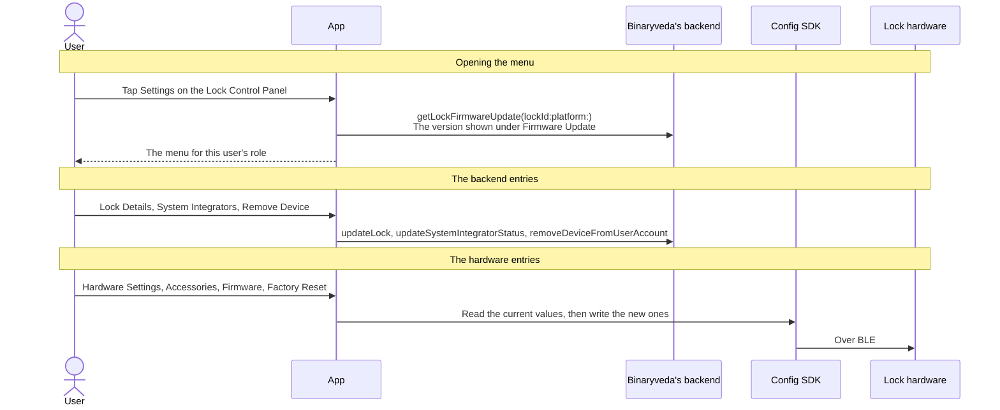
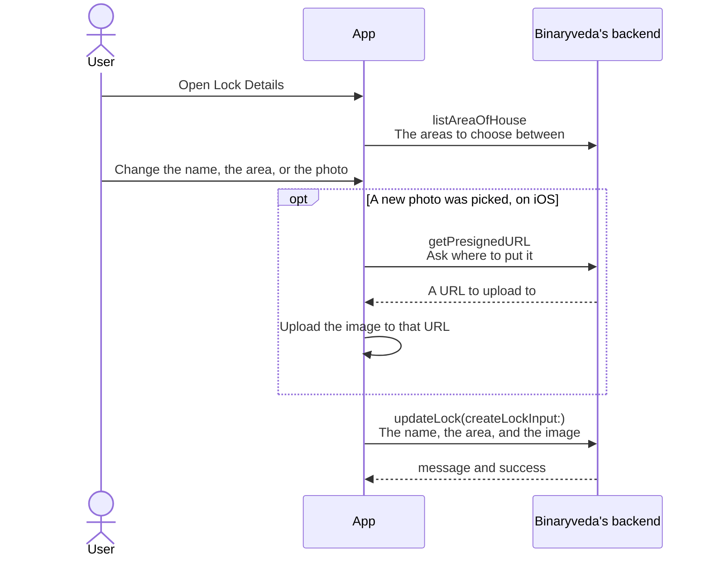
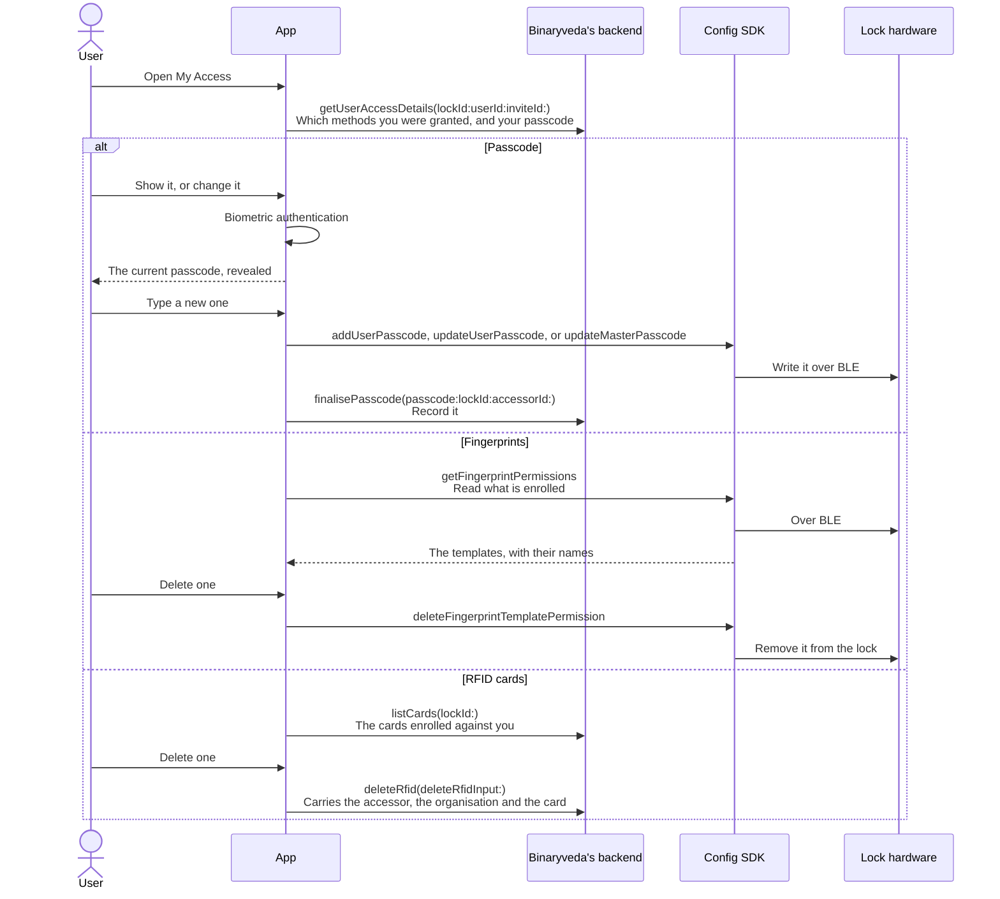
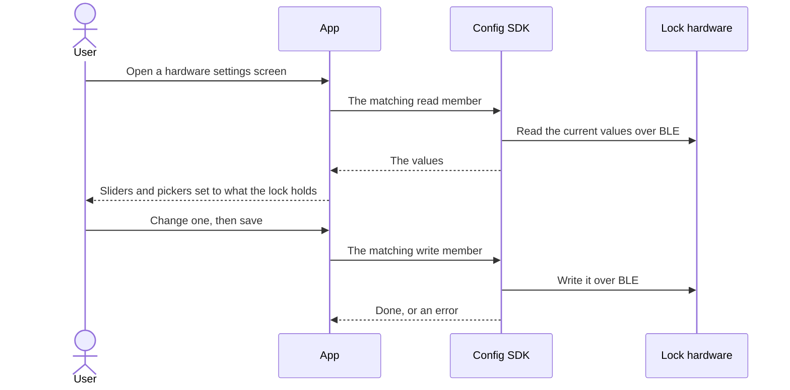
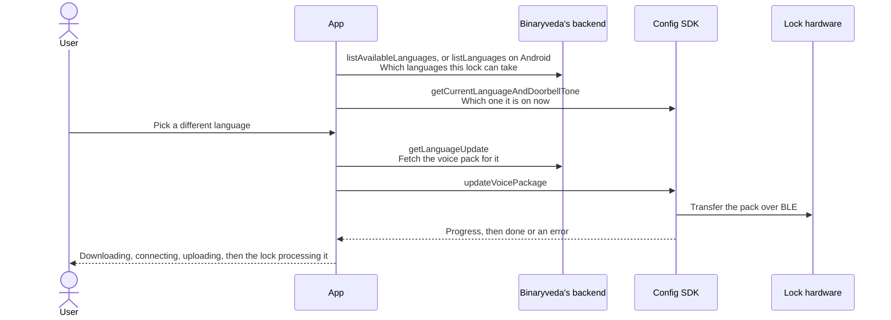
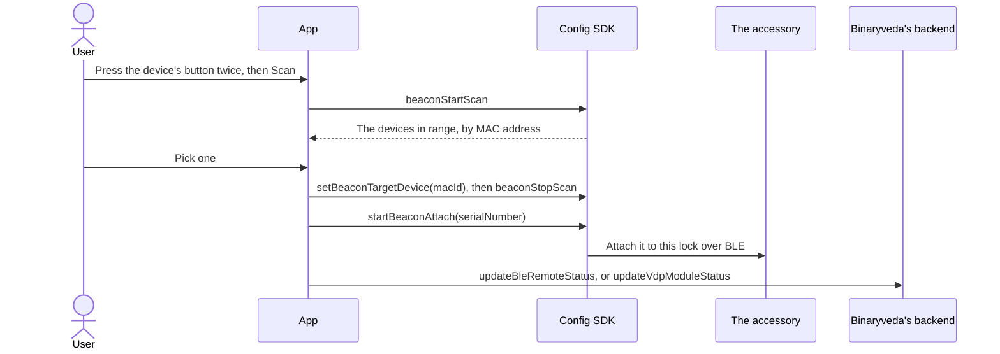
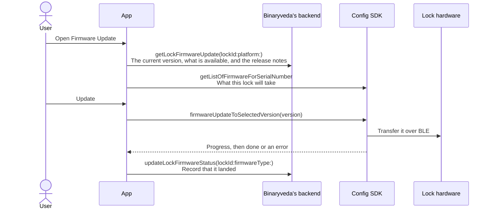
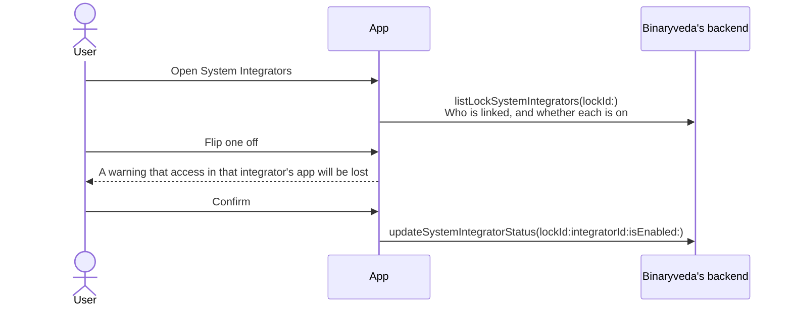
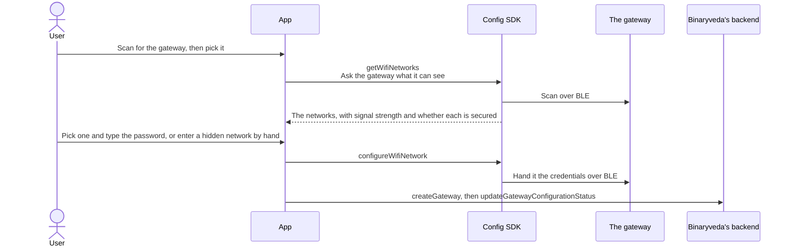
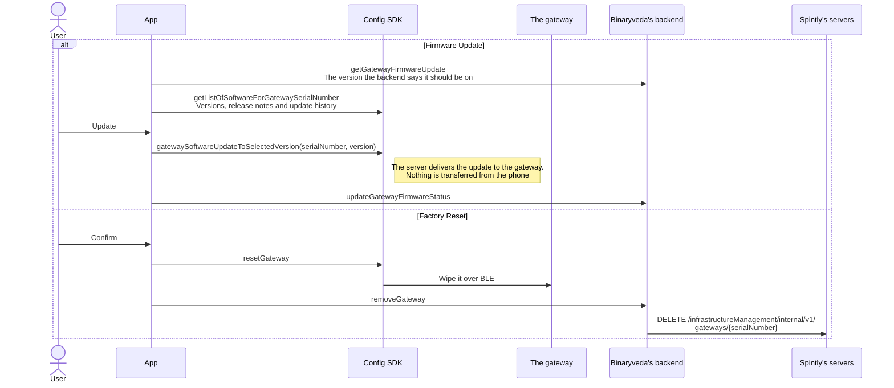

# 7. Lock Settings

**What it is.** Everything behind the **Settings** button on the
[Lock Control Panel](lock-control-panel.md). One menu, whose entries cover the
lock's name and photo, the hardware settings written into the lock itself, the
accessories attached to it, firmware, third party access, and the two ways of
getting rid of the lock.

!!! warning "Key point"

    This is the **Config SDK's** page. Hardware settings, accessories and
    firmware are all written to the lock over BLE, so the phone has to be near
    it. The menu itself, the lock's name and photo, and the records of what was
    done are Binaryveda's backend.

    Three actions reach Spintly's servers, and all three take something away:
    a factory reset, removing a lock from your own account, and removing a
    gateway.

## Participants

This page uses User, App, Config SDK, Lock hardware, Binaryveda's backend, and
Spintly's servers.

Each one is defined, with the colour it keeps across the site, in
[Reading these pages](conventions.md).

## The menu, and who sees what

Thirteen entries exist. Which of them are drawn depends on the signed in user's
role on that lock, and on whether the lock has finished onboarding.

| Entry | Owner | Primary | Secondary |
|---|---|---|---|
| **Lock Details** | Yes | Yes | No |
| **My Access** | Yes | Yes | Yes |
| **Hardware Settings** | Yes | Yes | No |
| **Accessories** | Yes | No | No |
| **Voice Assistants** | Yes | Yes | Yes |
| **System Integrators** | Yes | Yes | iOS only |
| **FAQs**, **Manual**, **Get Help** | Yes | Yes | Yes |
| **Firmware Update** | Yes | iOS only | No |
| **Factory Reset** | Yes | No | No |
| **About Lock** | Yes | Yes | Yes |
| **Remove Device** | No | Yes | Yes |

**Factory Reset and Remove Device are the same idea at two scales**, and no role
ever sees both. The owner gets Factory Reset, which wipes the lock and takes it
off everyone's account. Everyone else gets Remove Device, which drops it from
their own account and leaves the lock alone.

### While the lock is still being set up

A lock with onboarding left to finish shows a cut down menu, because most
entries would act on a lock that is not fully configured yet. The owner keeps
FAQs, Get Help, About Lock and Factory Reset, so the reset is always available
as a way out of a half finished lock. A primary or secondary user keeps FAQs,
Get Help and About Lock.

A lock counts as unfinished when it has a pending master or user passcode, a
pending critical firmware update, or a configuration status that is anything
other than fully meshed.

## The whole flow

The menu itself costs one call. Everything below it is its own flow, and each
has its own section.



Nothing else is fetched when the menu opens. The lock's name, role, model and
serial number all arrive with the lock that
[Home](home.md) and the Control Panel already hold.

## 1. Lock Details

Renaming the lock, changing which area of the house it sits in, and changing its
photo. All three go out on one mutation, and a new photo is uploaded before it.



On iOS the photo goes straight to storage rather than through the backend, and
only the resulting key travels on `updateLock`. Android has no presigned URL
step and sends the image with the mutation.

## 2. My Access

Your own access methods on this lock: your passcode, your enrolled fingerprints,
and your RFID cards. Only the methods you were granted are listed, and
**enrolling** a fingerprint or a card is the same work as at the end of lock
onboarding, covered in
[Fingerprint and RFID](lock-onboarding.md#8-fingerprint-and-rfid). What belongs
to this screen is the passcode, seeing what you already have, and removing it.



The passcode comes back on `getUserAccessDetails`, and biometric authentication
guards both showing it and changing it. Which write member runs depends on what
is there already: `addUserPasscode` for a first one, `updateUserPasscode` to
replace it, and `updateMasterPasscode` for the owner's master passcode. Both
update members send the old value with the new.

Cards are unassigned at the backend, so one can be deleted from anywhere.
Fingerprint templates sit in the lock, so that list needs the phone nearby and
is the only entry here that asks for Bluetooth and location permission.

Deleting anything is refused while
[dual authentication](user-management.md#6-managing-users-afterwards) is on for
you. Fingerprints are capped at four, and iOS caps cards at one.

!!! note "NFC is built but never shown"

    Both apps carry a fourth method, **NFC**, with its own name, icon and
    screen. Both also leave it out of the list that the screen draws, so it
    never appears on either platform. `getUserAccessDetails` still returns a
    `mobileNfc` flag, and both apps ignore it here.

    NFC tap is still granted on the invite and still opens the lock. It is only
    the My Access entry that is dead, which matches
    [User Management](user-management.md#5-the-other-access-methods), where NFC
    needs no enrolment and never appears on an invited user's setup list.

## 3. Hardware Settings

Everything here is stored **in the lock**, not on the backend, and the screen is
blocked when the lock is out of range.

**All four groups work the same way**, so one diagram covers them. Read the
current values out of the lock, show them, write the new ones back.



What changes between them is only which members run. These are the same on both
platforms.

| Group | What it holds | Read with | Written with |
|---|---|---|---|
| **Sound** | Lock volume, keypad volume and doorbell volume, each 0 to 5 | `readSoundSettings` | `updateLockSoundSettings` |
| **Lights** | Keypad light intensity, 1 to 5 | `readLEDIntensitySettings` | `updateLEDIntensitySettings` |
| **Timeout Alerts** | Tamper alarm duration, prank alarm duration, and the door ajar alarm | `readTimeoutAlertSettings` | `updateTamperAlarmSettings`, `updatePrankAlarmSettings`, `updateDOTLSettings` |
| **Lock Audio and Door Bell** | The lock's spoken language and its doorbell tone | `getCurrentLanguageAndDoorbellTone` | `updateVoicePackage`, `setDoorbellTone` |

Keypad light intensity starts at 1, so the lights cannot be turned off entirely.

Timeout Alerts reads its three values together but writes them separately, so
changing more than one runs more than one BLE write. `updateDOTLSettings` carries
both the door ajar timeout and whether the alarm is on, so turning it off still
sends a duration.

### Changing the lock's audio language

Lock Audio Language is the one setting that breaks the pattern above, because
the voice pack has to come from the backend before it can go to the lock.



This is the lock's spoken prompts, not the app's own language. The transfer runs
in stages and reports progress back, because it moves a file rather than a
handful of bytes.

**The two platforms ask for the language list with different queries.** iOS
sends `listAvailableLanguages`; Android's screen sends `listLanguages`.

## 4. Accessories

Owner only. Two devices sit behind it:

- **BLE Remote**, a key fob that opens the lock.
- **VDP Module**, which connects a video door phone panel to the lock. The app
  only provisions it. Video and intercom stay in that hardware.

The Config SDK treats both as beacons, so every call below is the same for
either one. Only the backend field names differ.

### Attaching one



### Once it is attached

`listBleRemotes` and `listVdpModules` say what this lock has. An accessory has
no name, only a MAC address, so its settings screen holds two entries:

- **Firmware Update**, which is `getListOfFirmwareForBeacon` and then
  `firmwareUpdateToSelectedVersion`. The firmware transfers from the phone over
  BLE. Android asks the backend what is available first, with
  `getBLERemoteFirmwareUpdate` or `getVDPModuleFirmwareUpdate` depending on the
  accessory. iOS takes the list from the SDK alone.
- **Factory Reset**, which is biometric authentication, then `resetBeacon`, then
  `removeBleRemote` or `removeVdpModule`.

## 5. Firmware Update

The lock's own firmware. The backend says what is available, the Config SDK
lists what the lock will accept, and the transfer runs over BLE.



`getLockFirmwareUpdate` is also called when the menu opens, to put the version
under the Firmware Update row.

An update marked **critical** holds the lock in the unfinished state described
above until it is applied.

## 6. System Integrators

Third party services that have been given access to the lock. **They are not
invited from this app.** Linking starts in the integrator's own application, and
this screen only switches an already linked integrator on or off for one lock.



The switch is per lock, so turning an integrator off here leaves it on for every
other lock it was linked to.

## 7. Voice Assistants

Alexa and Google Home, switched on or off for this lock. Linking the account
itself happens under Profile rather than here, and this screen only decides
whether an already linked assistant may act on this lock. It goes out on
`updateVoiceAssistancePreferences`.

Voice commands can read whether a lock is locked or unlocked, read its mode, and
unlock it. There is no command to lock.

## 8. Factory Reset and Remove Device

Two different actions that both end with the lock gone from the app.

**Factory Reset is the owner's**, needs the phone near the lock, and needs
biometric authentication. It wipes the lock over BLE and then tells the backend
to take it apart, which is what removes it from every other user's app too.

**Remove Device is everyone else's**, needs nothing but a confirmation, and
touches neither the lock nor anyone else's account.

=== "Factory Reset"

    ```mermaid
    sequenceDiagram
        actor U as User
        participant A as App
        participant C as Config SDK
        participant L as Lock hardware
        participant B as Binaryveda's backend
        participant S as Spintly's servers

        U->>A: Factory Reset, then confirm
        A-->>U: A warning covering the activity trail, the access methods and every added user
        U->>A: Pass biometric authentication
        A->>C: resetDevice
        C->>L: Wipe the lock over BLE
        C-->>A: Done, or an error
        A->>B: updateLockConfigurationStatus(lockId:lockConfigurationStatus:)<br/>Mark the reset as under way
        A->>B: removeLock(lockSerialNumber:)
        B->>S: DELETE /infrastructureManagement/internal/v1/<br/>accessPoints/{accessPointId}<br/>Take the lock's access point away
        A-->>U: Back to Home, with the lock gone
    ```

    **The configuration status is written before the removal.** If the BLE wipe
    succeeds and the removal does not, the lock is left in a reset pending state
    rather than looking untouched, and the reduced menu offers the reset again.

=== "Remove Device"

    ```mermaid
    sequenceDiagram
        actor U as User
        participant A as App
        participant B as Binaryveda's backend
        participant S as Spintly's servers

        U->>A: Remove Device, then confirm
        A-->>U: A warning that saved passcodes and fingerprints go with it
        A->>B: removeDeviceFromUserAccount(lockId:)
        B->>S: PATCH /permissionManagementV3/v1/organisations/{orgId}/<br/>accessors/{accessorId}/permissions<br/>The access point goes in permissionsToRemove
        Note right of S: One call only. The accessor itself is left alone,<br/>so the user keeps their access to every other lock
        A-->>U: Back to Home
    ```

    **No SDK member runs and the lock is never contacted**, so this works from
    anywhere. The lock keeps working for everyone else.

    **This is not the same as an owner removing someone**, which is
    [removeUser in User Management](user-management.md#what-changing-a-user-does-at-spintly)
    and can take the accessor out of the organisation. Leaving a lock yourself
    never does.

Both Spintly paths above are the same ones
[User Management](user-management.md#what-changing-a-user-does-at-spintly) uses
when an owner removes somebody else. The difference is only who asked.

## 9. About Lock, FAQs, Manual and Get Help

The four read only entries.

| Entry | Where its content comes from |
|---|---|
| **About Lock** | The lock the app already holds, for the device name, model name and number, and serial number. The fingerprint count is read from the lock with `getFingerprintPermissions`, so no backend call is made |
| **FAQs** | `getFaqs` |
| **Manual** | `getProductManualLink`, keyed on the lock's model id, opened in a web view |
| **Get Help** | `createSupportTicket`, then `listSupportTickets` and `viewSupportTicket` on iOS |

## The Wi-Fi Gateway

**The gateway is not a Lock Settings entry.** It is a device of its own, added
during onboarding and managed from its own card on [Home](home.md). It is
covered here because it is the third piece of hardware the Config SDK writes to,
and because its firmware works differently from everything else on this page.

The gateway bridges the lock to the internet. It is what makes a lock report
Online or Offline, what carries push notifications while the user is away, and
what the remote unlock falls back to when Bluetooth is out of range.

### Adding one, and changing its network



**The gateway does the scanning, not the phone.** The network list is whatever
the gateway can reach from where it is plugged in, which is the point.

A hidden network is typed in by hand, with its security type picked from a list.
Failures come back as the access point not being found, or the password being
wrong.

### Gateway settings

Six entries, from the gateway's card on Home: **Edit Module Name**,
**Connections**, **Wi-Fi Network**, **About**, **Firmware Update** and
**Factory Reset**. The last two are owner only.

Opening the settings reads the gateway itself with `getGateway`, which is what
About is drawn from. Connections lists the locks this gateway serves, from
`listConnections`. Renaming goes out on `updateGateway`.



**Gateway firmware is the one update the phone does not carry.** The SDK asks
for the version and the server delivers it to the gateway in the background. A
lock, a BLE remote and a VDP module all take their firmware from the phone over
BLE instead.

## Differences between the two

| | iOS | Android |
|---|---|---|
| Firmware Update for a primary user | Shown | Hidden |
| System Integrators for a secondary user | Shown | Hidden |
| System Integrators overall | Behind a feature flag | Always built in |
| Voice Assistants overall | Always built in | Behind a build flag |
| The reduced menu while a lock is unfinished | FAQs, Get Help, About Lock, and Factory Reset for an owner | The same, plus Manual and Voice Assistants, and plus Remove Device for a primary or secondary user |
| Renaming a fingerprint | A sheet opens, but its Update button only closes it. Nothing is saved and no call is made | No rename anywhere |
| Menu entries defined but unreachable | The fingerprint rename sheet | Notifications, Diagnosis and Backup are defined, appear in no menu, and do nothing when tapped |

## Every SDK member this flow uses

All of them belong to the **Config SDK**, and all of them need a Spintly session
token handed over with `setAuthToken` first. The members are the same on both
platforms, and differ only in how each reports back: a `completion` closure on
iOS, a callback interface on Android.

??? note "iOS"

    | Member | When | What it is for |
    |---|---|---|
    | `configurationProvider.setAuthToken(token:)` | Before any write | Authorise the SDK |
    | `configurationProvider.addUserPasscode` | My Access | Write a first passcode |
    | `configurationProvider.updateUserPasscode` | My Access | Replace an existing one, carrying the old value |
    | `configurationProvider.updateMasterPasscode` | My Access | Replace the owner's master passcode |
    | `configurationProvider.getFingerprintPermissions` | My Access | List the fingerprints enrolled in the lock |
    | `configurationProvider.deleteFingerprintTemplatePermission` | My Access | Remove one from the lock |
    | `configurationProvider.readSoundSettings` | Sound | Read the three volumes |
    | `configurationProvider.updateLockSoundSettings` | Sound | Write them back |
    | `configurationProvider.readLEDIntensitySettings` | Lights | Read the keypad intensity |
    | `configurationProvider.updateLEDIntensitySettings` | Lights | Write it back |
    | `configurationProvider.readTimeoutAlertSettings` | Timeout Alerts | Read all three timeouts |
    | `configurationProvider.updateTamperAlarmSettings` | Timeout Alerts | Write the tamper duration |
    | `configurationProvider.updatePrankAlarmSettings` | Timeout Alerts | Write the prank cooldown |
    | `configurationProvider.updateDOTLSettings` | Timeout Alerts | Write the door ajar timeout and its flag |
    | `configurationProvider.getCurrentLanguageAndDoorbellTone` | Lock Audio and Door Bell | Read the current pair |
    | `configurationProvider.setDoorbellTone` | Door Bell | Write the tone |
    | `configurationProvider.updateVoicePackage` | Lock Audio Language | Transfer the voice pack |
    | `configurationProvider.getListOfFirmwareForSerialNumber` | Firmware Update | Versions the lock will take |
    | `configurationProvider.firmwareUpdateToSelectedVersion` | Firmware Update, and accessories | Transfer the firmware |
    | `configurationProvider.beaconStartScan`, `beaconStopScan` | Accessories | Find one in range |
    | `configurationProvider.setBeaconTargetDevice` | Accessories | Aim at the one picked |
    | `configurationProvider.startBeaconAttach` | Accessories | Tie it to the lock |
    | `configurationProvider.getListOfFirmwareForBeacon` | Accessories | Versions the accessory will take |
    | `configurationProvider.resetBeacon` | Accessories | Wipe it |
    | `configurationProvider.resetDevice` | Factory Reset | Wipe the lock |
    | `configurationProvider.getWifiNetworks` | Gateway | What the gateway can see |
    | `configurationProvider.configureWifiNetwork` | Gateway | Hand it the credentials |
    | `configurationProvider.getListOfSoftwareForGatewaySerialNumber` | Gateway | Versions, notes and history |
    | `configurationProvider.gatewaySoftwareUpdateToSelectedVersion` | Gateway | Ask the server to deliver it |
    | `configurationProvider.resetGateway` | Gateway | Wipe it |

??? note "Android"

    The same members, in the same places. Android takes a callback object where
    iOS takes a `completion` closure, and `setAuthToken(authToken)` drops the
    argument label.

    Three names differ:

    | iOS | Android |
    |---|---|
    | `updateUserPasscode` | `updatePasscode` |
    | `updateMasterPasscode` | `generateMasterPasscode` |
    | `getVersion`, `setDebugLogging` | Neither exists |
