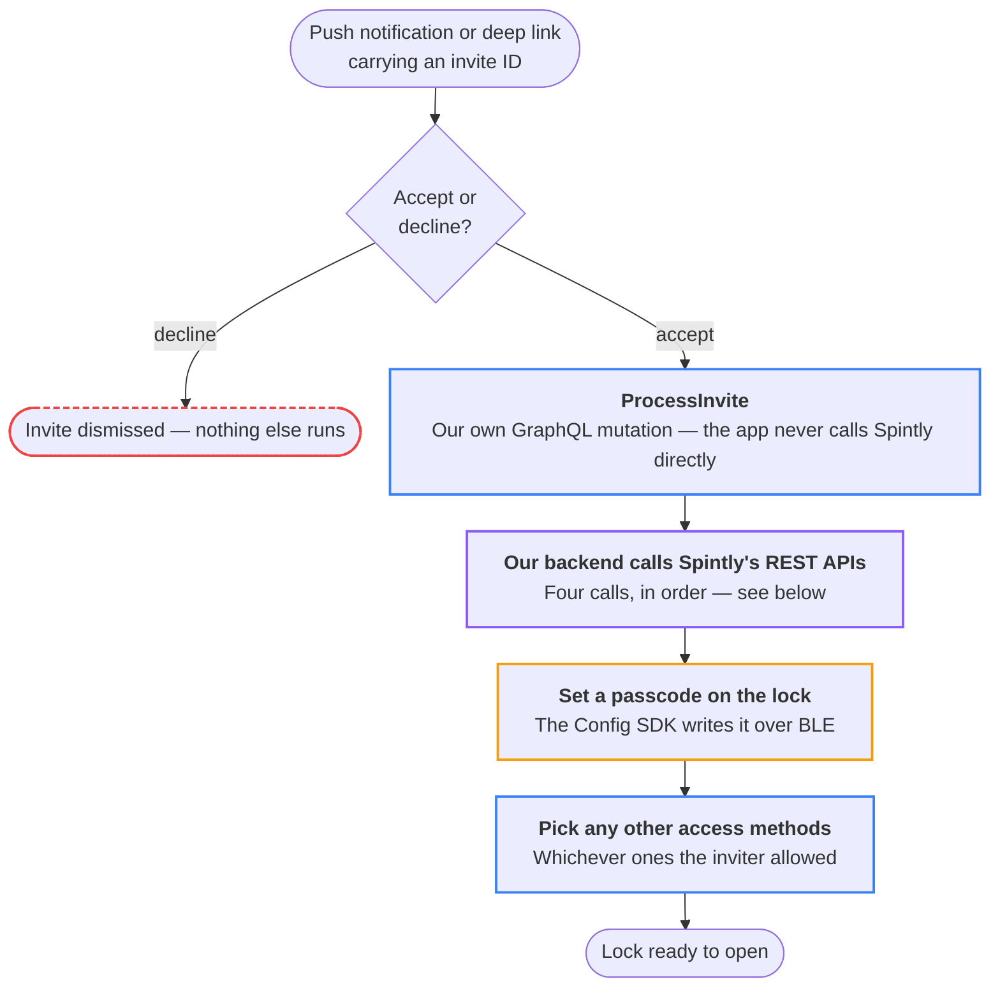
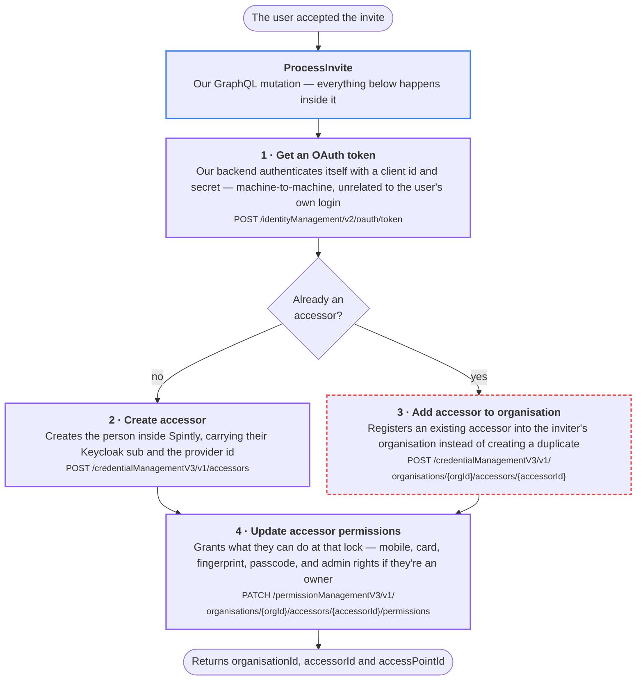

# 2. Lock Share Invites

**What it is.** Someone shares a lock with you. Push notification or deep link
carrying an invite ID → accept or decline → set a passcode on the lock → pick
any other access methods the inviter allowed.

**Not part of onboarding.** It happens to an already-logged-in user and can fire
at any time — days or months after they signed up, and as often as people share
locks with them. [User Onboarding](user-onboarding.md) runs once, up front; this
runs whenever an invite arrives.

!!! warning "Key point"

    The only flow that reaches **Spintly's backend** or writes to the **lock
    hardware**.

Three different systems do the work, in this order — the app, our backend, and
then the lock itself:



!!! info "Accessor"

    Spintly's word for a person who can open a door is an **accessor**. Three of
    Spintly's IDs matter here — `organisationId`, `accessorId` and
    `accessPointId`.

## What our backend calls at Spintly

`ProcessInvite` is **ours** — a GraphQL mutation the app fires when someone
accepts or declines an invite. The four calls below are **Spintly's**, made by
our backend, never by the app.

<p class="sdk-key">
  <span class="k-access">our own backend</span>
  <span class="k-oauth">Spintly's REST API</span>
  <span class="k-flow">start / result</span>
  <span class="k-fail">alternative path</span>
</p>



!!! note "No token cache"

    Step 1 is re-fetched before **each** of the calls below it — there is no
    token cache anywhere in this flow.

Steps 2 and 3 are alternatives, not a sequence: a brand-new person is created,
an existing accessor is registered into the inviter's organisation. Either way
step 4 runs afterwards.

The three IDs that come back — `organisationId`, `accessorId` and
`accessPointId` — are Spintly's, and the app passes them straight into the
Config SDK below. Every other backend call in this flow stays inside our own
backend.

## Writing the passcode to the lock

One Config SDK member does the actual hardware write, and it is the same call
with the same arguments on both platforms. It needs a valid Spintly token first
— the OAuth exchange from
[User Onboarding](user-onboarding.md#3-after-login-trading-the-keycloak-token),
which both platforms re-run just before the write.

<p class="sdk-key">
  <span class="k-oauth">OAuth SDK</span>
  <span class="k-config">Config SDK</span>
  <span class="k-flow">app step</span>
</p>

=== "iOS"

    ```mermaid
    %%{init:{"flowchart":{"wrappingWidth":520,"nodeSpacing":24,"rankSpacing":28}}}%%
    flowchart TD
        S(["Invite accepted, passcode chosen"]) --> N0
        N0["<b>Re-run the OAuth exchange</b><br/>The Config SDK will not write without a valid Spintly token"]
        N0 --> N1["<b>1 · configurationProvider.addUserPasscode(serial, orgId, accessorId, passcode, completion)</b><br/>Write the passcode to the lock over BLE"]
        N1 --> E(["Passcode live on the lock"])

        classDef sdkOauth stroke:#8b5cf6,stroke-width:2px
        classDef sdkConfig stroke:#f59e0b,stroke-width:2px
        class N0 sdkOauth
        class N1 sdkConfig
    ```

=== "Android"

    ```mermaid
    %%{init:{"flowchart":{"wrappingWidth":520,"nodeSpacing":24,"rankSpacing":28}}}%%
    flowchart TD
        S(["Invite accepted, passcode chosen"]) --> N0
        N0["<b>Re-run the OAuth exchange</b><br/>The Config SDK will not write without a valid Spintly token"]
        N0 --> N1["<b>1 · configurationProvider.addUserPasscode(serial, orgId, accessorId, passcode, callback)</b><br/>Write the passcode to the lock over BLE"]
        N1 --> N2["<b>2 · SpintlyCompletionCallback&lt;Void&gt; → completed, failed</b><br/>How the Config SDK reports the result back — no iOS equivalent"]
        N2 --> E(["Passcode live on the lock"])

        classDef sdkOauth stroke:#8b5cf6,stroke-width:2px
        classDef sdkConfig stroke:#f59e0b,stroke-width:2px
        class N0 sdkOauth
        class N1,N2 sdkConfig
    ```

The only difference between the platforms is the last argument and what comes
back through it: iOS takes a `completion` closure, Android takes a `callback`
and reports through `SpintlyCompletionCallback<Void>`.
