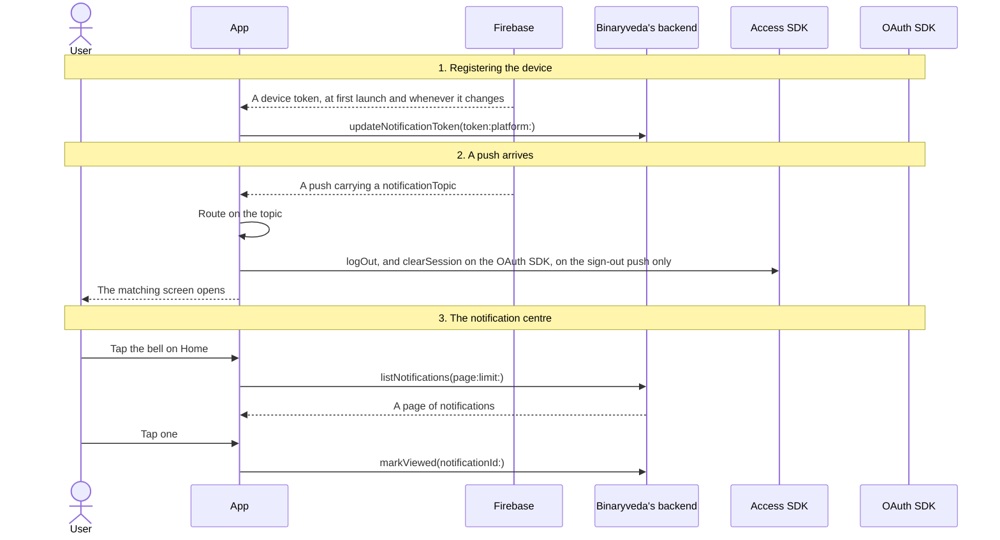
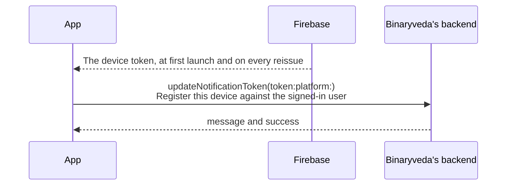
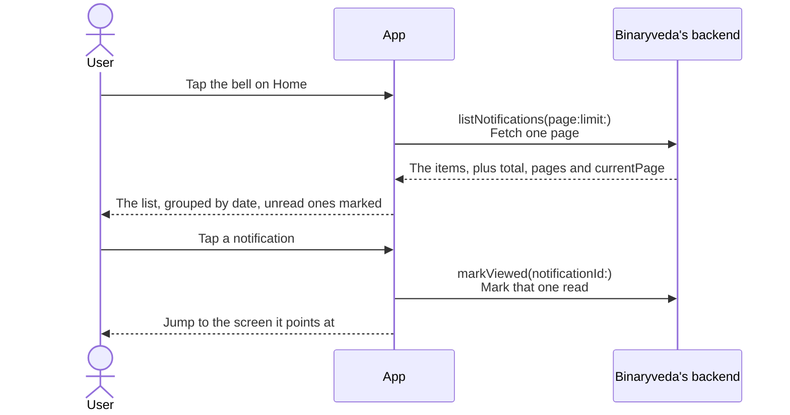

# 6. Notifications

**What it is.** Two separate things that share a name: **push notifications**,
which arrive from Firebase and route the user to a screen, and the
**notification centre** behind the bell on Home, which is a paged list held on
Binaryveda's backend.

!!! warning "Key point"

    Only one push topic reaches a Spintly SDK, the sign-out one. Everything else
    on this page is Firebase and Binaryveda's backend.

## Who does what

Six participants appear across the diagrams. Each diagram shows only the ones
it needs.

| Participant | What it is |
|---|---|
| **User** | The person holding the phone |
| **App** | The iOS or Android app |
| **Firebase** | Firebase Cloud Messaging, which carries the push and issues the device token |
| **Binaryveda's backend** | Binaryveda's GraphQL API, which stores the token and the notification list |
| **Access SDK** | Spintly's `serviceProvider`, whose session is cleared on sign-out |
| **OAuth SDK** | Spintly's `oauthManager`, whose session is cleared alongside it |

!!! tip "Reading the diagrams"

    Each diagram reads top to bottom. Every participant has a vertical line, and
    every arrow between two lines is one call.

    | What you see | What it means |
    |---|---|
    | **Solid arrow** | A call going out, from whoever it starts at to whoever it points at |
    | **Dashed arrow** | The answer coming back. Also used when Firebase delivers a push on its own |
    | **Arrow that loops back to its own line** | Work the app does by itself. Nothing leaves the app |
    | **Two lines on an arrow** | The first line is the member or GraphQL field being called, the second says what it does |
    | **Grey banner across the whole diagram** | A heading, marking where one part of the flow ends and the next begins |
    | **Box labelled `alt`** | A choice between two paths. A dashed line splits the box into a top half and a bottom half, each with its own condition above it. Exactly one of the two halves happens |

    The iOS and Android tabs are linked across the site. Pick a platform once
    and every diagram follows.

## The whole flow

Three steps. Each one has its own section below.



## 1. Registering the device

Firebase issues the device a token. The app hands it to Binaryveda's backend,
which is what lets the backend address a push at this phone. Firebase reissues
the token from time to time, and the app sends the new one each time.



Both platforms send the same mutation and pass their own platform value. No SDK
is involved.

## 2. A push arrives

Every push carries a `notificationTopic`, and that string decides what the app
does. The list of topics is the same on both platforms.

| Topic | What the app does |
|---|---|
| `LOGOUT` | Signs the user out. **The only topic that touches a Spintly SDK** |
| `NEW_LOCK_INVITE` | Opens the invite screen, carrying the invite id |
| `ACTIVITY_TRAIL` | Opens the activity trail for the property in the payload |
| `LOCK_FIRMWARE_UPDATE` | Opens the firmware update screen |
| `GATEWAY_FIRMWARE_UPDATE` | Opens the firmware update screen |
| `DOORBELL` | Raises a local notification reading "Someone was at {lock} door!" |
| `REMOTE_UNLOCK_REQUEST` | Nothing. The handler is commented out on both platforms |

=== "iOS"

    ```mermaid
    sequenceDiagram
        actor U as User
        participant A as App
        participant F as Firebase
        participant S as Access SDK
        participant O as OAuth SDK

        F-->>A: Push delivered, carrying notificationTopic
        alt If the topic is LOGOUT
            A->>A: Check the push's sessionId matches this user's token
            A->>S: credentialManager.logOut()<br/>Clear the Access SDK session
            A->>O: oauthManager.clearSession()<br/>Clear the OAuth session
            A->>A: Delete the Firebase token
            A-->>U: Signed out
        else Any other topic
            A->>A: Route on the topic
            A-->>U: The matching screen opens
        end
    ```

    **iOS splits the handling in two.** `handleScreenRedirection` runs when the
    user taps a push, and covers sign-out, invites, the activity trail and
    firmware. `handleSilentPush` runs for pushes that arrive without the user
    doing anything, and covers only sign-out and the doorbell.

    **The sign-out push is checked before it is acted on.** The `sessionId` in
    the payload has to match the `sid` in the user's own token, so a push meant
    for a different session is ignored.

=== "Android"

    ```mermaid
    sequenceDiagram
        actor U as User
        participant A as App
        participant F as Firebase
        participant S as Access SDK
        participant O as OAuth SDK

        F-->>A: Push delivered, carrying notificationTopic
        alt If the topic is LOGOUT
            A->>S: credentialManager.logOut()<br/>Clear the Access SDK session
            A->>O: oauthManager.clearSession()<br/>Clear the OAuth session
            A->>A: Delete the Firebase token, then post a logout event
            A-->>U: Signed out
        else Any other topic
            A->>A: Build a system notification and route on the topic
            A-->>U: The matching screen opens when it is tapped
        end
    ```

    **Android handles every topic in one place**, `onMessageReceived`, and
    builds the system notification itself rather than letting Firebase display
    it.

    **The doorbell push gets a fixed notification id**, so a second ring
    replaces the first rather than stacking. Its title is written from how long
    ago the ring was: "Doorbell Rang" if it just happened, then the time,
    then "yesterday at", then the full date.

## 3. The notification centre

The bell on Home opens a history of notifications, a page at a time.
Binaryveda's backend keeps a record for each one: a title, a body, a timestamp,
whether the user has read it, and a code saying what kind it is.



The two platforms do not recognise the same set of codes.

| Code | iOS | Android |
|---|---|---|
| `NEW_LOCK_INVITE` | Yes | Yes |
| `LOCK_INVITE_ACCEPTED` | Yes | Yes |
| `LOCK_OFFLINE` | Yes | Yes |
| `LOCK_BATTERY_STATUS` | Yes | Yes |
| `LOCK_FIRMWARE_UPDATE` | Yes | Yes |
| `GATEWAY_FIRMWARE_UPDATE` | Yes | Yes |
| `LOCK_ONLINE` | Yes | **No** |
| `LOCK_INVITE_DECLINED` | Yes | **No** |

There is no way to mark everything read. `markViewed` takes one id at a time.

## Differences between the two

| | iOS | Android |
|---|---|---|
| Sign-out push | Checks the push's `sessionId` against the token's `sid` first | Acts on it directly |
| Notification codes recognised | Eight | Six, without `LOCK_ONLINE` and `LOCK_INVITE_DECLINED` |

## Every SDK member this flow uses

Only the sign-out push reaches a Spintly SDK. iOS goes through
`SpintlyHelper.logout()`, Android through `SpintlySDKManager.logout()`, and both
run the same two calls in the same order.

??? note "iOS"

    | SDK | Member | When | What it is for |
    |---|---|---|---|
    | Access | `credentialManager.logOut()` | A sign-out push, once the session id matches | Clear the Access SDK session |
    | OAuth | `oauthManager.clearSession()` | A sign-out push, once the session id matches | Clear the OAuth session |

??? note "Android"

    | SDK | Member | When | What it is for |
    |---|---|---|---|
    | Access | `credentialManager.logOut()` | A sign-out push | Clear the Access SDK session |
    | OAuth | `oauthManager.clearSession()` | A sign-out push | Clear the OAuth session |
