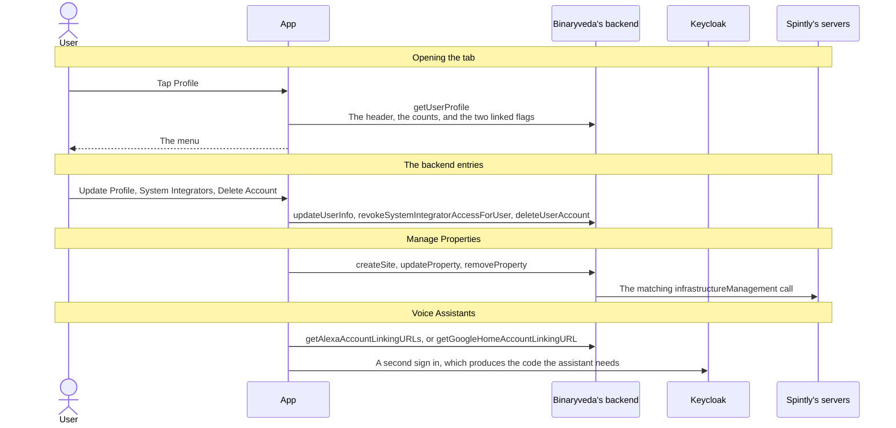
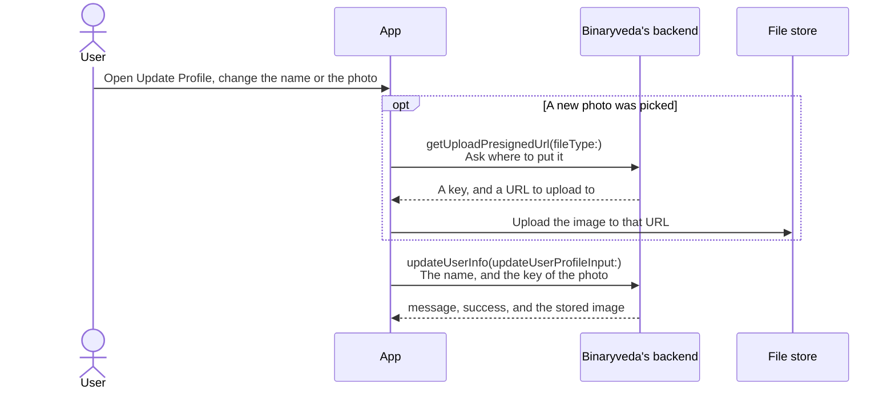
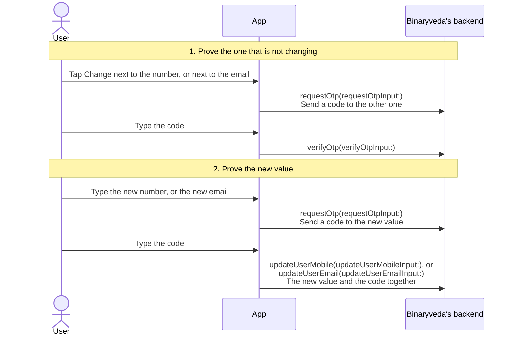
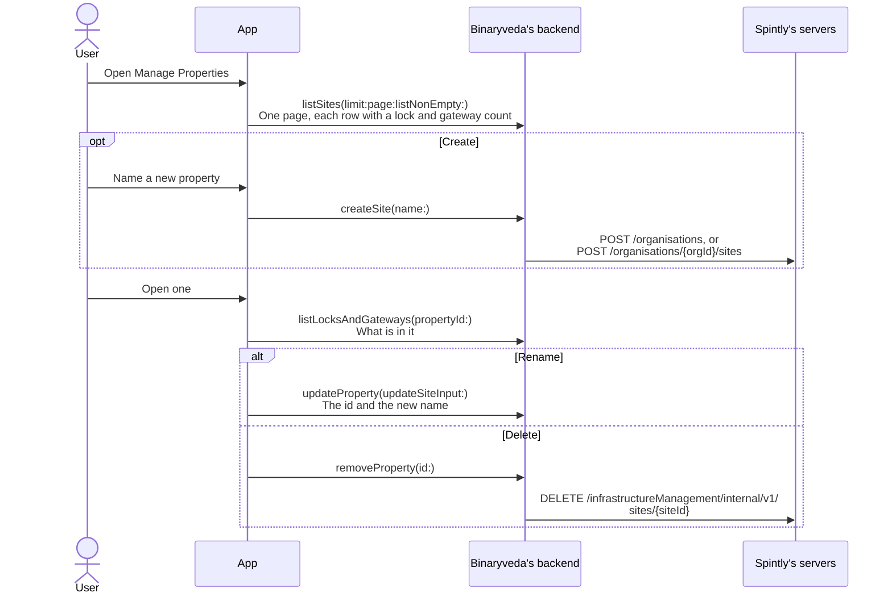
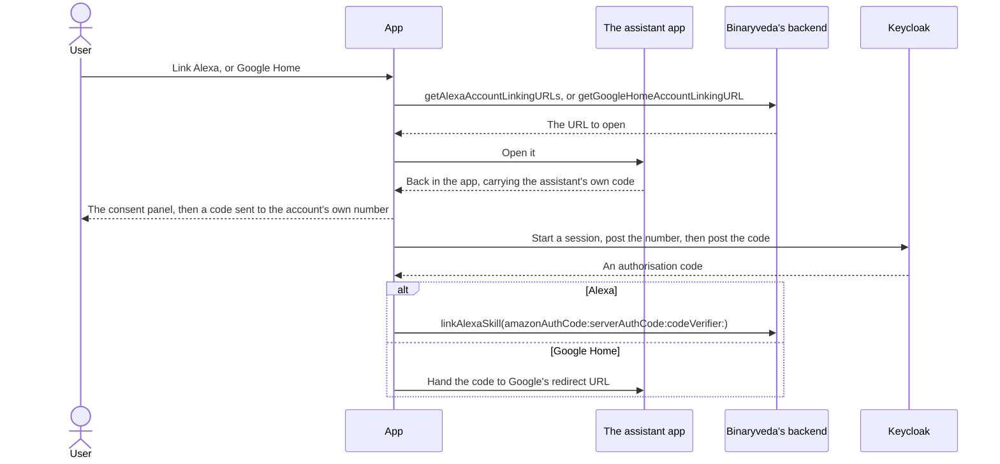
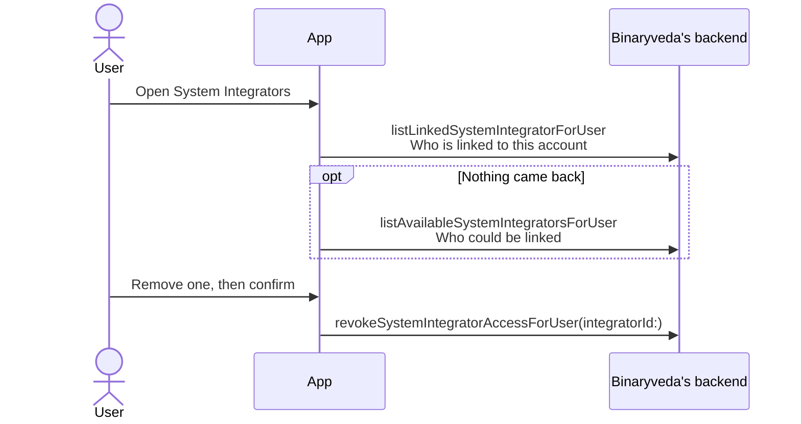
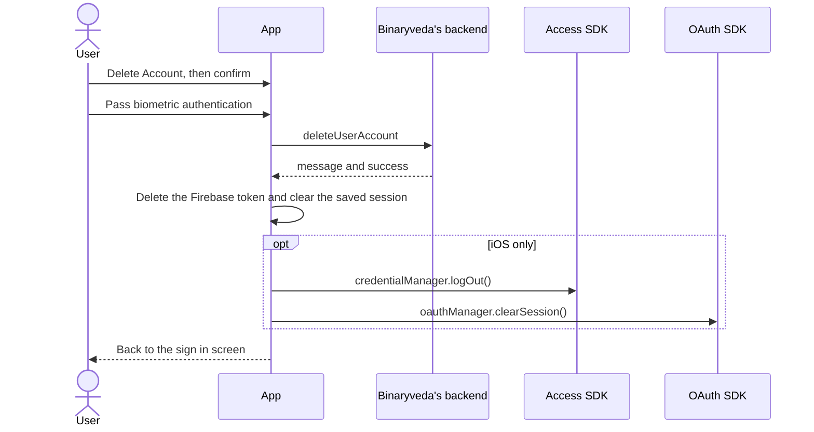

# 9. Profile and Account

**What it is.** The Profile tab and everything behind it: the account's own
details, the properties it holds, the assistants and third party services linked
to it, and the two ways of leaving.

!!! warning "Key point"

    This is Binaryveda's backend's page. **Only Manage Properties reaches
    Spintly's servers**, because a property is a Spintly site, and the only
    entry that reaches a Spintly SDK is Delete Account, on iOS alone.

    Two entries make no call at all: Support and Terms & Policies both read
    values built into the app.

## Participants

This page uses User, App, Binaryveda's backend, Keycloak, Spintly's servers, and
the File store a profile photo is uploaded to. Voice Assistants adds the
assistant's own app, which is not one of the shared participants.

Each one is defined, with the colour it keeps across the site, in
[Reading these pages](conventions.md).

## The menu

Nine entries, in the same order on both platforms. None of them depends on the
user's role, because nothing on this page belongs to a lock. What varies between
the two is which entries are built in at all.

| Entry | What it is |
|---|---|
| **Update Profile** | The name and the photo, and the way in to changing the phone number or the email |
| **Manage Properties** | The properties on the account, and the locks and gateways in each |
| **Add Device** | Opens the sheet for adding a lock or a gateway, which is [Lock Onboarding](lock-onboarding.md). It makes no call of its own |
| **Voice Assistants** | Links or unlinks Alexa and Google Home for the whole account |
| **System Integrators** | The third party services linked to the account, and removing one |
| **Support** | Two phone numbers, an email address and a website |
| **Terms & Policies** | The terms and conditions, and the privacy policy |
| **Delete Account** | Deletes the account, behind biometric authentication |
| **Sign Out** | Covered in [User Onboarding](user-onboarding.md#7-sign-out) |

## The whole flow

Opening the tab costs one query. Everything below it is its own flow, and each
has its own section.

## 1. Opening the tab

`getUserProfile` fills the header on its own. It carries the name, email, mobile
code and number, the profile photo, the counts shown under them, and
`alexaLinked` and `googleAssistanceLinked`, which the Voice Assistants screen
reads again when it opens.

Nothing else is fetched. The same query runs at the end of sign in, covered in
[Mobile number and OTP](user-onboarding.md#2-mobile-number-and-otp).

## 2. Update Profile

The name and the photo. The phone number and the email are drawn greyed out with
a **Change** link each, and those two go to the next section.

**The photo never travels through the backend.** It goes straight to the file
store on both platforms, and only its key is sent on the mutation. This is the
same arrangement Lock Details uses for a lock's photo on iOS, described in
[Lock Settings](lock-settings.md#1-lock-details).

`UpdateUserProfileInput` holds `name` and `profileImage` and nothing else, so the
number and the email cannot be changed here.

## 3. Changing the phone number or the email

**Each is verified against the other.** Changing the number starts by proving
the email, and changing the email starts by proving the number. Whichever is
being changed, it is four calls and two codes.

`requestOtp` and `verifyOtp` both carry the same two enums, and that pair is the
only thing separating the four calls above.

| Field | What it says |
|---|---|
| `updateDetailsOf` | Which field is being changed, `MOBILE` or `EMAIL` |
| `requestFor` | Where the code is being sent |

The two are opposites in step 1 and identical in step 2.

The last call has no separate verify step. `updateUserMobile` and
`updateUserEmail` take the code alongside the new value and write it in one go.

!!! note "An account with no email yet skips step 1"

    There is nothing to verify against, so both platforms send
    `verifyEmailForFirstLogin(email:)` in place of the first `requestOtp` and go
    straight to the new value. The app lands on this screen on its own when
    [Home](home.md#1-opening-home) finds the profile has no email.
Both apps submit the code as soon as the field is full, and both stop doing so
after a wrong one, so the button matters only on a retry.

## 4. Manage Properties

A property is a Spintly **site**, so creating one and deleting one both reach
Spintly's servers. Creating is the same call the first step of
[Lock Onboarding](lock-onboarding.md#1-choose-a-property) makes, including its
branch for the first property on an account.

**A property holding a lock or a gateway cannot be deleted.** Android checks the
two counts and refuses before sending. iOS sends and shows what comes back.

## 5. Voice Assistants

Alexa and Google Home, linked to the **account** here and then switched on per
lock in [Lock Settings](lock-settings.md#7-voice-assistants). Both steps are
needed before a voice command reaches a lock.

**Linking is an account linking handshake rather than a call.** The app sends the
user to the assistant's own app, the assistant sends them back, and the app then
runs a second Keycloak sign in to produce the authorisation code the assistant is
waiting for.

**Only Alexa finishes at Binaryveda's backend.** Google Home's code goes back to
Google, which redeems it itself, so there is no matching mutation for it.

Alexa's URL arrives as a pair: `alexaAppURL`, a universal link into the Alexa
app, and `lwaFallbackURL`, used when that app is not installed.

Unlinking is one call either way, `unlinkAccountWithAlexa` or
`unlinkAccountWithGoogleAssistance`, with no handshake and no code.

## 6. System Integrators

The integrators linked to the **account**, as against the per lock switch of the
same name in [Lock Settings](lock-settings.md#6-system-integrators). Linking
still starts in the integrator's own application, so this screen lists and
removes, and nothing else.

**The second query only runs when the first returns nothing.** An account with
no integrator sees what it could link instead, as a read only list with nothing
to tap.

Revoking here takes the integrator off the whole account, so it covers every lock
at once. The Lock Settings switch is one lock at a time.

## 7. Support and Terms & Policies

Neither reaches the backend.

| Entry | Where its content comes from |
|---|---|
| **Support** | Two phone numbers, an email address and a website, all constants in the app. Tapping one opens the dialler, the mail client, or the browser |
| **Terms & Policies** | Two URLs from the app's build configuration. iOS opens them in a web view, Android in its PDF viewer |

This is the account level counterpart of **Get Help** in
[Lock Settings](lock-settings.md#9-about-lock-faqs-manual-and-get-help), which
does raise a ticket. Support here only hands over the contact details.

## 8. Delete Account

Biometric authentication, one mutation, then the app tears down what it holds.

**The teardown only runs on a success.** A failed mutation leaves the user signed
in with the error shown, and the biometric check has to be passed again.

**Android leaves the Spintly sessions alone here.** It clears them when the next
sign in starts instead, which is the platform difference already recorded in
[User Onboarding](user-onboarding.md#differences-between-the-two).

Sign Out ends much the same way, with `logOut` in place of `deleteUserAccount`
and no biometric. The order those calls run in is in
[User Onboarding](user-onboarding.md#7-sign-out).

## Differences between the two

| | iOS | Android |
|---|---|---|
| Sign Out | A button under the menu | The last row of the menu |
| System Integrators | Behind a feature flag | Always built in |
| Voice Assistants | Always built in | Behind a build flag |
| The counts under the header | `propertyCount`, `ownedLockCount` and `ownedGatewayCount`, all from `getUserProfile` | `lockCount` and `gatewayCount` from `getUserProfile`, and the property count from the length of `listAssignedProperties`, which Home already holds |
| Resending the code for a new number or email | Sends the request against the other channel with empty values, so no code arrives | Sends it again to the new value |
| `codeVerifier` on `linkAlexaSkill` | The PKCE verifier generated for the session | The literal string `toBeRemoved` |
| Deleting a property that still holds devices | Sent, and the backend's answer is shown | Refused before sending |
| Clearing the Spintly sessions after Delete Account | Part of the same teardown | Left to the next sign in |
| Developer only entry | **Developer Dashboard**, a menu row hidden in production | A long press on Terms & Policies, which opens a Quick Access screen |
| Menu entries defined but unreachable | None | **FAQs**, defined and commented out of the list |

## Every SDK member this flow uses

**Only iOS reaches an SDK anywhere on this page**, and only from Delete Account.
It runs the same two members a sign out does, through `SpintlyHelper.logout()`.

| SDK | Member | When | What it is for |
|---|---|---|---|
| Access | `credentialManager.logOut()` | Once the account is deleted | Clear the Access SDK session |
| OAuth | `oauthManager.clearSession()` | Once the account is deleted | Clear the OAuth session |

Android calls neither. Nothing else on this page, on either platform, touches an
SDK at all.
