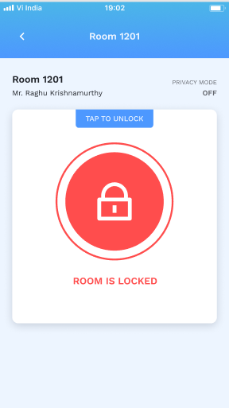
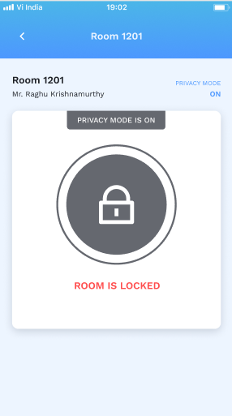
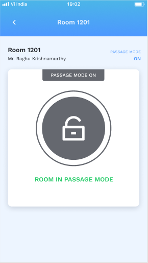
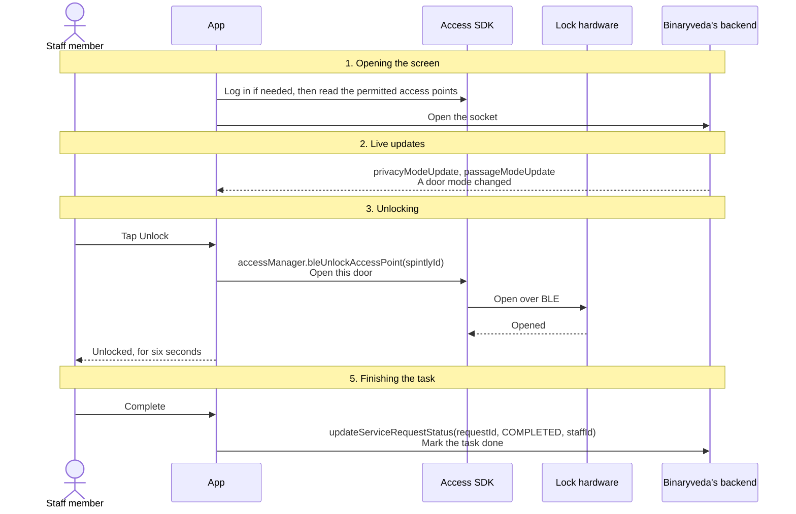
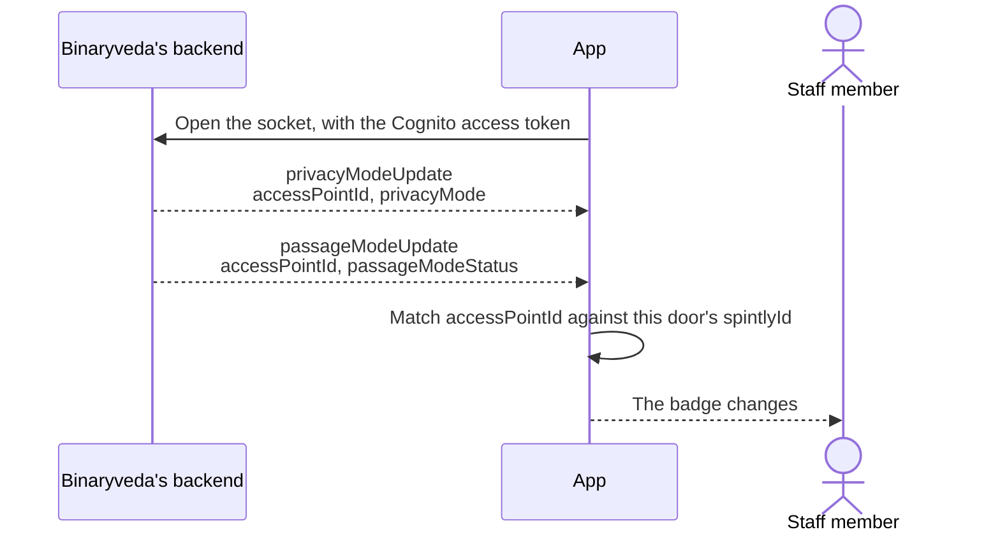
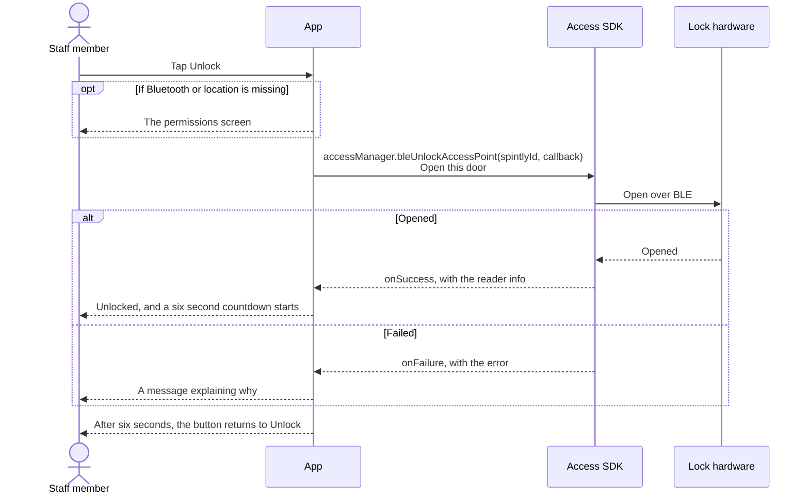
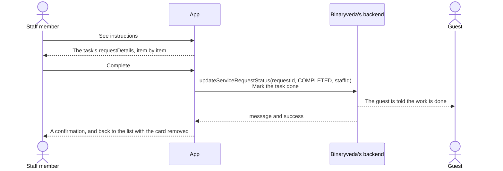

# 5. Control Panel

**What it is.** One door, and the button that opens it. This is the only screen
in the app where an SDK opens anything.

**How to get there.** Four routes lead to the same screen: tap a card on the
[Rooms](rooms.md) tab, tap **Access Control Panel** on an expanded task card,
tap a [Search](search.md) result, or tap through from a
[notification](notifications.md). Only the routes that start from a task carry
**See instructions** and **Mark Complete**.

!!! warning "Key point"

    Every unlock here is **Bluetooth**. Both platforms carry the code for a
    remote unlock through the gateway, and neither calls it. See
    [step 3](#3-unlocking).

## Participants

This page uses Staff member, App, Access SDK, Lock hardware and Binaryveda's
backend.

Each one is defined, with the colour it keeps across the site, in
[Reading these pages](conventions.md).

## What is on the screen

| | Where it comes from |
|---|---|
| The room number, or the shared area's name | The card that opened this screen |
| Who is in the room | `occupiedBy`, when it came from a room card |
| Privacy mode, passage mode | The card, then kept current over the socket |
| **Unlock** | The Access SDK, using the door's `spintlyId` |
| **Complete**, and the instructions dialog | Only when a task opened this screen |

<div class="screens">
<figure>
<a href="images/control-panel/01-locked.png"></a>
<figcaption><strong>Locked</strong>Opened from a room card, so there is no Complete button. Unlock is <code>bleUnlockAccessPoint</code> with this door's <code>spintlyId</code>.</figcaption>
</figure>
<figure>
<a href="images/control-panel/02-privacy-on.png"></a>
<figcaption><strong>Privacy mode</strong>The guest has locked the room from inside. The button can still be tapped, and the SDK refuses with <code>UnauthorisedError</code> 4.</figcaption>
</figure>
<figure>
<a href="images/control-panel/03-passage-mode.png"></a>
<figcaption><strong>Passage mode</strong>The door is held open for everyone. The badge shows it, and Unlock has nothing to do.</figcaption>
</figure>
</div>

## The whole flow

Five steps. Each one has its own section below.



## 1. Opening the screen

The screen makes sure the Access SDK has a session, then reads the list of
access points the SDK is holding.

=== "iOS"

    ```mermaid
    sequenceDiagram
        participant A as App
        participant S as Access SDK

        A->>A: Check the Bluetooth permission, and start the manager if granted
        A->>S: credentialManager.isLoggedIn()<br/>Is there already a session?
        alt Already logged in
            A->>S: Observe permissionManager.accessPoints
        else Not logged in
            A->>S: The Spintly login, then observe accessPoints
        end
        S-->>A: The permitted access points
    ```

    The access point list is read through KVO on
    `permissionManager.accessPoints` with `options: .initial`, so the first
    value arrives without waiting for a change.

=== "Android"

    ```mermaid
    sequenceDiagram
        participant A as App
        participant S as Access SDK

        A->>S: shouldAttemptSmartAccessLogin()<br/>Is a login needed?
        alt Already logged in
            A->>S: Observe permissionManager.accessPointsLiveData
        else Not logged in
            A->>S: The Spintly login, then observe accessPointsLiveData
        end
        S-->>A: The permitted access points
        A->>S: Observe accessManager.scannedDevicesLiveData<br/>Which of them are in Bluetooth range
    ```

    **This is where a non-housekeeping role first gets a Spintly session.** The
    Dashboard only sets one up for housekeeping, so for every other role the
    handshake happens here, the first time a Control Panel is opened. The full
    handshake is
    [User Onboarding, step 5](user-onboarding.md#5-trading-the-cognito-token-for-a-spintly-session).

    Android also starts the BLE scan from the Tasks tab rather than from here,
    driven by connectivity flows: whenever Bluetooth, location permission or
    location services become available, `accessManager.startBleScan()` is
    called.

## 2. Live updates

The two door modes are kept current while the screen is open, so the Unlock
button reflects the lock rather than a stale card.



The same two events drive the [Rooms](rooms.md#3-live-updates) tab. On Android
the match writes back into the shared room list, so a change seen here is
already applied when the staff member goes back.

## 3. Unlocking



Nothing is sent to Binaryveda's backend after an unlock. The backend hears about
it indirectly, from Spintly through Kafka, and no screen in this app waits for
that.

### The six second window

Both platforms hold the unlocked state for **six seconds** and then put the
button back, whether or not the door was actually opened. It is a display timer
only: nothing is called when it fires, and the lock relocks itself on its own
schedule.

### The permission check

=== "iOS"

    `isRequiredPermissionsEnabled()` checks the Bluetooth permission and that
    the radio is switched on. If it passes, `startBleScan()` runs and then the
    unlock. If it fails, the unlock does not happen and the screen offers the
    permissions route. On the simulator the check returns true unconditionally.

=== "Android"

    `areRequiredPermissionPresent(isUnlockPressed = true)` runs **before any SDK
    call**. Below API 31 it needs location permission and location services.
    From API 31 it needs the Bluetooth permission. Either way the Bluetooth
    radio must be on. If anything is missing the app navigates to the
    permissions screen with a flag saying the unlock triggered it, and nothing
    is called.

### Remote unlock exists but is never used

The consumer app falls back to the gateway when Bluetooth fails. This app does
not.

| | What is there |
|---|---|
| iOS | A `remoteUnlock` declaration in the view model protocol, commented out |
| Android | `SpintlyUnlockViaRemoteUseCase`, a repository method, a data source method, and `accessManager.remoteUnlockAccessPoint` behind them |

On Android the chain is complete all the way down, and the use case is imported
into `ControlPanelViewModel`, but it is never constructed and never invoked. On
both platforms **a failed Bluetooth unlock has no fallback**.

## 4. Privacy mode and passage mode

Two modes, and both are read-only in this app. The staff app never turns either
on or off. Passage mode is set by the admin console, and the backend talks to
Spintly's `setDoorMode` endpoint to apply it.

| Mode | What it means here |
|---|---|
| **Privacy mode** | The guest has locked the room from inside. Spintly refuses the unlock, and the app shows "The lock is in privacy mode. You do not have access to unlock the room" |
| **Passage mode** | The door is held open for everyone. The badge shows it, and the Unlock button has nothing to do |

Privacy mode is not enforced by the app. The button can still be tapped, the
call still goes to the SDK, and the refusal comes back as an
`UnauthorisedError` with code 4.

## 5. Finishing the task

When the screen was opened from a task, it can complete that task without going
back.



A room cleaning task gets a different confirmation dialog from every other kind,
because it is the one the guest can ask for again. The task-tab screenshots in
[Tasks](tasks.md#2-the-tabs-within-a-category) show See instructions, Complete,
and those confirmation dialogs in the tab they were opened from.

The backend rules from [Tasks](tasks.md#three-rules-the-backend-enforces) apply
here too, so a staff member who did not start the task cannot complete it from
this screen either.

## What an unlock error means

The Access SDK reports failures as an error domain and a code. iOS maps them to
plain sentences, and Android shows the SDK's own `displayMessage`.

| Domain and code | What it means |
|---|---|
| `BluetoothError` 1 | Bluetooth is off |
| `AccessControlServiceError` 1 | The phone is not supported |
| `AccessControlServiceError` 2, 3 | Could not reach the lock. Move closer |
| `AccessControlServiceError` 4 | No lock was scanned. The lock is offline |
| `AccessControlServiceError` 7 | The lock is too far away |
| `UnauthorisedError` 1 | The SDK is not logged in |
| `UnauthorisedError` 4 | Access denied, which in practice means privacy mode |
| `UnauthorisedError` 7 | The access point is not in the SDK's database |
| `UnauthorisedError` 9 | Click to access denied |

`UnauthorisedError` 7 is the one most often misread. It usually means `pollData`
has not run since the staff member's permissions changed, rather than that the
door does not exist.

## Differences between the two

| | iOS | Android |
|---|---|---|
| Which roles arrive with a session | All of them, set up on the Task tab | Housekeeping only. Every other role gets one here |
| Reading the access points | KVO on `permissionManager.accessPoints` | `accessPointsLiveData` observed forever |
| Where the BLE scan is started | Immediately before each unlock | From the Tasks tab, whenever Bluetooth or location becomes available |
| The permission check against the SDK call | After `startBleScan`, and it blocks the unlock | Before any SDK call |
| How the unlock result arrives | `UnlockDelegate` → `didUnlock(readerInfo:customParameter:)`, `didFail(_:)` | `UnlockCallback` → `onSuccess(ReaderInfo, Byte)`, `onFailure(Exception)` |
| Error messages | Mapped to written sentences by `SmartLockSDKErrorHandler` | The SDK's `displayMessage`, or the exception message |
| Analytics | Every unlock attempt is tracked, with the result | Not tracked |
| Unlocked window | Six seconds, on a shared `AutoExpiryTimer` | Six seconds, on a per-card `CountDownTimer` |

## Every SDK member this flow uses

Every call below is the Access SDK. iOS reaches it through `SmartAccessHelper`
and `SmartLockHelper`, Android through `SpintlyLibHelper` and `SpintlyCloudImpl`.

??? note "iOS"

    | SDK | Member | When | What it is for |
    |---|---|---|---|
    | Access | `credentialManager.isLoggedIn()` | Opening the screen | Check before logging in again |
    | Access | `permissionManager.accessPoints` | Opening the screen, observed | The doors this staff member may open |
    | Access | `cloudSyncManager.pollData` | After a login | Pull down the door permissions |
    | Access | `accessManager.startBleScan()` | Before each unlock | Start listening for the lock nearby |
    | Access | `accessManager.bleUnlockAccessPoint(_:delegate:)` | Tapping Unlock | Open the door over Bluetooth |
    | Access | `UnlockDelegate` → `didUnlock(readerInfo:customParameter:)`, `didFail(_:)` | Tapping Unlock | How the attempt reports back |

??? note "Android"

    | SDK | Member | When | What it is for |
    |---|---|---|---|
    | Access | `credentialManager.isLoggedIn` | Opening the screen | Check before logging in again |
    | Access | `credentialManager.loginStatusLiveData` | Opening the screen | Confirm the SDK reports itself logged out |
    | Access | `permissionManager.accessPointsLiveData` | Opening the screen, observed | The doors this staff member may open |
    | Access | `accessManager.scannedDevicesLiveData` | Opening the screen, observed | Which of those doors are in range |
    | Access | `cloudSyncManager.pollData(CompletionCallback)` | After a login | Pull down the door permissions |
    | Access | `accessManager.startBleScan()` | When Bluetooth or location becomes available | Start listening for locks nearby |
    | Access | `accessManager.bleUnlockAccessPoint(accessPointId, UnlockCallback)` | Tapping Unlock | Open the door over Bluetooth |
    | Access | `UnlockCallback` → `onSuccess`, `onFailure` | Tapping Unlock | How the attempt reports back |
    | Access | `accessManager.remoteUnlockAccessPoint(accessPointId, RemoteUnlockCallback)` | Never called | Present in the data layer, wired to no screen |
