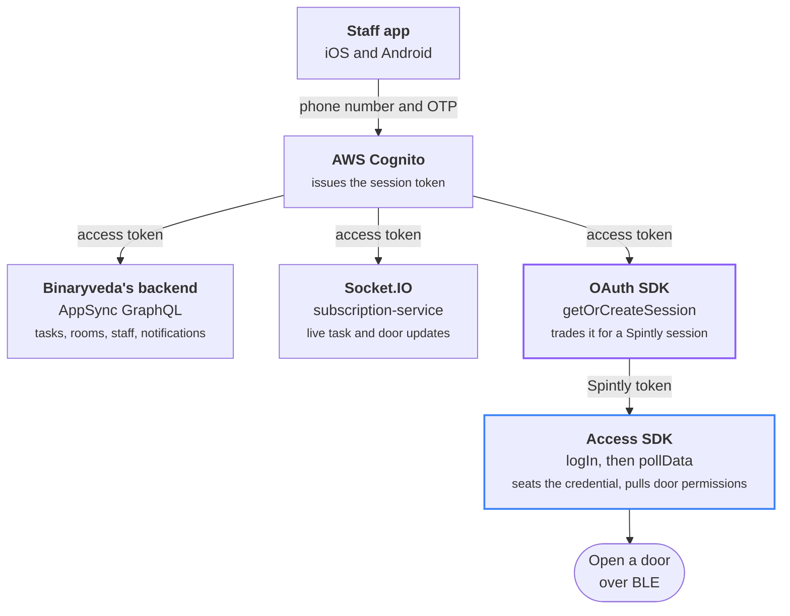

# Connected Lock Staff App

Hotel staff use this app to see the work assigned to them, reach the rooms they
are allowed into, and open a door. It covers hospitality work. It does not
manage locks.

Which task categories appear depends on the signed in role: housekeeping, front
desk, restaurant, engineering or site manager. That split is on
[Tasks](tasks.md). The rest of the app is the same for everyone: Rooms, Search,
Control Panel, Notifications, Profile.

## What the app is made of

Cognito issues one access token, and the app sends it to three places: the
GraphQL API, the socket, and Spintly's OAuth SDK.

## The two SDKs

The staff app ships **two** of Spintly's three SDKs. They version independently
and share nothing except the session token the OAuth SDK produces.

### OAuth SDK: the session token

Exchanges the Cognito access token for a Spintly **session token**. Nothing else
can talk to Spintly until this succeeds.

The exchange runs over callbacks rather than a single call. The app asks for a
session, the SDK asks the app how to authenticate, the app hands back a token
exchange request, and the SDK returns the session.

### Access SDK: the credential

Holds the signed in credential and the staff member's door permissions. `logIn`
seats the Spintly token inside the SDK, `pollData` pulls down which doors the
staff member may open, and `bleUnlockAccessPoint` opens one.

### There is no Config SDK

The third Spintly SDK, the one that writes to lock hardware, is **not shipped**.
Staff never provision a lock, set a passcode, enrol a fingerprint, update
firmware or factory reset anything, so the app has no lock settings screen and
this site has no page for one.

What staff do get is read only. When a lock, gateway or repeater goes offline or
its battery runs low, the backend raises a task in the **System** category, and
staff work it like any other task. See
[Tasks](tasks.md#5-device-faults-arrive-as-tasks).

### Versions shipped

| Short name | iOS (`Godrej-Locks-iOS-SpintlySDK` 2.1.0) | Android |
|---|---|---|
| **OAuth** | `SpintlyOauth` | `oauthsdk-0.7.0.aar` (`com.mrinq.oauthsdk`) |
| **Access** | `SmartAccessFramework` | `smartaccesssdk-1.16.0.0.aar` (`com.mrinq.smartaccesssdk`) |

!!! info "Accessor"

    Spintly's word for a person who can open a door is an **accessor**. A staff
    member's accessor is created by the backend when an admin creates them, not
    by this app. Their `accessPointId` is what the unlock call takes, and the
    app knows it as `spintlyId`.
