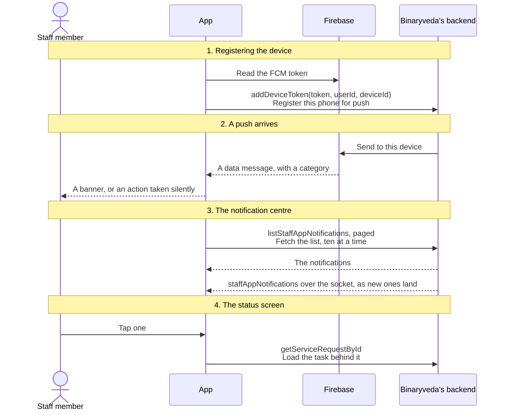
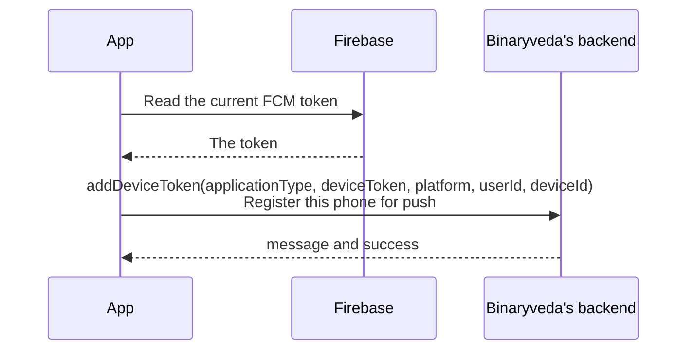
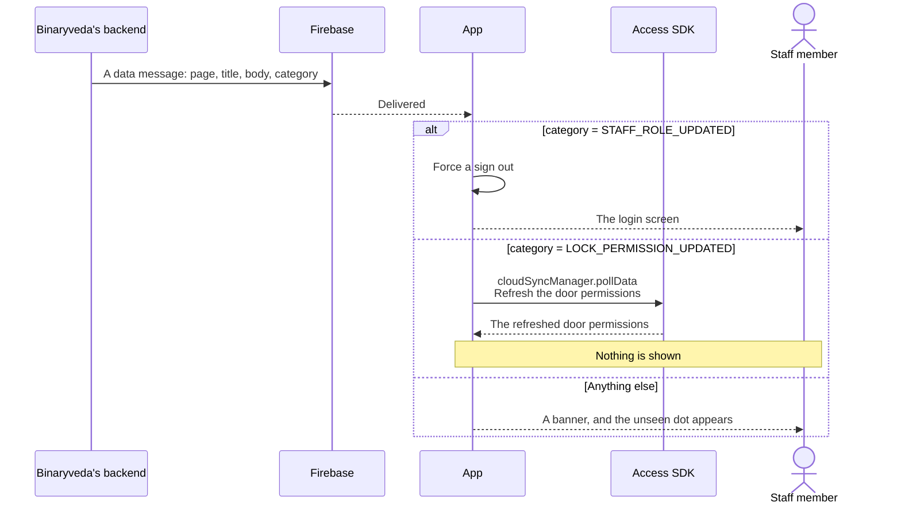
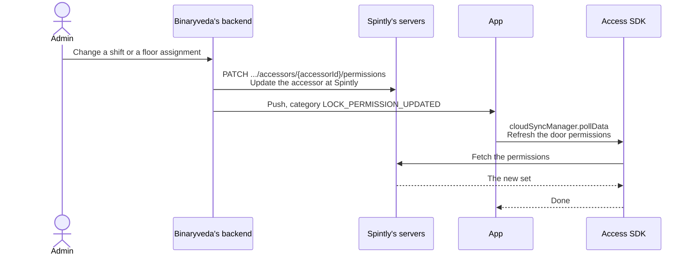
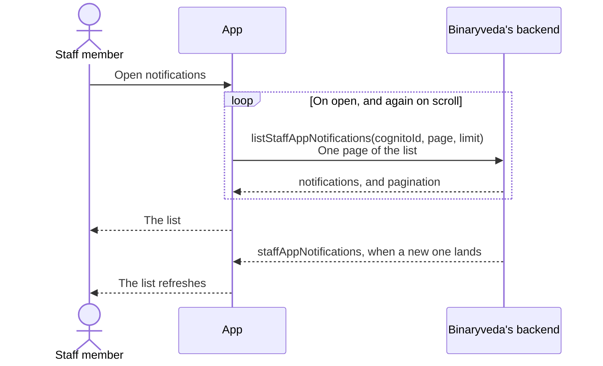
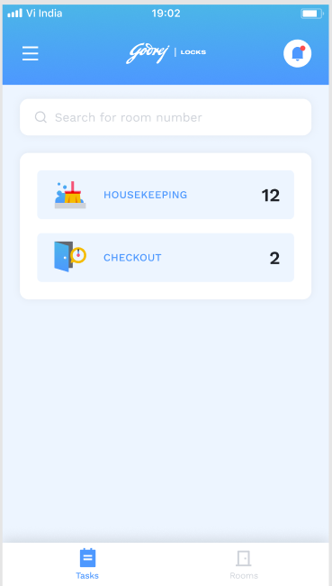
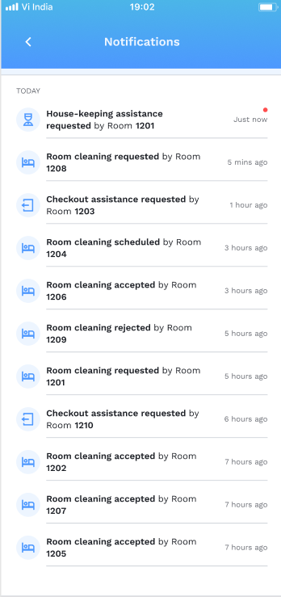
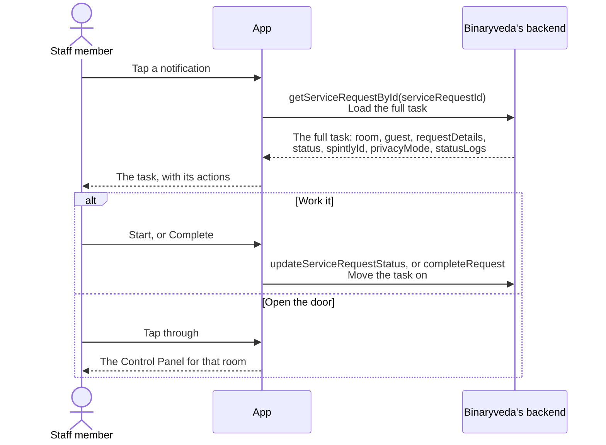

# 6. Notifications

**What it is.** Two things that share a name. **Push** wakes the app when work
arrives or something changes, and two push categories take an action instead of
showing a banner. The **notification centre** is a screen listing what has
happened, with a status screen behind each entry.

**How to get there.** Tap the bell in the Dashboard header, from either tab.
Tapping a push banner opens the same screen.

!!! warning "Key point"

    One push category, `LOCK_PERMISSION_UPDATED`, is the only route by which a
    change to a staff member's door permissions reaches the Access SDK. See
    [step 2](#2-a-push-arrives).

## Participants

This page uses Staff member, App, Firebase, Binaryveda's backend and Access SDK.

Each one is defined, with the colour it keeps across the site, in
[Reading these pages](conventions.md).

## The whole flow

Four steps. Each one has its own section below.

## 1. Registering the device

Push is registered right after the OTP, as the last step before the app lets the
staff member in.

`deviceId` is what lets the backend tell two phones apart for the same staff
member. Android mints a UUID on first sign in and keeps it in secure
preferences, and iOS uses the identifier its own data store already holds.

**The token can change on its own.** Firebase rotates it, and both platforms
re-register when it does.

=== "iOS"

    Handled through the Firebase messaging delegate, which stores the new token
    and re-registers.

=== "Android"

    `GodrejMessagingService.onNewToken` fires, reads the stored user ID and
    UUID, mints a UUID if there is not one, and calls `addDeviceToken` again.
    If no user ID is stored, which means nobody is signed in, it does nothing.

On sign out the token is deleted, so a signed-out phone stops receiving anything
for that staff member. See
[Profile and Logout](profile-and-logout.md#3-logging-out).

## 2. A push arrives

A push carries a data payload. Two of its categories are instructions rather
than messages, and neither shows anything to the staff member.

### The two that act instead of showing

**`STAFF_ROLE_UPDATED`** means an admin changed this staff member's role. What
they can see and open has changed underneath them, so the session is ended and
they sign in again.

**`LOCK_PERMISSION_UPDATED`** means their door permissions changed, usually
because a shift or a floor assignment moved. The Access SDK holds a cached copy
of those permissions, and this push is what tells it to refresh.

Without this, the SDK would keep the old permission set until the next sign in,
and an unlock would fail with `UnauthorisedError` 7 on a door the staff member
is now permitted to open. See
[Control Panel](control-panel.md#what-an-unlock-error-means).

On Android this is handled in `GodrejMessagingService`, which will initialise
the SDK itself if the app was launched cold by the push, and does nothing when
the SDK is not logged in.

### Tapping a banner

Both platforms open the notification centre. Android carries a `page` value in
the payload and falls back to `notification` when it is absent, and iOS sets a
flag on its app state that the Dashboard reads.

## 3. The notification centre

A paged list, ten at a time, with a socket event telling the app when something
new has landed.

Each entry carries a `category`, a `state`, a `createdAt`, the `room`, and the
`serviceRequestId` it belongs to.

**The unseen dot.** The Dashboard fetches only the first page and looks at the
newest entry. If it has not been visited, the dot is shown. A push arriving also
turns the dot on without any fetch.

<figure>

<figcaption><strong>The unseen dot</strong>The bell on the Dashboard. A push turns this on without a fetch, and opening the centre clears it.</figcaption>
</figure>
<figure>

<figcaption><strong>The centre</strong><code>listStaffAppNotifications</code>, ten at a time. Each row is a category, a room, and a <code>serviceRequestId</code>. Tapping one loads the task with <code>getServiceRequestById</code>.</figcaption>
</figure>

## 4. The notification status screen

Tapping an entry loads the task behind it in full, because a notification only
carries an ID.

The task can be worked from here exactly as it can from the
[Tasks](tasks.md#4-acting-on-a-task) tab, and the same backend rules apply.

## Differences between the two

| | iOS | Android |
|---|---|---|
| Where push is handled | `AppDelegate`, through `UNUserNotificationCenterDelegate` | `GodrejMessagingService`, a `FirebaseMessagingService` |
| `STAFF_ROLE_UPDATED` | Forces a sign out, from `AppDelegate` | Forces a sign out, from `GodrejMessagingService` |
| `LOCK_PERMISSION_UPDATED` | Not handled | Triggers `pollData`, initialising the SDK first if needed |
| Notification permission | Asked for at launch | Asked for from API 33, and skipped below it |
| Which screen a tap opens | A flag on the app state, read by the Dashboard | A `page` value in the payload, defaulting to the notification list |

!!! note "`LOCK_PERMISSION_UPDATED` is Android only"

    Both platforms act on `STAFF_ROLE_UPDATED`. Only Android acts on
    `LOCK_PERMISSION_UPDATED`. On iOS a permissions change is picked up the next
    time something calls `pollData`, which in practice means the next sign in or
    the next Control Panel that has to log in first. Worth confirming with the
    iOS team whether that is intended.

## Every SDK member this flow uses

??? note "Android"

    | SDK | Member | When | What it is for |
    |---|---|---|---|
    | Access | `SpintlyLibHelper.initialise(context)` | A `LOCK_PERMISSION_UPDATED` push on a cold start | Create the SDK before using it |
    | Access | `credentialManager.isLoggedIn` | A `LOCK_PERMISSION_UPDATED` push | Skip the refresh when nobody is signed in |
    | Access | `cloudSyncManager.pollData(CompletionCallback)` | A `LOCK_PERMISSION_UPDATED` push | Refresh the door permissions |

iOS makes no SDK call from this flow.
