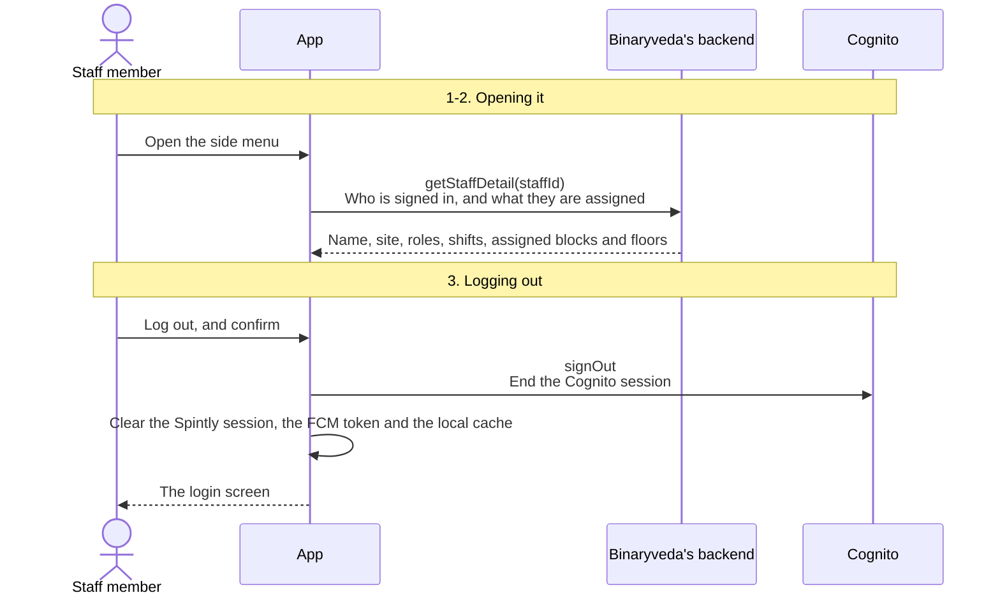
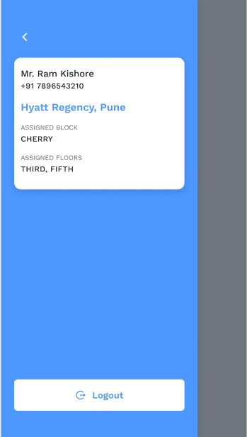
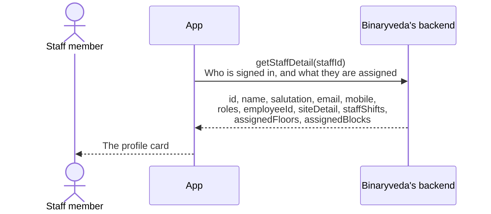
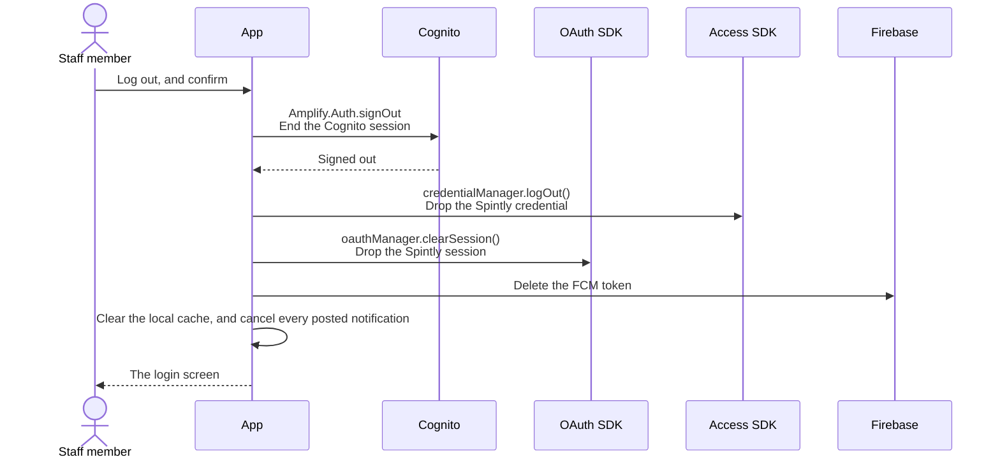

# 7. Profile and Logout

**What it is.** The side menu. It shows who is signed in, where they work, and
what they have been assigned, and it holds the only Log out button in the app.

**How to get there.** Tap the profile icon in the Dashboard header, from either
tab. It slides in from the left over the Dashboard. On iOS a swipe in from the
left edge opens it too.

## Participants

This page uses Staff member, App, Cognito, Binaryveda's backend, Firebase, OAuth
SDK and Access SDK.

Each one is defined, with the colour it keeps across the site, in
[Reading these pages](conventions.md).

## The whole flow

Three steps. Each one has its own section below.

## 1. Opening it

The profile is refetched every time the screen appears rather than cached, so a
change an admin makes mid shift shows up without a restart.

<figure>

<figcaption><strong>The side menu</strong>Name, hotel, assigned block and floors come from <code>getStaffDetail</code>. Logout is the only way out of a session from the UI.</figcaption>
</figure>

=== "iOS"

    The side menu view model calls `getStaffDetail` when the view appears, and
    only when the network is up.

=== "Android"

    The screen observes its own lifecycle and calls `getStaffDetail` on every
    `ON_RESUME`, so coming back from the background refetches it.

## 2. Staff detail

| Shown | Where it comes from |
|---|---|
| Name | `salutation`, `firstName`, `lastName` |
| Phone | `mobileCode` and `mobileNumber` |
| Hotel | `siteDetail.name` and `siteDetail.location` |
| Assigned block | The block names across every shift, joined |
| Assigned floors | The floor names on the first shift, uppercased with the word "floor" stripped |

Both platforms show **Not Assigned** when there are no shifts.

This is the same shift data that decides which rooms come back from
`getAccessibleRoomsByStaff`, so the assigned floors here are a preview of what
the [Rooms](rooms.md#2-who-sees-which-rooms) tab will show.

!!! note "Floors come from the first shift, blocks from all of them"

    On both platforms the block list is built from every shift, while the floor
    list is read from `staffShifts.first` only. A staff member with more than one
    shift will see floors from just one of them.

## 3. Logging out

Log out is behind a confirmation dialog, then four things happen in order.

Deleting the FCM token is what stops the phone receiving anything after sign
out. The row on the backend is not removed, so the same device signing back in
registers a fresh token against the same `deviceId`.

The socket is dropped with the Dashboard, not here. On Android
`SocketIOUtils.clear()` runs when the Dashboard view model is cleared, and the
shared state is reset with it.

### The ways a session can end

Only the first is something the staff member chooses. The other three are
triggered elsewhere.

| | What triggers it | What is skipped |
|---|---|---|
| **The staff member logs out** | This screen | Nothing |
| **The role changed** | A `STAFF_ROLE_UPDATED` push, on both platforms | Nothing. It runs the same flow |
| **The SDK forced it** | The Access SDK reports `LOGGED_OUT` with an error, or `LOGGED_OUT_DELETED_USER`. Android only | The call to Cognito |
| **The user no longer exists** | iOS only. Any GraphQL response that says the user does not exist | Nothing. It runs the same flow |

A forced logout skips the Cognito call because whatever forced it has usually
already invalidated the session. Android guards it with a flag so a burst of
login-status changes cannot run it twice. Both other paths are covered in
[User Onboarding, step 6](user-onboarding.md#6-while-signed-in).

## Differences between the two

| | iOS | Android |
|---|---|---|
| When the profile is fetched | On appear, and only when online | On every `ON_RESUME` |
| Forced logout from the SDK | The error is shown, but no sign out is forced | `LOGGED_OUT` with an error forces a sign out |
| Sign out from a role change | `AppDelegate` posts `autoLogout`, which the side menu acts on | `GodrejMessagingService` forces it |
| Sign out when the user is gone | The response interceptor forces it on any "user does not exist" reply | Not handled |

## Every SDK member this flow uses

??? note "Both platforms"

    | SDK | Member | When | What it is for |
    |---|---|---|---|
    | Access | `credentialManager.logOut()` | Logging out | Drop the credential |
    | OAuth | `oauthManager.clearSession()` | Logging out | Drop the Spintly session |
