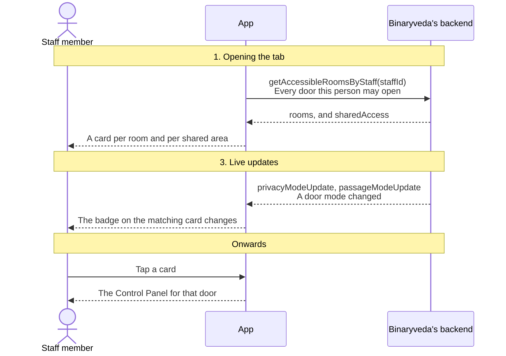
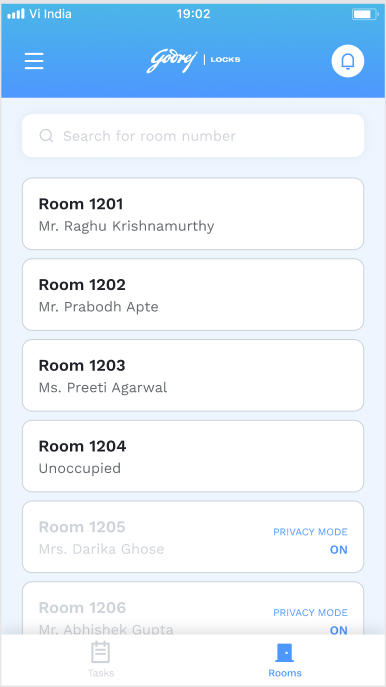
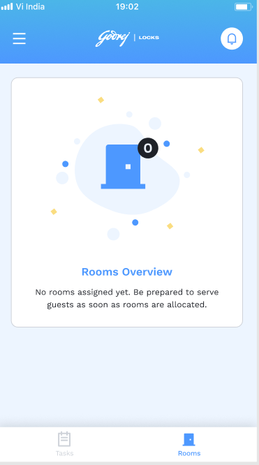
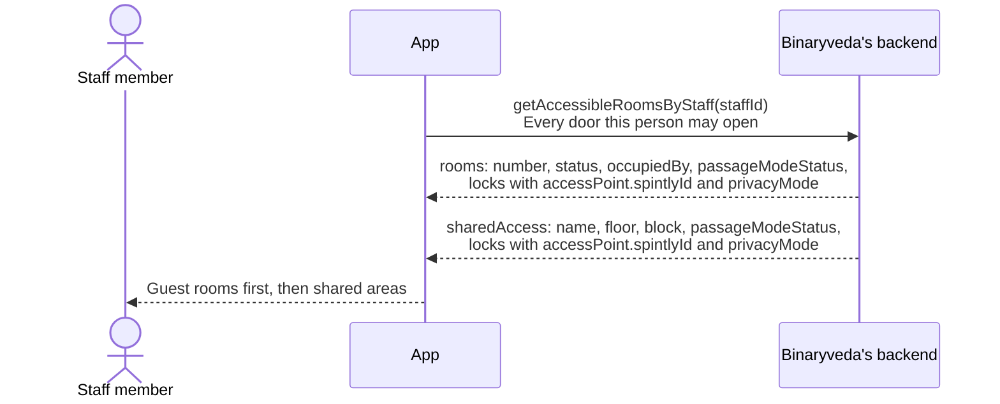
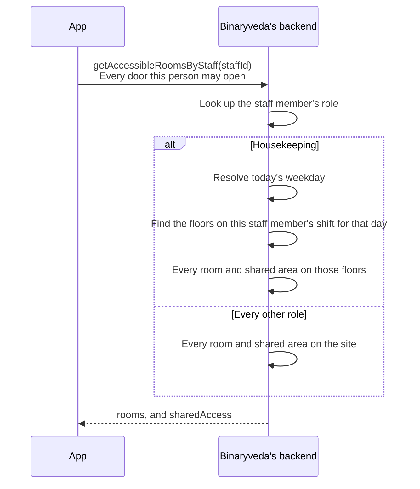
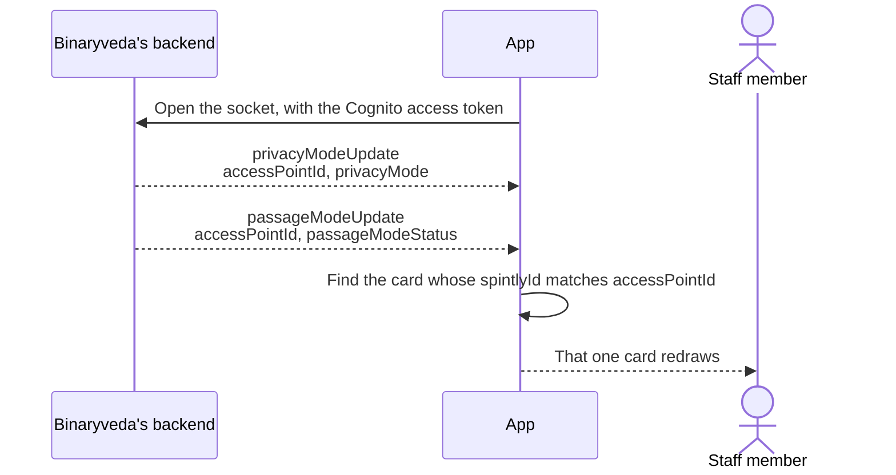

# 3. Rooms

**What it is.** The second Dashboard tab. It lists every door this staff member
is allowed through, whether or not there is a task behind it, covering guest
rooms and shared areas such as a linen store or a service corridor. Tapping one
opens the [Control Panel](control-panel.md).

**How to get there.** The right button on the Dashboard's bottom bar.

!!! warning "Key point"

    This list is not filtered by the app. What arrives is exactly what this
    staff member may open, decided by the backend from their shift. See
    [step 2](#2-who-sees-which-rooms).

## Participants

This page uses Staff member, App and Binaryveda's backend.

Each one is defined, with the colour it keeps across the site, in
[Reading these pages](conventions.md).

## The whole flow

Three steps. Each one has its own section below.

## 1. Opening the tab

One call returns both lists.

<figure>

<figcaption><strong>The room list</strong>Guest name when the room is taken, Unoccupied when it is empty. Privacy Mode sits on the card when the guest has it on. Tapping a card opens the Control Panel. The search field is room search.</figcaption>
</figure>
<figure>

<figcaption><strong>Nothing assigned</strong>A housekeeper with no shift today gets nothing back from <code>getAccessibleRoomsByStaff</code>. See <a href="#2-who-sees-which-rooms">step 2</a>.</figcaption>
</figure>

The two kinds of card differ only in what they show.

| | A guest room | A shared area |
|---|---|---|
| Title | The room number | The area's name |
| Subtitle | Who is in it, from `occupiedBy` | Its floor, or its block |
| Status | `status`, one of booked, occupied, vacant, on change | Not shown |
| Door state | `privacyMode` and `passageModeStatus` | The same |
| What opens it | `locks.accessPoint.spintlyId` | The same |

**`spintlyId` is the field that matters most here.** It is the access point ID
the Access SDK takes, and without it the Unlock button on the Control Panel has
nothing to act on. A room whose lock has no access point cannot be opened from
the app.

## 2. Who sees which rooms

The scoping happens in `user-service`, not in the app.

Two consequences follow:

- **A housekeeper's list changes with the day.** The same staff member opening
  the app on a Tuesday and a Wednesday can see different floors, because the
  shift is looked up per weekday.
- **An empty list usually means no shift.** A housekeeper who is not rostered
  today gets nothing back, which is the backend working as designed.

The permissions the **Access SDK** holds are a separate copy of the same idea,
kept in step by `pollData`. If an admin changes a shift, the backend updates the
staff member's accessor permissions at Spintly and sends a push, which on Android
triggers a fresh `pollData`. See
[Notifications](notifications.md#2-a-push-arrives).

## 3. Live updates

A room's door mode can change while the list is open, either because a guest
turned privacy mode on from inside or because passage mode was switched at the
lock. Two socket events carry it.

Both events are matched on `accessPointId` against the card's `spintlyId`, and
both platforms stop at the first match. Guest rooms and shared areas are
searched together, so either kind of card can update.

`passageModeStatus` arrives as a string and is treated as on only when it is
exactly `ENABLED`. Anything else, including the intermediate `ENABLING` and
`DISABLING` states the backend writes while it is talking to the lock, reads as
off.

What these two modes mean for the Unlock button is on the
[Control Panel](control-panel.md#4-privacy-mode-and-passage-mode).

## Differences between the two

| | iOS | Android |
|---|---|---|
| When the list is fetched | On appear, and on an explicit reload | On appear |
| Where the list is held | In the view model | In a shared `GlobalDataObjects` list, which the Control Panel writes back into |
| Matching a socket event | Decoded into a typed model, then matched | Matched from the raw JSON |

## Every SDK member this flow uses

None. The Access SDK is not touched until a card is tapped and the
[Control Panel](control-panel.md) opens.
