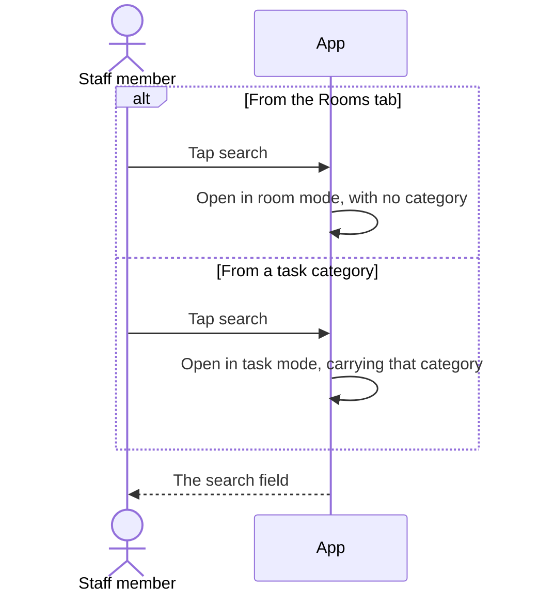
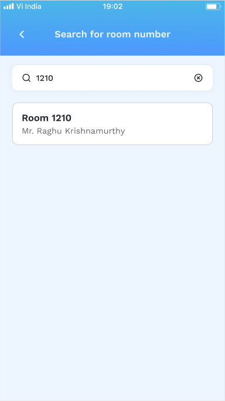
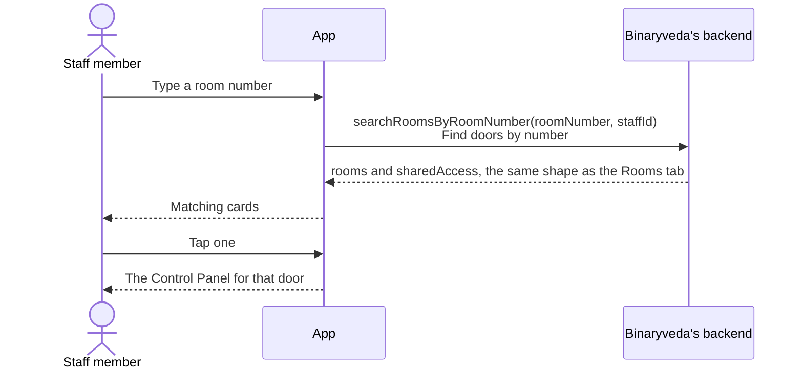
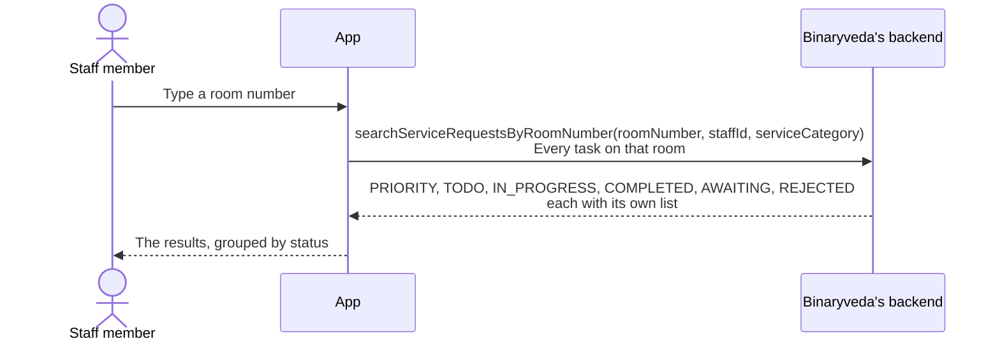
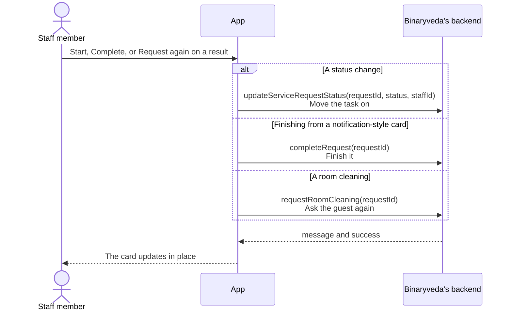

# 4. Search

**What it is.** One screen with two modes, reached from either Dashboard tab.
From Rooms it finds doors by room number. From Tasks it finds the tasks on a
room, grouped by status. Which mode it opens in is decided by the tab it was
opened from.

**How to get there.** The search field on the Rooms tab, or the magnifying glass
in the header of an open task category.

## Participants

This page uses Staff member, App and Binaryveda's backend.

Each one is defined, with the colour it keeps across the site, in
[Reading these pages](conventions.md).

## 1. The two ways in

The screen is told which mode to run in, and in task mode which category to
search inside.

<figure>

<figcaption><strong>From Rooms</strong>The field on the tab. Typing a number is <code>searchRoomsByRoomNumber</code>.</figcaption>
</figure>
<figure>

<figcaption><strong>From a task category</strong>The magnifying glass. It opens task search for that category only.</figcaption>
</figure>

On Android the mode is carried as a `SearchScreenArgModel` holding
`sourceScreenName` and an optional `category`. On iOS the room search and the
task search are separate screens that share the card views.

## 2. Searching rooms

<figure>

<figcaption><strong>A match</strong><code>searchRoomsByRoomNumber</code> with <code>staffId</code>. Only rooms this person may open come back. Tapping the card opens the Control Panel.</figcaption>
</figure>

The response is the same shape as the Rooms tab, including `spintlyId` and the
privacy and passage badges. The search is still limited by shift, as described
in [Rooms](rooms.md#2-who-sees-which-rooms).

## 3. Searching tasks

The task search returns every status at once, not a filtered list.

Because the response arrives grouped by status, the screen shows every task on
that room in one pass rather than making the staff member check each tab.

## 4. Acting on a result

A task found here can be worked without leaving the screen. The same three calls
from [Tasks](tasks.md#4-acting-on-a-task) are wired up.

The backend rules are the same ones, so a task the staff member did not start
cannot be completed from here either.

## Differences between the two

| | iOS | Android |
|---|---|---|
| How the two modes are built | Two screens sharing card views | One screen, switched by an argument |
| Seen state after acting | Held in the view model | Also written back to the local Room cache, so the New badge clears |

## Every SDK member this flow uses

None. Opening a result leads to the [Control Panel](control-panel.md), which is
where the Access SDK comes in.
