# 2. Tasks

**What it is.** The first of the two Dashboard tabs, and where most of the day's
work happens. It shows the categories of work this staff member is responsible
for with a count on each, and opening one gives a set of status tabs to work
through.

**How to get there.** It is the screen the app lands on after sign in, and the
left button on the Dashboard's bottom bar. Tapping a category card opens its
tabs, and the back arrow returns here.

!!! warning "Key point"

    Almost nothing on this screen touches an SDK. The exceptions are the Spintly
    session, set up from here on first load, and on Android the BLE scan, which
    this tab starts whenever Bluetooth or location becomes available. Which roles
    get a session here differs by platform, and that is
    [User Onboarding, step 5](user-onboarding.md#5-trading-the-cognito-token-for-a-spintly-session).

## Participants

This page uses Staff member, App, Binaryveda's backend, Kafka and Spintly's
servers.

Each one is defined, with the colour it keeps across the site, in
[Reading these pages](conventions.md).

## The whole flow

Six steps. Each one has its own section below.

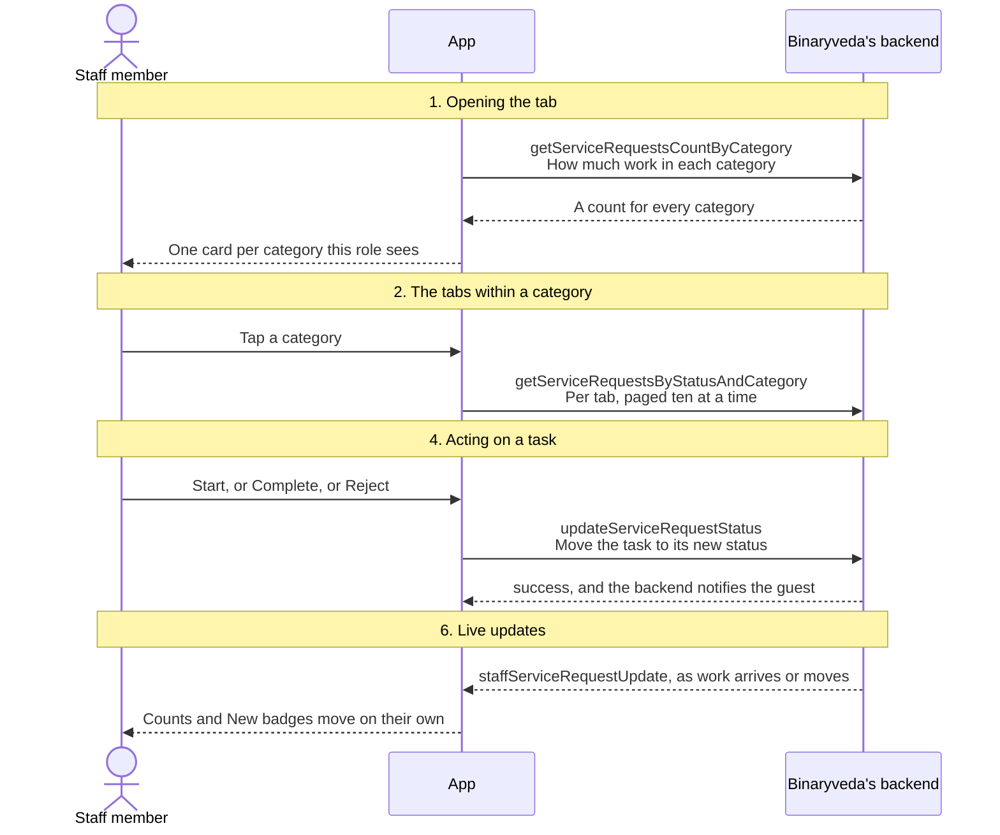
```mermaid
sequenceDiagram
    actor U as Staff member
    participant A as App
    participant B as Binaryveda's backend

    Note over U,B: 1. Opening the tab
    A->>B: getServiceRequestsCountByCategory<br/>How much work in each category
    B-->>A: A count for every category
    A-->>U: One card per category this role sees

    Note over U,B: 2. The tabs within a category
    U->>A: Tap a category
    A->>B: getServiceRequestsByStatusAndCategory<br/>Per tab, paged ten at a time

    Note over U,B: 4. Acting on a task
    U->>A: Start, or Complete, or Reject
    A->>B: updateServiceRequestStatus<br/>Move the task to its new status
    B-->>A: success, and the backend notifies the guest

    Note over U,B: 6. Live updates
    B-->>A: staffServiceRequestUpdate, as work arrives or moves
    A-->>U: Counts and New badges move on their own
```

## 1. Opening the tab

One call returns a count for every category. The app then keeps only the
categories this role is allowed to see.

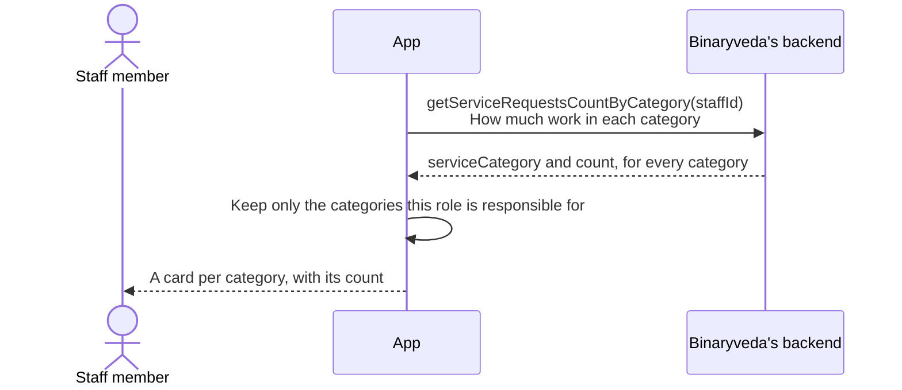
```mermaid
sequenceDiagram
    actor U as Staff member
    participant A as App
    participant B as Binaryveda's backend

    A->>B: getServiceRequestsCountByCategory(staffId)<br/>How much work in each category
    B-->>A: serviceCategory and count, for every category
    A->>A: Keep only the categories this role is responsible for
    A-->>U: A card per category, with its count
```

| Role | Categories shown |
|---|---|
| House Keeping, House Keeping Manager | Housekeeping, Check Out |
| Front Desk | Housekeeping, Check Out, Reception, Emergency |
| Restaurant Manager | Room Service |
| Engineering Maintenance | System |
| Site Manager, Site Admin | All of them |

Where the room list is filtered by the backend from the shift, this list is
filtered in the app. The call returns every category and the app drops the ones
this role is not responsible for. A category the backend did not return gets no
card either, so a role can end up seeing fewer cards than the table above lists.

iOS matches the role on letters only, so `House Keeping`, `House-Keeping` and
`HOUSEKEEPING` all work. Android matches the role code as an exact string
(`HOUSEKEEPING`, `FRONTDESK`, `RESTAURANT-MANAGER`, and so on).

<figure>
<a href="images/tasks/01-categories.png">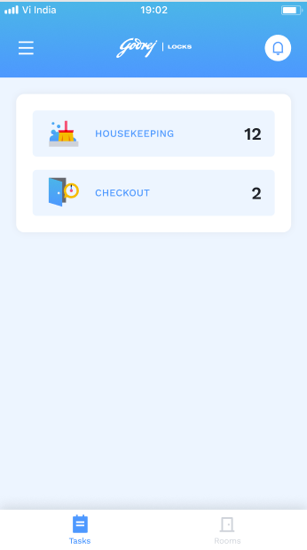</a>
<figcaption><strong>Housekeeping</strong>Housekeeping and Check Out.</figcaption>
</figure>
<figure>
<a href="images/tasks/75-hk-manager-categories.png">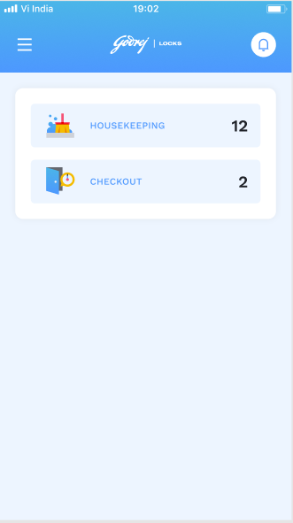</a>
<figcaption><strong>Housekeeping manager</strong>The same two categories. The manager role does not add extra cards.</figcaption>
</figure>
<figure>
<a href="images/tasks/50-front-desk-categories.png">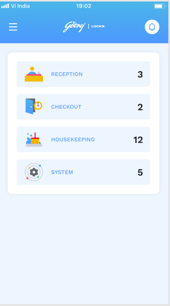</a>
<figcaption><strong>Front desk</strong>Reception, Check Out and Housekeeping, plus Emergency when there is any. The System card in this older shot is no longer shown to Front Desk. It now goes to Engineering, Site Manager and Site Admin only.</figcaption>
</figure>

<figure>
<a href="images/tasks/64-restaurant-categories.png">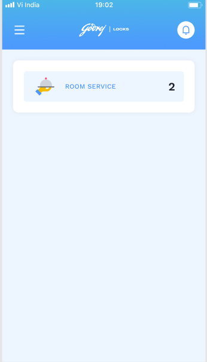</a>
<figcaption><strong>Restaurant manager</strong>Room Service only.</figcaption>
</figure>
<figure>
<a href="images/tasks/68-engineering-categories.png">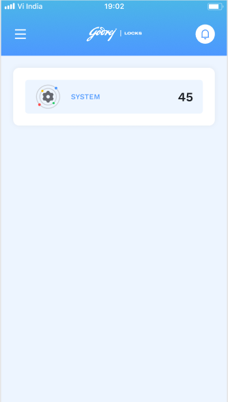</a>
<figcaption><strong>Engineering</strong>System only. Device faults and access-revoked tasks both live here.</figcaption>
</figure>
<figure>
<a href="images/tasks/74-site-manager-categories.png">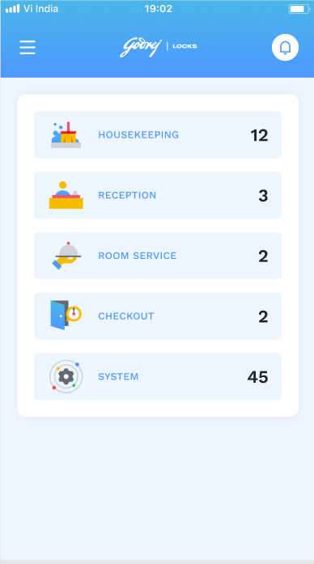</a>
<figcaption><strong>Site manager</strong>Every category the site uses. Site Admin is the same filter.</figcaption>
</figure>

## 2. The tabs within a category

Opening a category gives a pager of status tabs. **Which tabs appear depends on
the category**, not on the role.

| Category | Tabs |
|---|---|
| Housekeeping | Priority, To Do, In Progress, Completed, Awaiting, Rejected |
| Check Out | Priority, In Progress, Completed |
| Reception, Room Service, Emergency, System | Priority, Completed |

Each tab is its own paged list, ten at a time.

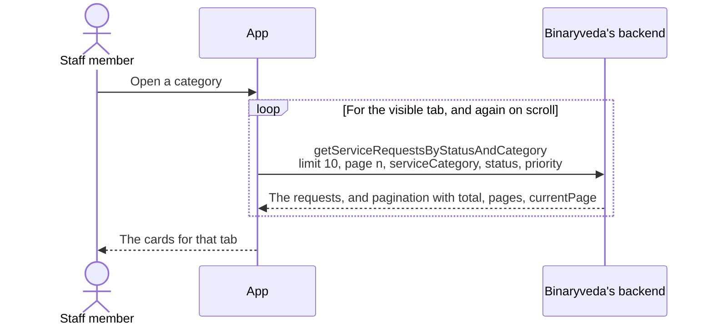
```mermaid
sequenceDiagram
    actor U as Staff member
    participant A as App
    participant B as Binaryveda's backend

    U->>A: Open a category
    loop For the visible tab, and again on scroll
        A->>B: getServiceRequestsByStatusAndCategory<br/>limit 10, page n, serviceCategory, status, priority
        B-->>A: The requests, and pagination with total, pages, currentPage
    end
    A-->>U: The cards for that tab
```

The **Priority** tab is not a status of its own. It is the same call with
`priority: true`. Expanding a card shows Start, Complete, or Access Control
Panel. Those buttons are the calls in [step 4](#4-acting-on-a-task).

### Housekeeping: Priority

An empty Priority tab means nothing is currently flagged. It does not mean the
category is unused.

<figure>
<a href="images/tasks/76-housekeeping-priority-new.png">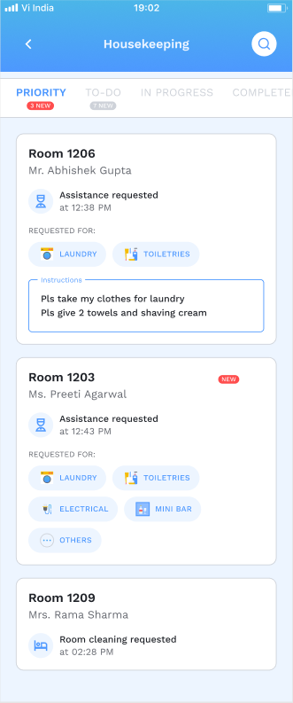</a>
<figcaption><strong>New work</strong>The red NEW on a tab is the same client-side list as the category badge. Items and guest notes sit on the card.</figcaption>
</figure>
<figure>
<a href="images/tasks/03-housekeeping-priority.png">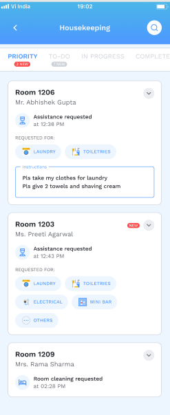</a>
<figcaption><strong>The list</strong>Assistance and room cleaning mixed in.</figcaption>
</figure>
<figure>
<a href="images/tasks/04-housekeeping-priority-service-request.png">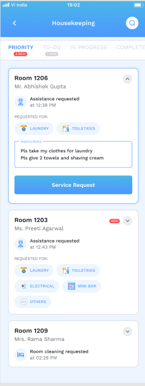</a>
<figcaption><strong>Start the work</strong>Expanding the card. Service Request is <code>updateServiceRequestStatus</code> to <code>IN_PROGRESS</code>.</figcaption>
</figure>
<figure>
<a href="images/tasks/05-housekeeping-priority-long-instructions.png">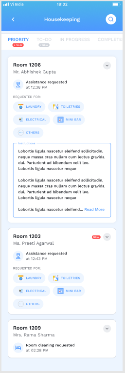</a>
<figcaption><strong>Long instructions</strong><code>requestDetails</code> is free text. Read More is the card truncating it, not a second call.</figcaption>
</figure>
<figure>
<a href="images/tasks/06-housekeeping-priority-expanded-actions.png">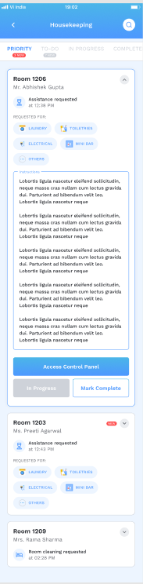</a>
<figcaption><strong>Once it is claimed</strong>Access Control Panel opens the door. In Progress is already the status. Mark Complete is the same status call as on the Control Panel.</figcaption>
</figure>
<figure>
<a href="images/tasks/42-housekeeping-priority-empty.png">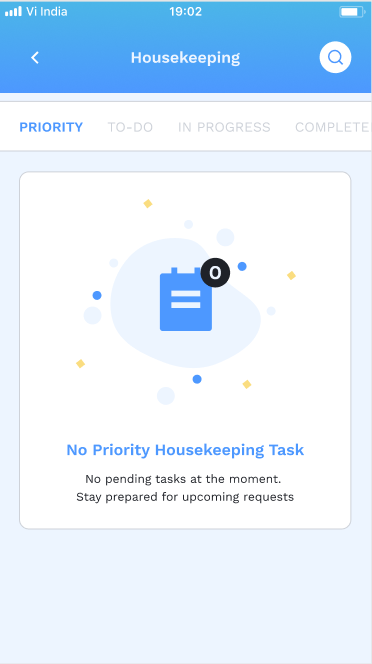</a>
<figcaption><strong>Nothing urgent</strong>The empty state for this tab. To Do and the others can still have work.</figcaption>
</figure>

<figure>
<a href="images/tasks/07-housekeeping-priority-control-panel.png">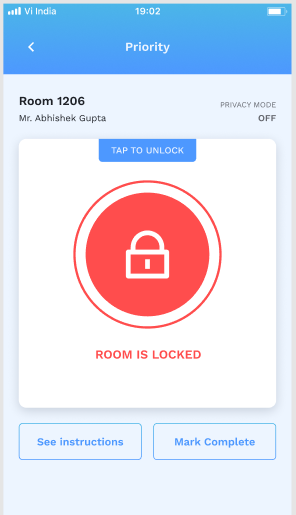</a>
<figcaption><strong>From a task</strong>See instructions and Mark Complete are only here because a task opened this screen. Unlock is still BLE.</figcaption>
</figure>
<figure class="crop">
<a href="images/tasks/08-housekeeping-priority-instructions.png">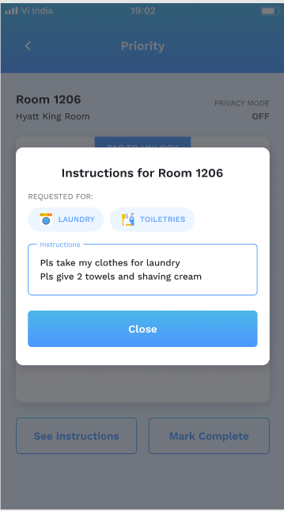</a>
<figcaption><strong>See instructions</strong>The task's <code>requestDetails</code>, item by item. There is no extra fetch, because the card already holds this.</figcaption>
</figure>
<figure class="crop">
<a href="images/tasks/11-housekeeping-priority-instructions-long.png">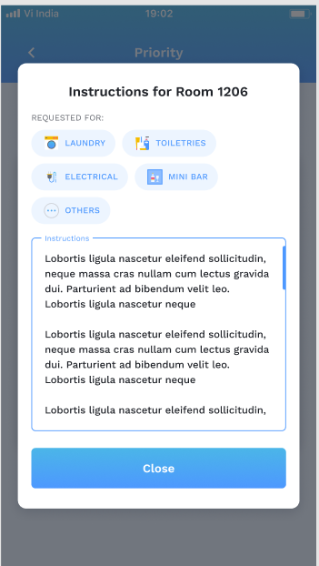</a>
<figcaption><strong>The same dialog, long text</strong>Still <code>requestDetails</code>. The dialog scrolls rather than paging.</figcaption>
</figure>
<figure class="crop">
<a href="images/tasks/09-housekeeping-priority-completed-panel.png">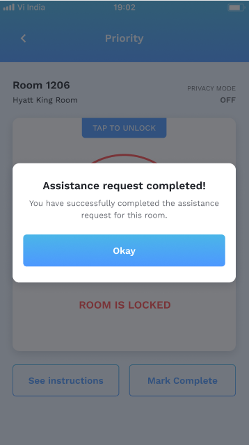</a>
<figcaption><strong>Assistance done</strong>The confirmation after Complete from the Control Panel. A room cleaning gets a different sentence, because the guest can ask again.</figcaption>
</figure>
<figure class="crop">
<a href="images/tasks/10-housekeeping-priority-completed-list.png">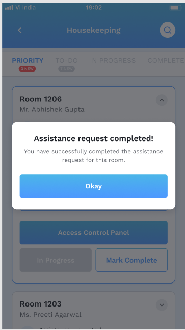</a>
<figcaption><strong>Done from the list</strong>The same confirmation when Complete is tapped on the card. The card then leaves this tab.</figcaption>
</figure>

### Housekeeping: To Do

Scheduled cleanings sit here with a window on the card. Start Room Cleaning
moves it to In Progress.

<figure>
<a href="images/tasks/12-housekeeping-todo.png">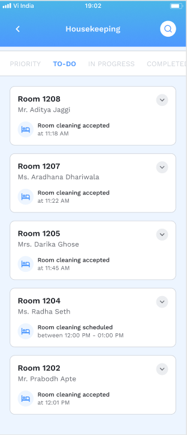</a>
<figcaption><strong>The list</strong>Accepted cleanings, and one scheduled for later. <code>scheduledFrom</code> and <code>scheduledTo</code> are only set on that kind of task.</figcaption>
</figure>
<figure>
<a href="images/tasks/13-housekeeping-todo-start.png">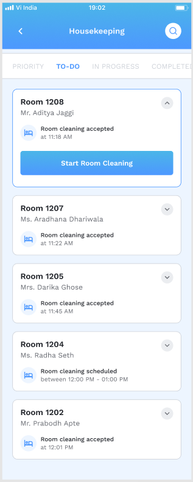</a>
<figcaption><strong>Start Room Cleaning</strong><code>updateServiceRequestStatus</code> to <code>IN_PROGRESS</code>. Only the staff member who starts it can complete it later.</figcaption>
</figure>
<figure>
<a href="images/tasks/14-housekeeping-todo-actions.png">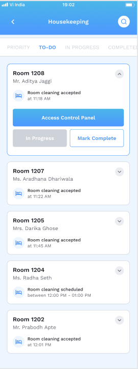</a>
<figcaption><strong>After starting</strong>In Progress is already pressed because the status has moved. Access Control Panel opens the door and Mark Complete finishes the task.</figcaption>
</figure>

<figure>
<a href="images/tasks/15-housekeeping-todo-control-panel.png">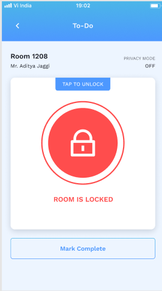</a>
<figcaption><strong>The door from To Do</strong>Mark Complete is on the Control Panel as well. There is no See instructions on a plain room cleaning.</figcaption>
</figure>
<figure>
<a href="images/tasks/16-housekeeping-todo-privacy.png">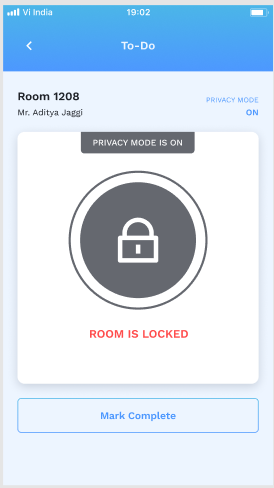</a>
<figcaption><strong>Privacy on</strong>Same as from Rooms. The task can still be completed, but the door stays shut until the guest turns privacy mode off.</figcaption>
</figure>
<figure class="crop">
<a href="images/tasks/17-housekeeping-todo-completed.png">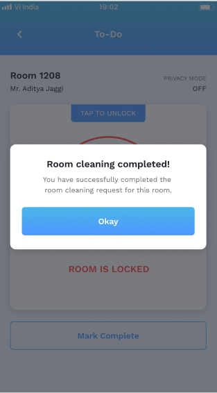</a>
<figcaption><strong>Cleaning done</strong>The room-cleaning confirmation. Different copy from assistance, because this is the task the guest can request again.</figcaption>
</figure>

### Housekeeping: In Progress

Claimed work. Complete is offered on the card and on the Control Panel.

<figure>
<a href="images/tasks/18-housekeeping-in-progress.png">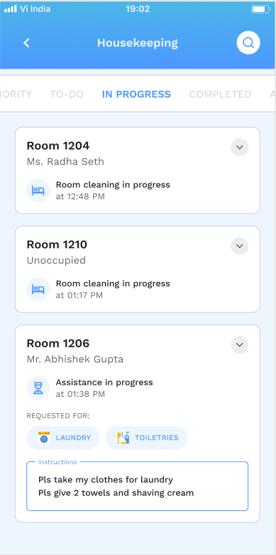</a>
<figcaption><strong>The list</strong>Cleanings and assistance that someone has already started. An unoccupied room can still have a cleaning in progress.</figcaption>
</figure>
<figure>
<a href="images/tasks/19-housekeeping-in-progress-cleaning.png">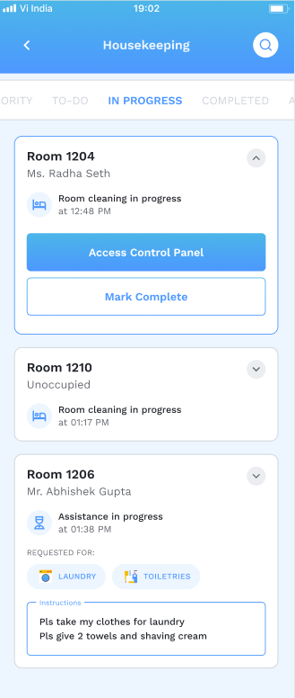</a>
<figcaption><strong>A cleaning</strong>Access Control Panel and Mark Complete. There is no Start, because the status is already In Progress.</figcaption>
</figure>
<figure>
<a href="images/tasks/20-housekeeping-in-progress-assistance.png">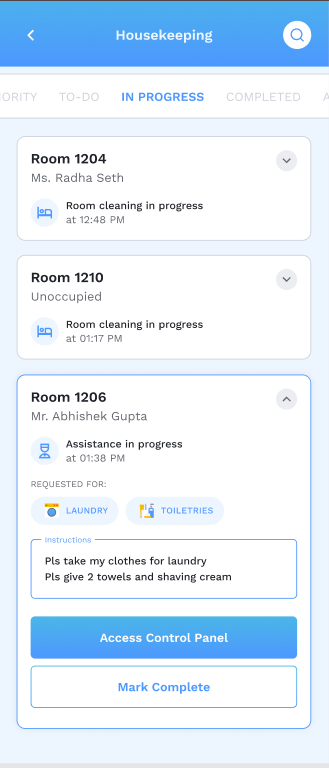</a>
<figcaption><strong>Assistance</strong>The items stay on the card for the whole life of the task. Completing it is the same status call as a cleaning.</figcaption>
</figure>

<figure>
<a href="images/tasks/21-housekeeping-in-progress-control-panel.png">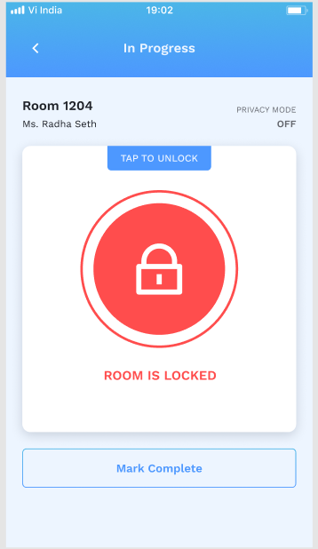</a>
<figcaption><strong>The door from In Progress</strong>Same Unlock path. Mark Complete is <code>updateServiceRequestStatus</code> to <code>COMPLETED</code>.</figcaption>
</figure>
<figure>
<a href="images/tasks/22-housekeeping-in-progress-privacy.png">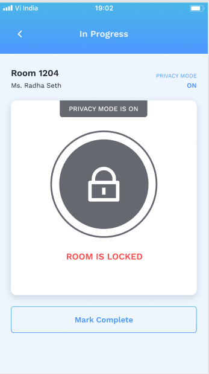</a>
<figcaption><strong>Privacy on</strong>The work can still be marked complete. Unlock waits on the guest.</figcaption>
</figure>
<figure class="crop">
<a href="images/tasks/23-housekeeping-in-progress-completed.png">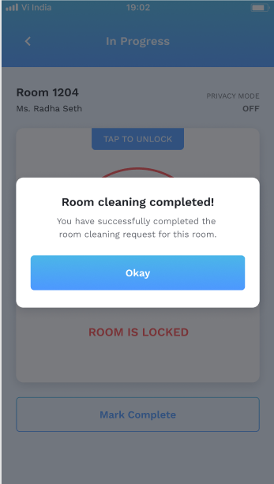</a>
<figcaption><strong>Cleaning done</strong>The same confirmation as from To Do. The card then moves to Completed.</figcaption>
</figure>

### Housekeeping: Completed

A terminal tab. The timeline on an expanded card is `statusLogs`.

<figure>
<a href="images/tasks/24-housekeeping-completed.png">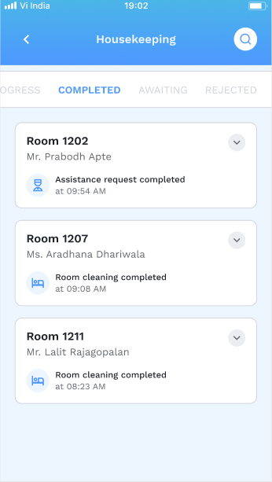</a>
<figcaption><strong>The list</strong>Assistance and cleanings that have already finished. Nothing to act on except reading the log.</figcaption>
</figure>
<figure>
<a href="images/tasks/25-housekeeping-completed-assistance.png">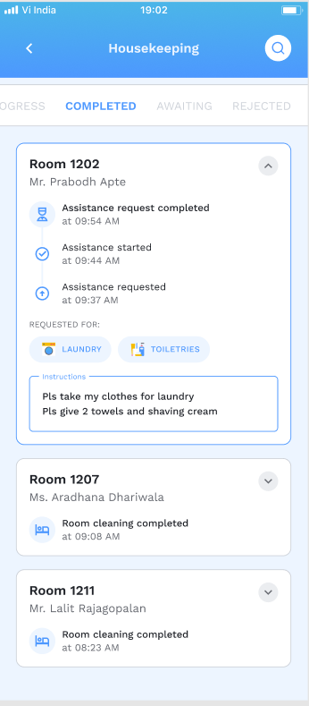</a>
<figcaption><strong>Assistance log</strong>Requested, started, completed, with times. The items and instructions stay on the card after it is done.</figcaption>
</figure>
<figure>
<a href="images/tasks/26-housekeeping-completed-cleaning.png">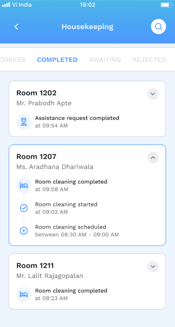</a>
<figcaption><strong>A scheduled cleaning</strong>The window it was booked for is still in the log, then started and completed.</figcaption>
</figure>
<figure>
<a href="images/tasks/27-housekeeping-completed-unlock.png">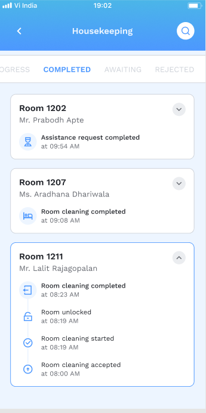</a>
<figcaption><strong>Unlocked along the way</strong>The Access SDK unlock is not written here. Room unlocked in this log is the backend hearing about it through Kafka.</figcaption>
</figure>

### Housekeeping: Awaiting

The guest was asked to wait. Accept moves the task to To Do and Reject ends it.
Request again is only offered on a room cleaning.

<figure>
<a href="images/tasks/28-housekeeping-awaiting.png">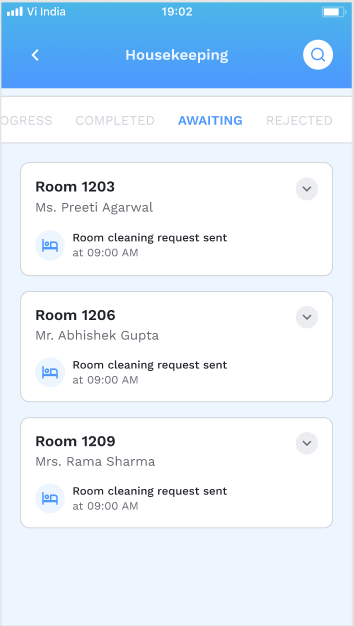</a>
<figcaption><strong>The list</strong>Room cleaning request sent. These are waiting on the guest, not on staff.</figcaption>
</figure>
<figure>
<a href="images/tasks/29-housekeeping-awaiting-request-again.png">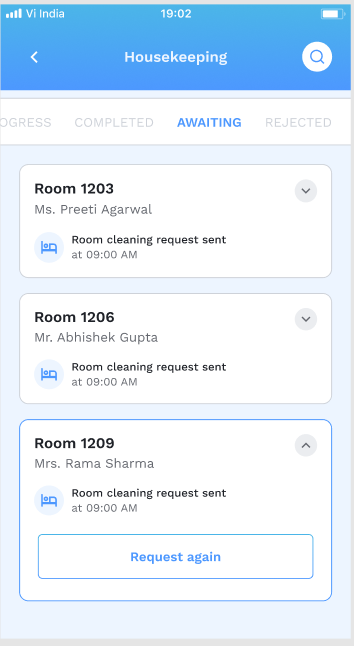</a>
<figcaption><strong>Request again</strong><code>requestRoomCleaning</code>. The guest gets a fresh prompt. Only <code>ROOM_CLEANING</code> tasks offer this.</figcaption>
</figure>
<figure class="crop">
<a href="images/tasks/30-housekeeping-awaiting-sent.png">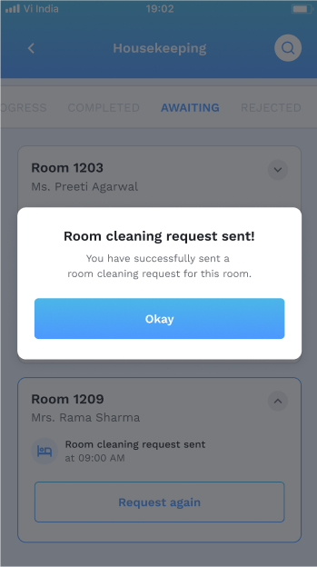</a>
<figcaption><strong>Sent</strong>The confirmation after Request again. The card stays on Awaiting until the guest answers.</figcaption>
</figure>

### Housekeeping: Rejected

A terminal tab. There is no action left on the card.

<figure>
<a href="images/tasks/31-housekeeping-rejected.png">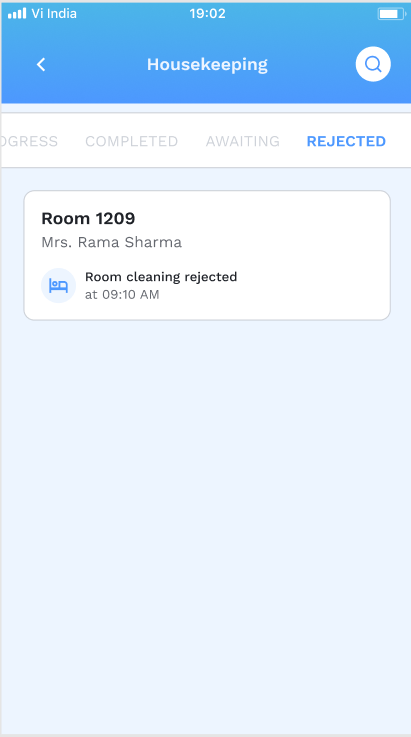</a>
<figcaption><strong>Rejected</strong>The guest turned the cleaning down, or staff did. Completed and Rejected both stop here.</figcaption>
</figure>

### Check Out: Priority

Check Out has three tabs, not six. Completing a checkout that carries an
initiate-checkout item can vacate the room in the same write.

<figure>
<a href="images/tasks/32-checkout-priority.png">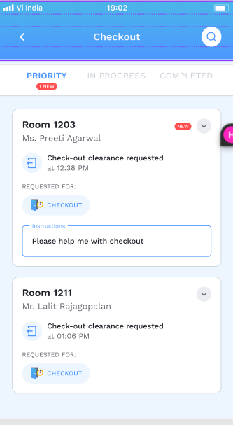</a>
<figcaption><strong>The list</strong>Check-out clearance requested. The item type is <code>CHECKOUT</code>.</figcaption>
</figure>
<figure>
<a href="images/tasks/33-checkout-priority-initiate.png">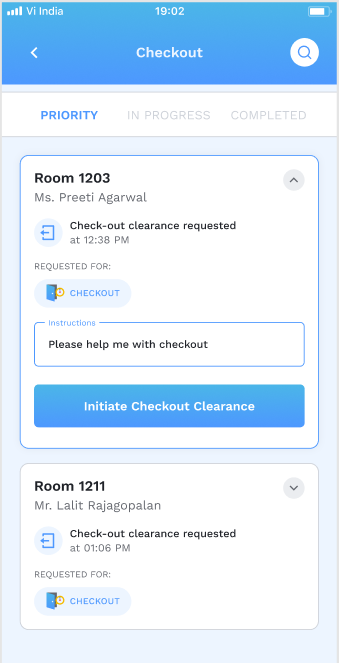</a>
<figcaption><strong>Initiate Checkout Clearance</strong>The start call for this category, still <code>updateServiceRequestStatus</code> to <code>IN_PROGRESS</code>.</figcaption>
</figure>
<figure>
<a href="images/tasks/34-checkout-priority-actions.png">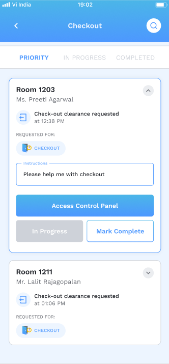</a>
<figcaption><strong>Once it is claimed</strong>Same three buttons as a housekeeping card. Completing this kind of task can free the room.</figcaption>
</figure>

<figure>
<a href="images/tasks/35-checkout-priority-control-panel.png">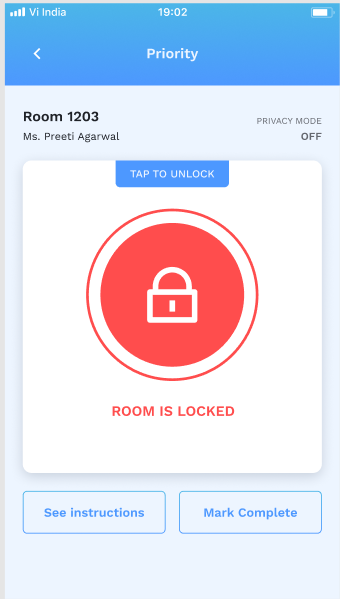</a>
<figcaption><strong>The door from checkout</strong>See instructions and Mark Complete, because a task opened it.</figcaption>
</figure>
<figure class="crop">
<a href="images/tasks/36-checkout-priority-instructions.png">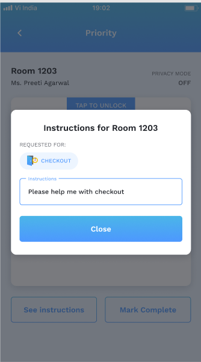</a>
<figcaption><strong>See instructions</strong>The checkout item and the guest's note.</figcaption>
</figure>
<figure class="crop">
<a href="images/tasks/37-checkout-priority-completed.png">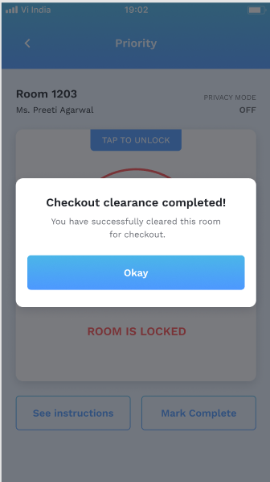</a>
<figcaption><strong>Cleared</strong>The checkout confirmation. If the task carried an initiate-checkout item, the room is set vacant in this write.</figcaption>
</figure>

### Check Out: In Progress

<figure>
<a href="images/tasks/38-checkout-in-progress.png">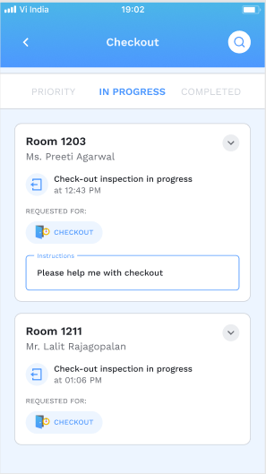</a>
<figcaption><strong>The list</strong>Check-out inspection in progress. Priority is gone once the task is claimed.</figcaption>
</figure>
<figure>
<a href="images/tasks/39-checkout-in-progress-actions.png">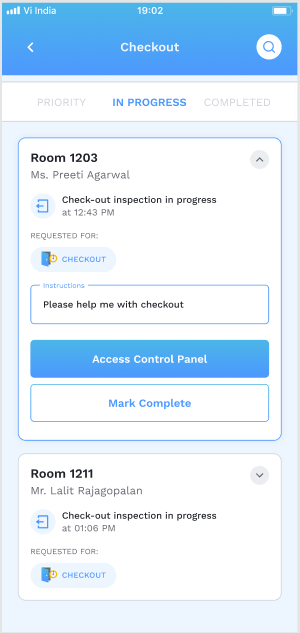</a>
<figcaption><strong>Finish it</strong>Access Control Panel and Mark Complete. Same rules: only the staff member who started it can complete it.</figcaption>
</figure>

### Check Out: Completed

<figure>
<a href="images/tasks/40-checkout-completed.png">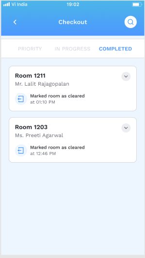</a>
<figcaption><strong>The list</strong>Marked room as cleared. Terminal, same as housekeeping Completed.</figcaption>
</figure>
<figure>
<a href="images/tasks/41-checkout-completed-timeline.png">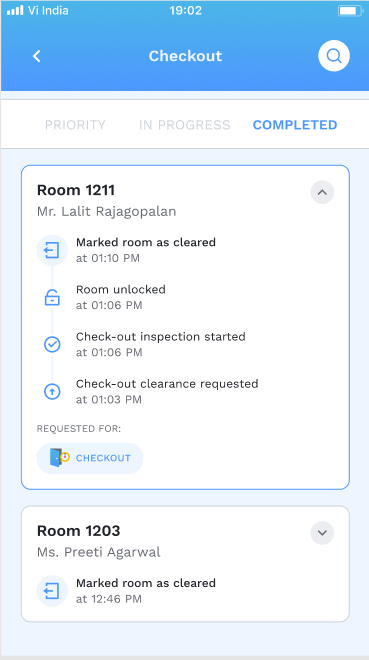</a>
<figcaption><strong>The log</strong>Requested, inspection started, unlocked, marked cleared. Room unlocked here is Kafka again, not a write from the Unlock tap.</figcaption>
</figure>

Front Desk uses the same Check Out category for guest requests such as airport
drop. These cards have no clearance flow. Expand the card and mark it complete.

<figure>
<a href="images/tasks/56-checkout-airport.png">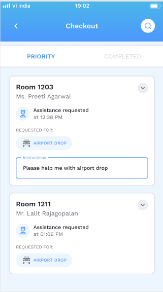</a>
<figcaption><strong>Airport drop</strong>Same category, different item. Completing it does not vacate the room.</figcaption>
</figure>
<figure>
<a href="images/tasks/57-checkout-airport-complete.png">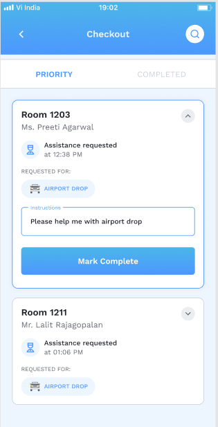</a>
<figcaption><strong>Mark Complete</strong><code>updateServiceRequestStatus</code> to <code>COMPLETED</code>.</figcaption>
</figure>
<figure class="crop">
<a href="images/tasks/58-checkout-airport-dialog.png">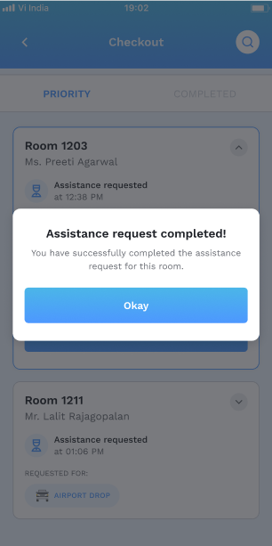</a>
<figcaption><strong>Done</strong>The same assistance confirmation as Reception.</figcaption>
</figure>
<figure>
<a href="images/tasks/59-checkout-airport-completed.png">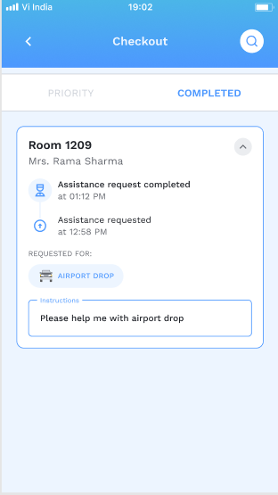</a>
<figcaption><strong>The log</strong>Requested, then completed. Completing this item does not vacate the room.</figcaption>
</figure>

### Reception

Two tabs. Guest asks the desk for help (taxi, wake-up call, extend stay,
emergency). Staff mark it complete. There is no Start step.

<figure>
<a href="images/tasks/51-reception-priority.png">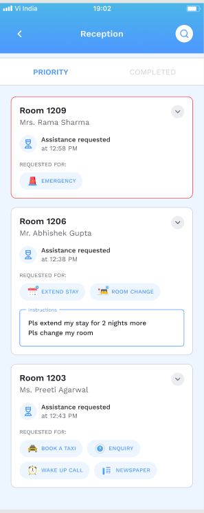</a>
<figcaption><strong>Priority</strong>An emergency card is outlined in red. Requested-for chips are the item types on the task.</figcaption>
</figure>
<figure>
<a href="images/tasks/52-reception-mark-complete.png">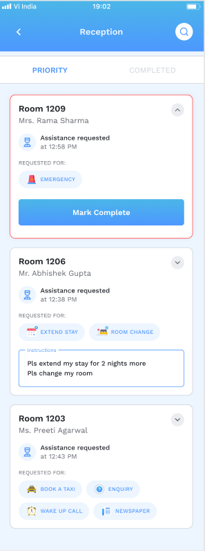</a>
<figcaption><strong>Mark Complete</strong>The only action on these cards besides reading the note.</figcaption>
</figure>
<figure class="crop">
<a href="images/tasks/53-reception-completed-dialog.png">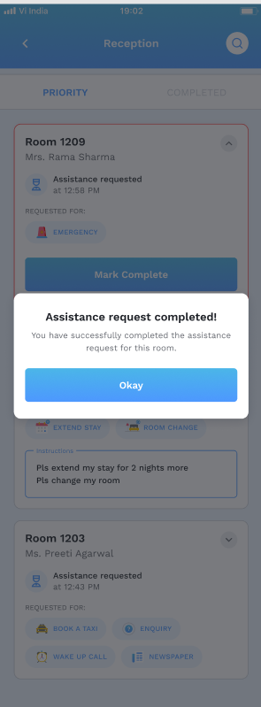</a>
<figcaption><strong>Done</strong><code>updateServiceRequestStatus</code> to <code>COMPLETED</code>. The guest is notified.</figcaption>
</figure>

<figure>
<a href="images/tasks/54-reception-completed.png">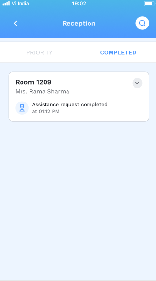</a>
<figcaption><strong>Completed</strong>The card has moved. Nothing left to tap except the chevron.</figcaption>
</figure>
<figure>
<a href="images/tasks/55-reception-completed-timeline.png">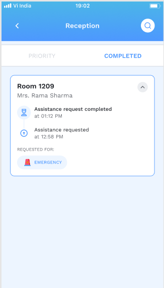</a>
<figcaption><strong>The log</strong><code>statusLogs</code>: requested, then completed.</figcaption>
</figure>

Emergency, when it appears as its own category, uses these same two tabs.

### Room Service

Restaurant manager. Same two tabs as Reception.

<figure>
<a href="images/tasks/65-room-service-priority.png">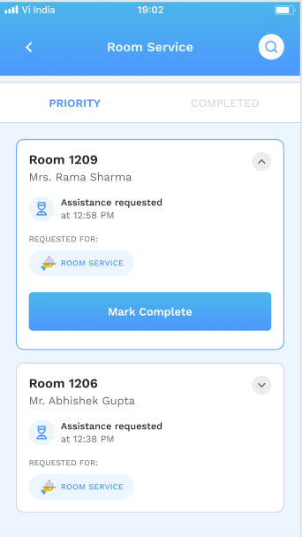</a>
<figcaption><strong>Priority</strong>Expand and Mark Complete. No door unlock from this card unless the staff member also has room access.</figcaption>
</figure>
<figure class="crop">
<a href="images/tasks/66-room-service-dialog.png">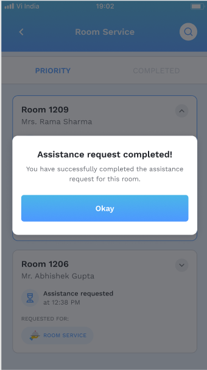</a>
<figcaption><strong>Done</strong>Same confirmation copy as Reception.</figcaption>
</figure>
<figure>
<a href="images/tasks/67-room-service-completed.png">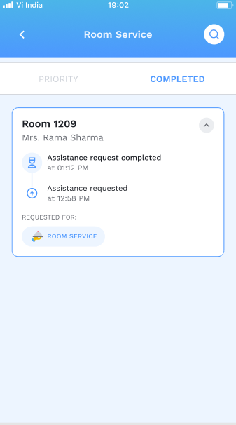</a>
<figcaption><strong>The log</strong>Requested, then completed, with the Room Service chip still on the card.</figcaption>
</figure>

### System: access revoked

System holds two unrelated kinds of work, and both sit on the same two tabs. The
first is a guest room whose access was taken away rather than a broken device.
Device faults are covered in [step 5](#5-device-faults-arrive-as-tasks), because
where they come from needs explaining first.

<figure>
<a href="images/tasks/60-system-access-revoked.png">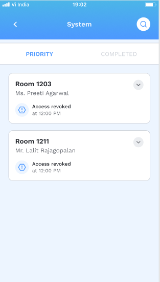</a>
<figcaption><strong>Access revoked</strong>A room and a guest, not a serial number.</figcaption>
</figure>
<figure>
<a href="images/tasks/61-system-access-revoked-complete.png">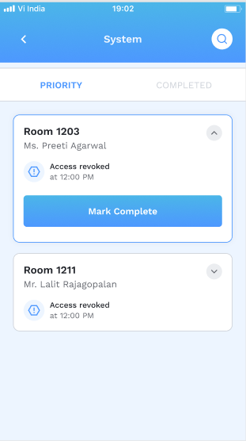</a>
<figcaption><strong>Mark Complete</strong>Staff confirm they have handled it. The app does not revoke access itself.</figcaption>
</figure>
<figure class="crop">
<a href="images/tasks/62-system-request-dialog.png">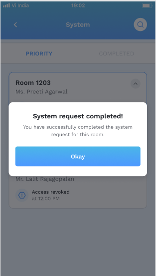</a>
<figcaption><strong>Done</strong>The System confirmation, not the assistance one.</figcaption>
</figure>
<figure>
<a href="images/tasks/63-system-access-revoked-completed.png">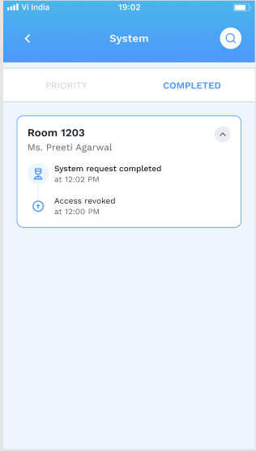</a>
<figcaption><strong>The log</strong>Completed, then the original Access revoked event.</figcaption>
</figure>

## 3. A task's life

A task moves through a fixed set of states, and the backend refuses anything
outside it.

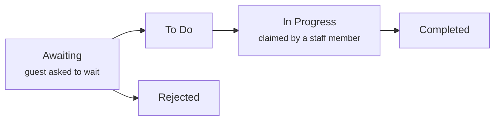
```mermaid
%%{init:{"flowchart":{"rankSpacing":30}}}%%
flowchart LR
    AW["Awaiting<br/><small>guest asked to wait</small>"] --> TD["To Do"]
    AW --> RJ["Rejected"]
    TD --> IP["In Progress<br/><small>claimed by a staff member</small>"]
    IP --> CO["Completed"]
```

What each card carries, whichever tab it is on:

| Field | What it is |
|---|---|
| `roomNumber`, `guestName` | Which room, and who is in it |
| `requestDetails` | One or more items, each with a type and free-text instructions |
| `taskStatus`, `isPriority` | Which tab it belongs on |
| `spintlyId` | The door, which is what makes the Unlock button work |
| `privacyMode`, `passageModeStatus` | The lock's current mode |
| `scheduledFrom`, `scheduledTo` | Set when a room cleaning is booked for later |
| `deviceType`, `deviceStatus` | Set on System tasks only. See [step 5](#5-device-faults-arrive-as-tasks) |
| `statusLogs` | Timestamps for every transition, and who serviced it |

A task whose only item is `ROOM_CLEANING` is handled differently by the app. It
is the one kind that can be scheduled, and the only one offering **Request
again**.

## 4. Acting on a task

Three calls cover everything a staff member can do.

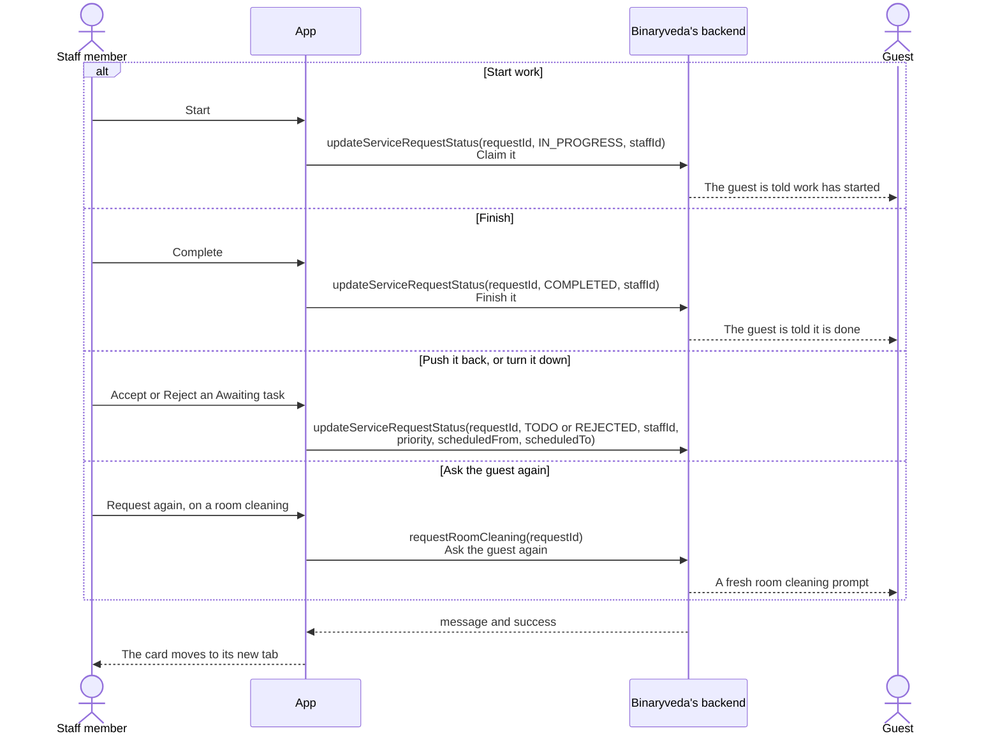
```mermaid
sequenceDiagram
    actor U as Staff member
    participant A as App
    participant B as Binaryveda's backend
    actor G as Guest

    alt Start work
        U->>A: Start
        A->>B: updateServiceRequestStatus(requestId, IN_PROGRESS, staffId)<br/>Claim it
        B-->>G: The guest is told work has started
    else Finish
        U->>A: Complete
        A->>B: updateServiceRequestStatus(requestId, COMPLETED, staffId)<br/>Finish it
        B-->>G: The guest is told it is done
    else Push it back, or turn it down
        U->>A: Accept or Reject an Awaiting task
        A->>B: updateServiceRequestStatus(requestId, TODO or REJECTED, staffId,<br/>priority, scheduledFrom, scheduledTo)
    else Ask the guest again
        U->>A: Request again, on a room cleaning
        A->>B: requestRoomCleaning(requestId)<br/>Ask the guest again
        B-->>G: A fresh room cleaning prompt
    end
    B-->>A: message and success
    A-->>U: The card moves to its new tab
```

`completeRequest` exists alongside `updateServiceRequestStatus` and is used from
the notification screens. It takes only a `requestId`.

### Three rules the backend enforces

- **The state machine.** Anything outside the diagram in
  [step 3](#3-a-tasks-life) comes back as `invalidStatusChange`. Completed and
  Rejected are terminal.
- **Only the staff member who started a task can complete it.** The stored
  `serviced_by` is checked against the `staffId` sent, and a mismatch fails with
  `requestNotServicedByStaff`.
- **Completing a Check Out task can free the room.** If the task carries an
  initiate-checkout item, the room is set to vacant in the same write.

Moving an Awaiting task to To Do can also carry `scheduledFrom` and
`scheduledTo`, but only when `priority` is false. A task cannot be both urgent
and booked for later.

## 5. Device faults arrive as tasks

The **System** category is not raised by a guest. It is raised by the hardware,
through Kafka, and it is the only place lock hardware appears in this app.

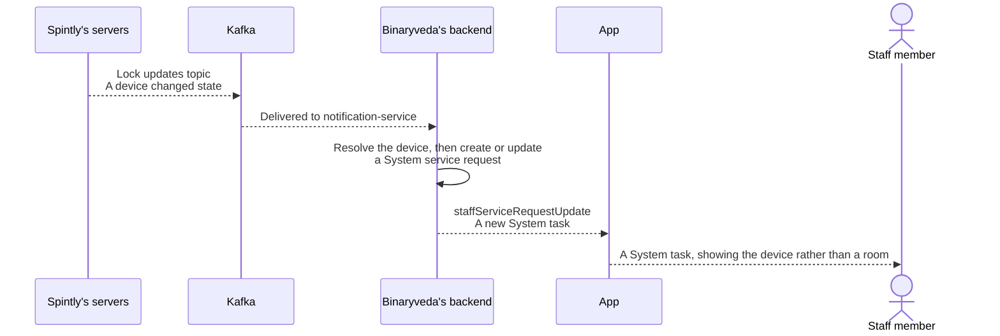
```mermaid
sequenceDiagram
    participant S as Spintly's servers
    participant K as Kafka
    participant B as Binaryveda's backend
    participant A as App
    actor U as Staff member

    S-->>K: Lock updates topic<br/>A device changed state
    K-->>B: Delivered to notification-service
    B->>B: Resolve the device, then create or update<br/>a System service request
    B-->>A: staffServiceRequestUpdate<br/>A new System task
    A-->>U: A System task, showing the device rather than a room
```

The card uses two fields instead of a room number.

| Field | Values |
|---|---|
| `deviceType` | `LOCK`, `GATEWAY`, `REPEATER` |
| `deviceStatus` | `OFFLINE`, `CRITICAL` (critical battery), `WEAK` (weak battery) |

A lock that belongs to a room still shows the room number. A gateway or
repeater shows **Gateway** or **Repeater**, with the serial underneath. The
backend updates the same task when a device flaps, rather than opening a new
one each time.

There is nothing to repair in the app. Staff look at the hardware, then mark
the task complete.

<figure>
<a href="images/tasks/69-system-device-priority.png">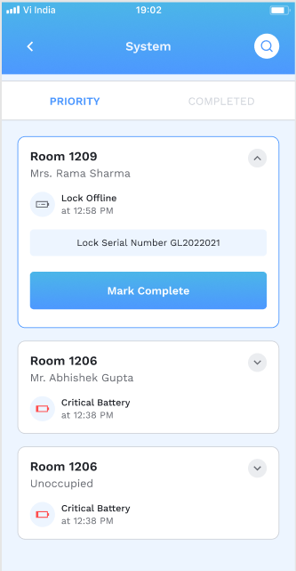</a>
<figcaption><strong>Lock faults</strong>Lock Offline and Critical Battery. The serial is on the expanded card.</figcaption>
</figure>
<figure class="crop">
<a href="images/tasks/73-repeater-card.png">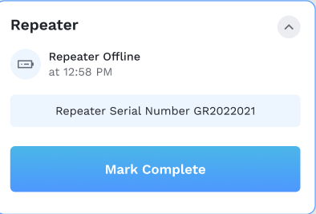</a>
<figcaption><strong>Repeater</strong>Title is the device, not a room. Same Mark Complete.</figcaption>
</figure>
<figure class="crop">
<a href="images/tasks/70-system-device-dialog.png">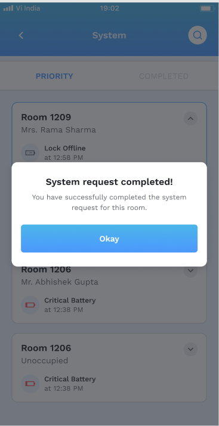</a>
<figcaption><strong>Done</strong>Same System confirmation as access revoked.</figcaption>
</figure>

<figure>
<a href="images/tasks/71-system-completed-devices.png">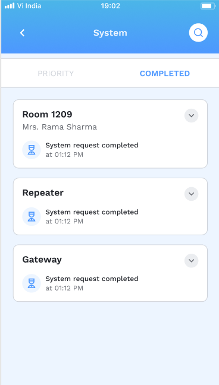</a>
<figcaption><strong>Completed</strong>Room, Repeater and Gateway can sit on the same tab.</figcaption>
</figure>
<figure>
<a href="images/tasks/72-system-lock-offline-timeline.png">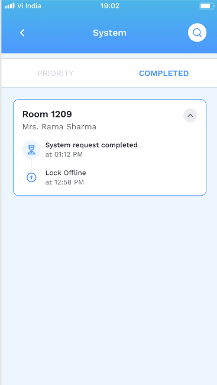</a>
<figcaption><strong>The log</strong>Completed, then the original Lock Offline event.</figcaption>
</figure>

## 6. Live updates

The lists do not need a pull to refresh. The socket pushes every status change
for the site, and both platforms recount from it.

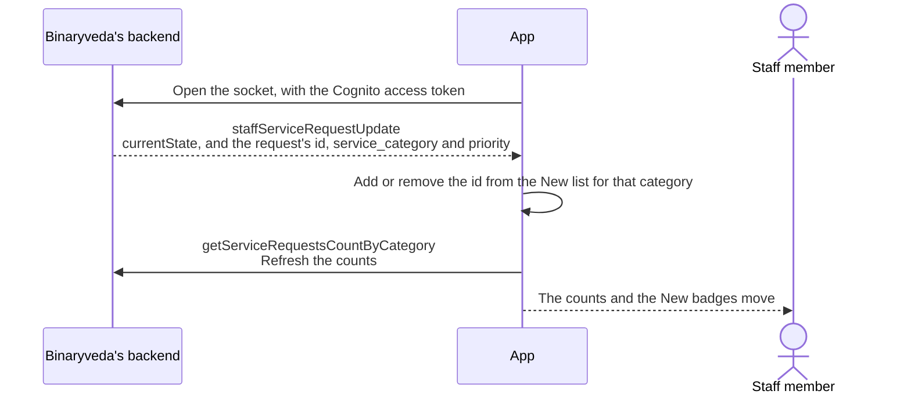
```mermaid
sequenceDiagram
    participant B as Binaryveda's backend
    participant A as App
    actor U as Staff member

    A->>B: Open the socket, with the Cognito access token
    B-->>A: staffServiceRequestUpdate<br/>currentState, and the request's id, service_category and priority
    A->>A: Add or remove the id from the New list for that category
    A->>B: getServiceRequestsCountByCategory<br/>Refresh the counts
    A-->>U: The counts and the New badges move
```

The event goes to everyone in the socket room named `siteId + roleCode`, so a
staff member sees unclaimed work arrive and a shared queue stays in step across
phones.

<figure>
<a href="images/tasks/02-categories-new-badge.png">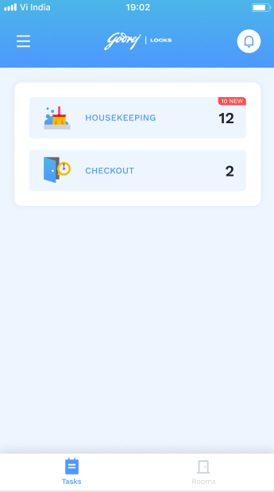</a>
<figcaption><strong>The New badge</strong>Client-side. A <code>staffServiceRequestUpdate</code> in <code>TODO</code> or <code>PRIORITY</code> adds the id, and opening the card takes it off. Restarting the app clears it.</figcaption>
</figure>

**The New badge is client-side.** Neither platform is told what is new. Each
keeps a list of request IDs seen arriving in a `TODO` or `PRIORITY` state over
the socket, and removes an ID once the card has been looked at. Restarting the
app clears it.

=== "iOS"

    `SocketManagerClass` appends to a single `newTaskList` of `(id, category)`
    pairs when the event's `currentState` is `TODO` or `PRIORITY`.

=== "Android"

    `TasksViewModel` keeps one list per category, adds an ID when the state is
    `TODO` and removes it otherwise, then reloads the counts on the main thread.

## Differences between the two

| | iOS | Android |
|---|---|---|
| The listing call | `listRequests` as well as `getServiceRequestsByStatusAndCategory` | `getServiceRequestsByStatusAndCategory`, plus `getServiceRequestsByCategories` |
| A slimmer variant | Not present | `getServiceRequestsIdsByStatusAndCategory`, the same field with IDs only |
| How the role is matched | On letters alone, so `House Keeping`, `House-Keeping` and `HOUSEKEEPING` all resolve | Exact string match on the role code |
| The New list | One list of `(id, category)` pairs | One list per category |
| Where seen state is kept | In memory | Also cached in a local Room database |

## Every SDK member this flow uses

The Spintly session set up on first load, which is
[User Onboarding, step 5](user-onboarding.md#5-trading-the-cognito-token-for-a-spintly-session),
and on Android one Access SDK call of its own.

??? note "Android"

    | SDK | Member | When | What it is for |
    |---|---|---|---|
    | Access | `accessManager.startBleScan()` | Whenever Bluetooth, or on API 30 and below location, becomes available | Start listening for locks nearby |

iOS starts its BLE scan immediately before each unlock instead, on the
[Control Panel](control-panel.md#3-unlocking).
