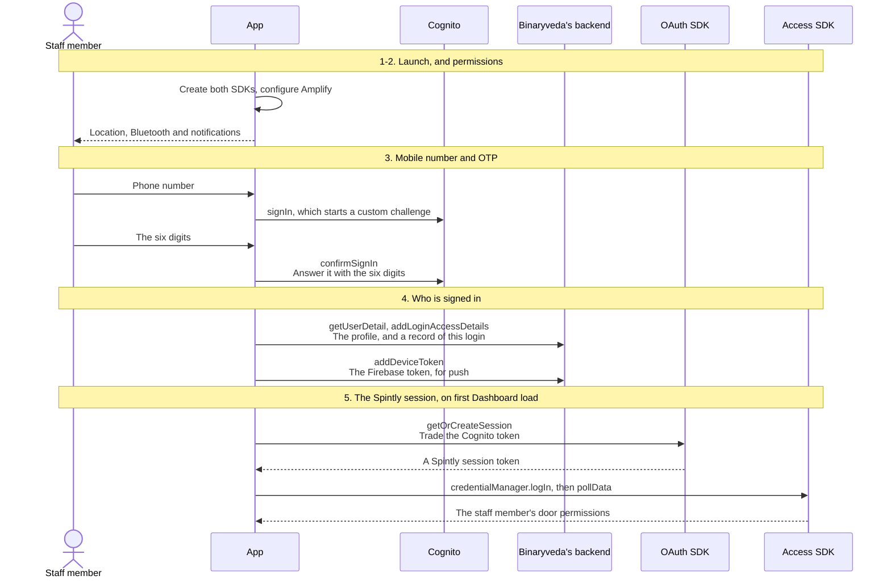
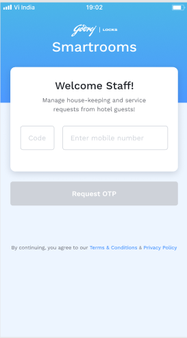
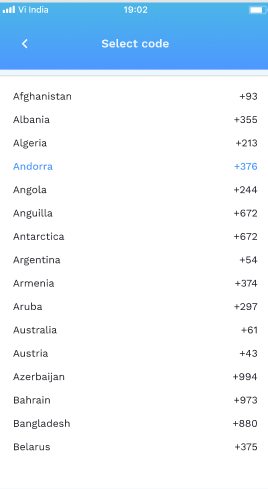
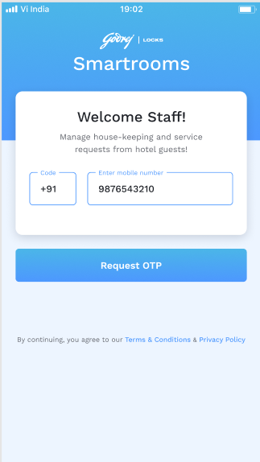
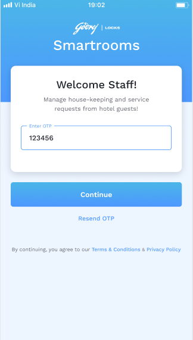
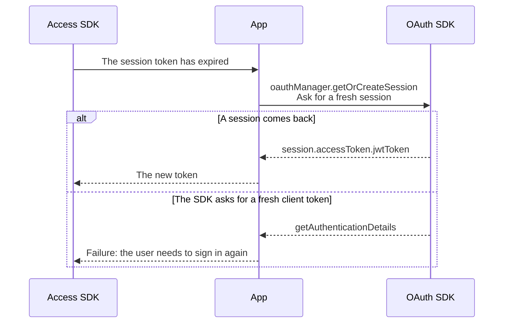

# 1. User Onboarding

**What it is.** Everything from a cold launch to a working session: creating the
SDKs, asking for permissions, signing in with a phone number and an OTP,
registering the device for push, and trading the Cognito token for a Spintly
session so the Access SDK can open doors.

!!! warning "Key point"

    The Spintly handshake does **not** run at sign in. It runs later, the first
    time the Dashboard loads, and on Android only for the housekeeping role. See
    [step 5](#5-trading-the-cognito-token-for-a-spintly-session).

## Participants

This page uses Staff member, App, Cognito, Binaryveda's backend, Firebase, OAuth
SDK and Access SDK.

Each one is defined, with the colour it keeps across the site, in
[Reading these pages](conventions.md).

## The whole flow

Six steps. Each one has its own section below. Ending a session is the other
direction, and it is on
[Profile and Logout](profile-and-logout.md#3-logging-out).



## 1. App launch

Both SDKs are created before anything is signed in, so the token-refresh handler
and the login-status observer are already in place when a session appears.

<div class="screens">
<figure>
<a href="images/user-onboarding/01-splash.png"></a>
<figcaption><strong>The splash screen</strong>Everything in this step runs behind it. Both SDKs are created and Amplify is configured before a session exists.</figcaption>
</figure>
</div>

=== "iOS"

    ```mermaid
    sequenceDiagram
        participant A as App
        participant C as Cognito
        participant O as OAuth SDK
        participant S as Access SDK

        Note over A,S: AppDelegate.didFinishLaunchingWithOptions
        A->>A: FirebaseApp.configure()<br/>Start Firebase
        A->>C: Amplify.add(AWSCognitoAuthPlugin), then Amplify.configure<br/>Set up Cognito
        A->>O: SpintlyOauthManager(clientId:provider:environment:)<br/>Create the OAuth manager
        A->>S: SpintlyACServiceProvider.defaultInstance<br/>then setEnvironment
        A->>S: credentialManager.setRefreshTokenDelegate<br/>Register the token-refresh handler
        A->>S: credentialManager.setLoginStatusDelegate<br/>Register the login-status observer
        A->>A: Register for push notifications
    ```

    All of it sits in `SmartAccessHelper.initialise()`, called once from the app
    delegate. The service provider is only built when it is still nil, so a
    second call re-creates the OAuth manager but leaves the Access SDK alone.

=== "Android"

    ```mermaid
    sequenceDiagram
        participant A as App
        participant C as Cognito
        participant O as OAuth SDK
        participant S as Access SDK

        Note over A,S: GodrejApplication.onCreate
        A->>O: SpintlyOauthManager(context, clientId, providerId, environment)<br/>Create the OAuth manager
        A->>S: SpintlyACServiceProvider.getDefaultInstance(context)<br/>then environmentManager.environment
        A->>S: credentialManager.setTokenRefreshHandler<br/>Register the token-refresh handler
        A->>C: Amplify.configure(applicationContext)<br/>Set up Cognito

        Note over A,S: GodrejActivity.onCreate
        A->>A: Root detection, and the app stops here if the device is rooted
        A->>S: credentialManager.loginStatusLiveData<br/>Start observing the login state
        A->>A: Watch for an auto-logout signal
    ```

    Android refuses to run on a rooted device: `RootDetection` replaces the
    whole UI with a dialog that closes the app.

## 2. Permissions

Three permissions are asked for: **location**, **Bluetooth** and **push
notifications**. An unlock needs Bluetooth, and older Android versions need
location alongside it.

The screen is deliberately not shown every launch. Both platforms count and show
it once every **ten** times, and both skip it entirely once everything has been
granted.

=== "iOS"

    ```mermaid
    sequenceDiagram
        actor U as Staff member
        participant A as App

        Note over A: On the splash screen, and again after a successful sign in
        A->>A: Read the stored skip count
        alt If the count is 0 or 10, and something is still missing
            A-->>U: The permissions screen
            U->>A: Continue on each card
        else Otherwise
            A-->>U: Straight on to the next screen
        end
    ```

=== "Android"

    ```mermaid
    sequenceDiagram
        actor U as Staff member
        participant A as App

        Note over A: When the Dashboard opens
        A->>A: Increment the stored launch count
        alt If the count is a multiple of 10, and something is still missing
            A-->>U: The permissions screen
            U->>A: Continue on each card
        else Otherwise
            A-->>U: The Dashboard
        end
    ```

## 3. Mobile number and OTP

Cognito is configured for a **custom auth challenge**, so `signIn` does not take
a password. It starts a challenge, the trigger sends an SMS, and `confirmSignIn`
answers it with the six digits.

Staff cannot sign themselves up. If Cognito has no user for that number the
challenge trigger throws **"User does not exist"**, which the app surfaces
directly. A staff member has to be created by an admin first, and that is also
what creates their Spintly accessor.

<div class="screens">
<figure>
<a href="images/user-onboarding/02-mobile-empty.png"></a>
<figcaption><strong>The number screen</strong>Request OTP stays disabled until both fields are filled. Nothing has been sent anywhere yet.</figcaption>
</figure>
<figure>
<a href="images/user-onboarding/03-country-code.png"></a>
<figcaption><strong>The picker</strong>Filled from <code>listCountryCodes</code>. Android opens this as a screen of its own, and iOS picks the code in a sheet.</figcaption>
</figure>
<figure>
<a href="images/user-onboarding/04-mobile-filled.png"></a>
<figcaption><strong>Ready to send</strong>This tap is <code>signIn</code>, which starts the custom challenge. The app signs out first so a half-finished attempt does not leak into this one.</figcaption>
</figure>
<figure>
<a href="images/user-onboarding/05-otp-filled.png"></a>
<figcaption><strong>Six digits in</strong>The six digits go to <code>confirmSignIn</code>. Outside production the Lambda answers every challenge with a fixed code.</figcaption>
</figure>
</div>

**Terms and Privacy Policy.** Two links sit at the bottom of this screen. Each
opens the matching document in a web view inside the app. The URLs are build
config, and neither link touches Cognito or the backend. Android pushes a screen
of its own, and iOS shows the web view over the login screen.

=== "iOS"

    ```mermaid
    sequenceDiagram
        actor U as Staff member
        participant A as App
        participant C as Cognito
        participant B as Binaryveda's backend

        A->>B: listCountryCodes<br/>Fill the country code picker
        B-->>A: The list, cached after the first fetch
        U->>A: Country code and phone number
        A->>C: signOut, to clear any half-finished attempt
        A->>C: Amplify.Auth.signIn(username:)<br/>Start the custom challenge
        C-->>A: nextStep = confirmSignInWithCustomChallenge
        A-->>U: The OTP field, and a 60 second resend countdown
        U->>A: The six digits
        A->>C: Amplify.Auth.confirmSignIn(challengeResponse:)<br/>Answer it with the six digits
        alt Signed in
            C-->>A: isSignedIn
            A->>A: Store the logged-in flag
        else Wrong code
            C-->>A: Not signed in
            A-->>U: Invalid OTP
        end
    ```

    One scene handles both halves. `currentScreen` moves from `.enterNumber` to
    `.enterOtp`, and the country code is picked in a sheet rather than a
    separate screen.

=== "Android"

    ```mermaid
    sequenceDiagram
        actor U as Staff member
        participant A as App
        participant C as Cognito
        participant B as Binaryveda's backend

        U->>A: Tap the country code field
        A->>B: listCountryCodes<br/>A screen of its own
        B-->>A: The list
        U->>A: Phone number
        A->>C: Amplify.Auth.signOut, to clear any half-finished attempt
        A->>C: Amplify.Auth.signIn(number, "")<br/>Start the custom challenge
        C-->>A: nextStep.additionalInfo["USERNAME"]
        A-->>U: The OTP screen, and a resend countdown
        U->>A: The six digits
        A->>C: Amplify.Auth.confirmSignIn(code)<br/>Answer it with the six digits
        alt isSignInComplete
            C-->>A: true
            A->>A: Record the Cognito user id for crash reports
        else Not complete
            C-->>A: false
            A-->>U: Invalid OTP
        end
    ```

!!! warning "The code is fixed outside production"

    In the non-production environments the `CreateAuthChallenge` Lambda answers
    every challenge with a fixed code, and only sends an SMS when the number
    starts `+91`. Five wrong attempts fail the whole session.

## 4. Who is signed in

With a Cognito session in hand, the app fetches the staff profile, records the
login, and registers the device for push. Both platforms make the same three
calls in a different order.

=== "iOS"

    ```mermaid
    sequenceDiagram
        participant A as App
        participant B as Binaryveda's backend
        participant F as Firebase

        A->>B: addLoginAccessDetails<br/>Record that this device signed in
        B-->>A: success
        A->>B: getUserDetail<br/>The profile, role and staffId
        B-->>A: id, staffId, staffRole
        A->>A: Store the role, staffId and id
        A->>F: Read the FCM token
        F-->>A: The token
        A->>B: addDeviceToken<br/>Register this phone for push
        B-->>A: success
        A-->>A: On to Permissions, or the Dashboard
    ```

    If `addLoginAccessDetails` or `getUserDetail` fails, iOS sets the logged-in
    flag back to false, so a failure here undoes the sign in.

=== "Android"

    ```mermaid
    sequenceDiagram
        participant A as App
        participant B as Binaryveda's backend
        participant F as Firebase

        A->>B: getUserDetail<br/>The profile, role and staffId
        B-->>A: id, staffId, staffRole
        A->>A: Read or mint a device UUID, and store it
        par Both are started from the same callback
            A->>F: FirebaseMessaging.getInstance().token
            F-->>A: The token
            A->>B: addDeviceToken(token, id, uuid)<br/>Register this phone for push
            B-->>A: success
        and
            A->>B: addLoginAccessDetails(accessedAt)<br/>Record that this device signed in
            B-->>A: success
        end
        A->>A: Store the user id
        A-->>A: On to the Dashboard
    ```

    Only `addDeviceToken` gates the navigation. If it fails the app stays on the
    OTP screen even though Cognito has already signed the user in.

What `addDeviceToken` sends, and why the device UUID goes with it, is in
[Notifications](notifications.md#1-registering-the-device).

## 5. Trading the Cognito token for a Spintly session

No unlock is possible until this handshake completes. It runs on the **first
Dashboard load** rather than at sign in, and again from the Control Panel if it
has not happened yet.

The Cognito **access token** is the client token handed to the OAuth SDK. The
SDK does not take it directly. It asks the app for authentication details
through a callback, and the app answers with a token exchange request built
around that token.

=== "iOS"

    ```mermaid
    sequenceDiagram
        participant A as App
        participant O as OAuth SDK
        participant S as Access SDK

        A->>S: credentialManager.isLoggedIn()<br/>Is there already a session?
        opt If it is already logged in
            A-->>A: Nothing more to do
        end
        A->>O: oauthManager.getOrCreateSession(delegate:)<br/>Trade the Cognito token
        O-->>A: AuthorizationDelegate → getAuthenticationDetails(_:)
        A->>O: AuthenticationDetails.createWithTokenExchangeGrantType(clientToken:)<br/>then continuation.continueTask()
        O-->>A: didGetSession(_:) → session.accessToken.jwtToken
        A->>S: credentialManager.isLoggedIn(), and appLoginState == .LOGGED_OUT
        opt Only when both say it is logged out
            A->>S: credentialManager.logIn(accessToken:)<br/>Seat the Spintly token
            S-->>A: completion, with an error or nil
        end
        A->>S: cloudSyncManager.pollData<br/>Pull down the door permissions
        S-->>A: completion
    ```

    iOS runs this for **every role**, from the Task tab and again from the
    Control Panel.

=== "Android"

    ```mermaid
    sequenceDiagram
        participant A as App
        participant O as OAuth SDK
        participant S as Access SDK

        A->>S: shouldAttemptSmartAccessLogin()<br/>isLoggedIn is false and the state is LOGGED_OUT
        opt If it is already logged in
            A->>S: cloudSyncManager.pollData(callback), and nothing else
        end
        A->>S: credentialManager.logOut()<br/>Drop any old credential
        A->>O: oauthManager.clearSession()<br/>Clear any half-finished session first
        A->>O: oauthManager.getOrCreateSession(AuthorizationCallback)<br/>Trade the Cognito token
        O-->>A: getAuthenticationDetails(AuthenticationContinuation)
        A->>O: AuthenticationDetails.createWithTokenExchangeGrantType(token)<br/>then continueTask()
        O-->>A: onSuccess(session) → session.accessToken.jwtToken
        A->>S: credentialManager.logIn(token, CompletionCallback)<br/>Seat the Spintly token
        alt completed
            S-->>A: Logged in
            A->>S: cloudSyncManager.pollData(callback)<br/>Pull down the door permissions
        else failed
            S-->>A: The exception
            A->>S: logOut and clearSession<br/>Roll the whole attempt back
        end
    ```

    **Android gates this on role.** `initSpintly` only runs when the staff role
    code is `housekeeping`. Every other role reaches the Dashboard with the
    Access SDK still logged out, and only picks up a session when they open a
    Control Panel.

    **Android clears before it logs in.** The login begins with `logOut()` and
    `clearSession()`, so any existing Spintly session is discarded and rebuilt.
    iOS keeps an existing session and skips the work.

`pollData` is what fills the door list. Until it returns, the Access SDK holds
no permissions and `bleUnlockAccessPoint` has nothing to match a `spintlyId`
against.

## 6. While signed in

Two things are registered against the Access SDK at launch and stay live for the
whole session.

### The token-refresh handler

The Spintly session token expires. When it does, the Access SDK asks the app for
a new one rather than failing.



Both platforms answer the second branch the same way, with a failure rather than
a fresh Cognito token. A Spintly session that outlives its Cognito token is
therefore not repaired in the background, and the staff member has to sign in
again.

### The login-status observer

The SDK reports its own login state, and both platforms watch it.

=== "iOS"

    `LoginStatusDelegate.didUpdateLoginStatus()` reads `loginStatus.error`, pulls
    `displayMessage` out of its `userInfo`, records it to Analytics, and posts a
    `spintlyLoginError` notification for the UI to show.

=== "Android"

    `loginStatusLiveData` is observed for as long as the activity is alive, but
    only acted on while the app itself is signed in. An exception is recorded to
    Crashlytics and shown in a snackbar. A `LOGGED_OUT` **with** an exception,
    or `LOGGED_OUT_DELETED_USER`, is treated as a forced logout and runs the
    sign-out flow below. A plain `LOGGED_OUT` with no exception is the app's own
    sign out and is ignored.

Both platforms also force a sign out on a `STAFF_ROLE_UPDATED` push, which is in
[Notifications](notifications.md#2-a-push-arrives).

## Differences between the two

| | iOS | Android |
|---|---|---|
| Where the SDKs are created | `AppDelegate`, in `SmartAccessHelper.initialise()` | The Application class, in `SpintlyLibHelper.initialise()` |
| Rooted device | Not blocked | The app refuses to run |
| Splash delay | 0.7 seconds | 2 seconds |
| Where permissions are checked | On the splash screen, and after sign in | When the Dashboard opens |
| Phone number and OTP | One scene, two states | Two routes, plus a third for the country code |
| Order after the OTP | `addLoginAccessDetails`, then `getUserDetail`, then `addDeviceToken` | `getUserDetail`, then `addDeviceToken` and `addLoginAccessDetails` together |
| What a failure here does | Sets the logged-in flag back to false | Leaves the user on the OTP screen |
| Who gets a Spintly session | Every role | Housekeeping only on the Dashboard, any role through a Control Panel |
| Before the Spintly login | Skips it if the SDK is already logged in | Clears the session and rebuilds it |
| Login-status errors | Posted as a notification, and tracked in Analytics | Snackbar, recorded to Crashlytics, and can force a sign out |

## Every SDK member this flow uses

??? note "iOS"

    | SDK | Member | When | What it is for |
    |---|---|---|---|
    | OAuth | `SpintlyOauthManager(clientId:provider:environment:)` | App launch | Create the OAuth manager |
    | OAuth | `oauthManager.getOrCreateSession(delegate:)` | The Spintly login, and every token refresh | Trade the Cognito token for a Spintly session |
    | OAuth | `AuthenticationDetails.createWithTokenExchangeGrantType(clientToken:)` | Inside `getAuthenticationDetails` | Hand the Cognito token over for exchange |
    | OAuth | `AuthorizationDelegate` → `getAuthenticationDetails(_:)`, `didGetSession(_:)`, `didFailWithError(_:)` | The Spintly login | How the exchange reports back |
    | Access | `SpintlyACServiceProvider.defaultInstance` | App launch | Create the Access SDK |
    | Access | `environmentManager.setEnvironment(_:)` | App launch | Point it at the environment |
    | Access | `credentialManager.setRefreshTokenDelegate(_:)` | App launch | Register the token-refresh handler |
    | Access | `credentialManager.setLoginStatusDelegate(delegate:)` | App launch | Register the login-status observer |
    | Access | `credentialManager.isLoggedIn()` | Before the Spintly login | Check before logging in again |
    | Access | `credentialManager.loginStatus.appLoginState` | Before the Spintly login | Confirm the SDK reports itself logged out |
    | Access | `credentialManager.logIn(accessToken:)` | The Spintly login | Seat the Spintly token |
    | Access | `cloudSyncManager.pollData` | After the login | Pull down the door permissions |

??? note "Android"

    | SDK | Member | When | What it is for |
    |---|---|---|---|
    | OAuth | `SpintlyOauthManager(context, clientId, providerId, environment)` | App launch | Create the OAuth manager |
    | OAuth | `oauthManager.getOrCreateSession(AuthorizationCallback)` | The Spintly login, and every token refresh | Trade the Cognito token for a Spintly session |
    | OAuth | `AuthenticationDetails.createWithTokenExchangeGrantType(token)` | Inside `getAuthenticationDetails` | Hand the Cognito token over for exchange |
    | OAuth | `AuthorizationCallback` → `getAuthenticationDetails`, `onSuccess`, `onFailure` | The Spintly login | How the exchange reports back |
    | OAuth | `oauthManager.clearSession()` | Before every login | Drop the Spintly session |
    | Access | `SpintlyACServiceProvider.getDefaultInstance(context)` | App launch | Create the Access SDK |
    | Access | `environmentManager.environment` | App launch | Point it at the environment |
    | Access | `credentialManager.setTokenRefreshHandler(TokenRefreshHandler)` | App launch | Register the token-refresh handler |
    | Access | `credentialManager.loginStatusLiveData` | App launch | Observe the login state |
    | Access | `credentialManager.isLoggedIn` | Before the Spintly login | Check before logging in again |
    | Access | `credentialManager.logIn(token, CompletionCallback)` | The Spintly login | Seat the Spintly token |
    | Access | `cloudSyncManager.pollData(CompletionCallback)` | After the login, and on a permissions push | Pull down the door permissions |
    | Access | `credentialManager.logOut()` | Before every login | Drop the credential |
