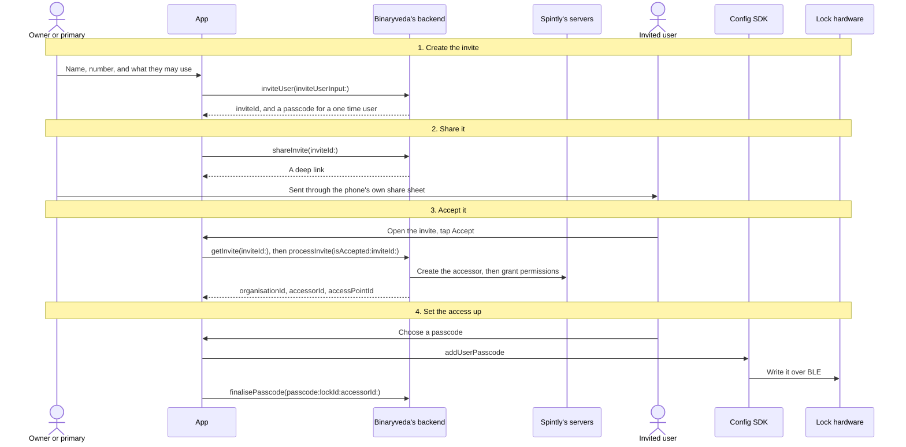
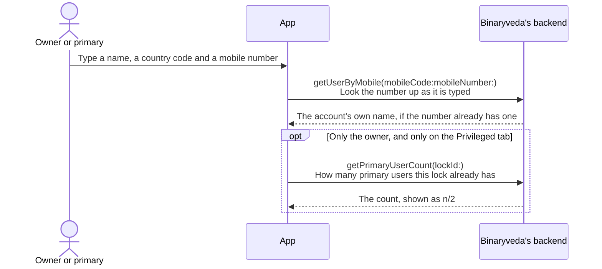
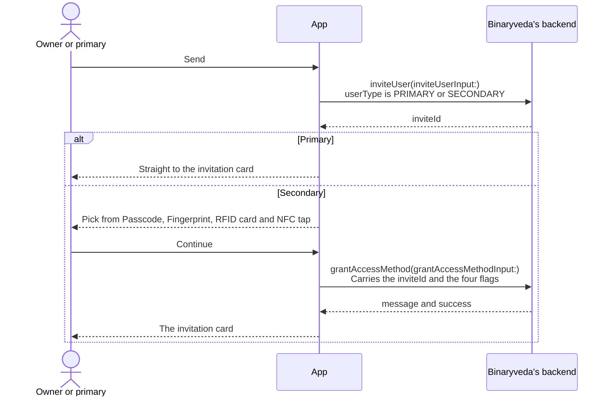
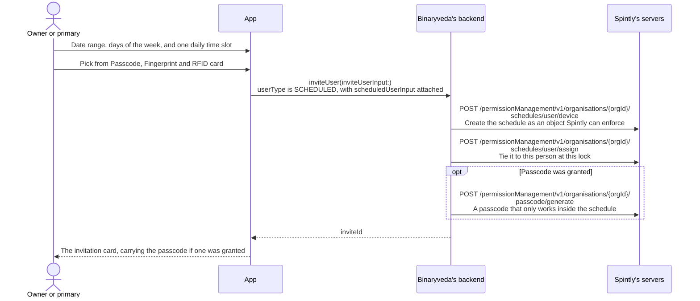
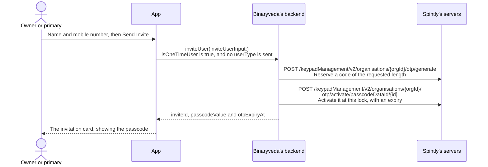
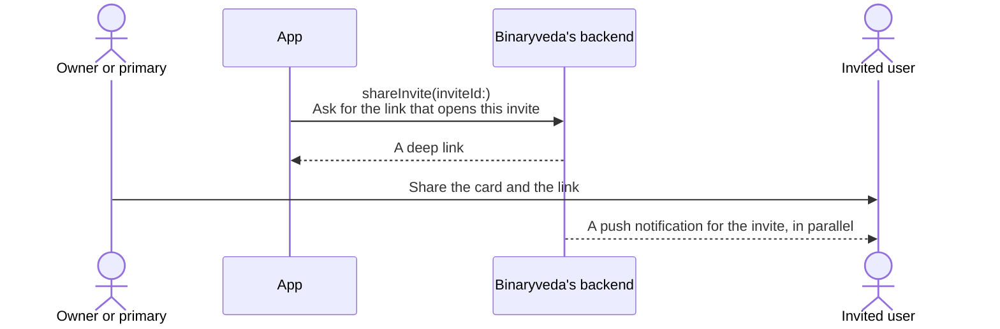
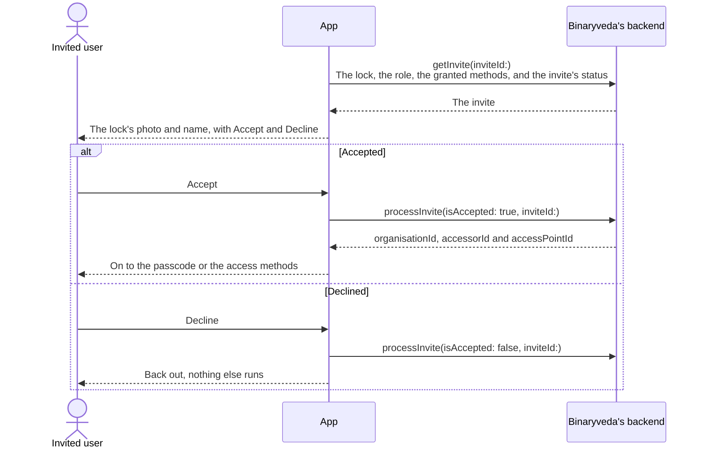
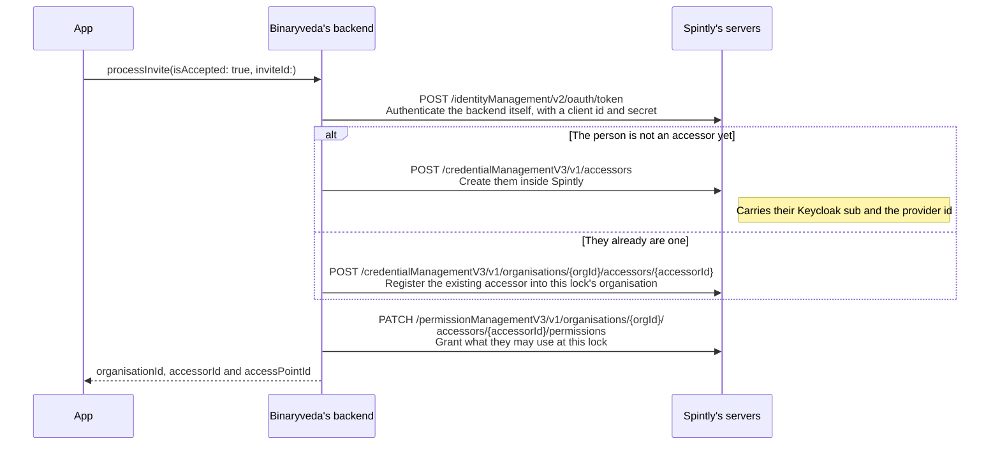
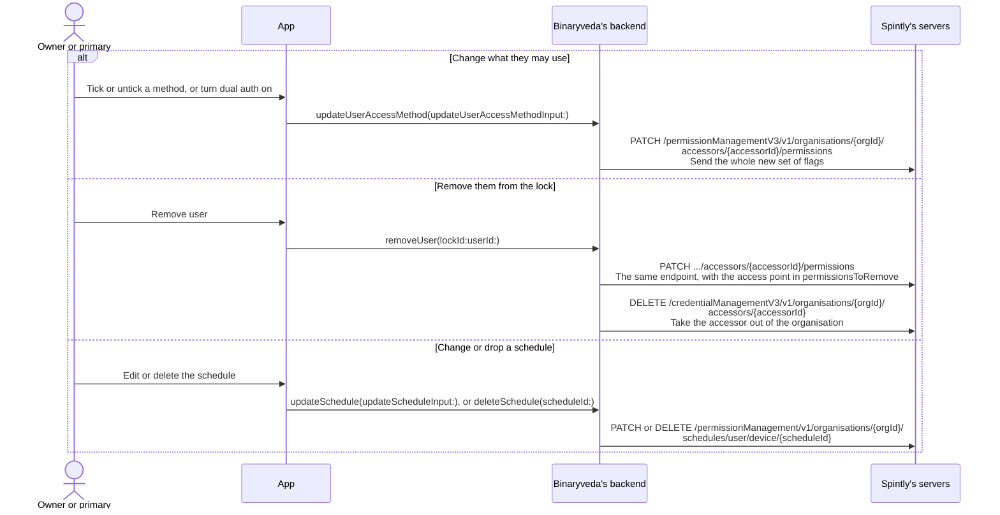

# 5. User Management

**What it is.** Everything behind the **Users** button on the
[Lock Control Panel](lock-control-panel.md): inviting someone to a lock, what
each kind of invited user receives, how they accept, and how they set up the
access they were given.

Access is granted **per lock**, not per property. Inviting the same person to a
second lock is a second invite.

!!! warning "Key point"

    Inviting someone, accepting an invite, and taking access away are all
    requests to **Binaryveda's backend**. The backend is what talks to Spintly,
    and the diagrams below show which of its calls each request turns into.

    Only one step on this page reaches the lock itself: the **Config SDK**
    writes the new user's passcode over BLE.

## Who does what

Seven participants appear across the diagrams. Each diagram shows only the ones
it needs.

| Participant | What it is |
|---|---|
| **Owner or primary** | The person sending the invite, from the lock's Users screen |
| **Invited user** | The person receiving it, on their own phone |
| **App** | The iOS or Android app. Both people are using it, on different phones |
| **Config SDK** | Spintly's `configurationProvider`, the only SDK in this flow and the only one that can write to the lock |
| **Lock hardware** | The lock itself, over BLE |
| **Binaryveda's backend** | Binaryveda's GraphQL API, with `user-service` behind it |
| **Spintly's servers** | Spintly's REST APIs, which only Binaryveda's backend calls |

!!! tip "Reading the diagrams"

    Each diagram reads top to bottom. Every participant has a vertical line, and
    every arrow between two lines is one call.

    | What you see | What it means |
    |---|---|
    | **Solid arrow** | A call going out, from whoever it starts at to whoever it points at |
    | **Dashed arrow** | The answer coming back. Also used when the SDK calls back into the app on its own |
    | **Arrow that loops back to its own line** | Work the app does by itself. Nothing leaves the app |
    | **Two lines on an arrow** | The first line is the member, GraphQL field, or HTTP path being called, the second says what it does |
    | **Grey banner across the whole diagram** | A heading, marking where one part of the flow ends and the next begins |
    | **Box labelled `opt`** | Something that only sometimes happens. Its condition sits at the top of the box, and when that condition is false everything inside is skipped |
    | **Box labelled `alt`** | A choice between two paths. A dashed line splits the box into a top half and a bottom half, each with its own condition above it. Exactly one of the two halves happens |

    Arrows into Binaryveda's backend carry the **GraphQL field** and its
    arguments. Arrows into Spintly carry the **HTTP method and path** that
    Binaryveda's backend uses.

    The iOS and Android tabs are linked across the site. Pick a platform once
    and every diagram follows.

## The kinds of user

The Users screen has three tabs, and the Privileged tab covers two roles. Which
one is being created is decided by two fields on the same mutation: `userType`
and `isOneTimeUser`.

| Kind | Sent as | What the invited person receives | What they have to do | Do they need the app |
|---|---|---|---|---|
| **Primary** | `userType: PRIMARY` | An invite, and no code | Accept, then choose their own lock passcode | Yes |
| **Secondary** | `userType: SECONDARY` | An invite, and no code | Accept, then set up the access methods they were granted | Yes |
| **Scheduled** | `userType: SCHEDULED` with a schedule attached | An invite, plus a passcode if passcode access was granted | Nothing, if they only use the passcode. It works during their scheduled days and hours | No, unless they want app access |
| **One time** | `isOneTimeUser: true`, no `userType` | A single use passcode with an expiry | Type it on the keypad | No |

Two things that are easy to mix up:

- **A scheduled user's passcode is not a one time code.** It is an ordinary lock
  passcode that stays valid for the whole schedule, and only works inside the
  allowed days and hours.
- **A primary user is never sent a lock passcode.** Accepting the invite is
  enough, and the app then asks them to choose one.

Only the owner can make someone primary. The checkbox is shown to the owner
alone, with an `n/2` counter fed by `getPrimaryUserCount`, and it stops
accepting taps once two primary users exist.

## The whole flow

The diagram follows a primary or secondary user, the longest path: invited,
accepted, passcode set. Steps 1 and 2 are on the inviter's phone, steps 3 and 4
on the invited person's.

A one time user stops after step 2. A scheduled user may stop after step 3,
depending on the platform.

Each step has its own section below.



## 1. Creating the invite

The inviter opens **Users** on the Lock Control Panel, picks a tab, and fills in
a name and a mobile number. Everything after that depends on the kind of user.

Only a mobile number is collected. No email address is used anywhere in this
flow.

### The identity step, common to all four



When the number already belongs to an account, the name comes back from the
lookup and is used instead of the typed one.

### Privileged, primary or secondary



**A primary user skips the access method step.** They implicitly get every
method, so the app goes straight from the invite to the card.

**App access is not one of the four.** `grantAccessMethod` carries only
`passcode`, `fingerprint`, `card` and `mobileNfc`. Opening the lock from the app
comes with the invite itself and cannot be turned off here.

### Scheduled



`scheduledUserInput` carries `startDate`, `endDate`, `daysOfWeek`, `fromTime`
and `toTime`, plus a `passcode`, `fingerprint` and `rfid` flag. The two
platforms fill those three flags differently, which is covered in
[Differences](#differences-between-the-two).

### One time



There is no access method step and no schedule step. The passcode comes back
from the backend already generated, and the app shows the inviter that it is
valid for **6 hours**. The countdown in the user list is worked out from
`otpExpiryAt`.

A one time user who has been used up can be sent a fresh code with **Invite
Again**, which runs the same mutation again with the same name and number.

## 2. Sharing the invite

The app builds an invitation card showing the lock, the role, the granted
methods, and the passcode when there is one. Sharing it is one query and then
the phone's own share sheet, so the invite can go out over any messaging app.



The invited user can arrive either way: by tapping the push notification, or by
opening the shared link. Both land on the same screen with the same invite id.

## 3. Accepting the invite

The invited user opens the invite, the app fetches it, and they accept or
decline.

Until they accept, the invite is only a record on Binaryveda's backend and the
lock knows nothing about them. Accepting is what creates them at Spintly as an
accessor and grants them access at that lock.



An invite is only actionable while it is **active**. The status comes back on
`getInvite`, and a revoked, accepted, rejected or expired invite is shown as a
message instead of the Accept and Decline buttons.

The three ids that come back are Spintly's, and they are what the Config SDK
needs in the next step.

### What accepting does at Spintly

`processInvite` is Binaryveda's. The paths below are Spintly's, called by
Binaryveda's backend while it handles that one mutation.



Either a new accessor is created or an existing one is registered into the
inviter's organisation. The permission update runs afterwards either way.

!!! note "No token cache"

    The OAuth token at the top is fetched again before each call under it.
    Nothing in Binaryveda's services caches a Spintly token, so every operation
    on this page is at least two Spintly calls deep.

Request bodies, headers and the per-service differences behind these paths, and
behind the ones further down, are in Binaryveda's Spintly API usage document.

### Setting the new access up, straight after accepting

Accepting grants the access but does not finish the job, so the app keeps the
new user in the flow and walks them through whatever they were given. Which
screen comes first depends on their role.

- A **primary** user goes to the passcode screen first, since choosing a
  passcode is the one thing every primary user does, and then on to anything
  else they were granted.
- A **secondary** user goes straight to the list of granted methods, with the
  passcode sitting in that list when it was granted.
- A **scheduled** user is treated as a secondary user on iOS. On Android the
  flow stops here and the app returns Home, which is covered in
  [Differences](#differences-between-the-two).

Before showing that list, both platforms ask the backend which methods were
actually granted, with `getUserAccessDetails`. On this path only the invite id
is filled in, since the person does not have a user id on this lock yet. If
nothing was granted, the screen is skipped.

## 4. Setting the passcode

This is the only step in the flow that reaches the lock. The Config SDK writes
the passcode over BLE, so the phone has to be near the lock, and then the app
tells the backend the passcode is live.

The Config SDK will not write anything without a valid Spintly token, so both
platforms run the OAuth exchange from
[User Onboarding](user-onboarding.md#4-trading-the-keycloak-token-for-a-spintly-session)
first and hand the token over with `setAuthToken`.

=== "iOS"

    ```mermaid
    sequenceDiagram
        actor U as Invited user
        participant A as App
        participant C as Config SDK
        participant L as Lock hardware
        participant B as Binaryveda's backend

        U->>A: Choose and confirm a passcode
        A->>C: oauthManager.getOrCreateSession, then configurationProvider.setAuthToken(token:)<br/>Authorise the write
        A->>C: configurationProvider.addUserPasscode(serial, orgId, accessorId, passcode, completion)
        C->>L: Write the passcode over BLE
        C-->>A: completion<br/>Done, or an error
        A->>B: finalisePasscode(passcode:lockId:accessorId:)<br/>Record it against the user
        A-->>U: On to the rest of the granted methods
    ```

=== "Android"

    ```mermaid
    sequenceDiagram
        actor U as Invited user
        participant A as App
        participant C as Config SDK
        participant L as Lock hardware
        participant B as Binaryveda's backend

        U->>A: Choose and confirm a passcode
        A->>C: oauthManager.getOrCreateSession, then configurationProvider.setAuthToken(authToken)<br/>Authorise the write
        A->>C: configurationProvider.addUserPasscode(serial, orgId, accessorId, passcode, callback)
        C->>L: Write the passcode over BLE
        C-->>A: SpintlyCompletionCallback → completed or failed
        A->>B: finalisePasscode(passcode:lockId:accessorId:)<br/>Record it against the user
        A-->>U: On to the rest of the granted methods
    ```

The passcode is 4 to 12 digits on both platforms. The strength label does not
match: iOS calls anything up to six digits **weak**, Android calls six digits or
more **strong**, so the same six digit passcode is labelled differently on the
two phones.

This is not the same as the master passcode set during
[Lock Onboarding](lock-onboarding.md#7-master-passcode). That one replaces the
lock's factory code and needs it first. An invited user's passcode is a new one
added alongside it, so nothing existing has to be typed in.

## 5. The other access methods

Fingerprint and RFID card enrolment work exactly as they do at the end of lock
onboarding, and both write to the lock through the Config SDK. They are
documented in
[Fingerprint and RFID, in Lock Onboarding](lock-onboarding.md#8-fingerprint-and-rfid).

NFC tap needs no enrolment. It is a permission rather than something stored on
the lock, so it is granted on the invite and never appears on the invited user's
setup list.

## 6. Managing users afterwards

The Users screen lists this lock's users under the same three tabs, from
`listUsersForLock(lockId:type:)`. Each tab groups them by the status that query
returns, so people who have not accepted yet are kept apart from active ones.

| Action | What the app calls |
|---|---|
| Open a user | `getUserAccessDetails(lockId:userId:inviteId:)`, which returns the granted methods, the passcode value and the dual auth flag |
| Change what they may use | `updateUserAccessMethod(updateUserAccessMethodInput:)`, which carries the same four flags plus `dualAuth` |
| Rename them | `editUserName(lockId:userId:name:)` |
| Remove them | `removeUser(lockId:userId:)`, which revokes their access to this lock |
| Cancel an invite that has not been accepted | `deleteInvite(inviteId:)` |
| Change a scheduled user's schedule | `updateSchedule(updateScheduleInput:)`, or `deleteSchedule(scheduleId:)` |
| Re-share an invite | `shareInvite(inviteId:)` again |

**Dual authentication lives here**, on the user's own detail screen, and it goes
out on `updateUserAccessMethod`. It applies to a single user rather than to the
lock, and it is what makes that user's unlock Bluetooth only, as described in
[Unlocking a lock](home.md#3-unlocking-a-lock).

**Updating a scheduled user's methods can return a passcode.**
`updateUserAccessMethod` returns a `passcodeValue`, which is how a newly granted
passcode reaches the inviter for re-sharing.

### What changing a user does at Spintly

Three of the actions above reach Spintly: changing what a user may use, removing
them from the lock, and editing or deleting a schedule. The diagram takes each
one from the tap, through the mutation the app sends, to the calls the backend
makes at Spintly. The other actions in the table stop at Binaryveda's backend.

All three end at the same permissions endpoint the accept used, because
permissions are the only record Spintly keeps of what a person may do at a lock.



## Differences between the two

| | iOS | Android |
|---|---|---|
| A scheduled user's access methods on `inviteUser` | `scheduledUserInput` always carries `passcode`, `fingerprint` and `rfid` as `false`, and the granted methods are sent afterwards on `grantAccessMethod` | The chosen methods are sent inside `scheduledUserInput` on the invite itself |
| Where a scheduled invitee lands after accepting | The granted methods screen, the same as a secondary user | Nowhere. The app returns Home, so a scheduled user cannot set up their methods in the app |
| The passcode strength label | Weak up to six digits, strong from seven | Weak below six digits, strong from six |
| How the passcode write reports back | A `completion` closure | `SpintlyCompletionCallback<Void>` |

## Every SDK member this flow uses

Only the passcode write reaches an SDK, and it is the Config SDK. Everything
else on this page is GraphQL. iOS reaches it through `SpintlyHelper`, Android
through `SpintlySDKManager`.

??? note "iOS"

    | SDK | Member | When | What it is for |
    |---|---|---|---|
    | OAuth | `oauthManager.getOrCreateSession(delegate:)` | Before the passcode write | Fetch the Spintly session token |
    | Config | `configurationProvider.setAuthToken(token:)` | Before the passcode write | Authorise the SDK to write to the lock |
    | Config | `configurationProvider.addUserPasscode(serial, orgId, accessorId, passcode, completion)` | The invited user sets their passcode | Write the passcode into the lock over BLE |

??? note "Android"

    | SDK | Member | When | What it is for |
    |---|---|---|---|
    | OAuth | `oauthManager.getOrCreateSession(AuthorizationCallback)` | Before the passcode write | Fetch the Spintly session token |
    | Config | `configurationProvider.setAuthToken(authToken)` | Before the passcode write | Authorise the SDK to write to the lock |
    | Config | `configurationProvider.addUserPasscode(serial, orgId, accessorId, passcode, callback)` | The invited user sets their passcode | Write the passcode into the lock over BLE |
    | Config | `SpintlyCompletionCallback<Void>` → `completed`, `failed` | The invited user sets their passcode | How the write reports back |
