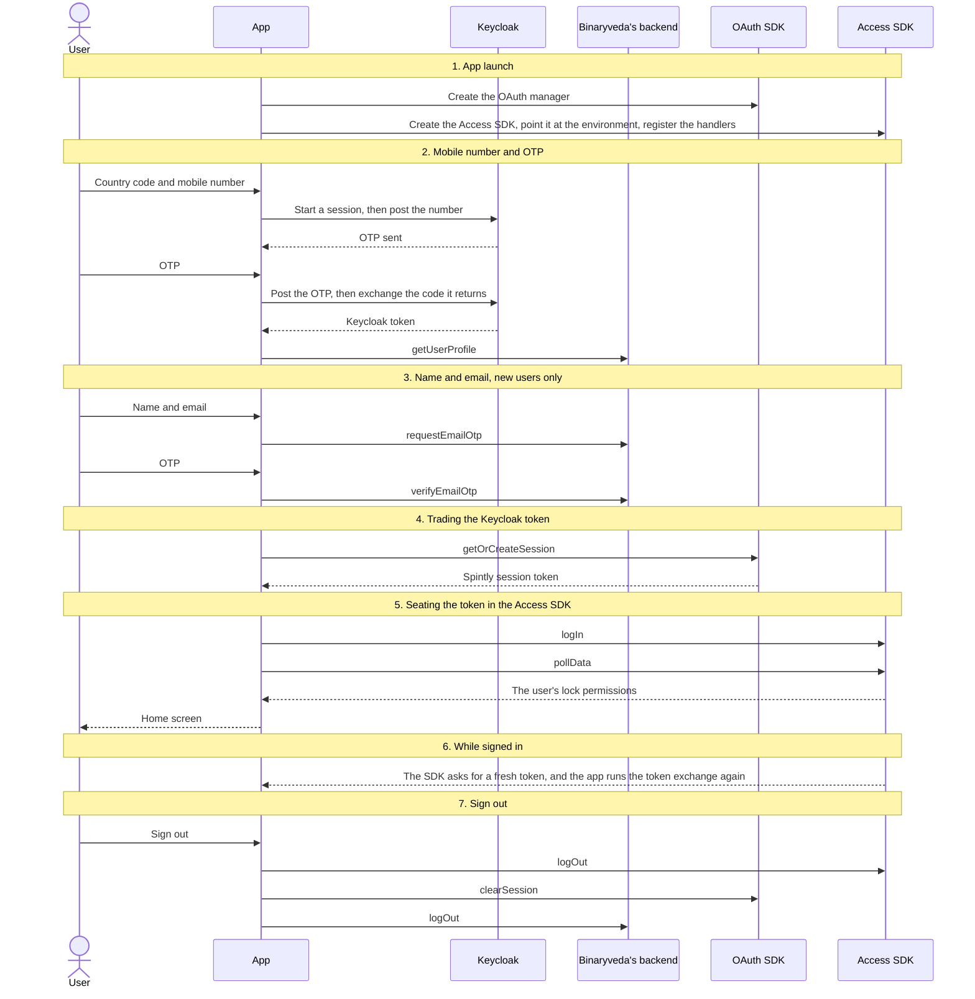

# 1. User Onboarding

**What it is.** Signing in and signing up: mobile number → mobile OTP → (new
users) name + email → email OTP → Home.

!!! warning "Key point"

    Signing in does not touch a Spintly SDK. The mobile number and OTP screens
    talk to Keycloak, and the name and email screens talk to Binaryveda's
    backend. Spintly only comes into it once the app holds a Keycloak token.

**Three cases**, all on the same code path.

| Case | Screens | What happens after |
|---|---|---|
| New user | number → mobile OTP → name + email → email OTP | Everything below runs |
| Existing user | number → mobile OTP | The same, without the name and email screens. Their profile already has both |
| Returning user, app reopened on a saved session | None, the splash screen goes straight to Home | No sign-in screens and nothing to Keycloak. The app asks the Access SDK whether it is still logged in, and if it is, only `pollData` runs |

In all three the Spintly work is identical. It starts once the app has a valid
Keycloak token and does not care which screens produced it.

## Who does what

Seven participants appear across the diagrams. Each diagram shows only the ones
it needs.

| Participant | What it is |
|---|---|
| **User** | The person signing in |
| **App** | The iOS or Android app |
| **Keycloak** | Godrej's identity server, which the sign-in screens talk to directly over HTTP |
| **Binaryveda's backend** | Binaryveda's GraphQL API |
| **OAuth SDK** | Spintly's `oauthManager`, the only thing that can turn a Keycloak token into a Spintly session token |
| **Access SDK** | Spintly's `serviceProvider`, which holds the session and the user's lock permissions |
| **Config SDK** | Spintly's `configurationProvider`. Created and pointed at an environment here, but given no token and not used again until a lock flow |

!!! tip "Reading the diagrams"

    Each diagram reads top to bottom. Every participant has a vertical line, and
    every arrow between two lines is one call.

    | What you see | What it means |
    |---|---|
    | **Solid arrow** | A call going out, from whoever it starts at to whoever it points at |
    | **Dashed arrow** | The answer coming back. Also used when an SDK calls back into the app on its own |
    | **Arrow that loops back to its own line** | Work the app does by itself. Nothing leaves the app |
    | **Two lines on an arrow** | The first line is the member or endpoint being called, the second says what it does |
    | **Grey banner across the whole diagram** | A heading, marking where one part of the flow ends and the next begins |
    | **Box labelled `opt`** | Something that only sometimes happens. Its condition sits at the top of the box, and when that condition is false everything inside is skipped |
    | **Box labelled `alt`** | A choice between two paths. A dashed line splits the box into a top half and a bottom half, each with its own condition above it. Exactly one of the two halves happens |

    The iOS and Android tabs are linked across the site. Pick a platform once
    and every diagram follows.

## The whole flow

Seven steps, each with its own section below. This diagram is the outline, so it
leaves the branches out. They are drawn into the step they belong to.



## 1. App launch

All three SDKs are created and pointed at an environment before anything else
can run. The two platforms differ in when that work happens.

=== "iOS"

    ```mermaid
    sequenceDiagram
        participant A as App
        participant O as OAuth SDK
        participant C as Config SDK
        participant S as Access SDK

        A->>O: SpintlyOauthManager(clientId:provider:environment:)<br/>Create the OAuth manager
        A->>C: SpintlyConfigurationProvider.defaultInstance<br/>Get the Config SDK instance
        opt If this is a debug build
            A->>C: setDebugLogging(enabled:)<br/>Turn on SDK logging
        end
        A->>C: setEnvironment(environment:region:)<br/>Point it at the environment
        A->>S: SpintlyACServiceProvider.defaultInstance<br/>Get the Access SDK instance
        A->>S: environmentManager.setEnvironment(_:)<br/>Point it at the environment
        A->>S: credentialManager.setRefreshTokenDelegate(_:)<br/>Register the token-refresh handler
        A->>S: credentialManager.setLoginStatusDelegate(delegate:)<br/>Register the login-status handler
        A->>C: getVersion()<br/>Read the SDK version for the log
    ```

    **When it runs.** AppDelegate calls `SpintlyHelper.initialise()` on launch,
    but only when the user is already signed in. On a signed-out launch none of
    it runs, and the SDKs are built on first use instead, because every
    `SpintlyHelper` entry point calls `initialise()` before anything else. Each
    of the three is guarded on its own instance being nil, so later calls do
    nothing. The OAuth guard tests `configurationProvider` rather than
    `oauthManager`.

=== "Android"

    ```mermaid
    sequenceDiagram
        participant A as App
        participant O as OAuth SDK
        participant C as Config SDK
        participant S as Access SDK

        A->>O: SpintlyOauthManager(context, clientId, providerId, environment)<br/>Create the OAuth manager, environment passed in the constructor
        A->>S: SpintlyACServiceProvider.getDefaultInstance(context)<br/>Get the Access SDK instance
        A->>S: environmentManager.environment = …<br/>Point it at the environment
        A->>C: SpintlyConfigurationProvider.getDefaultInstance(context)<br/>Get the Config SDK instance
        A->>C: setEnvironment(environment, region)<br/>Point it at the environment
        A->>S: credentialManager.setTokenRefreshHandler { }<br/>Register the token-refresh handler, from SpintlySDKManager's init block
    ```

    **When it runs.** Hilt builds all three as singletons the first time
    anything injects `SpintlySDKManager`. The application class does nothing
    eagerly, and `SpintlySDKManager` is injected into the user data source, so
    in practice this happens on the first data-source call.

    The Config SDK environment is set again before every Config SDK call later
    on. iOS sets it once and leaves it.

## 2. Mobile number and OTP

The user enters a country code and mobile number, Keycloak sends an OTP, and the
verified OTP comes back with an authorisation code. The app exchanges that code
for a Keycloak token, then reads the profile it belongs to. That profile is what
decides whether the name and email screens run.

The OTP is six digits on both platforms, and both submit it as soon as the field
fills, so nobody taps the button on the way through.

=== "iOS"

    ```mermaid
    sequenceDiagram
        actor U as User
        participant A as App
        participant K as Keycloak
        participant B as Binaryveda's backend

        Note over U,B: Ask Keycloak for an OTP
        U->>A: Country code and mobile number
        A->>A: PKCEManager()<br/>A new code verifier and challenge for this attempt
        A->>K: GET auth?<br/>Start a Keycloak session
        K-->>A: The URL to post the number to
        A->>K: POST country-code and mobile
        K-->>A: OTP sent, and the URL to post it to

        Note over U,B: Check the OTP and pick up a token
        A-->>U: Enter the OTP
        U->>A: OTP
        A->>K: POST mobile-otp
        alt If the OTP is correct
            K-->>A: The authorisation code, in the Location header
            A->>K: POST token<br/>Exchange the code, with the code verifier
            K-->>A: Access token, refresh token and id token
        else If the OTP is wrong
            K-->>A: isOTPInvalid, and the same URL again
            A-->>U: Wrong code, retype it on the same screen
        end

        Note over U,B: Work out where to send the user next
        A->>B: getUserProfile<br/>Read the profile this token belongs to
        B-->>A: Name and email, or blanks for a new user
        alt If both came back filled in
            A-->>U: Home screen
        else If either one is missing
            A-->>U: Name and email screen
        end
    ```

    **A wrong OTP tears nothing down.** The Keycloak session lives in the
    `formAction` URL that arrives with each response, so the retry posts to the
    same place.

    **A new code verifier and challenge** are generated every time the number
    screen opens, so going back and starting over always begins a fresh Keycloak
    session.

=== "Android"

    ```mermaid
    sequenceDiagram
        actor U as User
        participant A as App
        participant K as Keycloak
        participant B as Binaryveda's backend
        participant O as OAuth SDK
        participant S as Access SDK

        Note over U,S: Wipe the previous user, then ask Keycloak for an OTP
        U->>A: Country code and mobile number
        A->>A: clearUserDataStore()<br/>Drop what the previous user left behind
        A->>S: credentialManager.logOut()<br/>Clear the previous user's Access SDK session
        A->>O: oauthManager.clearSession()<br/>Clear the previous user's OAuth session
        A->>A: Empty the cookie jar, then generate a code verifier, challenge and state
        A->>K: GET /realms/gdb2c-{env}/protocol/openid-connect/auth<br/>Start a Keycloak session
        K-->>A: The URL to post the number to
        A->>K: POST country-code and mobile
        K-->>A: OTP sent, and the URL to post it to

        Note over U,S: Check the OTP and pick up a token
        A-->>U: Enter the OTP
        U->>A: OTP
        A->>K: POST mobile-otp
        alt If the OTP is correct
            K-->>A: The authorisation code, in the Location header
            A->>K: POST /realms/gdb2c-{env}/protocol/openid-connect/token<br/>Exchange the code, with the code verifier
            K-->>A: Access token, refresh token and id token
        else If the OTP is wrong
            K-->>A: invalidOTP, and the same URL again
            A-->>U: Wrong code, retype it on the same screen
        end

        Note over U,S: Work out where to send the user next
        A->>B: getUserProfile<br/>Read the profile this token belongs to
        B-->>A: Name and email, or blanks for a new user
        alt If the email came back
            A-->>U: Device authentication, then Home
        else If it is missing
            A-->>U: Name and email screen
        end
    ```

    **The two SDK calls at the top** are the only SDK work anywhere in the
    sign-in screens. They run on the number screen, before Keycloak is
    contacted, so a second user signing in on the same phone never inherits the
    first one's Spintly session. iOS has no equivalent.

    **Keycloak's own error codes** are mapped to messages on the number screen:
    `err-otp-throttled`, `err-req-country`, `err-req-mobile` and
    `err-len-mobile`.

## 3. Name and email, new users only

This step runs when the profile read at the end of the mobile OTP step comes back without a
name or an email. It goes to Binaryveda's backend rather than to Keycloak, and
touches no SDK. Both platforms send the same two mutations, and neither branches.

=== "iOS"

    ```mermaid
    sequenceDiagram
        actor U as User
        participant A as App
        participant B as Binaryveda's backend

        U->>A: Name and email
        A->>B: requestEmailOtp(requestEmailOtpInput:)<br/>Only the email is sent here
        B-->>A: message and success
        A-->>U: Enter the OTP
        U->>A: OTP
        A->>B: verifyEmailOtp(verifyEmailOtpInput:)<br/>Name, email and OTP together
        B-->>A: message and success
        A->>A: Set isLoggedIn, refresh the Firebase notification token
        A-->>U: Home screen
    ```

    **This is the path behind the `keyclockEmailAuthUpdate` feature flag.** With
    the flag off, the same two screens post `full_name` and `email` to
    Keycloak's `enterProfile` and then the OTP to `verifyProfile`, and the
    authorisation code arrives at the end of the email step rather than the
    mobile step.

=== "Android"

    ```mermaid
    sequenceDiagram
        actor U as User
        participant A as App
        participant B as Binaryveda's backend

        U->>A: Name and email
        A->>B: requestEmailOtp(requestEmailOtpInput:)<br/>Only the email is sent here
        B-->>A: message and success
        A-->>U: Enter the OTP
        U->>A: OTP
        A->>B: verifyEmailOtp(verifyEmailOtpInput:)<br/>Name, email and OTP together
        B-->>A: message and success
        A->>A: setIsEmailVerified(true)
        A-->>U: Device authentication, then Home
    ```

    **The Keycloak versions of both calls** are still written in
    `KeyCloakClient` but are commented out at the call site, so they never run.

## 4. Trading the Keycloak token for a Spintly session

The app now holds a Keycloak token. The OAuth SDK turns it into a Spintly
session token through a back and forth rather than a single call: the app asks
for a session, the SDK asks how to authenticate, the app hands back a
token-exchange request, and the SDK returns the session.

This runs again on every token refresh, and again before every Config SDK call
in the lock flows.

=== "iOS"

    ```mermaid
    sequenceDiagram
        participant A as App
        participant K as Keycloak
        participant O as OAuth SDK

        Note over A,O: Make sure the Keycloak token is usable
        A->>A: returnKeycloakAccessToken<br/>Read the saved Keycloak token
        opt If the saved token has expired
            A->>K: POST token<br/>Refresh it with the refresh token
            K-->>A: A fresh Keycloak token
        end

        Note over A,O: Hand it to the OAuth SDK
        A->>O: getOrCreateSession(delegate:)<br/>Ask the OAuth SDK for a Spintly session
        O-->>A: AuthorizationDelegate → getAuthenticationDetails(_:)<br/>The SDK asks how to authenticate
        A->>O: AuthenticationDetails.createWithTokenExchangeGrantType(clientToken:)<br/>Build the request from the Keycloak token
        A->>O: setAuthenticationDetails(authenticationDetails:), then continueTask()<br/>Hand it back and let the SDK carry on

        Note over A,O: See what came back
        alt If the exchange succeeds
            O-->>A: AuthorizationDelegate → didGetSession(_:)<br/>The Spintly session
            A->>A: session.accessToken.jwtToken<br/>Read the Spintly token out of it
            A->>A: JWTDecoder.decode(token:find:) on exp<br/>Check how long the token has left
        else If it fails
            O-->>A: AuthorizationDelegate → didFailWithError(_:)<br/>No Spintly session
        end
        opt If the Spintly token is about to expire
            A->>O: clearSession()<br/>Throw the session away
            A->>A: Drop the Access and Config SDK instances, then start again from the top
        end
    ```

    **If the refresh token has expired too**, there is no Keycloak token to
    trade, and the app signs the user out instead of calling the SDK at all.

=== "Android"

    ```mermaid
    sequenceDiagram
        participant A as App
        participant K as Keycloak
        participant O as OAuth SDK

        Note over A,O: Hand the Keycloak token to the OAuth SDK
        A->>O: getOrCreateSession(AuthorizationCallback)<br/>Ask the OAuth SDK for a Spintly session
        O-->>A: AuthorizationCallback → getAuthenticationDetails<br/>The SDK asks how to authenticate
        A->>K: getAccessTokenOrLogout()<br/>Read the saved Keycloak token, refreshing it if it has expired
        K-->>A: A usable Keycloak token
        A->>O: AuthenticationDetails.createWithTokenExchangeGrantType(jwtToken)<br/>Build the request from the Keycloak token
        A->>O: setAuthenticationDetails(details), then continueTask()<br/>Hand it back and let the SDK carry on

        Note over A,O: See what came back
        alt If the exchange succeeds
            O-->>A: AuthorizationCallback → onSuccess(session)<br/>The Spintly session
            A->>O: session.isValidForThreshold<br/>Ask the SDK how long the session has left
        else If it fails
            O-->>A: AuthorizationCallback → onFailure(e)<br/>Reported as SpintlyOauthNotAuthorizedException
        end
        opt If the session is about to expire
            A->>O: clearSession()<br/>Throw the session away
            A->>O: getOrCreateSession(AuthorizationCallback)<br/>Start again from the top
        end
    ```

    **The Keycloak read happens inside the SDK's callback**, and it blocks. If
    nothing usable comes back it posts a logout event on the event bus rather
    than returning a token.

Both platforms check how long the session has left, but they ask different
things. iOS decodes `exp` out of the JWT itself. Android uses the SDK's own
`isValidForThreshold`.

## 5. Seating the token in the Access SDK

The Spintly token goes into the Access SDK, and the user's lock permissions come
down. The `opt` box is the shortcut a returning user takes: their SDK is still
logged in, so only `pollData` runs.

=== "iOS"

    ```mermaid
    sequenceDiagram
        participant A as App
        participant S as Access SDK

        A->>S: credentialManager.isLoggedIn()<br/>A method on iOS
        A->>S: credentialManager.loginStatus.appLoginState<br/>Read the SDK's own login state
        opt If the SDK reports it is logged out
            A->>S: credentialManager.logIn(accessToken:)<br/>Seat the Spintly token
            S-->>A: completion<br/>Done, or failed with an error
        end
        A->>S: cloudSyncManager.pollData<br/>Pull down the user's lock permissions
        S-->>A: completion<br/>Done, or failed with an error
    ```

    **When it runs.** `setPermissionsToLock` fires once the lock list arrives on
    the Home screen, and again before every unlock. Both checks have to agree
    before `logIn` runs: `isLoggedIn()` false and `appLoginState` `LOGGED_OUT`.

=== "Android"

    ```mermaid
    sequenceDiagram
        participant A as App
        participant O as OAuth SDK
        participant S as Access SDK

        A->>S: credentialManager.isLoggedIn<br/>A property on Android
        opt If the SDK is not logged in yet
            A->>O: The token exchange, as above<br/>Get a Spintly token first
            O-->>A: Spintly session token
            A->>S: credentialManager.logIn(token, CompletionCallback)<br/>Seat the Spintly token
            S-->>A: CompletionCallback → completed or failed
        end
        A->>S: cloudSyncManager.pollData(callback)<br/>Pull down the user's lock permissions
        S-->>A: CompletionCallback → completed or failed
        A->>S: accessManager.startBleScan()<br/>Start looking for the user's locks nearby
    ```

    **When it runs.** `HomeViewModel.start()` fires once, when the Home screen
    opens.

The Config SDK is given no token here on either platform. It gets one
immediately before each call that needs it, in
[Lock Onboarding](lock-onboarding.md).

## 6. While signed in: what the SDK asks the app for

These are the calls the app does not start. The Access SDK reaches back into the
app through the handlers registered at app launch, and the app answers. The two
notes mark two separate events, not one sequence.

=== "iOS"

    ```mermaid
    sequenceDiagram
        participant S as Access SDK
        participant A as App
        participant K as Keycloak
        participant O as OAuth SDK

        Note over S,O: The SDK needs a fresh token
        S-->>A: TokenRefreshDelegate → refreshAuthentication(completion:)
        A->>K: returnKeycloakAccessToken<br/>Read the Keycloak token, refreshing it if it has expired
        alt If a Keycloak token comes back
            A->>O: getOrCreateSession(delegate:)<br/>Run the token exchange again
            O-->>A: The new Spintly token, handed back through the completion
        else If there is none
            A->>A: triggerSignout()<br/>Sign the user out
        end

        Note over S,O: The SDK's login state changed
        S-->>A: LoginStatusDelegate → didUpdateLoginStatus()
        A->>S: credentialManager.loginStatus<br/>Read the current state
        S-->>A: appLoginState and error
        A->>A: Log it, then show the user a toast
    ```

    **`getOrCreateSession` is called on the line after the Keycloak read**
    rather than inside its callback. When the Keycloak token is still valid the
    read returns straight away and this makes no difference. When it has to be
    refreshed first, the delegate's `clientToken` may not be set by the time the
    SDK asks for it.

=== "Android"

    ```mermaid
    sequenceDiagram
        participant S as Access SDK
        participant A as App
        participant K as Keycloak
        participant O as OAuth SDK

        Note over S,O: The SDK needs a fresh token
        S-->>A: The handler passed to setTokenRefreshHandler fires
        A->>O: getOrCreateSession(AuthorizationCallback)<br/>Run the token exchange again
        A->>K: getAccessTokenOrLogout()<br/>Read the Keycloak token, refreshing it if it has expired
        alt If a Keycloak token comes back
            O-->>A: The new Spintly token, handed back through completionCallback.completed
        else If there is none
            A->>A: Post a logout event on the event bus
        end
    ```

    **There is no login-status handler.** Android has no equivalent of iOS's
    `LoginStatusDelegate`, so nothing tells the app when the SDK's own login
    state changes.

## 7. Sign out

Both platforms clear the Access SDK credential first and the OAuth session
second, and both tell Binaryveda's backend separately. Neither branches. The
only difference is where the backend call sits.

=== "iOS"

    ```mermaid
    sequenceDiagram
        actor U as User
        participant A as App
        participant B as Binaryveda's backend
        participant O as OAuth SDK
        participant S as Access SDK

        U->>A: Sign out
        A->>B: logOut<br/>The SignOut mutation, sent from the data source
        A->>A: Clear the saved tokens and user defaults
        A->>S: credentialManager.logOut()<br/>Clear the Access SDK session
        A->>O: oauthManager.clearSession()<br/>Clear the OAuth session
        A-->>U: Signed out
    ```

=== "Android"

    ```mermaid
    sequenceDiagram
        actor U as User
        participant A as App
        participant B as Binaryveda's backend
        participant O as OAuth SDK
        participant S as Access SDK

        U->>A: Sign out
        A->>S: credentialManager.logOut()<br/>Clear the Access SDK session
        A->>O: oauthManager.clearSession()<br/>Clear the OAuth session
        A->>B: logOut<br/>The LogOut mutation, straight after
        A-->>U: Signed out
    ```

## Differences between the two

Members are shown without their receiver where both platforms share it. The
handler and login rows are all on `credentialManager`, and the version row is on
`configurationProvider`.

| | iOS | Android |
|---|---|---|
| When the SDKs are built | At launch if the user is already signed in, otherwise on first use | By Hilt, the first time anything injects `SpintlySDKManager` |
| Clearing the previous user's SDK session when a sign-in starts | **Not done** | `logOut()` and `clearSession()`, in the mobile OTP request |
| Token-refresh handler | `setRefreshTokenDelegate(_:)` | `setTokenRefreshHandler { }`, a different name for the same purpose |
| Login-status handler | `setLoginStatusDelegate(delegate:)` | **No equivalent found** |
| Reading the Keycloak token for the exchange | Read before `getOrCreateSession`, and passed into the delegate | Read inside `getAuthenticationDetails`, blocking |
| Session freshness check | Decodes `exp` out of the JWT itself | Uses the SDK's `isValidForThreshold` |
| A stale session | Clears it, drops the Access and Config instances, restarts login | Clears it and calls `getOrCreateSession` again |
| Config SDK environment | Set once when the SDK is created | Re-applied before every Config SDK call |
| Logged-in check | `isLoggedIn()`, a method, plus `loginStatus.appLoginState` | `isLoggedIn`, a property |
| Where the Access SDK login runs | When the lock list arrives, and before every unlock | Once, when the Home screen opens |
| BLE scan after `pollData` | Not started here | `accessManager.startBleScan()` |
| SDK version logging | `getVersion()` | Not read |

## Every SDK member this flow uses

iOS reaches all of these through `SpintlyHelper`, Android through
`SpintlySDKManager`.

??? note "iOS"

    | SDK | Member | When | What it is for |
    |---|---|---|---|
    | OAuth | `SpintlyOauthManager(clientId:provider:environment:)` | App launch | Create the OAuth manager |
    | OAuth | `getOrCreateSession(delegate:)` | Every token exchange, including refreshes | Ask for a Spintly session |
    | OAuth | `AuthorizationDelegate` → `getAuthenticationDetails(_:)`, `didGetSession(_:)`, `didFailWithError(_:)` | During the token exchange | How the exchange reports back |
    | OAuth | `AuthenticationDetails.createWithTokenExchangeGrantType(clientToken:)` | During the token exchange | Build the token-exchange request |
    | OAuth | `AuthenticationContinuation.setAuthenticationDetails(authenticationDetails:)`, `continueTask()` | During the token exchange | Hand the request back to the SDK |
    | OAuth | `SpintlyOauthSession.accessToken.jwtToken` | End of the token exchange | The Spintly token itself |
    | OAuth | `clearSession()` | A session about to expire, and sign out | Clear the OAuth session |
    | Access | `SpintlyACServiceProvider.defaultInstance` | App launch | Get the Access SDK instance |
    | Access | `environmentManager.setEnvironment(_:)` | App launch | Point it at the environment |
    | Access | `credentialManager.setRefreshTokenDelegate(_:)` | App launch | Register the token-refresh handler |
    | Access | `credentialManager.setLoginStatusDelegate(delegate:)` | App launch | Register the login-status handler |
    | Access | `credentialManager.isLoggedIn()` | Before the Access SDK login | Check before logging in again |
    | Access | `credentialManager.loginStatus.appLoginState`, `.error` | Before the Access SDK login, and on every login-status callback | The SDK's login state and last error |
    | Access | `credentialManager.logIn(accessToken:)` | The Access SDK login | Seat the Spintly token |
    | Access | `credentialManager.logOut()` | Sign out | Clear the Access SDK session |
    | Access | `cloudSyncManager.pollData` | Right after the Access SDK login, and before every unlock | Pull down the user's lock permissions |
    | Access | `TokenRefreshDelegate` → `refreshAuthentication(completion:)` | Whenever the SDK needs a fresh token | The SDK asking the app for one |
    | Access | `LoginStatusDelegate` → `didUpdateLoginStatus()` | Whenever the SDK's login state changes | The SDK telling the app about it |
    | Config | `SpintlyConfigurationProvider.defaultInstance` | App launch | Get the Config SDK instance |
    | Config | `setDebugLogging(enabled:)` | App launch, debug builds only | Turn on SDK logging |
    | Config | `setEnvironment(environment:region:)` | App launch | Point it at the environment |
    | Config | `getVersion()` | App launch | Read the SDK version for the log |

??? note "Android"

    | SDK | Member | When | What it is for |
    |---|---|---|---|
    | OAuth | `SpintlyOauthManager(context, clientId, providerId, environment)` | App launch | Create the OAuth manager |
    | OAuth | `getOrCreateSession(AuthorizationCallback)` | Every token exchange, including refreshes | Ask for a Spintly session |
    | OAuth | `AuthorizationCallback` → `getAuthenticationDetails`, `onSuccess`, `onFailure` | During the token exchange | How the exchange reports back |
    | OAuth | `AuthenticationDetails.createWithTokenExchangeGrantType(jwtToken)` | During the token exchange | Build the token-exchange request |
    | OAuth | `AuthenticationContinuation.setAuthenticationDetails(details)`, `continueTask()` | During the token exchange | Hand the request back to the SDK |
    | OAuth | `SpintlyOauthSession.isValidForThreshold` | End of the token exchange | Check the session is not about to expire |
    | OAuth | `SpintlyOauthSession.accessToken.jwtToken` | End of the token exchange | The Spintly token itself |
    | OAuth | `clearSession()` | Requesting the mobile OTP, a session about to expire, and sign out | Clear the OAuth session |
    | OAuth | `SpintlyOauthNotAuthorizedException` | A failed token exchange | The SDK's not-authorized error |
    | Access | `SpintlyACServiceProvider.getDefaultInstance(context)` | App launch | Get the Access SDK instance |
    | Access | `environmentManager.environment` | App launch | Point it at the environment |
    | Access | `credentialManager.setTokenRefreshHandler { }` | App launch | Register the token-refresh handler |
    | Access | `credentialManager.isLoggedIn` | Before the Access SDK login | Check before logging in again |
    | Access | `credentialManager.logIn(token, CompletionCallback<Void?>)` | The Access SDK login | Seat the Spintly token |
    | Access | `credentialManager.logOut()` | Requesting the mobile OTP, and sign out | Clear the Access SDK session |
    | Access | `cloudSyncManager.pollData(callback)` | Right after the Access SDK login, and before every unlock | Pull down the user's lock permissions |
    | Access | `accessManager.startBleScan()` | Once `pollData` succeeds | Start looking for the user's locks nearby |
    | Access | `CompletionCallback<T>` → `completed`, `failed` | The Access SDK login, and `pollData` | How the Access SDK reports back |
    | Config | `SpintlyConfigurationProvider.getDefaultInstance(context)` | App launch | Get the Config SDK instance |
    | Config | `setEnvironment(environment, region)` | App launch, and before every Config SDK call | Point it at the environment |
