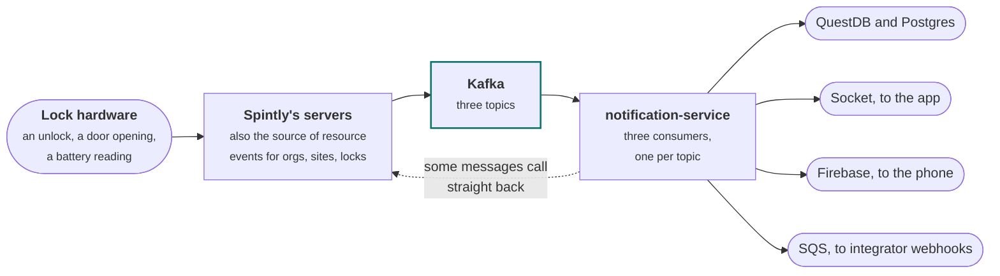
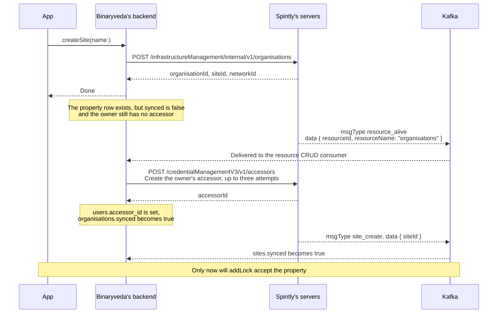
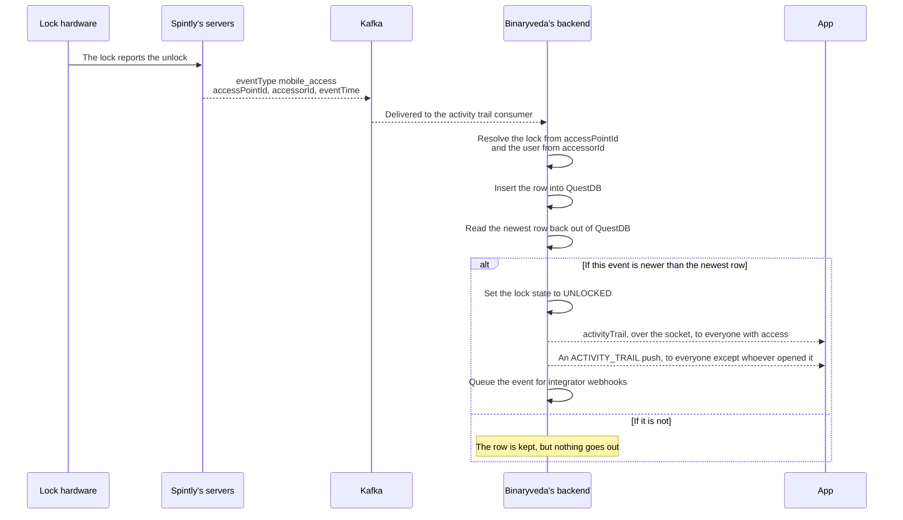

# Kafka events

> **Not published on the site.** This page lives in `unpublished/` and is
> deliberately left out of the `nav`, so it is not built. The flow pages in
> `docs/` name it in prose rather than linking to it, the same way they refer to
> Binaryveda's Spintly API usage document. Read it here, in the repo.

**What it is.** Spintly does not answer every question over REST. A lot of what
the app ends up seeing arrives at Binaryveda as a **Kafka message** from Spintly
first, and only then turns into a database write, a socket event, a push
notification, or a further call back into Spintly.

This page is the record of those messages: the three topics, what each message
actually looks like, and what Binaryveda does when one arrives.

!!! warning "Key point"

    **Binaryveda only consumes.** Spintly is the producer for all three topics.
    Nothing in the estate publishes to Kafka. When Binaryveda needs to send
    something onward it uses the socket, Firebase, or an SQS queue instead.

## Participants

This page uses App, Binaryveda's backend, Spintly's servers, Lock hardware, and
one participant of its own:

| Participant | What it is |
|---|---|
| <span class="p-key p-kafka"></span> **Kafka** | Spintly's message bus, an AWS MSK cluster. Spintly publishes to it, `notification-service` reads from it |

The rest are defined, with the colour each one keeps across the site, in
[Reading these pages](../docs/conventions.md).

## Where it sits



The dotted line back into Spintly is the part that surprises people, and it is
covered in [The chaining](#the-chaining) below. Some messages are not just
news. They are the trigger for Binaryveda's next REST call.

## The three topics

Each topic gets its own consumer group and its own handler. All three run in
`notification-service` and nowhere else.

| Topic | Consumer group | Carries |
|---|---|---|
| `KAFKA_TOPIC_RESOURCE_CRUD` | `spintly-resource-crud-consumer-group` | Organisations, sites, access points, locks and gateways being created, updated, deleted, or going live |
| `KAFKA_TOPIC_ACTIVITY_TRAIL` | `spintly-lock-unlock-updates-consumer-group` | Everything a lock does: unlocks, the deadbolt, the door, door modes, the doorbell, alarms, card enrolment |
| `KAFKA_TOPIC_ONLINE_OFFLINE` | `spintly-lock-online-offline-updates-consumer-group` | Locks and gateways going online or offline, battery readings, BLE remotes being paired |

The connection is SSL with SASL `scram-sha-512`. The consumers do **not** start
when the environment is `dev` or `local`, so a local backend never sees any of
this.

!!! note "Three topics, three different envelopes"

    The three topics do not agree on a message shape, and the field that says
    what kind of message it is has a different name on each. This catches
    people out, so it is worth holding on to:

    | Topic | Kind field | Where the body is |
    |---|---|---|
    | Resource CRUD | `messageData.msgType` | `messageData.data` |
    | Activity trail | `eventType` | The top level of the message |
    | Online/offline | `msgType` | `data` |

## 1. Resource CRUD

The wrapper carries a `requestId`, which is how repeats are recognised.

```json
{
  "messageData": {
    "requestId": "8f2c...",
    "msgType": "access_point_create",
    "data": { "accessPointId": 12345 }
  }
}
```

| `msgType` | What `data` carries |
|---|---|
| `organisation_create`, `organisation_update`, `organisation_delete` | The organisation |
| `site_create`, `site_update`, `site_delete` | `siteId` |
| `access_point_create`, `access_point_delete` | `accessPointId` |
| `device_create`, `device_update`, `device_delete` | `serialNumber`, `configurationStatus` |
| `gateway_create`, `gateway_delete` | `serialNumber`, `configurationStatus` |
| `mesh_io_create`, `mesh_io_delete` | The mesh IO module |
| **`resource_alive`** | `resourceId` and `resourceName`, where `resourceName` is one of `organisations`, `sites`, `networks`, `access_points`, `devices` |

`resource_alive` is the one to know. It is Spintly's signal that a resource
exists across **all** of Spintly's own internal services, rather than just
having been accepted by the one that answered the REST call. `resourceId` is the
same id Binaryveda stores as `spintly_id`.

!!! info "Why `resource_alive` and not `organisation_create`"

    Creating the owner's accessor used to be gated on `organisation_create`.
    That event arrives while the organisation is still being set up inside
    Spintly, so the accessor call landed on an organisation that did not exist
    yet, came back `500 organisation does not exist`, and the retry then failed
    authentication with `invalid_grant`. Gating on `resource_alive` removed the
    race. `organisation_create` is now ignored entirely.

## 2. Activity trail

Flat: no wrapper, and `eventTime` is Unix **seconds**, not milliseconds.

```json
{
  "eventType": "mobile_access",
  "eventTime": 1755765432,
  "accessPointId": 12345,
  "accessorId": 67890,
  "accessPointDirection": "entry",
  "mobileAccessMode": "clickToAccess"
}
```

### Unlock events

These are the ones that become rows in the activity trail.

| `eventType` | Shows in the trail as |
|---|---|
| `card_access` | Card |
| `mobile_access` | Mobile, plus `_Bluetooth` or `_NFC` from `mobileAccessMode` |
| `remote_access` | Remote |
| `fingerprint_access` | Fingerprint |
| `keypad_accessor_access` | Passcode |
| `keypad_passcode_access` | OTP. Carries `passcodeId`, and the one time user is retired on arrival |
| `dual_auth_access` | 2FA. Carries `firstAccessType` and `secondAccessType`, each with its own mobile access mode |
| `web_remote_access` | Web Remote |
| `mechanical_key_unlock` | **Nothing.** A physical key unlock is excluded from the trail |

### Everything else on the same topic

| `eventType` | What it means |
|---|---|
| `deadbolt_event` | `deadBoltState` of `0` is LOCKED, anything else UNLOCKED. Only the LOCKED case is written to the trail, as an `autolock` row |
| `door_open`, `door_close` | The door itself, separate from the deadbolt |
| `door_mode_changed` | Carries `oldDoorMode` and `updatedDoorMode`. `locked` means privacy mode, `unlocked` means passage mode, `accessControl` means neither |
| `doorbell` | Somebody pressed the bell |
| `door_tamper`, `door_tamper_reset` | The tamper switch |
| `door_open_too_long` | Door ajar |
| `latch_locking_failure` | The door did not latch |
| `prank_alarm` | Wrong passcode too many times |
| `card_enrolled`, `card_unenrolled` | Carries `orgId` and `credentialId`, which is the RFID |

## 3. Online and offline

Wrapped in `data`, and keyed on `msgType` rather than `eventType`.

```json
{
  "msgType": "device_status",
  "data": {
    "serialNumber": "...",
    "status": "online",
    "activeGatewaySerialNumber": "...",
    "statusTime": 1755765432
  }
}
```

| `msgType` | What `data` carries |
|---|---|
| `device_status` | `serialNumber`, `status`, `activeGatewaySerialNumber`, `statusTime`. The gateway serial is what builds the lock-to-gateway mapping |
| `gateway_status` | `serialNumber`, `status` |
| `device_battery_status` | `serialNumber`, `deviceBatteryVoltage`, `deviceBatteryPercentage`, `eventTime` |
| `beacon_attached`, `beacon_detached` | `serialNumber`, `beaconMacId`. A BLE remote being paired to or cleared from a lock |

## The chaining

This is what each message sets off. Read it as: a message arrives, and the
handler does some combination of writing to a database, calling Spintly,
emitting a socket event, sending a push, and queuing a webhook.

### Messages that call back into Spintly

Four messages are not news at all. They are the trigger for the next REST call,
and nothing else in the estate makes that call.

| Message | What Binaryveda does with it |
|---|---|
| `resource_alive`, `organisations` | Owner has no accessor: `POST /credentialManagementV3/v1/accessors`, **retried up to three times, 1.5 seconds apart**. Owner already has one from another organisation: `POST /credentialManagementV3/v1/organisations/{orgId}/accessors/{accessorId}` instead, once only. Either way the organisation is then marked synced |
| `access_point_create` | Marks the lock synced and its configuration status `ACCESS_POINT_CREATED`, then **either** `POST /credentialManagementV3/v1/accessors` (owner has none) **or** `PATCH /permissionManagementV3/v1/organisations/{orgId}/accessors/{accessorId}/permissions` (owner has one). Never both |
| `device_update`, `configurationStatus` 1 | `DELETE /infrastructureManagement/internal/v1/accessPoints/{accessPointId}` |
| `gateway_update`, `configurationStatus` 1 | `DELETE /infrastructureManagement/internal/v1/gateways/{serialNumber}` |

The accessor retry exists because there is no retry anywhere else for these
calls. A single transient failure without it would leave the user with no
accessor and no way to get one.

### The accessor chain, in full

This is the chain [Lock Onboarding](../docs/lock-onboarding.md) runs on, and the reason
the app has to poll rather than read the answer off the response.



`addLock` refuses a property whose `synced` is still false, answering *"The site
has not synced yet"*. So the Kafka round trip is not a background detail here.
It is the gate on the next step of onboarding.

### What an unlock message turns into

One `mobile_access` message fans out to as many as five places.



That freshness check is worth knowing about, because it is the usual explanation
for a trail row that exists while nobody's phone lit up. If QuestDB is empty for
that lock, or the read fails, the check cannot pass and **no socket event and no
push are sent**, even though the row was written.

### The full table

| Message | Database | Socket | Push | Webhook |
|---|---|---|---|---|
| Unlock events | Row in QuestDB, lock state to UNLOCKED | `activityTrail` | `ACTIVITY_TRAIL` | `ACTIVITY_TRAIL` |
| `deadbolt_event`, LOCKED | Row in QuestDB as `autolock` | `activityTrail`, `deadbolt` | `DEADBOLT`, watch only | `LOCK_STATUS_UPDATE` |
| `door_open`, `door_close` | Door state on the lock | `doorStatus` | `DOOR_STATUS`, watch only | `DOOR_STATE_CHANGED` |
| `door_mode_changed` | Privacy mode or passage mode on the lock | `doorModes` | | `DOOR_MODE_CHANGED` |
| `doorbell` | | | `DOORBELL`, silent and high priority, owner, primary and secondary | `DOORBELL_ALARM` |
| `door_tamper` | | | `DOOR_TAMPER` | `THEFT_ALARM` |
| `door_tamper_reset` | | | `DOOR_TAMPER_RESET` | |
| `door_open_too_long` | | | `DOOR_AJAR` | `DOOR_AJAR_ALARM` |
| `latch_locking_failure` | | | `LATCH_LOCKING_FAILURE` | |
| `prank_alarm` | | | `PRANK_ALARM` | `PRANK_ALARM` |
| `card_enrolled`, `card_unenrolled` | Card assignment row | | | |
| `device_status` | Lock online or offline, lock to gateway mapping | `inventoryStatus` | `INVENTORY_STATUS`, watch only | `DEVICE_STATUS` |
| `gateway_status` | Gateway online or offline | `inventoryStatus` | `INVENTORY_STATUS`, watch only | |
| `device_battery_status` | Row in QuestDB, battery level and status | `inventoryStatus` | `LOCK_BATTERY` when critical or dead | `CRITICAL_BATTERY_ALERT` |
| `beacon_attached`, `beacon_detached` | BLE remote state | | | |

Any message carrying an `accessPointId` also queues a `REPORT_STATE` message for
Google Home, for every user on that lock who has linked their account.

!!! note "Who gets a push"

    Not everyone with access gets everything.

    - **Owner and primary** get every activity on the lock.
    - **Secondary** users only get their own activity.
    - **Whoever performed the action** is filtered out of the alert push, so
      nobody is notified about their own unlock. They still get the silent watch
      push.
    - The alarm topics go to owner, primary and secondary only.
    - `DEADBOLT`, `DOOR_STATUS`, `INVENTORY_STATUS` and the `ACTIVITY_TRAIL`
      data push go **only** to tokens registered as `WATCH_OS`. The phone apps
      never see them.

## Delivery, repeats and failure

The consumers do not use Kafka's own offset commits, so a few of these
behaviours are Binaryveda's rather than Kafka's.

| | How it works |
|---|---|
| Offsets | Committed by hand. `autoCommit` is off, and the offset is written to a `kafka_offsets` table after each message. On startup the consumer seeks to the stored offset |
| Repeats, resource CRUD | Deduplicated on `requestId`. A repeat is logged and dropped |
| Repeats, `resource_alive` | Spintly sends it more than once per resource. The accessor call is guarded on the owner not already having one, so a repeat after a failure retries naturally, and a repeat after a success does nothing |
| A message that keeps crashing the consumer | On a crash Kafka says it will not restart, the stored offset is bumped by one to step over the message, and the consumer reconnects |
| The online/offline consumer | The same crash path exists but **the restart is commented out**, so that consumer stays down until the service does |
| Ordering | Only the QuestDB freshness check, described above. There is no other ordering guarantee |

## Where these messages surface

| This page | Reads |
|---|---|
| [Lock Onboarding](../docs/lock-onboarding.md) | `resource_alive`, `site_create`, `access_point_create`. The polling in steps 1 and 4 is waiting on these |
| [Home](../docs/home.md) | `activityTrail`, `inventoryStatus`, `doorModes`, `doorStatus`, `deadbolt` on the socket |
| [Lock Control Panel](../docs/lock-control-panel.md) | The same five socket events, landing on different parts of the screen |
| [Activity Trail](../docs/activity-trail.md) | `activityTrail`, as a signal to fetch again |
| [Notifications](../docs/notifications.md) | The push topics in the table above |
| [Lock Settings](../docs/lock-settings.md) | `device_update` and `gateway_update`, which drive removal |
