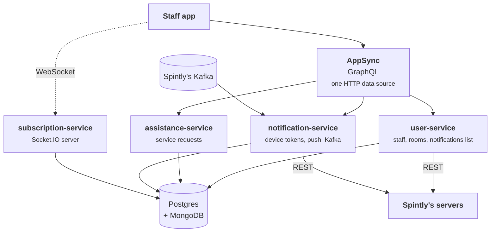

# The backend

Every arrow into **Binaryveda's backend** on the flow pages ends up somewhere
specific. This page says where.

## The shape of it

Both apps talk to **one AWS AppSync GraphQL endpoint**. AppSync has a single
HTTP data source, and the routing to a service happens inside the VTL mapping
template for each field, as a URL prefix. Behind that sit Node and Express
services on Kubernetes, sharing **one Postgres database** and a **MongoDB** for
notifications and Kafka offsets.

The Cognito access token is forwarded as the `Authorization` header at every
hop, and the socket takes it as a connect parameter.

AppSync exposes **184 operations** in total, most of them for the admin web
console. The staff app uses **17**.

## Every call the app makes

Grouped by the service that answers it. The path is what the AppSync mapping
template rewrites the operation to.

### user-service

| GraphQL operation | Method and path | Where it is used |
|---|---|---|
| `getUserDetail` | `GET /user-service/v1/users/detail` | [User Onboarding](user-onboarding.md#4-who-is-signed-in) |
| `getStaffDetail` | `GET /user-service/v1/staff/{staffId}` | [Profile and Logout](profile-and-logout.md#2-staff-detail) |
| `getAccessibleRoomsByStaff` | `GET /user-service/v1/staff/rooms` | [Rooms](rooms.md#1-opening-the-tab) |
| `searchRoomsByRoomNumber` | `GET /user-service/v1/staff/rooms-by-number` | [Search](search.md#2-searching-rooms) |
| `listCountryCodes` | `GET /user-service/v1/users/country-codes` | [User Onboarding](user-onboarding.md#3-mobile-number-and-otp) |
| `listStaffAppNotifications` | `GET /user-service/v1/staff/app-notifications` | [Notifications](notifications.md#3-the-notification-centre) |
| `addLoginAccessDetails` | `POST /user-service/v1/users/login-access-details` | [User Onboarding](user-onboarding.md#4-who-is-signed-in) |

### assistance-service

| GraphQL operation | Method and path | Where it is used |
|---|---|---|
| `getServiceRequestsCountByCategory` | `GET /assistance-service/v1/service-request/count-by-category` | [Tasks](tasks.md#1-opening-the-tab) |
| `getServiceRequestsByStatusAndCategory` | `GET /assistance-service/v1/service-request/by-status-and-category` | [Tasks](tasks.md#2-the-tabs-within-a-category) |
| `getServiceRequestsByCategories` | `GET /assistance-service/v1/service-request/by-categories` | [Tasks](tasks.md#1-opening-the-tab), Android only |
| `listRequests` | `GET /assistance-service/v1/service-request/requests` | [Tasks](tasks.md#2-the-tabs-within-a-category), iOS only |
| `getServiceRequestById` | `GET /assistance-service/v1/service-request` | [Notifications](notifications.md#4-the-notification-status-screen) |
| `searchServiceRequestsByRoomNumber` | `GET /assistance-service/v1/service-request/search-service-requests-by-room-number` | [Search](search.md#3-searching-tasks) |
| `updateServiceRequestStatus` | `PATCH /assistance-service/v1/service-request/status` | [Tasks](tasks.md#4-acting-on-a-task) |
| `completeRequest` | `PATCH /assistance-service/v1/service-request/request-complete` | [Tasks](tasks.md#4-acting-on-a-task) |
| `requestRoomCleaning` | `PATCH /assistance-service/v1/service-request/request-room-cleaning` | [Tasks](tasks.md#4-acting-on-a-task) |

### notification-service

| GraphQL operation | Method and path | Where it is used |
|---|---|---|
| `addDeviceToken` | `POST /notification-service/v1/notifications/device-token` | [Notifications](notifications.md#1-registering-the-device) |

## What the backend decides, not the app

Three rules live in the backend. The app cannot bend them, and a screen that
looks like it is deciding something is usually just reflecting one of these.

| Rule | Which call enforces it | Where it is explained |
|---|---|---|
| Which rooms a staff member sees | `getAccessibleRoomsByStaff` branches on role, and scopes housekeeping to today's shift | [Rooms](rooms.md#2-who-sees-which-rooms) |
| Which status change is allowed | `updateServiceRequestStatus` enforces the state machine, checks `serviced_by`, and can vacate a room | [Tasks](tasks.md#three-rules-the-backend-enforces) |
| Who receives a live event | `subscription-service` emits to a socket room named `siteId + roleCode` | [Tasks](tasks.md#6-live-updates) |

One detail about that last one belongs here rather than on a flow page: the
other services do not call `subscription-service` over HTTP. They publish into
the same socket through a **Postgres adapter**, so `assistance-service` emits
`staffServiceRequestUpdate` directly.

## The socket

One connection, opened with the Cognito access token as a connect parameter.

| | |
|---|---|
| Handshake path | `/subscription-service/socket.io` |
| Namespace | `/subscription-service/v1/staff` |
| Transport | WebSocket only |

Four events reach the staff app.

| Event | What it carries | Used on |
|---|---|---|
| `staffServiceRequestUpdate` | `currentState`, and the service request with its `id`, `service_category` and `priority` | [Tasks](tasks.md#6-live-updates) |
| `staffAppNotifications` | A new notification for this site and role | [Notifications](notifications.md#3-the-notification-centre) |
| `privacyModeUpdate` | `accessPointId`, `privacyMode` | [Rooms](rooms.md#3-live-updates), [Control Panel](control-panel.md#2-live-updates) |
| `passageModeUpdate` | `accessPointId`, `passageModeStatus` | [Rooms](rooms.md#3-live-updates), [Control Panel](control-panel.md#2-live-updates) |

## Where Kafka fits

Spintly publishes to Kafka. `notification-service` consumes three topics and is
the only thing that reads them.

| Topic | What it carries |
|---|---|
| Activity trail | Unlocks, door open and close, deadbolt, error logs |
| Lock updates | A lock, gateway or repeater going online or offline, and battery status |
| Resource CRUD | Locks and access points being created, changed or removed |

The topic that matters most to the staff app is **lock updates**, because it is
what puts hardware faults on the Tasks tab. `notification-service` resolves the
device the message names, then creates or updates a System service request
carrying a `device_type` of `LOCK`, `GATEWAY` or `REPEATER` and a
`device_status` of `OFFLINE`, `CRITICAL` or `WEAK`. Those are the two fields the
task card reads. The whole path, drawn out, is on
[Tasks](tasks.md#5-device-faults-arrive-as-tasks).

## Spintly's REST APIs

Only the backend calls these. The app reaches Spintly only through the two SDKs.

| What it does | Called by |
|---|---|
| `POST /identityManagement/v2/oauth/token` | Both, to authenticate itself |
| `POST /credentialManagementV3/v1/accessors` | `user-service`, when an admin creates a staff member |
| `DELETE .../organisations/{orgId}/accessors/{accessorId}` | `user-service`, when a staff member is removed |
| `PATCH .../accessors/{accessorId}/credential` | `user-service`, assigning an RFID card |
| `PATCH /permissionManagementV3/v1/.../permissions` | `user-service`, when shifts or floors change |
| `PATCH /permissionManagementV3/v1/.../setDoorMode` | `notification-service`, turning passage mode on or off |

The important one for this app is the permissions call. When an admin changes a
staff member's shift or floors, `user-service` updates their accessor's
permissions at Spintly, and a push then tells the app to call `pollData` so the
Access SDK picks up the change. See
[Notifications](notifications.md#2-a-push-arrives).

## What the staff app never touches

Three services in the platform have nothing to do with this app.

| Service | What it is for |
|---|---|
| `inventory-service` | Rooms, floors, blocks, locks, gateways. 107 AppSync operations, all admin console |
| `booking-service` | Bookings, check in, check out, PMS integration |
| `scheduling-service` | Not wired into AppSync at all, and calls older Spintly endpoints than the rest. Treat it as legacy |

They matter only because they own the data the staff app reads back through
`user-service` and `assistance-service`.

!!! warning "The OTP is a fixed code in these environments"

    The Cognito `CreateAuthChallenge` trigger answers every login with a
    hardcoded `123456`. All three configured environments are test environments,
    so confirm how production is set up before relying on the login flow. The
    detail is in
    [User Onboarding](user-onboarding.md#3-mobile-number-and-otp).
